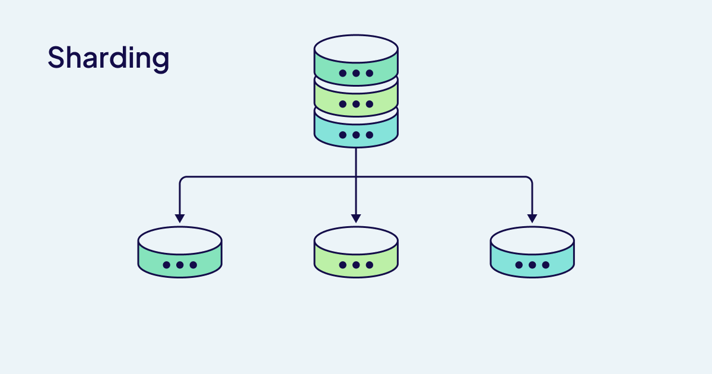

import FilteredTextBlock from '@site/src/components/Documentation/FilteredTextBlock';
import TabItem from '@theme/TabItem';
import Tabs from '@theme/Tabs';
import PyCode from '!!raw-loader!/_includes/code/howto/manage-data.collections.py';
import PyCodeV3 from '!!raw-loader!/_includes/code/howto/manage-data.collections-v3.py';
import TSCode from '!!raw-loader!/_includes/code/howto/manage-data.collections.ts';
import TSCodeLegacy from '!!raw-loader!/_includes/code/howto/manage-data.collections-v2.ts';
import JavaCode from '!!raw-loader!/_includes/code/howto/java/src/test/java/io/weaviate/docs/manage-data.classes.java';
import GoCode from '!!raw-loader!/_includes/code/howto/go/docs/manage-data.classes_test.go';


Weaviate offers two complementary superpowers for scaling your deployment: sharding and replication.
Sharding divides your data so it can be spread out across multiple nodes, allowing you to handle datasets far larger than a single machine could process.
Meanwhile, replication creates redundant copies of your data, ensuring high availability even when individual nodes fail or need maintenance.
While each scaling method shines on its own, the true magic happens when they join forces.

Let's explore how you can harness these capabilities to build a deployment that's both massive in scale and rock-solid in reliability!

## Scaling Methods


### Replication

Replication creates redundant copies of your data, it is useful when your data needs to be highly available.


### Sharding

Sharding divides data across nodes, it is useful when your dataset is too large for just a single node.




### Choosing your strategy

<table className="decision-matrix">
  <colgroup>
    <col style={{ width: '25%' }} />
    <col style={{ width: '15%' }} />
    <col style={{ width: '15%' }} />
    <col style={{ width: '15%' }} />
    <col style={{ width: '30%' }} />
  </colgroup>
  <thead>
    <tr>
      <th>Requirement/Goal</th>
      <th>Sharding</th>
      <th>Replication</th>
      <th>Both Combined</th>
      <th>Primary Consideration</th>
    </tr>
  </thead>
  <tbody>
    <tr>
      <td>
        <strong>Handle dataset too large for single node</strong>
      </td>
      <td className="access-cell" style={{ textAlign: 'center' }}>
        <div className="access-level">Yes</div>
      </td>
      <td className="access-cell" style={{ textAlign: 'center' }}>
        <div className="access-level">No</div>
      </td>
      <td className="access-cell" style={{ textAlign: 'center' }}>
        <div className="access-level">Yes</div>
      </td>
      <td className="constraints-cell">
        <div className="constraints-level">
          <p><strong>How much data are you storing?</strong></p>
          <ul>
            <li>
              Vector dimensions and count determine memory requirements
            </li>
            <li>
              Sharding divides this across nodes
            </li>
          </ul>
        </div>
      </td>
    </tr>
    <tr>
      <td>
        <strong>Improve query throughput</strong>
      </td>
      <td className="access-cell" style={{ textAlign: 'center' }}>
        <div className="access-level">Maybe*</div>
      </td>
      <td className="access-cell" style={{ textAlign: 'center' }}>
        <div className="access-level">Yes</div>
      </td>
      <td className="access-cell" style={{ textAlign: 'center' }}>
        <div className="access-level">Yes</div>
      </td>
      <td className="constraints-cell">
        <div className="constraints-level">
          <p><strong>Is your workload read-heavy?</strong></p>
          <ul>
            <li>
              Replication allows distributing read queries across nodes
            </li>
            <li>
              Sharding may help with certain query patterns
            </li>
          </ul>
        </div>
      </td>
    </tr>
    <tr>
      <td>
        <strong>Accelerate data imports</strong>
      </td>
      <td className="access-cell" style={{ textAlign: 'center' }}>
        <div className="access-level">Yes</div>
      </td>
      <td className="access-cell" style={{ textAlign: 'center' }}>
        <div className="access-level">No</div>
      </td>
      <td className="access-cell" style={{ textAlign: 'center' }}>
        <div className="access-level">Yes</div>
      </td>
      <td className="constraints-cell">
        <div className="constraints-level">
          <p><strong>Is import speed a priority?</strong></p>
          <ul>
            <li>
              Sharding enables parallel processing of imports
            </li>
            <li>
              Replication adds overhead during imports
            </li>
          </ul>
        </div>
      </td>
    </tr>
    <tr>
      <td>
        <strong>Ensure high availability</strong>
      </td>
      <td className="access-cell" style={{ textAlign: 'center' }}>
        <div className="access-level">No</div>
      </td>
      <td className="access-cell" style={{ textAlign: 'center' }}>
        <div className="access-level">Yes</div>
      </td>
      <td className="access-cell" style={{ textAlign: 'center' }}>
        <div className="access-level">Yes</div>
      </td>
      <td className="constraints-cell">
        <div className="constraints-level">
          <p><strong>Can you tolerate downtime?</strong></p>
          <ul>
            <li>
              Replication provides redundancy if nodes fail
            </li>
            <li>
              Without replication, shard loss = data loss
            </li>
          </ul>
        </div>
      </td>
    </tr>
    <tr>
      <td>
        <strong>Enable zero-downtime upgrades</strong>
      </td>
      <td className="access-cell" style={{ textAlign: 'center' }}>
        <div className="access-level">No</div>
      </td>
      <td className="access-cell" style={{ textAlign: 'center' }}>
        <div className="access-level">Yes</div>
      </td>
      <td className="access-cell" style={{ textAlign: 'center' }}>
        <div className="access-level">Yes</div>
      </td>
      <td className="constraints-cell">
        <div className="constraints-level">
          <p><strong>How critical is continuous operation?</strong></p>
          <ul>
            <li>
              Replication allows rolling updates
            </li>
            <li>
              Production systems typically require this capability
            </li>
          </ul>
        </div>
      </td>
    </tr>
    <tr>
      <td>
        <strong>Optimize resource utilization</strong>
      </td>
      <td className="access-cell" style={{ textAlign: 'center' }}>
        <div className="access-level">Yes</div>
      </td>
      <td className="access-cell" style={{ textAlign: 'center' }}>
        <div className="access-level">Maybe*</div>
      </td>
      <td className="access-cell" style={{ textAlign: 'center' }}>
        <div className="access-level">Maybe*</div>
      </td>
      <td className="constraints-cell">
        <div className="constraints-level">
          <p><strong>Are you resource-constrained?</strong></p>
          <ul>
            <li>
              Sharding distributes load efficiently
            </li>
            <li>
              Replication adds resource overhead
            </li>
          </ul>
        </div>
      </td>
    </tr>
    <tr>
      <td>
        <strong>Geographic distribution</strong>
      </td>
      <td className="access-cell" style={{ textAlign: 'center' }}>
        <div className="access-level">No</div>
      </td>
      <td className="access-cell" style={{ textAlign: 'center' }}>
        <div className="access-level">Yes</div>
      </td>
      <td className="access-cell" style={{ textAlign: 'center' }}>
        <div className="access-level">Yes</div>
      </td>
      <td className="constraints-cell">
        <div className="constraints-level">
          <p><strong>Do you need multi-region support?</strong></p>
          <ul>
            <li>
              Replicas can be deployed across regions
            </li>
            <li>
              Reduces latency for geographically distributed users
            </li>
          </ul>
        </div>
      </td>
    </tr>
  </tbody>
</table>

**This may serve as a partial solution and will depend on your configuration.*

### Sharding: Divide and Conquer

You've made the decision to shard your data, now let's get it configured:


<Tabs groupId="languages">
  <TabItem value="py" label="Python Client v4">
    <FilteredTextBlock
      text={PyCode}
      startMarker="# START ShardingSettings"
      endMarker="# END ShardingSettings"
      language="py"
    />
  </TabItem>

  <TabItem value="js" label="JS/TS Client v3">
    <FilteredTextBlock
      text={TSCode}
      startMarker="// START ShardingSettings"
      endMarker="// END ShardingSettings"
      language="ts"
    />
  </TabItem>

    <TabItem value="js2" label="JS/TS Client v2">
    <FilteredTextBlock
      text={TSCodeLegacy}
      startMarker="// START ShardingSettings"
      endMarker="// END ShardingSettings"
      language="tsv2"
    />
  </TabItem>

</Tabs>

#### Parameters

These parameters are used to configure your collection shards:

| Parameter             | Type    | Description                                                                                                                                                                                                                                                                                          |
| :-------------------- | :------ | :--------------------------------------------------------------------------------------------------------------------------------------------------------------------------------------------------------------------------------------------------------------------------------------------------- |
| `desiredCount`        | integer | *Immutable, Optional*. Controls the target number of physical shards for the collection index. Defaults to the number of nodes in the cluster, but can be explicitly set lower. If set higher than the node count, some nodes will host multiple shards.                                                  |
| `virtualPerPhysical`  | integer | *Immutable, Optional*. Defines how many virtual shards correspond to one physical shard, defaulting to `128`.                                                                                                               |
| `desiredVirtualCount` | integer | *Read-only*. Shows the target total number of virtual shards, calculated as `desiredCount * virtualPerPhysical`.                                                                                                                                                                                    |


### Replication: An army of clones

Configure your data's replication to ensure it's always available:

import RaftRFChangeWarning from '/_includes/1-25-replication-factor.mdx';

<RaftRFChangeWarning/>

Configure replication settings, such as [async replication](/deploy/configuration/replication.md#async-replication-settings) and [deletion resolution strategy](/weaviate/concepts/replication-architecture/consistency.md#deletion-resolution-strategies).

<Tabs groupId="languages">
  <TabItem value="py" label="Python Client v4">
    <FilteredTextBlock
      text={PyCode}
      startMarker="# START AllReplicationSettings"
      endMarker="# END AllReplicationSettings"
      language="py"
      docRefs={[
        "weaviate.collections.classes.html#weaviate.collections.classes.config.Configure"
      ]}
    />
  </TabItem>

  <TabItem value="js" label="JS/TS Client v3">
    <FilteredTextBlock
      text={TSCode}
      startMarker="// START AllReplicationSettings"
      endMarker="// END AllReplicationSettings"
      language="ts"
    />
  </TabItem>

  <TabItem value="js2" label="JS/TS Client v2">
    <FilteredTextBlock
      text={TSCodeLegacy}
      startMarker="// START AllReplicationSettings"
      endMarker="// END AllReplicationSettings"
      language="tsv2"
    />
  </TabItem>
  <TabItem value="curl" label="cURL">

```bash
curl \
-X POST \
-H "Content-Type: application/json" \
-d '{
    "class": "Article",
    "properties": [
        {
            "dataType": [
                "string"
            ],
            "description": "Title of the article",
            "name": "title"
        }
    ],
    "replicationConfig": {
      "factor": 3,
      "asyncEnabled": true,
      "deletionStrategy": "TimeBasedResolution"
    }
}' \
http://localhost:8080/v1/schema
```

</TabItem>
</Tabs>


In a highly available environment, combining sharding and replication leverages the power and
capabilities of both methods to be a dynamic duo that keeps your deployment highly available.
If given the opportunity, those two techniques will be your deployment's dynamic duo.
Specifically using the [`ASYNC_REPLICATION` environment variables](./async-rep.md) introduced in the 1.29 release
will allow you to unleash the full power of horizontal scaling!

## Questions and feedback

import DocsFeedback from '/_includes/docs-feedback.mdx';

<DocsFeedback/>
