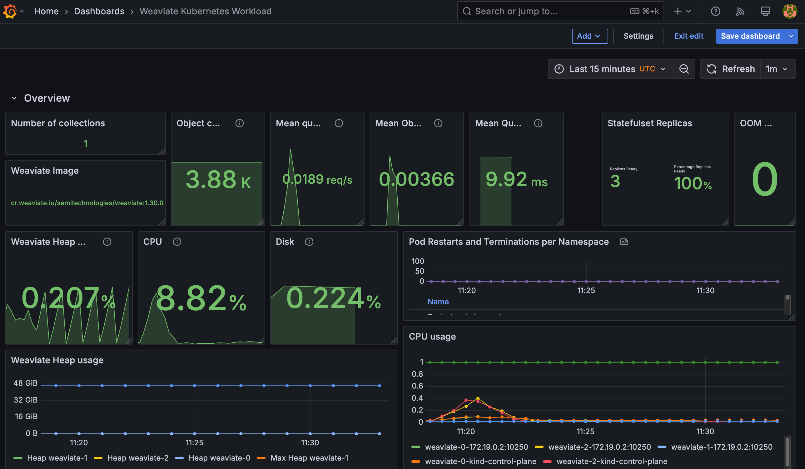
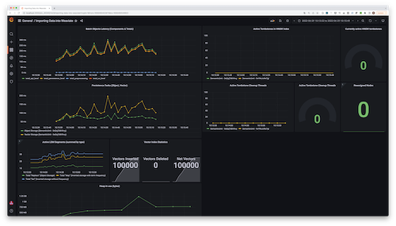
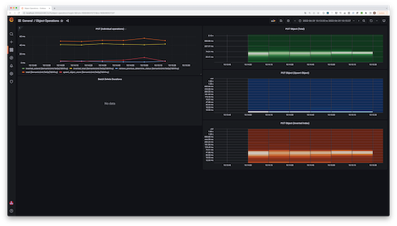
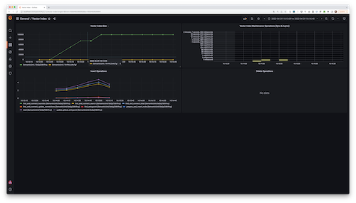
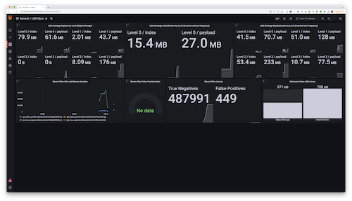
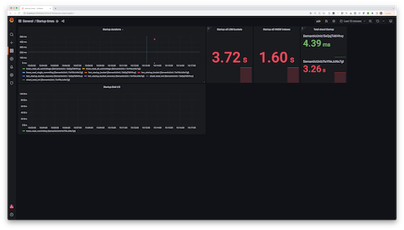
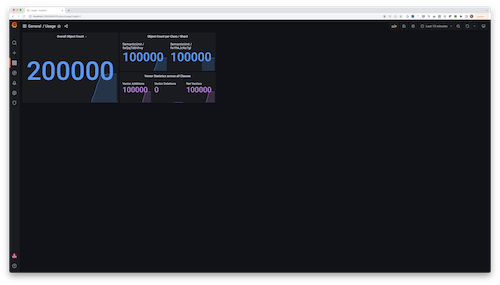
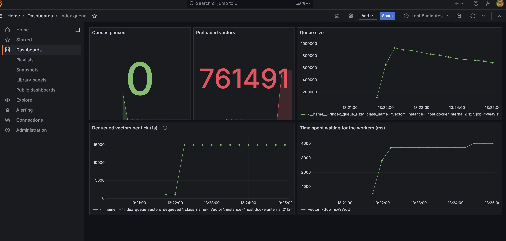

Weaviate can expose Prometheus-compatible metrics for monitoring. A standard
Prometheus/Grafana setup can be used to visualize metrics on various
dashboards.

Metrics can be used to measure request latencies, import
speed, time spent on vector vs object storage, memory usage, application usage,
and more.

## Configure Monitoring

### Enable within Weaviate

To tell Weaviate to collect metrics and expose them in a Prometheus-compatible
format, all that's required is to set the following [environment variable](./env-vars/index.md#PROMETHEUS_MONITORING_ENABLED):

```sh
PROMETHEUS_MONITORING_ENABLED=true
```

By default, Weaviate will expose the metrics at `<hostname>:2112/metrics`. You
can optionally change the port to a custom port using the following environment
variable:

```sh
PROMETHEUS_MONITORING_PORT=3456
```

### Scrape metrics from Weaviate

Metrics are typically scraped into a time-series database, such as Prometheus.
How you consume metrics depends on your setup and environment.

The [Weaviate examples repo contains a fully pre-configured setup using
Prometheus, Grafana and some example
dashboards](https://github.com/weaviate/weaviate-examples/tree/main/monitoring-prometheus-grafana).
You can start up a full-setup including monitoring and dashboards with a single
command. In this setup the following components are used:

- Docker Compose is used to provide a fully-configured setup that can be
  started with a single command.
- Weaviate is configured to expose Prometheus metrics as outlined in the
  section above.
- A Prometheus instance is started with the setup and configured to scrape
  metrics from Weaviate every 15s.
- A Grafana instance is started with the setup and configured to use the
  Prometheus instance as a metrics provider. Additionally, it runs a dashboard
  provider that contains a few sample dashboards.

### Multi-tenancy

When using multi-tenancy, we suggest setting the `PROMETHEUS_MONITORING_GROUP` [environment variable](./env-vars/index.md#PROMETHEUS_MONITORING_GROUP) as `true` so that data across all tenants are grouped together for monitoring.

## Obtainable Metrics

:::info Versioning & breaking changes

Be aware that metrics do not follow the semantic versioning guidelines of other Weaviate features. Weaviate's main APIs are stable and breaking changes are extremely rare. Metrics, however, have shorter feature lifecycles. It can sometimes be necessary to introduce an incompatible change or entirely remove a metric, for example, because the cost of observing a specific metric in production has grown too high. As a result, it is possible that a Weaviate minor release contains a breaking change for the Monitoring system. If so, it will be clearly highlighted in the [release notes](https://github.com/weaviate/weaviate/releases).

:::

The list of metrics that are obtainable through Weaviate's metric system is constantly being expanded. The complete list of metrics can be found in the source code files: 
- [`usecases/monitoring/prometheus.go`](https://github.com/weaviate/weaviate/blob/main/usecases/monitoring/prometheus.go)
- [`usecases/replica/metrics.go`](https://github.com/weaviate/weaviate/blob/main/usecases/replica/metrics.go)
- [`adapters/repos/db/metrics.go`](https://github.com/weaviate/weaviate/blob/main/adapters/repos/db/metrics.go)
- [`adapters/repos/db/lsmkv/metrics.go`](https://github.com/weaviate/weaviate/blob/main/adapters/repos/db/lsmkv/metrics.go)
- [`adapters/repos/db/lsmkv/memtable_metrics.go`](https://github.com/weaviate/weaviate/blob/main/adapters/repos/db/lsmkv/memtable_metrics.go)

This page describes metrics and their uses. Typically metrics are quite granular, as they can always be aggregated later on. For example if the granularity is "shard", you could aggregate all "shard" metrics of the same "class" (collection) to obtain a class metrics, or aggregate all metrics to obtain the metric for the entire Weaviate instance.

### General & build information

| Metric                                      | Description                                                                                                                   | Labels                                       | Type    |
| ------------------------------------------- | ----------------------------------------------------------------------------------------------------------------------------- | -------------------------------------------- | ------- |
| `weaviate_build_info`                       | Provides general information about the build (What version is currently running? How long has this version been running, etc) | `version`, `revision`, `branch`, `goVersion` | `Gauge` |
| `weaviate_runtime_config_hash`              | Hash value of the currently active runtime configuration, useful for tracking when new configurations take effect             | `sha256`                                     | `Gauge` |
| `weaviate_runtime_config_last_load_success` | Indicates whether the last loading attempt was successful (`1` for success, `0` for failure)                                  | None                                         | `Gauge` |
| `weaviate_schema_collections`               | Shows the total number of collections at any given point                                                                      | `nodeID`                                     | `Gauge` |
| `weaviate_schema_shards`                    | Shows the total number of shards at any given point                                                                           | `nodeID`, `status` (HOT, COLD, WARM, FROZEN) | `Gauge` |

### Object and query operations

#### Batch operations

| Metric                          | Description                                                                                                                                                                                             | Labels                                  | Type        |
| ------------------------------- | ------------------------------------------------------------------------------------------------------------------------------------------------------------------------------------------------------- | --------------------------------------- | ----------- |
| `batch_durations_ms`            | Duration of a single batch operation in ms. The `operation` label further defines what operation as part of the batch (e.g. object, inverted, vector) is being used. Granularity is a shard of a class. | `operation`, `class_name`, `shard_name` | `Histogram` |
| `batch_delete_durations_ms`     | Duration of a batch delete in ms. The `operation` label further defines what operation as part of the batch delete is being measured. Granularity is a shard of a class                                 | `operation`, `class_name`, `shard_name` | `Summary`   |
| `batch_size_bytes`              | Size of a raw batch request batch in bytes                                                                                                                                                              | `api`                                   | `Summary`   |
| `batch_size_objects`            | Number of objects in a batch                                                                                                                                                                            | None                                    | `Summary`   |
| `batch_size_tenants`            | Number of unique tenants referenced in a batch                                                                                                                                                          | None                                    | `Summary`   |
| `batch_objects_processed_total` | Number of objects processed in a batch                                                                                                                                                                  | `class_name`, `shard_name`              | `Counter`   |
| `batch_objects_processed_bytes` | Number of bytes processed in a batch                                                                                                                                                                    | `class_name`, `shard_name`              | `Counter`   |

#### Object operations

| Metric                 | Description                                                                                                                                                                                                                                  | Labels                                          | Type      |
| ---------------------- | -------------------------------------------------------------------------------------------------------------------------------------------------------------------------------------------------------------------------------------------- | ----------------------------------------------- | --------- |
| `object_count`         | Numbers of objects present. Granularity is a shard of a class                                                                                                                                                                                | `class_name`, `shard_name`                      | `Gauge`   |
| `objects_durations_ms` | Duration of an individual object operation, such as `put`, `delete`, etc. as indicated by the `operation` label, also as part of a batch. The `step` label adds additional precision to each `operation`. Granularity is a shard of a class. | `operation`, `step`, `class_name`, `shard_name` | `Summary` |

#### Query operations

| Metric                                 | Description                                                                                                  | Labels                                      | Type        |
| -------------------------------------- | ------------------------------------------------------------------------------------------------------------ | ------------------------------------------- | ----------- |
| `concurrent_queries_count`             | Number of concurrently running query operations                                                              | `class_name`, `query_type`                  | `Gauge`     |
| `queries_durations_ms`                 | Duration of queries in milliseconds                                                                          | `class_name`, `query_type`                  | `Histogram` |
| `queries_filtered_vector_durations_ms` | Duration of queries in milliseconds                                                                          | `class_name`, `shard_name`, `operation`     | `Summary`   |
| `concurrent_goroutines`                | Number of concurrently running goroutines                                                                    | `class_name`, `query_type`                  | `Gauge`     |
| `requests_total`                       | Metric that tracks all user requests to determine if it was successful or failed                             | `status`, `class_name`, `api`, `query_type` | `Gauge`     |
| `query_dimensions_total`               | The vector dimensions used by any read-query that involves vectors                                           | `query_type`, `operation`, `class_name`     | `Counter`   |
| `query_dimensions_combined_total`      | The vector dimensions used by any read-query that involves vectors, aggregated across all classes and shards | None                                        | `Counter`   |

### Vector index

#### General vector index

| Metric                                                 | Description                                                                                                                                                                                    | Labels                                          | Type      |
| ------------------------------------------------------ | ---------------------------------------------------------------------------------------------------------------------------------------------------------------------------------------------- | ----------------------------------------------- | --------- |
| `vector_index_size`                                    | The total capacity of the vector index. Typically larger than the number of vectors imported as it grows proactively.                                                                          | `class_name`, `shard_name`                      | `Gauge`   |
| `vector_index_operations`                              | Total number of mutating operations on the vector index. The operation itself is defined by the `operation` label.                                                                             | `operation`, `class_name`, `shard_name`         | `Gauge`   |
| `vector_index_durations_ms`                            | Duration of regular vector index operation, such as insert or delete. The operation itself is defined through the `operation` label. The `step` label adds more granularity to each operation. | `operation`, `step`, `class_name`, `shard_name` | `Summary` |
| `vector_index_maintenance_durations_ms`                | Duration of a sync or async vector index maintenance operation. The operation itself is defined through the `operation` label.                                                                 | `operation`, `class_name`, `shard_name`         | `Summary` |
| `vector_index_tombstones`                              | Number of currently active tombstones in the vector index. Will go up on each incoming delete and go down after a completed repair operation.                                                  | `class_name`, `shard_name`                      | `Gauge`   |
| `vector_index_tombstone_cleanup_threads`               | Number of currently active threads for repairing/cleaning up the vector index after deletes have occurred.                                                                                     | `class_name`, `shard_name`                      | `Gauge`   |
| `vector_index_tombstone_cleaned`                       | Total number of deleted and removed vectors after repair operations.                                                                                                                           | `class_name`, `shard_name`                      | `Counter` |
| `vector_index_tombstone_unexpected_total`              | Total number of unexpected tombstones that were found, for example because a vector was not found for an existing id in the index                                                              | `class_name`, `shard_name`, `operation`         | `Counter` |
| `vector_index_tombstone_cycle_start_timestamp_seconds` | Unix epoch timestamp of the start of the current tombstone cleanup cycle                                                                                                                       | `class_name`, `shard_name`                      | `Gauge`   |
| `vector_index_tombstone_cycle_end_timestamp_seconds`   | Unix epoch timestamp of the end of the last tombstone cleanup cycle. A negative value indicates that the cycle is still running                                                                | `class_name`, `shard_name`                      | `Gauge`   |
| `vector_index_tombstone_cycle_progress`                | A ratio (percentage) of the progress of the current tombstone cleanup cycle. 0 indicates the very beginning, 1 is a complete cycle.                                                            | `class_name`, `shard_name`                      | `Gauge`   |
| `vector_dimensions_sum`                                | Total dimensions in a shard                                                                                                                                                                    | `class_name`, `shard_name`                      | `Gauge`   |
| `vector_segments_sum`                                  | Total segments in a shard if quantization enabled                                                                                                                                              | `class_name`, `shard_name`                      | `Gauge`   |

#### Vector index (IVF-specific)

| Metric                                            | Description                                                                         | Labels                                  | Type        |
| ------------------------------------------------- | ----------------------------------------------------------------------------------- | --------------------------------------- | ----------- |
| `vector_index_postings`                           | The size of the vector index postings. Typically much lower than number of vectors. | `class_name`, `shard_name`              | `Gauge`     |
| `vector_index_posting_size_vectors`               | The size of individual vectors in each posting list                                 | `class_name`, `shard_name`              | `Histogram` |
| `vector_index_pending_background_operations`      | Number of background operations yet to be processed                                 | `operation`, `class_name`, `shard_name` | `Gauge`     |
| `vector_index_background_operations_durations_ms` | Duration of typical vector index background operations (split, merge, reassign)     | `operation`, `class_name`, `shard_name` | `Summary`   |
| `vector_index_store_operations_durations_ms`      | Duration of store operations (put, append, get)                                     | `operation`, `class_name`, `shard_name` | `Summary`   |

#### Async index queue

| Metric                                   | Description                                                 | Labels                                      | Type        |
| ---------------------------------------- | ----------------------------------------------------------- | ------------------------------------------- | ----------- |
| `queue_size`                             | Number of records in the queue                              | `class_name`, `shard_name`                  | `Gauge`     |
| `queue_disk_usage`                       | Disk usage of the queue                                     | `class_name`, `shard_name`                  | `Gauge`     |
| `queue_paused`                           | Whether the queue is paused                                 | `class_name`, `shard_name`                  | `Gauge`     |
| `queue_count`                            | Number of queues                                            | `class_name`, `shard_name`                  | `Gauge`     |
| `queue_partition_processing_duration_ms` | Duration in ms of a single partition processing             | `class_name`, `shard_name`                  | `Histogram` |
| `vector_index_queue_insert_count`        | Number of insert operations added to the vector index queue | `class_name`, `shard_name`, `target_vector` | `Counter`   |
| `vector_index_queue_delete_count`        | Number of delete operations added to the vector index queue | `class_name`, `shard_name`, `target_vector` | `Counter`   |

#### Tombstone management

| Metric                             | Description                                              | Labels                     | Type      |
| ---------------------------------- | -------------------------------------------------------- | -------------------------- | --------- |
| `tombstone_find_local_entrypoint`  | Total number of tombstone delete local entrypoint calls  | `class_name`, `shard_name` | `Counter` |
| `tombstone_find_global_entrypoint` | Total number of tombstone delete global entrypoint calls | `class_name`, `shard_name` | `Counter` |
| `tombstone_reassign_neighbors`     | Total number of tombstone reassign neighbor calls        | `class_name`, `shard_name` | `Counter` |
| `tombstone_delete_list_size`       | Delete list size of tombstones                           | `class_name`, `shard_name` | `Gauge`   |

### LSM store

The following sections provide detailed metrics for LSM (Log-Structured Merge-tree) bucket operations and replication functionality.

#### General LSM store

| Metric                                     | Description                                                                                                     | Labels                                                          | Type      |
| ------------------------------------------ | --------------------------------------------------------------------------------------------------------------- | --------------------------------------------------------------- | --------- |
| `lsm_active_segments`                      | Number of currently present segments per shard. Granularity is shard of a class. Grouped by `strategy`.         | `strategy`, `class_name`, `shard_name`, `path`                  | `Gauge`   |
| `lsm_objects_bucket_segment_count`         | Number of segments per shard in the objects bucket                                                              | `strategy`, `class_name`, `shard_name`, `path`                  | `Gauge`   |
| `lsm_compressed_vecs_bucket_segment_count` | Number of segments per shard in the vectors_compressed bucket                                                   | `strategy`, `class_name`, `shard_name`, `path`                  | `Gauge`   |
| `lsm_segment_count`                        | Number of segments by level                                                                                     | `strategy`, `class_name`, `shard_name`, `path`, `level`         | `Gauge`   |
| `lsm_segment_objects`                      | Number of entries per LSM segment by level. Granularity is shard of a class. Grouped by `strategy` and `level`. | `strategy`, `class_name`, `shard_name`, `path`, `level`         | `Gauge`   |
| `lsm_segment_size`                         | Size of LSM segment by level and unit                                                                           | `strategy`, `class_name`, `shard_name`, `path`, `level`, `unit` | `Gauge`   |
| `lsm_segment_unloaded`                     | Number of unloaded segments                                                                                     | `strategy`, `class_name`, `shard_name`, `path`                  | `Gauge`   |
| `lsm_memtable_size`                        | Size of memtable by path                                                                                        | `strategy`, `class_name`, `shard_name`, `path`                  | `Gauge`   |
| `lsm_memtable_durations_ms`                | Time in ms for a bucket operation to complete                                                                   | `strategy`, `class_name`, `shard_name`, `path`, `operation`     | `Summary` |
| `lsm_bitmap_buffers_usage`                 | Number of bitmap buffers used by size                                                                           | `size`, `operation`                                             | `Counter` |

#### LSM bucket operations

These metrics track read and write operations on LSM buckets, providing detailed visibility into database performance.

| Metric                                        | Description                                                 | Labels                                                                             | Type        |
| --------------------------------------------- | ----------------------------------------------------------- | ---------------------------------------------------------------------------------- | ----------- |
| `lsm_bucket_read_operation_count`             | Total number of LSM bucket read operations requested        | `operation` (get), `component` (active_memtable, flushing_memtable, segment_group) | `Counter`   |
| `lsm_bucket_read_operation_ongoing`           | Number of LSM bucket read operations currently in progress  | `operation` (get), `component` (active_memtable, flushing_memtable, segment_group) | `Gauge`     |
| `lsm_bucket_read_operation_failure_count`     | Number of failed LSM bucket read operations                 | `operation` (get), `component` (active_memtable, flushing_memtable, segment_group) | `Counter`   |
| `lsm_bucket_read_operation_duration_seconds`  | Duration of LSM bucket read operations in seconds           | `operation` (get), `component` (active_memtable, flushing_memtable, segment_group) | `Histogram` |
| `lsm_bucket_write_operation_count`            | Total number of LSM bucket write operations requested       | `operation` (put, delete)                                                          | `Counter`   |
| `lsm_bucket_write_operation_ongoing`          | Number of LSM bucket write operations currently in progress | `operation` (put, delete)                                                          | `Gauge`     |
| `lsm_bucket_write_operation_failure_count`    | Number of failed LSM bucket write operations                | `operation` (put, delete)                                                          | `Counter`   |
| `lsm_bucket_write_operation_duration_seconds` | Duration of LSM bucket write operations in seconds          | `operation` (put, delete)                                                          | `Histogram` |

#### LSM bucket lifecycle

These metrics track the initialization and shutdown of LSM buckets.

| Metric                                 | Description                                                | Labels     | Type        |
| -------------------------------------- | ---------------------------------------------------------- | ---------- | ----------- |
| `lsm_bucket_init_count`                | Total number of LSM bucket initializations requested       | `strategy` | `Counter`   |
| `lsm_bucket_init_in_progress`          | Number of LSM bucket initializations currently in progress | `strategy` | `Gauge`     |
| `lsm_bucket_init_failure_count`        | Number of failed LSM bucket initializations                | `strategy` | `Counter`   |
| `lsm_bucket_init_duration_seconds`     | Duration of LSM bucket initialization in seconds           | `strategy` | `Histogram` |
| `lsm_bucket_shutdown_count`            | Total number of LSM bucket shutdowns requested             | `strategy` | `Counter`   |
| `lsm_bucket_shutdown_in_progress`      | Number of LSM bucket shutdowns currently in progress       | `strategy` | `Gauge`     |
| `lsm_bucket_shutdown_duration_seconds` | Duration of LSM bucket shutdown in seconds                 | `strategy` | `Histogram` |
| `lsm_bucket_shutdown_failure_count`    | Number of failed LSM bucket shutdowns                      | `strategy` | `Counter`   |

#### LSM bucket cursors

These metrics track cursor usage patterns in LSM buckets.

| Metric                               | Description                                         | Labels     | Type        |
| ------------------------------------ | --------------------------------------------------- | ---------- | ----------- |
| `lsm_bucket_opened_cursors`          | Number of opened LSM bucket cursors                 | `strategy` | `Counter`   |
| `lsm_bucket_open_cursors`            | Number of currently open LSM bucket cursors         | `strategy` | `Gauge`     |
| `lsm_bucket_cursor_duration_seconds` | Duration of LSM bucket cursor operations in seconds | `strategy` | `Histogram` |

#### LSM segment metrics

These metrics provide visibility into LSM segment storage and size distribution.

| Metric                          | Description                          | Labels     | Type        |
| ------------------------------- | ------------------------------------ | ---------- | ----------- |
| `lsm_bucket_segment_total`      | Total number of LSM bucket segments  | `strategy` | `Gauge`     |
| `lsm_bucket_segment_size_bytes` | Size of LSM bucket segments in bytes | `strategy` | `Histogram` |

#### LSM compaction

These metrics track compaction operations that merge and optimize LSM segments.

| Metric                                   | Description                                                                              | Labels     | Type        |
| ---------------------------------------- | ---------------------------------------------------------------------------------------- | ---------- | ----------- |
| `lsm_bucket_compaction_count`            | Total number of LSM bucket compactions requested                                         | `strategy` | `Counter`   |
| `lsm_bucket_compaction_in_progress`      | Number of LSM bucket compactions currently in progress                                   | `strategy` | `Gauge`     |
| `lsm_bucket_compaction_failure_count`    | Number of failed LSM bucket compactions                                                  | `strategy` | `Counter`   |
| `lsm_bucket_compaction_noop_count`       | Number of times the periodic LSM bucket compaction task ran but found nothing to compact | `strategy` | `Counter`   |
| `lsm_bucket_compaction_duration_seconds` | Duration of LSM bucket compaction in seconds                                             | `strategy` | `Histogram` |

#### LSM memtable operations

These metrics track memtable flush operations that persist in-memory data to disk.

| Metric                                | Description                                     | Labels     | Type        |
| ------------------------------------- | ----------------------------------------------- | ---------- | ----------- |
| `lsm_memtable_flush_total`            | Total number of LSM memtable flushes            | `strategy` | `Counter`   |
| `lsm_memtable_flush_in_progress`      | Number of LSM memtable flushes in progress      | `strategy` | `Gauge`     |
| `lsm_memtable_flush_failures_total`   | Total number of failed LSM memtable flushes     | `strategy` | `Counter`   |
| `lsm_memtable_flush_duration_seconds` | Duration of LSM memtable flush in seconds       | `strategy` | `Histogram` |
| `lsm_memtable_flush_size_bytes`       | Size of LSM memtable at flushing time, in bytes | `strategy` | `Histogram` |

#### LSM WAL recovery

These metrics track Write-Ahead Log (WAL) recovery operations during startup.

| Metric                                     | Description                                               | Labels     | Type        |
| ------------------------------------------ | --------------------------------------------------------- | ---------- | ----------- |
| `lsm_bucket_wal_recovery_count`            | Total number of LSM bucket WAL recoveries requested       | `strategy` | `Counter`   |
| `lsm_bucket_wal_recovery_in_progress`      | Number of LSM bucket WAL recoveries currently in progress | `strategy` | `Gauge`     |
| `lsm_bucket_wal_recovery_failure_count`    | Number of failed LSM bucket WAL recoveries                | `strategy` | `Counter`   |
| `lsm_bucket_wal_recovery_duration_seconds` | Duration of LSM bucket WAL recovery in seconds            | `strategy` | `Histogram` |

### Schema & cluster consensus 

#### Schema & RAFT consensus

| Metric                            | Description                                                   | Labels | Type      |
| --------------------------------- | ------------------------------------------------------------- | ------ | --------- |
| `schema_writes_seconds`           | Duration of schema writes (which always involve the leader)   | `type` | `Summary` |
| `schema_reads_local_seconds`      | Duration of local schema reads that do not involve the leader | `type` | `Summary` |
| `schema_reads_leader_seconds`     | Duration of schema reads that are passed to the leader        | `type` | `Summary` |
| `schema_wait_for_version_seconds` | Duration of waiting for a schema version to be reached        | `type` | `Summary` |

#### Schema transactions (deprecated)

| Metric                       | Description                                                                             | Labels                | Type      |
| ---------------------------- | --------------------------------------------------------------------------------------- | --------------------- | --------- |
| `schema_tx_opened_total`     | Total number of opened schema transactions                                              | `ownership`           | `Counter` |
| `schema_tx_closed_total`     | Total number of closed schema transactions. A close must be either successful or failed | `ownership`, `status` | `Counter` |
| `schema_tx_duration_seconds` | Mean duration of a tx by status                                                         | `ownership`, `status` | `Summary` |

#### RAFT metrics (internal)

| Metric                                                        | Description                                                                                                                          | Labels                    | Type      |
| ------------------------------------------------------------- | ------------------------------------------------------------------------------------------------------------------------------------ | ------------------------- | --------- |
| `weaviate_internal_counter_raft_apply`                        | Number of transactions in the configured interval                                                                                    | None                      | `Counter` |
| `weaviate_internal_counter_raft_state_candidate`              | Number of times the raft server initiated an election                                                                                | None                      | `Counter` |
| `weaviate_internal_counter_raft_state_follower`               | Number of times in the configured interval that the raft server became a follower                                                    | None                      | `Summary` |
| `weaviate_internal_counter_raft_state_leader`                 | Number of times the raft server became a leader                                                                                      | None                      | `Counter` |
| `weaviate_internal_counter_raft_transition_heartbeat_timeout` | Number of times that the node transitioned to `candidate` state after not receiving a heartbeat message from the last known leader   | None                      | `Counter` |
| `weaviate_internal_gauge_raft_commitNumLogs`                  | Number of logs processed for application to the finite state machine in a single batch                                               | None                      | `Gauge`   |
| `weaviate_internal_gauge_raft_leader_dispatchNumLogs`         | Number of logs committed to disk in the most recent batch                                                                            | None                      | `Gauge`   |
| `weaviate_internal_gauge_raft_leader_oldestLogAge`            | The number of milliseconds since the oldest log in the leader's log store was written                                                | None                      | `Gauge`   |
| `weaviate_internal_gauge_raft_peers`                          | The number of peers in the raft cluster configuration                                                                                | None                      | `Gauge`   |
| `weaviate_internal_sample_raft_boltdb_logBatchSize`           | Measures the total size in bytes of logs being written to the db in a single batch                                                   | `quantile=0.5, 0.9, 0.99` | `Summary` |
| `weaviate_internal_sample_raft_boltdb_logSize`                | Measures the size of logs being written to the db                                                                                    | `quantile=0.5, 0.9, 0.99` | `Summary` |
| `weaviate_internal_sample_raft_boltdb_logsPerBatch`           | Measures the number of logs being written per batch to the db                                                                        | `quantile=0.5, 0.9, 0.99` | `Summary` |
| `weaviate_internal_sample_raft_boltdb_writeCapacity`          | Theoretical write capacity in terms of the number of logs that can be written per second                                             | `quantile=0.5, 0.9, 0.99` | `Summary` |
| `weaviate_internal_sample_raft_thread_fsm_saturation`         | An approximate measurement of the proportion of time the Raft FSM goroutine is busy and unavailable to accept new work               | `quantile=0.5, 0.9, 0.99` | `Summary` |
| `weaviate_internal_sample_raft_thread_main_saturation`        | An approximate measurement of the proportion of time the main Raft goroutine is busy and unavailable to accept new work (percentage) | `quantile=0.5, 0.9, 0.99` | `Summary` |
| `weaviate_internal_timer_raft_boltdb_getLog`                  | Measures the amount of time spent reading logs from the db (in ms)                                                                   | `quantile=0.5, 0.9, 0.99` | `Summary` |
| `weaviate_internal_timer_raft_boltdb_storeLogs`               | Time required to record any outstanding logs since the last request to append entries for the given node                             | `quantile=0.5, 0.9, 0.99` | `Summary` |
| `weaviate_internal_timer_raft_commitTime`                     | Time required to commit a new entry to the raft log on the leader node                                                               | `quantile=0.5, 0.9, 0.99` | `Summary` |
| `weaviate_internal_timer_raft_fsm_apply`                      | Number of logs committed by the finite state machine since the last interval                                                         | `quantile=0.5, 0.9, 0.99` | `Summary` |
| `weaviate_internal_timer_raft_fsm_enqueue`                    | Time required to queue up a batch of logs for the finite state machine to apply                                                      | `quantile=0.5, 0.9, 0.99` | `Summary` |
| `weaviate_internal_timer_raft_leader_dispatchLog`             | Time required for the leader node to write a log entry to disk                                                                       | `quantile=0.5, 0.9, 0.99` | `Summary` |

#### Memberlist (internal)

| Metric                                                 | Description                                                          | Labels                    | Type      |
| ------------------------------------------------------ | -------------------------------------------------------------------- | ------------------------- | --------- |
| `weaviate_internal_sample_memberlist_queue_broadcasts` | Shows the number of messages in the broadcast queue of Memberlist    | `quantile=0.5, 0.9, 0.99` | `Summary` |
| `weaviate_internal_timer_memberlist_gossip`            | Shows the latency distribution of the each gossip made in Memberlist | `quantile=0.5, 0.9, 0.99` | `Summary` |

### System resources

#### File I/O & memory

| Metric                       | Description                           | Labels                  | Type      |
| ---------------------------- | ------------------------------------- | ----------------------- | --------- |
| `file_io_writes_total_bytes` | Total number of bytes written to disk | `operation`, `strategy` | `Summary` |
| `file_io_reads_total_bytes`  | Total number of bytes read from disk  | `operation`             | `Summary` |
| `mmap_operations_total`      | Total number of mmap operations       | `operation`, `strategy` | `Counter` |
| `mmap_proc_maps`             | Number of entries in /proc/self/maps  | None                    | `Gauge`   |

#### Async operations

| Metric                     | Description                                                                                                  | Labels                                          | Type    |
| -------------------------- | ------------------------------------------------------------------------------------------------------------ | ----------------------------------------------- | ------- |
| `async_operations_running` | Number of currently running async operations. The operation itself is defined through the `operation` label. | `operation`, `class_name`, `shard_name`, `path` | `Gauge` |

#### Checksum

| Metric                                 | Description                                     | Labels | Type      |
| -------------------------------------- | ----------------------------------------------- | ------ | --------- |
| `checksum_validation_duration_seconds` | Duration of checksum validation                 | None   | `Summary` |
| `checksum_bytes_read`                  | Number of bytes read during checksum validation | None   | `Summary` |

#### Startup

| Metric                      | Description                                                                                                                                                                     | Labels                                  | Type      |
| --------------------------- | ------------------------------------------------------------------------------------------------------------------------------------------------------------------------------- | --------------------------------------- | --------- |
| `startup_progress`          | A ratio (percentage) of startup progress for a particular component in a shard                                                                                                  | `operation`, `class_name`, `shard_name` | `Gauge`   |
| `startup_durations_ms`      | Duration of individual startup operations in ms. The operation itself is defined through the `operation` label.                                                                 | `operation`, `class_name`, `shard_name` | `Summary` |
| `startup_diskio_throughput` | Disk I/O throughput in bytes/s at startup operations, such as reading back the HNSW index or recovering LSM segments. The operation itself is defined by the `operation` label. | `operation`, `class_name`, `shard_name` | `Summary` |

#### Backup & restore

| Metric                            | Description                                               | Labels                       | Type      |
| --------------------------------- | --------------------------------------------------------- | ---------------------------- | --------- |
| `backup_restore_ms`               | Duration of a backup restore                              | `backend_name`, `class_name` | `Summary` |
| `backup_restore_class_ms`         | Duration restoring class                                  | `class_name`                 | `Summary` |
| `backup_restore_init_ms`          | Startup phase of a backup restore                         | `backend_name`, `class_name` | `Summary` |
| `backup_restore_from_backend_ms`  | File transfer stage of a backup restore                   | `backend_name`, `class_name` | `Summary` |
| `backup_store_to_backend_ms`      | File transfer stage of a backup store                     | `backend_name`, `class_name` | `Summary` |
| `bucket_pause_durations_ms`       | Bucket pause durations                                    | `bucket_dir`                 | `Summary` |
| `backup_restore_data_transferred` | Total number of bytes transferred during a backup restore | `backend_name`, `class_name` | `Counter` |
| `backup_store_data_transferred`   | Total number of bytes transferred during a backup store   | `backend_name`, `class_name` | `Counter` |

#### Shard management

| Metric                                                | Description                                  | Labels                                                  | Type        |
| ----------------------------------------------------- | -------------------------------------------- | ------------------------------------------------------- | ----------- |
| `shards_loaded`                                       | Number of shards loaded                      | None                                                    | `Gauge`     |
| `shards_unloaded`                                     | Number of shards not loaded                  | None                                                    | `Gauge`     |
| `shards_loading`                                      | Number of shards in process of loading       | None                                                    | `Gauge`     |
| `shards_unloading`                                    | Number of shards in process of unloading     | None                                                    | `Gauge`     |
| `weaviate_index_shards_total`                         | Total number of shards per index status      | `status` (READONLY, INDEXING, LOADING, READY, SHUTDOWN) | `Gauge`     |
| `weaviate_index_shard_status_update_duration_seconds` | Time taken to update shard status in seconds | `status` (READONLY, INDEXING, LOADING, READY, SHUTDOWN) | `Histogram` |

### Modules & extensions

#### Vectorization (Text2Vec)

| Metric                             | Description                                                      | Labels                    | Type        |
| ---------------------------------- | ---------------------------------------------------------------- | ------------------------- | ----------- |
| `t2v_concurrent_batches`           | Number of batches currently running                              | `vectorizer`              | `Gauge`     |
| `t2v_batch_queue_duration_seconds` | Time of a batch spend in specific portions of the queue          | `vectorizer`, `operation` | `Histogram` |
| `t2v_request_duration_seconds`     | Duration of an individual request to the vectorizer              | `vectorizer`              | `Histogram` |
| `t2v_tokens_in_batch`              | Number of tokens in a user-defined batch                         | `vectorizer`              | `Histogram` |
| `t2v_tokens_in_request`            | Number of tokens in an individual request sent to the vectorizer | `vectorizer`              | `Histogram` |
| `t2v_rate_limit_stats`             | Rate limit stats for the vectorizer                              | `vectorizer`, `stat`      | `Gauge`     |
| `t2v_repeat_stats`                 | Why batch scheduling is repeated                                 | `vectorizer`, `stat`      | `Gauge`     |
| `t2v_requests_per_batch`           | Number of requests required to process an entire (user) batch    | `vectorizer`              | `Histogram` |

#### Tokenizer

| Metric                                  | Description                                      | Labels      | Type        |
| --------------------------------------- | ------------------------------------------------ | ----------- | ----------- |
| `tokenizer_duration_seconds`            | Duration of a tokenizer operation                | `tokenizer` | `Histogram` |
| `tokenizer_requests_total`              | Number of tokenizer requests                     | `tokenizer` | `Counter`   |
| `tokenizer_initialize_duration_seconds` | Duration of a tokenizer initialization operation | `tokenizer` | `Histogram` |
| `token_count_total`                     | Number of tokens processed                       | `tokenizer` | `Counter`   |
| `token_count_per_request`               | Number of tokens processed per request           | `tokenizer` | `Histogram` |

#### Module & external API

| Metric                                     | Description                                                    | Labels                                    | Type        |
| ------------------------------------------ | -------------------------------------------------------------- | ----------------------------------------- | ----------- |
| `weaviate_module_requests_total`           | Number of module requests to external APIs                     | `op`, `api`                               | `Counter`   |
| `weaviate_module_request_duration_seconds` | Duration of an individual request to a module external API     | `op`, `api`                               | `Histogram` |
| `weaviate_module_requests_per_batch`       | Number of items in a batch                                     | `op`, `api`                               | `Histogram` |
| `weaviate_module_request_size_bytes`       | Size (in bytes) of the request sent to an external API         | `op`, `api`                               | `Histogram` |
| `weaviate_module_response_size_bytes`      | Size (in bytes) of the response received from an external API  | `op`, `api`                               | `Histogram` |
| `weaviate_vectorizer_request_tokens`       | Number of tokens in the request sent to an external vectorizer | `inout`, `api`                            | `Histogram` |
| `weaviate_module_request_single_count`     | Number of single-item external API requests                    | `op`, `api`                               | `Counter`   |
| `weaviate_module_request_batch_count`      | Number of batched module requests                              | `op`, `api`                               | `Counter`   |
| `weaviate_module_error_total`              | Number of module errors                                        | `op`, `module`, `endpoint`, `status_code` | `Counter`   |
| `weaviate_module_call_error_total`         | Number of module errors (related to external calls)            | `module`, `endpoint`, `status_code`       | `Counter`   |
| `weaviate_module_response_status_total`    | Number of API response statuses                                | `op`, `endpoint`, `status`                | `Counter`   |
| `weaviate_module_batch_error_total`        | Number of batch errors                                         | `operation`, `class_name`                 | `Counter`   |

#### Usage Tracking

| Metric                                               | Description                                  | Labels                                                 | Type        |
| ---------------------------------------------------- | -------------------------------------------- | ------------------------------------------------------ | ----------- |
| `weaviate_usage_{gcs\|s3}_operations_total`          | Total number of operations for module labels | `operation` (collect/upload), `status` (success/error) | `Counter`   |
| `weaviate_usage_{gcs\|s3}_operation_latency_seconds` | Latency of usage operations in seconds       | `operation` (collect/upload)                           | `Histogram` |
| `weaviate_usage_{gcs\|s3}_resource_count`            | Number of resources tracked by module        | `resource_type` (collections/shards/backups)           | `Gauge`     |
| `weaviate_usage_{gcs\|s3}_uploaded_file_size_bytes`  | Size of the uploaded usage file in bytes     | None                                                   | `Gauge`     |

---

### Replication

#### Async replication

These metrics track asynchronous replication operations for maintaining data consistency across replicas.

| Metric                                                   | Description                                                              | Labels                                | Type        |
| -------------------------------------------------------- | ------------------------------------------------------------------------ | ------------------------------------- | ----------- |
| `async_replication_goroutines_running`                   | Number of currently running async replication goroutines                 | `type` (hashbeater, hashbeat_trigger) | `Gauge`     |
| `async_replication_hashtree_init_count`                  | Count of async replication hashtree initializations                      | None                                  | `Counter`   |
| `async_replication_hashtree_init_running`                | Number of currently running hashtree initializations                     | None                                  | `Gauge`     |
| `async_replication_hashtree_init_failure_count`          | Count of async replication hashtree initialization failures              | None                                  | `Counter`   |
| `async_replication_hashtree_init_duration_seconds`       | Duration of hashtree initialization in seconds                           | None                                  | `Histogram` |
| `async_replication_iteration_count`                      | Count of async replication comparison iterations                         | None                                  | `Counter`   |
| `async_replication_iteration_failure_count`              | Count of async replication iteration failures                            | None                                  | `Counter`   |
| `async_replication_iteration_duration_seconds`           | Duration of async replication comparison iterations in seconds           | None                                  | `Histogram` |
| `async_replication_iteration_running`                    | Number of currently running async replication iterations                 | None                                  | `Gauge`     |
| `async_replication_hashtree_diff_duration_seconds`       | Duration of async replication hashtree diff computation in seconds       | None                                  | `Histogram` |
| `async_replication_object_digests_diff_duration_seconds` | Duration of async replication object digests diff computation in seconds | None                                  | `Histogram` |
| `async_replication_propagation_count`                    | Count of async replication propagation executions                        | None                                  | `Counter`   |
| `async_replication_propagation_failure_count`            | Count of async replication propagation failures                          | None                                  | `Counter`   |
| `async_replication_propagation_object_count`             | Count of objects propagated by async replication                         | None                                  | `Counter`   |
| `async_replication_propagation_duration_seconds`         | Duration of async replication propagation in seconds                     | None                                  | `Histogram` |

#### Replication coordinator

These metrics track the replication coordinator's read and write operations across replicas.

| Metric                                            | Description                                                                    | Labels | Type        |
| ------------------------------------------------- | ------------------------------------------------------------------------------ | ------ | ----------- |
| `replication_coordinator_writes_succeed_all`      | Count of requests succeeding a write to all replicas                           | None   | `Counter`   |
| `replication_coordinator_writes_succeed_some`     | Count of requests succeeding a write to some replicas > CL but less than all   | None   | `Counter`   |
| `replication_coordinator_writes_failed`           | Count of requests failing due to consistency level                             | None   | `Counter`   |
| `replication_coordinator_reads_succeed_all`       | Count of requests succeeding a read from CL replicas                           | None   | `Counter`   |
| `replication_coordinator_reads_succeed_some`      | Count of requests succeeding a read from some replicas < CL but more than zero | None   | `Counter`   |
| `replication_coordinator_reads_failed`            | Count of requests failing due to read from replicas                            | None   | `Counter`   |
| `replication_read_repair_count`                   | Count of read repairs started                                                  | None   | `Counter`   |
| `replication_read_repair_failure`                 | Count of read repairs failed                                                   | None   | `Counter`   |
| `replication_coordinator_writes_duration_seconds` | Duration in seconds of write operations to replicas                            | None   | `Histogram` |
| `replication_coordinator_reads_duration_seconds`  | Duration in seconds of read operations from replicas                           | None   | `Histogram` |
| `replication_read_repair_duration_seconds`        | Duration in seconds of read repair operations                                  | None   | `Histogram` |

---

<!-- TODO[g-despot] First we need to create this guide for adding metrics - Extending Weaviate with new metrics is very easy. To suggest a new metric, see the [contributor guide](/contributor-guide).-->

## Sample Dashboards

Weaviate does not ship with any dashboards by default, but here is a list of
dashboards being used by the various Weaviate teams, both during development,
and when helping users. These do not come with any support, but may still be
helpful. Treat them as inspiration to design your own dashboards which fit
your uses perfectly:

| Dashboard                                                                                                                     | Purpose                                                                                                                 | Preview                                                                                                            |
| ----------------------------------------------------------------------------------------------------------------------------- | ----------------------------------------------------------------------------------------------------------------------- | ------------------------------------------------------------------------------------------------------------------ |
| [Cluster Workload in Kubernetes](https://github.com/weaviate/weaviate/blob/main/tools/dev/grafana/dashboards/kubernetes.json) | Visualize cluster workload, usage and activity in Kubernetes                                                            |  |
| [Importing Data Into Weaviate](https://github.com/weaviate/weaviate/blob/master/tools/dev/grafana/dashboards/importing.json)  | Visualize speed of import operations (including its components, such as object store, inverted index, and vector index) |       |
| [Object Operations](https://github.com/weaviate/weaviate/blob/master/tools/dev/grafana/dashboards/objects.json)               | Visualize speed of whole object operations, such as GET, PUT, etc.                                                      |                                                   |
| [Vector Index](https://github.com/weaviate/weaviate/blob/master/tools/dev/grafana/dashboards/vectorindex.json)                | Visualize the current state, as well as operations on the HNSW vector index                                             |                                          |
| [LSM Stores](https://github.com/weaviate/weaviate/blob/master/tools/dev/grafana/dashboards/lsm.json)                          | Get insights into the internals (including segments) of the various LSM stores within Weaviate                          |                                                   |
| [Startup](https://github.com/weaviate/weaviate/blob/master/tools/dev/grafana/dashboards/startup.json)                         | Visualize the startup process, including recovery operations                                                            |                                              |
| [Usage](https://github.com/weaviate/weaviate/blob/master/tools/dev/grafana/dashboards/usage.json)                             | Obtain usage metrics, such as number of objects imported, etc.                                                          |                                                         |
| [Aysnc index queue](https://github.com/weaviate/weaviate/blob/main/tools/dev/grafana/dashboards/index_queue.json)             | Observe index queue activity                                                                                            |                           |

## `nodes` API Endpoint

To get collection details programmatically, use the [`nodes`](/deploy/configuration/nodes.md) REST endpoint.

import APIOutputs from '/\_includes/rest/node-endpoint-info.mdx';

<APIOutputs />

## Questions and feedback

import DocsFeedback from '/\_includes/docs-feedback.mdx';

<DocsFeedback/>
