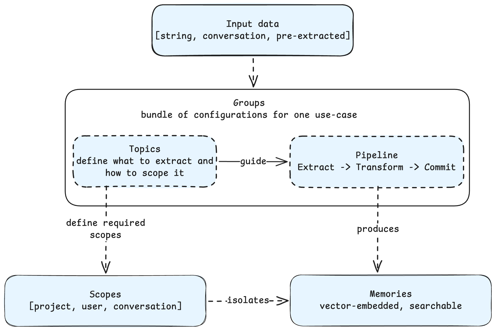

This page introduces the core concepts behind Engram's memory system. Each concept has its own page with full details.

| Concept | Description |
|---------|-------------|
| [Memories](memories.md) | Discrete pieces of information stored in Engram, automatically embedded as vectors for semantic search. |
| [Groups](groups.md) | Containers of topics and pipelines — a bundle of configuration that maps 1:1 to a use case. |
| [Topics](topics.md) | Named categories within a group that control what kinds of information to extract and how to scope it. |
| [Scopes](scopes.md) | Multi-level isolation system (project, user, conversation) that controls memory visibility. |
| [Input data types](input-data-types.md) | The three content formats Engram accepts: string, pre-extracted, and conversation. |
| [Pipelines](pipelines.md) | Async processing that extracts, transforms, and commits memories. Includes runs for tracking execution. |
| [Retrieval](retrieval.md) | Search strategies for finding memories: vector, BM25, and hybrid. |

## How concepts relate

- A [**Group**](groups.md) bundles a [**Pipeline**](pipelines.md) with one or more [**Topics**](topics.md) — one group per use case.
- [**Input data**](input-data-types.md) (string, conversation, or pre-extracted) is sent to a group for processing.
- **Topics** guide the pipeline on what to extract and define which [**Scopes**](scopes.md) are required.
- The pipeline produces [**Memories**](memories.md), which are isolated according to the scope rules.

## Questions and feedback

import DocsFeedback from '/_includes/docs-feedback.mdx';

<DocsFeedback/>
