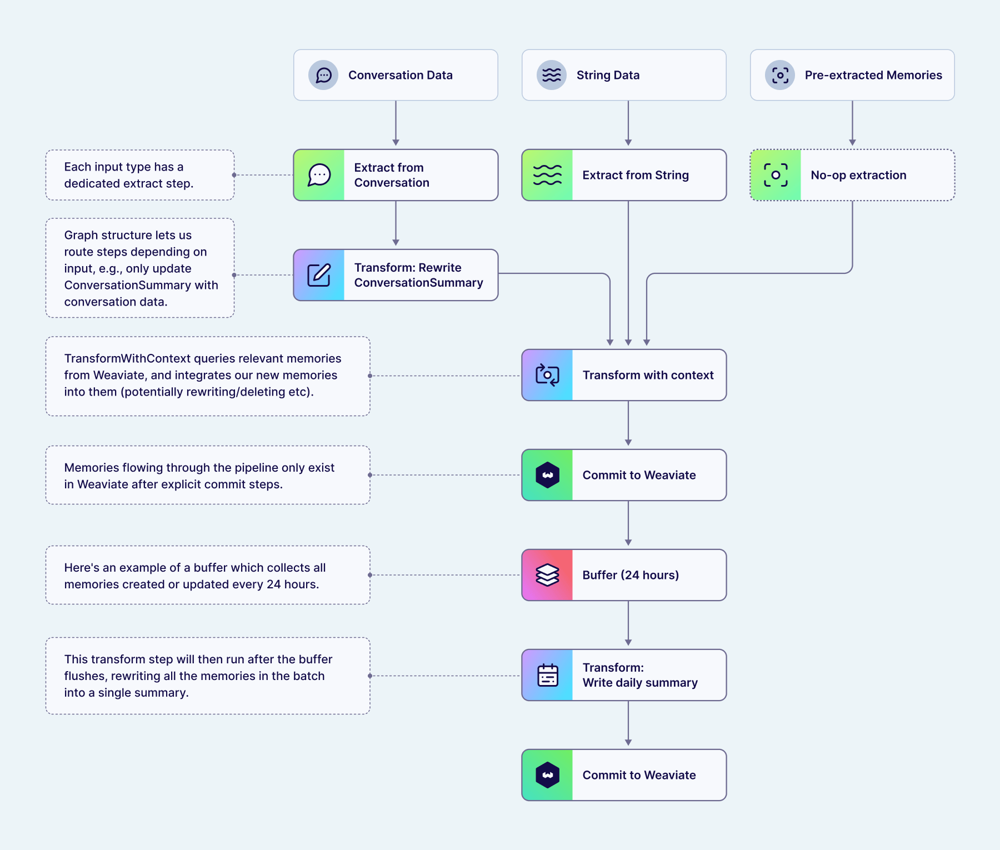

When you send content to Engram, it runs through an asynchronous pipeline that extracts, transforms, and commits memories. Pipelines are defined as a directed acyclic graph (DAG) of steps — different [input content types](input-data-types.md) enter the DAG at different extraction steps, and downstream steps like transform and commit are often shared between them.

:::info Pipeline configuration

Configurable pipelines are available on enterprise plans.

:::

## Pipeline steps

Each pipeline is a DAG with multiple entrypoints — one per content type — that converge into shared downstream steps:

1. **Extract** — The entrypoint into the pipeline. Each [content type](input-data-types.md) has its own extraction step (`ExtractFromString`, `ExtractFromConversation`, or `ExtractFromPreExtracted`). These extraction steps often feed into shared downstream transform and commit steps, though that is not required — a pipeline can route different content types through different downstream steps.
2. **Transform** — Refines extracted memories using existing context. Steps like `TransformWithContext`, `TransformOperations`, `TransformConcatenate`, and `TransformAggregate` deduplicate, merge, consolidate, and resolve conflicts with existing memories. `TransformAggregate` and `TransformWithContext` also honor [bounded topics](topics.md), consolidating multiple extracted facts into the single memory that exists for the topic's scope.
3. **Buffer** — Pauses the pipeline and accumulates memories (or raw inputs) until a trigger fires — by count, time since the first item, or time since the last item. Buffers can appear anywhere in the pipeline, not just at the start. Memories from different content types that route into the same buffer are aggregated together.
4. **Commit** — Finalizes the operations (create, update, delete) and persists them to storage.

A pipeline can chain these steps in different ways. For example, a pipeline for aggregated daily summaries might look like:

`[extract] → [transform] → [commit] → [buffer] → [transform] → [commit]`

In this case, memories are immediately extracted, transformed, and committed. They then enter a buffer that accumulates all memories added with the same [scope](scopes.md) (user or conversation). When the buffer triggers (e.g. after 24 hours), the accumulated batch continues through a second transform step — which could combine everything into a single "daily activity" memory — followed by a second commit.

## Runs

Each call to [store memories](../guides/store-memories.md) creates a **run** — a trackable unit of pipeline execution. Runs have four possible states:

| Status | Meaning |
|--------|---------|
| `running` | Pipeline is actively processing |
| `in_buffer` | Run is paused at a buffer step, waiting for a trigger to continue |
| `completed` | All operations committed successfully |
| `failed` | An error occurred during processing |

When a run completes, its [`committed_operations`](../guides/check-run-status.md) field shows exactly which memories were created, updated, or deleted.

## Questions and feedback

import DocsFeedback from '/_includes/docs-feedback.mdx';

<DocsFeedback/>
