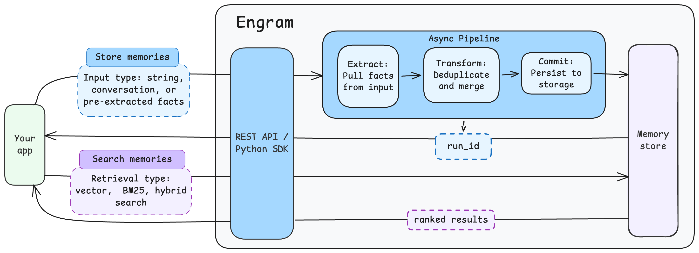

Engram is a memory server for LLM agents and applications. It provides a REST API that automatically extracts, transforms, and stores memories using vector embeddings and LLM-powered processing.

Use Engram to give your agents persistent memory that they can write to and search across conversations, users, and topics.

## Key capabilities

- **Automatic memory extraction** — Send raw text, pre-extracted facts, or full conversations. Engram's pipeline extracts and stores structured memories automatically.
- **Semantic search** — Find relevant memories using vector similarity, BM25 keyword search, or hybrid retrieval.
- **Scoped memory** — Organize memories by project, user, and conversation. Topics let you categorize memories within a group (e.g. `user_facts`, `preferences`).
- **Async processing** — Memory storage runs asynchronously through a pipeline. Poll run status to track when memories are committed.

## How it works

1. You send content to the Engram API (text, pre-extracted data, or a conversation).
2. Engram runs an async pipeline that extracts, transforms, and commits memories to storage.
3. You search stored memories using vector, BM25, or hybrid retrieval.

## Get started

- **[Quickstart](quickstart.md)** — Create a project, get an API key, store your first memory, and search it.
- **[Concepts](concepts.md)** — Understand memories, topics, groups, scoping, and pipelines.
- **[Guides](guides/index.md)** — Step-by-step instructions for storing, searching, and managing memories.
- **[API reference](/engram/api/rest)** — Full endpoint documentation with request and response schemas.

## Questions and feedback

import DocsFeedback from '/_includes/docs-feedback.mdx';

<DocsFeedback/>
