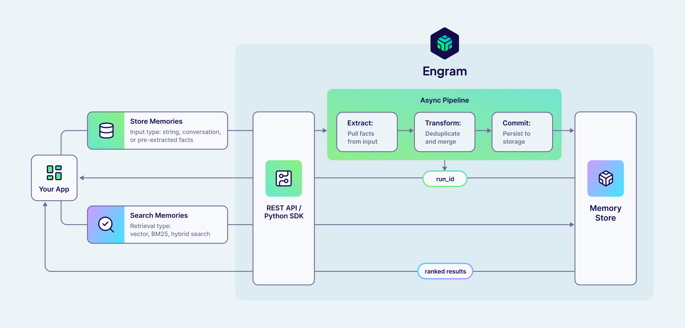

Engram is a memory server for LLM agents and applications. It provides a [REST API](/engram/api/rest) and [Python SDK](https://github.com/weaviate/engram-python-sdk) that automatically extracts, transforms, and stores memories using vector embeddings and LLM-powered processing.

Use Engram to give your agents persistent memory that they can write to and search across conversations, users, and [topics](concepts/topics.md).

## Key capabilities

- **Automatic memory extraction** — Send raw text, pre-extracted facts, or full conversations. Engram's [pipeline](concepts/pipelines.md) extracts and stores structured [memories](concepts/memories.md) automatically.
- **Semantic search** — Find relevant memories using vector similarity, BM25 keyword search, or [hybrid retrieval](concepts/search.md).
- **Scoped memory** — Organize memories by project, user, and conversation. [Topics](concepts/topics.md) let you categorize memories within a [group](concepts/groups.md) (e.g. `user_facts`, `preferences`).
- **Async processing** — Memory storage runs asynchronously through a pipeline. Poll [run status](guides/check-run-status.md) to track when memories are committed.

## How it works

Below is an overview of Engram's architecture and information flow:

Your app communicates with Engram through the REST API or Python SDK.

**[Storing memories](guides/store-memories.md):** You send content (text, a conversation, or pre-extracted facts) to the API. Engram immediately returns a `run_id` and processes the content asynchronously through a [pipeline](concepts/pipelines.md):

1. **Extract** — Pull individual facts from the input.
2. **Transform** — Deduplicate and merge with existing [memories](concepts/memories.md).
3. **Commit** — Persist the results to the memory store.

You can poll the [`run_id`](guides/check-run-status.md) to check when processing is complete.

**[Searching memories](guides/search-memories.md):** You send a query to the API with a [retrieval type](concepts/search.md) (vector, BM25, or hybrid). Engram searches the memory store and returns ranked results.

## Get started

- **[Quickstart](quickstart.md)** — Create a project, get an API key, store your first memory, and search it.
- **[Concepts](concepts/index.md)** — Understand memories, topics, groups, scoping, and pipelines.
- **[Guides](guides/index.md)** — Step-by-step instructions for storing, searching, and managing memories.
- **[REST API reference](/engram/api/rest)** — Full endpoint documentation with request and response schemas.

## Questions and feedback

import DocsFeedback from '/_includes/docs-feedback.mdx';

<DocsFeedback/>
