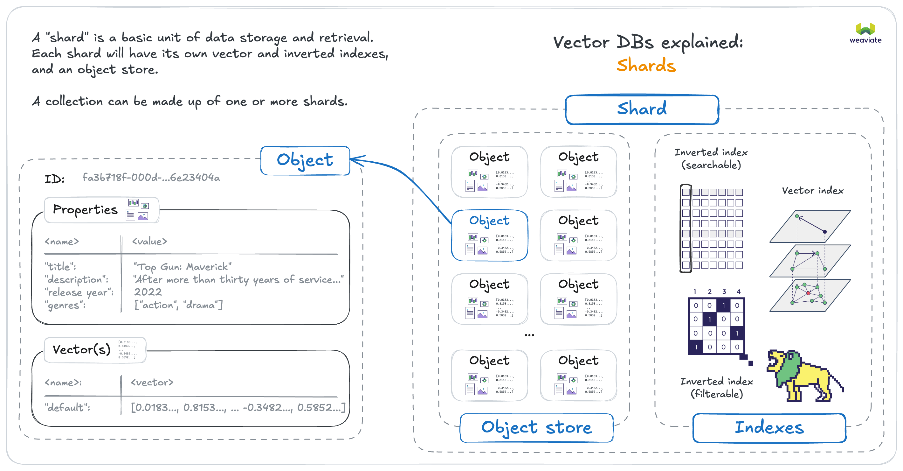
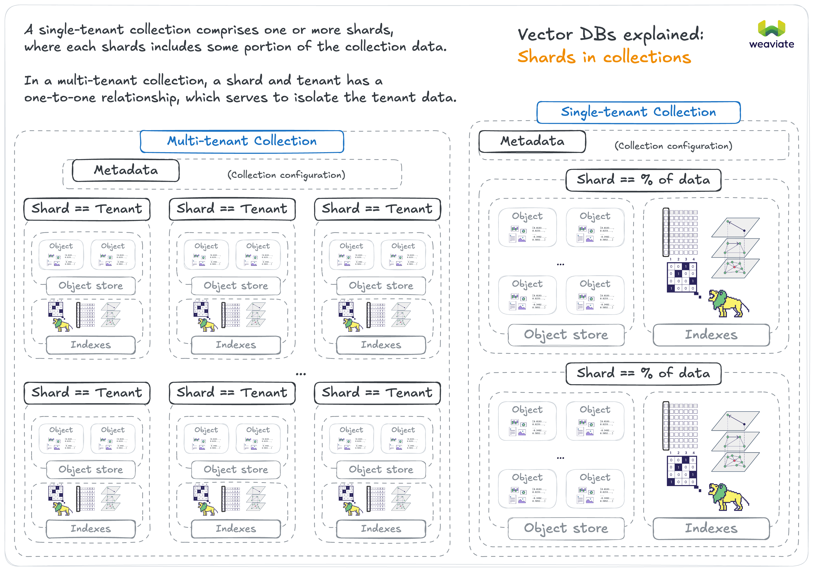

Weaviate can be scaled horizontally by being run on a set of multiple nodes in a cluster. This section lays out various ways in which Weaviate can be scaled, as well as factors to consider while scaling, and Weaviate's architecture in relation to horizontal scaling.

## Basic concepts

### Shards

A collection in Weaviate comprises of one or more "shards", which are the basic units of data storage and retrieval. A shard will contain its own vector index, inverted indexes, and object store. Each shard can be hosted on a different node, allowing for distributed data storage and processing.

The number of unique shards in a single-tenant collection can only be set at collection creation time. In most cases, letting Weaviate manage the number of shards is sufficient. But in some cases, you may want to manually configure the number of shards for performance or data distribution reasons.

In a multi-tenant collection, each tenant consists of one shard. This means that the number of unique shards in a multi-tenant collection is equal to the number of tenants.

### Replicas

Depending on the setup, each shard can have one or more "replicas", to be hosted on different nodes. This is referred to as a "high availability" setup, where the same data is available on multiple nodes. This allows for better read throughput and fault tolerance.

You can set the desired number of replicas, also called a replication factor, in Weaviate. This can be set a global cluster-level default using the [`REPLICATION_MINIMUM_FACTOR` environment variable](/docs/deploy/configuration/env-vars/index.md). It can also be set [per collection](/docs/weaviate/manage-collections/multi-node-setup.mdx#replication-settings), which will override the global default.

## Motivation to scale Weaviate
Generally there are (at least) three distinct motivations to scale out horizontally which all will lead to different setups.

### Motivation 1: Maximum Dataset Size
Due to the [memory footprint of an HNSW graph](./resources.md#the-role-of-memory) it may be desirable to spread a dataset across multiple servers ("nodes"). In such a setup, a single collection may be split into shards and shards are spread across nodes.

Weaviate does the required orchestration at import and query time fully automatically.

See [Sharding vs Replication](#sharding-vs-replication) below for trade-offs involved when running multiple shards.

**Solution: Sharding across multiple nodes in a cluster**

:::note
The ability to shard across a cluster was added in Weaviate `v1.8.0`.
:::

### Motivation 2: Higher Query Throughput
When you receive more queries than a single Weaviate node can handle, it is desirable to add more Weaviate nodes which can help in responding to your users' queries.

Instead of sharding across multiple nodes, you can replicate (the same data) across multiple nodes. This process also happens fully automatically and you only need to specify the desired replication factor. Sharding and replication can also be combined.

**Solution: Replicate your classes across multiple nodes in a cluster**

### Motivation 3: High Availability

When serving critical loads with Weaviate, it may be desirable to be able to keep serving queries even if a node fails completely. Such a failure could be either due to a software or OS-level crash or even a hardware issue. Other than unexpected crashes, a highly available setup can also tolerate zero-downtime updates and other maintenance tasks.

To run a highly available setup, classes must be replicated among multiple nodes.

**Solution: Replicate your classes across multiple nodes in a cluster**

## Sharding vs Replication

The motivation sections above outline when it is desirable to shard your classes across multiple nodes and when it is desirable to replicate your classes - or both. This section highlights the implications of a sharded and/or replicated setup.

:::note
All of the scenarios below assume that - as sharding or replication is increased - the cluster size is adapted accordingly. If the number of shards or the replication factor is lower than the number of nodes in the cluster, the advantages no longer apply.*
:::

### Advantages when increasing sharding
* Run larger datasets
* Speed up imports.

To use multiple CPUs efficiently, create multiple shards for your collection. For the fastest imports, create multiple shards even on a single node.

### Disadvantages when increasing sharding
* Query throughput does not improve when adding more sharded nodes

### Advantages when increasing replication
* System becomes highly available
* Increased replication leads to near-linearly increased query throughput

### Disadvantages when increasing replication
* Import speed does not improve when adding more replicated nodes

### Sharding Keys ("Partitioning Keys")
Weaviate uses specific characteristics of an object to decide which shard it belongs to. As of `v1.8.0`, a sharding key is always the object's UUID. The sharding algorithm is a 64bit Murmur-3 hash. Other properties and other algorithms for sharding may be added in the future.

Note that in a multi-tenant collection, each tenant consists of one shard.

## Shard replica movement

:::info Added in `v1.32`
:::

A shard replica can be moved or copied from one node to another. This is useful when you want to balance the load across nodes or when you want to change the replication factor of a part of a collection.

[See this page](/docs/deploy/configuration/replica-movement.mdx) for more details on how to move shard replicas.

### Use cases for moving shard replicas

1. **Load Balancing**: If certain nodes are experiencing higher loads than others, moving shard replicas can help distribute the load more evenly across the cluster.

2. **Scaling**: If you need to scale your cluster (e.g., adding more nodes to handle increased load), shard replicas can be moved to the new nodes to ensure that the data is evenly distributed across the cluster.

3. **Node Maintenance or Replacement**: If a node requires maintenance (e.g., hardware upgrades) or replacement, shard replicas can be moved to temporary or replacement nodes to ensure continuous availability during the maintenance window.

## Node Discovery

By default, Weaviate nodes in a cluster use a gossip-like protocol through [Hashicorp's Memberlist](https://github.com/hashicorp/memberlist) to communicate node state and failure scenarios.

Weaviate - especially when running as a cluster - is optimized to run on Kubernetes. The [Weaviate Helm chart](/deploy/installation-guides/k8s-installation.md#weaviate-helm-chart) makes use of a `StatefulSet` and a headless `Service` that automatically configures node discovery. All you have to do is specify the desired node count.

  
FQDN for node discovery

:::caution Added in `v1.25.15` and removed in `v1.30`

This was an experimental feature. Use with caution.

:::

There can be a situation where IP-address based node discovery is not optimal. In such cases, you can set `RAFT_ENABLE_FQDN_RESOLVER` and `RAFT_FQDN_RESOLVER_TLD` [environment variables](/deploy/configuration/env-vars/index.md#multi-node-instances) to enable fully qualified domain name (FQDN) based node discovery.

If this feature is enabled, Weaviate uses the FQDN resolver to resolve the node name to the node IP address for metadata (e.g., Raft) communication.

:::info FQDN: For metadata changes only
This feature is only used for metadata changes which [use Raft as the consensus mechanism](./replication-architecture/cluster-architecture.md#metadata-replication-raft). It does not affect data read/write operations.
:::

#### Examples of when to use FQDN for node discovery

The use of FQDN can resolve a situation where if IP addresses are re-used across different clusters, the nodes in one cluster could mistakenly discover nodes in another cluster.

It can also be useful when using services (for example, Kubernetes) where the IP of the services is different from the actual node IP, but it proxies the connection to the node.

#### Environment variables for FQDN node discovery

`RAFT_ENABLE_FQDN_RESOLVER` is a Boolean flag. This flag enables the FQDN resolver. If set to `true`, Weaviate uses the FQDN resolver to resolve the node name to the node IP address. If set to `false`, Weaviate uses the memberlist lookup to resolve the node name to the node IP address. The default value is `false`.

`RAFT_FQDN_RESOLVER_TLD` is a string that is appended in the format `[node-id].[tld]` when resolving a node-id to an IP address, where `[tld]` is the top-level domain.

To use this feature, set `RAFT_ENABLE_FQDN_RESOLVER` to `true`.

## Node affinity of shards and/or replication shards

Weaviate tries to select the node with the most available disk space.

This only applies when creating a new class, rather than when adding more data to an existing single class.

  
Pre-<code>v1.18.1</code> behavior

In versions `v1.8.0`-`v1.18.0`, users could not specify the node-affinity of a specific shard or replication shard.

Shards were assigned to 'live' nodes in a round-robin fashion starting with a random node.

## Consistency and current limitations

* Starting with `v1.25.0`, Weaviate adopts the [Raft consensus algorithm](https://raft.github.io/) which is a log-based algorithm coordinated by an elected leader. This brings an additional benefit in that concurrent schema changes are now supported. If you are a Kubernetes user, see the [`1.25 migration guide`](/deploy/migration/weaviate-1-25.md) before you upgrade. To upgrade, you have to delete your existing StatefulSet.
* As of `v1.8.0`, the process of broadcasting schema changes across the cluster uses a form of two-phase transaction that as of now cannot tolerate node failures during the lifetime of the transaction.
* As of `v1.8.0`, dynamically scaling a cluster is not fully supported yet. New nodes can be added to an existing cluster, however it does not affect the ownership of shards. Existing nodes can not yet be removed if data is present, as shards are not yet being moved to other nodes prior to a removal of a node.

## Questions and feedback

import DocsFeedback from '/_includes/docs-feedback.mdx';

<DocsFeedback/>
