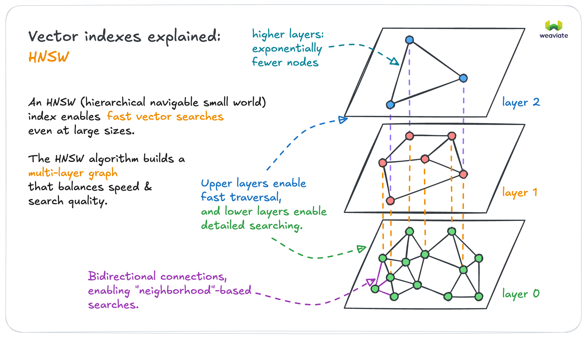
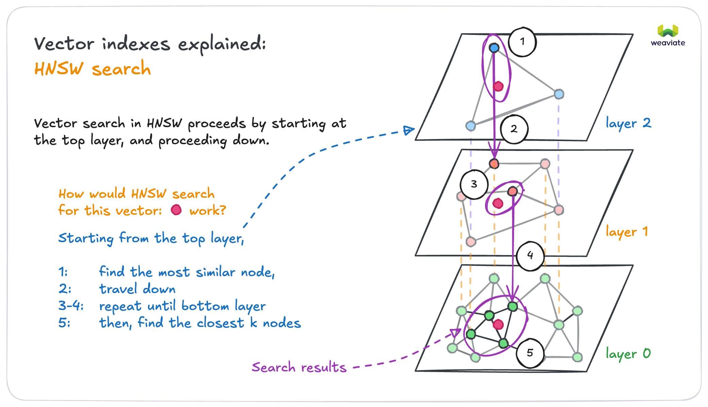
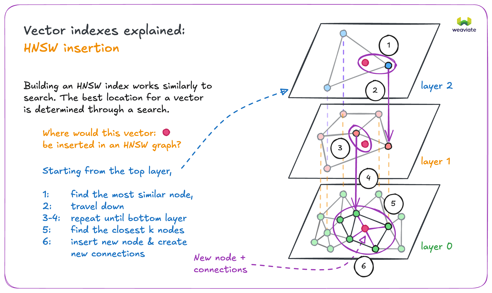
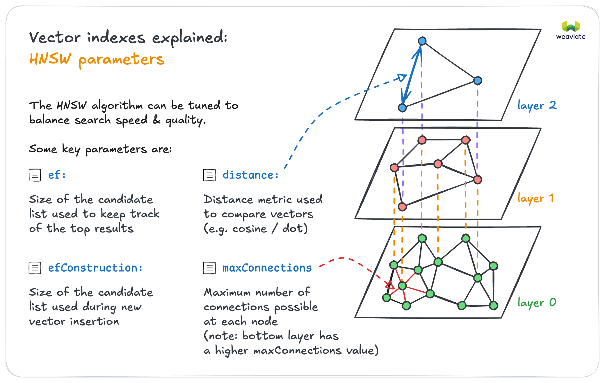

What is vector indexing? It's a key component of vector databases that helps to [significantly **increase the speed** of the search process of similarity search](https://weaviate.io/blog/vector-search-explained) with only a minimal tradeoff in search accuracy ([HNSW index](#hierarchical-navigable-small-world-hnsw-index)), or efficiently store many subsets of data in a small memory footprint ([flat index](#flat-index)). The [dynamic index](#dynamic-index) can even start off as a flat index and then dynamically switch to the HNSW index as it scales past a threshold.

Weaviate's vector-first storage system takes care of all storage operations with a vector index. Storing data in a vector-first manner not only allows for semantic or context-based search, but also makes it possible to store _very_ large amounts of data without decreasing performance (assuming scaled well horizontally or having sufficient shards for the indexes).

Weaviate supports these vector index types:

- [HNSW index](#hierarchical-navigable-small-world-hnsw-index): a more complex index that is slower to build, but it scales well to large datasets as queries have a logarithmic time complexity.
- [Flat index](#flat-index): a simple, lightweight index that is designed for small datasets.
- [Dynamic index](#dynamic-index): allows you to automatically switch from a flat index to an HNSW index as object count scales
- [HFresh index](#hfresh-index): a cluster-based index that uses HNSW for the centroid index, providing memory efficiency for large datasets

This page explains what vector indexes are, and what purpose they serve in the Weaviate vector database.

:::info What is a vector index?

In vector databases, a vector index is a data structure that organizes vector embeddings to enable efficient similarity search. Indexing vector databases properly is crucial for performance, and different index types serve different purposes - from the simple flat index to more sophisticated approaches like HNSW and HFresh.

:::

## Why do you need vector indexing?

[Vector embeddings](https://weaviate.io/blog/vector-embeddings-explained) are a great way to represent meaning. Understanding how to index a vector is crucial for working with vector databases effectively. Vectors embeddings are arrays of elements that can capture meaning from different data types, such as texts, images, videos, and other content. The number of elements are called dimensions. High dimension vectors capture more information, but they are harder to work with.

Vector databases make it easier to work with high dimensional vectors. Consider search; Vector databases efficiently measure semantic similarity between data objects. When you run a [similarity search](../../search/similarity.md), a vector database like Weaviate uses a vectorized version of the query to find objects in the database that have vectors similar to the query vector.

Vectors are like coordinates in a multi-dimensional space. A very simple vector might represent objects, _words_ in this case, in a 2-dimensional space.

In the graph below, the words `Apple` and `Banana` are shown close to each other. `Newspaper` and `Magazine` are also close to each other, but they are far away from `Apple` and `Banana` in the same vector space.

Within each pair, the distance between words is small because the objects have similar vector embeddings. The distance between the pairs is larger because the difference between the vectors is larger. Intuitively, fruits are similar to each other, but fruits are not similar to reading material.

For more details of this representation, see: ([GloVe](https://github.com/stanfordnlp/GloVe)) and [vector embeddings](https://weaviate.io/blog/vector-embeddings-explained#what-exactly-are-vector-embeddings).


Another way to think of this is how products are placed in a supermarket. You'd expect to find `Apples` close to `Bananas`, because they are both fruit. But when you are searching for a `Magazine`, you would move away from the `Apples` and `Bananas`, more towards the aisle with, for example, `Newspapers`. This is how the semantics of concepts can be stored in Weaviate as well, depending on the module you're using to calculate the numbers in the vectors. Not only words or text can be indexed as vectors, but also images, video, DNA sequences, etc. Read more about which model to use [here](/weaviate/modules/index.md).


:::tip

You might be also interested in our blog post [Vector search explained](https://weaviate.io/blog/vector-search-explained).

:::

Let's explore how to index a vector using different approaches supported by Weaviate.

## Vector index types

Many different types of vector indexes exist. A majority of them are designed to speed up searches by reducing the number of vectors that need to be compared. However, they do this in different ways, and each has its own strengths and weaknesses.

### Graph indexes

Graph indexes form a network of vectors, such that similar vectors are connected to each other. This allows for fast "traversal" of the graph to find similar vectors to a query vector.

HNSW, or "Hierarchical Navigable Small World", is the most common graph index type. It creates a set of "layers" of vectors, to enable fast traversal of the graph.

They are very scalable, allow incremental updates, and efficient for high-dimensional vectors.

This is the default index type in Weaviate.

### Tree-based indexes

Tree-based indexes divide the vectors into a tree structure.

ANNOY, or "Approximate Nearest Neighbors Oh Yeah", is a well-known tree-based index. It divides the vectors into a binary tree structure.

They can be memory-efficient, and are good for low-dimensional vectors. However, it may be costly to update the index over time, as the tree may need to be rebuilt.

### Cluster-based indexes

Cluster-based indexes group vectors based on their similarity. As a result, the search space is reduced to only the cluster(s) that is most likely to contain the nearest neighbors.

Their search accuracy (recall and precision) may generally be lower than graph-based indexes, but they can be more memory-efficient.

### Flat index

A flat index is the simplest type of index. It stores all vectors in a single list, and searches through all of them to find the nearest neighbors.

This is extremely memory-efficient, but does not scale well, as the search time grows linearly with the number of vectors.

The first method is the HNSW index.

## Hierarchical Navigable Small World (HNSW) index

**Hierarchical Navigable Small World (HNSW)** is an algorithm that works on multi-layered graphs. It is also an index type, and refers to vector indexes that are created using the HNSW algorithm. HNSW indexes enable very fast queries, but rebuilding the index when you add new vectors can be resource intensive.

Weaviate's `hnsw` index is a [custom implementation](../../more-resources/faq.md#q-does-weaviate-use-hnswlib) of the Hierarchical Navigable Small World ([HNSW](https://arxiv.org/abs/1603.09320)) algorithm that offers full [CRUD-support](https://db-engines.com/en/blog_post/87).

At build time, the HNSW algorithm creates a series of layers. At query time, the HNSW algorithm uses the layers to build a list of approximate nearest neighbors (ANN) quickly and efficiently.

Consider this diagram of a vector index using HNSW.



An individual object can exist in more than one layer, but every object in the database is represented in the lowest layer (layer zero in the picture). The layer zero data objects are very well connected to each other. Each layer above the lowest layer has fewer data object, and fewer connections. The data objects in the higher layers correspond to the objects in the lower layers, but each higher layer has exponentially fewer objects than the layer below. The HNSW algorithm takes advantage of the layers to efficiently process large amounts of data.



When a search query comes in, the HNSW algorithm finds the closest matching data points in the highest layer. Then, HNSW goes one layer deeper, and finds the closest data points in that layer to the ones in the higher layer. These are the nearest neighbors. The algorithm searches the lower layer to create a new list of nearest neighbors. Then, HNSW uses the new list and repeats the process on the next layer down. When it gets to the deepest layer, the HNSW algorithm returns the data objects closest to the search query.

Since there are relatively few data objects on the higher layers, HNSW has to search fewer objects. This means HNSW 'jumps' over large amounts of data that it doesn't need to search. When a data store has only one layer, the search algorithm can't skip unrelated objects. It has to search significantly more data objects even though they are unlikely to match.

### Resource requirements

HNSW is an in-memory index, where each node in the graph as well as each edge between nodes are stored in memory.

This means that the size of the index in memory is directly proportional to the number of vectors in the index, as well as the number of connections between vectors.

The size of an HNSW index is dominated by the number of vectors; take a look at the table below for an example:

| Component | Size derivation | Typical size | Size @1M vectors | Size @100M vectors |
| --- | --- | --- | --- | --- |
| Node | 4B (float) x N dimensions | 2-12kB | 2-12GB | 200-1200GB |
| Edge | 10B x 20 connections | 200B | 200MB | 20GB |

As you can see, the memory requirements of an HNSW index can quickly become a bottleneck. This is where [quantization](../vector-quantization.md) can be used to reduce the size of the index in memory.

HNSW is very fast, memory efficient, approach to similarity search. The memory cache only stores the highest layer instead of storing all of the data objects in the lowest layer. When the search moves from a higher layer to a lower one, HNSW only adds the data objects that are closest to the search query. This means HNSW uses a relatively small amount of memory compared to other search algorithms.

Have another look at the diagram; it demonstrates how the HNSW algorithm searches. The search vector in the top layer connects to a partial result in layer one. The objects in layer one lead HNSW to the result set in layer zero. This allows HNSW to skip objects that are unrelated to the search query.

Inserting a vector into an HNSW index works in a similar way. The HNSW algorithm finds the closest data objects in the highest layer, and then moves down to the next layer. It continues until it finds the best place to insert the new vector. The HNSW algorithm then connects the new vector to the existing vectors in that layer.



### Managing search quality vs speed tradeoffs

HNSW parameters can be adjusted to adjust search quality against speed.



The `ef` parameter is a critical setting for balancing the trade-off between search speed and quality.

The `ef` parameter dictates the size of the dynamic list used by the HNSW algorithm during the search process. A higher `ef` value results in a more extensive search, enhancing accuracy but potentially slowing down the query.

In contrast, a lower `ef` makes the search faster but might compromise on accuracy. This balance is crucial in scenarios where either speed or accuracy is a priority. For instance, in applications where rapid responses are critical, a lower `ef` might be preferable, even at the expense of some accuracy. Conversely, in analytical or research contexts where precision is paramount, a higher `ef` would be more suitable, despite the increased query time.

`ef` can be configured explicitly or dynamically. This feature is particularly beneficial in environments with varying query patterns. When `ef` is configured dynamically, Weaviate optimizes the balance between speed and recall based on real-time query requirements.

To enable dynamic `ef`, set `ef`: -1. Weaviate adjusts the size of the ANN list based on the query response limit. The calculation also takes into account the values of `dynamicEfMin`, `dynamicEfMax`, and `dynamicEfFactor`.

### Dynamic ef

The `ef` parameter controls the size of the ANN list at query time. You can configure a specific list size or else let Weaviate configure the list dynamically. If you choose dynamic `ef`, Weaviate provides several options to control the size of the ANN list.

The length of the list is determined by the query response limit that you set in your query. Weaviate uses the query limit as an anchor and modifies the size of ANN list according to the values you set for the `dynamicEf` parameters.

- `dynamicEfMin` sets a lower bound on the list length.
- `dynamicEfMax` sets an upper bound on the list length.
- `dynamicEfFactor` sets a range for the list.

The dynamic list size will be set as the query limit multiplied by `dynamicEfFactor`, modified by a minimum of `dynamicEfMin` and a maximum of `dynamicEfMax`.

In code, this can be expressed as:

```python
ef = min(max(dynamicEfMin, queryLimit * dynamicEfFactor), dynamicEfMax)
```

To keep search recall high, the actual dynamic `ef` value stays above `dynamicEfMin` even if the query limit is small enough to suggest a lower value.

To keep search speed reasonable even when retrieving large result sets, the dynamic `ef` value is limited to `dynamicEfMax`. Weaviate doesn't exceed `dynamicEfMax` even if the query limit is large enough to suggest a higher value. If the query limit is higher than `dynamicEfMax`, `dynamicEfMax` does not have any effect. In this case, dynamic `ef` value is equal to the query limit.

To determine the length of the ANN list, Weaviate multiples the query limit by `dynamicEfFactor`. The list range is modified by `dynamicEfMin` and `dynamicEfMax`.

Consider this GraphQL query that sets a limit of 4.

```graphql
{
  Get {
    JeopardyQuestion(limit: 4) {
      answer
      question
    }
  }
}
```

Imagine the collection has dynamic `ef` configured.

```json
  "vectorIndexConfig": {
     "ef": -1,
     "dynamicEfMin": 5
     "dynamicEfMax": 25
     "dynamicEfFactor": 10
  }
```

The resulting search list has these characteristics.

- A potential length of 40 objects ( ("dynamicEfFactor": 10) \* (limit: 4) ).
- A minimum length of 5 objects ("dynamicEfMin": 5).
- A maximum length of 25 objects ("dynamicEfMax": 25).
- An actual size of 5 to 25 objects.

If you use the [`docker-compose.yml` file from Weaviate](/deploy/installation-guides/docker-installation.md) to run your local instance, the `QUERY_DEFAULTS_LIMIT` environment variable sets a reasonable default query limit. To prevent out of memory errors,`QUERY_DEFAULTS_LIMIT` is significantly lower than `QUERY_MAXIMUM_RESULTS`.

To change the default limit, edit the value for `QUERY_DEFAULTS_LIMIT` when you configure your Weaviate instance.

### Deletions

Cleanup is an async process runs that rebuilds the HNSW graph after deletes and updates. Prior to cleanup, objects are marked as deleted, but they are still connected to the HNSW graph. During cleanup, the edges are reassigned and the objects are deleted for good.

## Flat index

The **flat index** is one of the fundamental ways to implement vector indexing in databases. As the name suggests, it's a simple, lightweight index that is fast to build and has a very small memory footprint. This index type is a good choice for use cases where each end user (i.e. tenant) has their own, isolated, dataset, such as in a SaaS product for example, or a database of isolated record sets.

As the name suggests, the flat index is a single layer of disk-backed data objects and thus a very small memory footprint. The flat index is a good choice for small collections, such as for multi-tenancy use cases.

A drawback of the flat index is that it does not scale well to large collections as it has a linear time complexity as a function of the number of data objects, unlike the `hnsw` index which has a logarithmic time complexity.

## Dynamic index

:::caution Experimental feature

Available starting in `v1.25`. This is an experimental feature. Use with caution.

:::

import DynamicAsyncRequirements from '/\_includes/dynamic-index-async-req.mdx';

<DynamicAsyncRequirements/>

The flat index is ideal for use cases with a small object count and provides lower memory overhead and good latency. As the object count increases the HNSW index provides a more viable solution as HNSW speeds up search. The goal of the dynamic index is to shorten latencies during querying time at the cost of a larger memory footprint as you scale.

By configuring a dynamic index, you can automatically switch from flat to HNSW indexes. This switch occurs when the object count exceeds a specified threshold (by default 10,000). This functionality only works with async indexing enabled. When the threshold is hit while importing, all the data piles up in the async queue, the HNSW index is constructed in the background and when ready the swap from flat to HNSW is completed.

Currently, this is only a one-way upgrade from a flat to an HNSW index, it does not support changing back to a flat index even if the object count goes below the threshold due to deletion.

This is particularly useful in a multi-tenant setup where building an HNSW index per tenant would introduce extra overhead. With a dynamic index, as individual tenants grow their index will switch from flat to HNSW, while smaller tenants' indexes remain flat.

## HFresh index

import HFreshStatus from '/_includes/code/hfresh_status.mdx';

<HFreshStatus />

The **HFresh index** is a cluster-based vector index that uses HNSW for the centroid index. It is based on the SPFresh algorithm, which organizes vectors into posting lists (clusters) for efficient retrieval. Read more about SPFresh in [SPFresh: Incremental In-Place Update for Billion-Scale Vector Search](https://arxiv.org/pdf/2410.14452).

HFresh works by:

1. **Partitioning vectors into clusters**, each with a centroid vector.
2. **Using an HNSW index** to efficiently search the centroids.
3. **Searching only the most relevant posting lists** (clusters) for a query.

This approach can provide memory efficiency benefits for large datasets while maintaining good search performance. The key trade-off is between memory usage and search recall, controlled by parameters like `searchProbe` (number of posting lists to search) and `replicas` (number of posting lists each vector is added to).

HFresh is particularly well-suited for:

- **Large-scale datasets with memory constraints**: Reduces memory usage while maintaining good search performance
- **High-dimensional vectors**: Particularly effective with high-dimensional embedding models
- **Cost-sensitive deployments**: Lower memory requirements can reduce infrastructure costs

:::note Supported distance metrics
HFresh only supports `cosine` and `l2-squared` distance metrics. Dot product is not supported.
:::

For configuration details, see the [HFresh index parameters](../../config-refs/indexing/vector-index.mdx#hfresh-index-parameters).

## Vector cache considerations

For optimal search and import performance, previously imported vectors need to be in memory. A disk lookup for a vector is orders of magnitudes slower than memory lookup, so the disk cache should be used sparingly. However, Weaviate can limit the number of vectors in memory. By default, this limit is set to one trillion (`1e12`) objects when a new collection is created.

During import set `vectorCacheMaxObjects` high enough that all vectors can be held in memory. Each import requires multiple searches. Import performance drops drastically when there isn't enough memory to hold all of the vectors in the cache.

After import, when your workload is mostly querying, experiment with vector cache limits that are less than your total dataset size.

Vectors that aren't currently in cache are added to the cache if there is still room. If the cache fills, Weaviate drops the whole cache. All future vectors have to be read from disk for the first time. Then, subsequent queries run against the cache until it fills again and the procedure repeats. Note that the cache can be a very valuable tool if you have a large dataset, and a large percentage of users only query a specific subset of vectors. In this case you might be able to serve the largest user group from cache while requiring disk lookups for "irregular" queries.

## Asynchronous indexing

This feature relates to the vector index, specifically only to the HNSW and HFresh indexes.

Asynchronous indexing can be enabled by opting in as follows:

- Open-source users can do this by setting the `ASYNC_INDEXING` environment variable to `true`.
- Weaviate Cloud users can do this by toggling the `Enable async indexing` switch in the Weaviate Cloud Console.

With synchronous indexing, the vector index is updated in lockstep with the object store. Updating an HNSW index can be an expensive operation, especially as the size of the index grows. As a result, the indexing operation can be the bottleneck in the system, slowing down the time for user requests to be completed.

When asynchronous indexing is enabled, all vector indexing operations go through a queue. This applies to not only batch imports, but also to single object imports, deletions, and updates.

This means that the object store can be updated quickly to finish performing user requests while the vector index updates in the background. Asynchronous indexing is especially useful for importing large amounts of data.

This means that there will be a short delay between object creation and the object being available for vector search using the HNSW index. The number of objects in the queue can be monitored per node [as shown here](/deploy/configuration/nodes.md).

:::info Changes in `v1.28`

In Weaviate `v1.22` to `v1.27`, the async indexing feature only affected batch import operations, using an in-memory queue.
<br/>

Starting in `v1.28`, the async indexing feature has been expanded to include single object imports, deletions, and updates. Additionally, the in-memory queue has been replaced with a persistent, on-disk queue. This change allows for more robust handling of indexing operations, and improves performance though reduction of lock contention and memory usage.
<br/>

The use of an on-disk queue may result in a slight increase in disk usage, however this is expected to be a small percentage of the total disk usage.

:::

## Vector indexing FAQ

### Can I use vector indexing with vector quantization?

Yes, you can read more about it in [vector quantization (compression)](../vector-quantization.md).

### Which vector index is right for me?

Here's a quick guide to choosing the right index:

- **Flat index**: Best for SaaS products where each end user (tenant) has their own isolated, small dataset. Fast for small collections with a known size for minimal memory overhead.

- **HNSW index**: Best for large collections requiring high query throughput and low latency. Requires more memory but provides excellent search performance.

- **Dynamic index**: Best for collections that start small but may grow significantly over time. Automatically transitions from flat to HNSW as data scales.

- **HFresh index**: Best for very large collections where memory efficiency is a priority, especially with high-dimensional vectors.

#### Comparison between index types

| Feature                       | Flat                             | HNSW                        | HFresh                                    |
| ----------------------------- | -------------------------------- | --------------------------- | ----------------------------------------- |
| Memory usage                  | Very low                         | High                        | Low                                       |
| Search speed (small datasets) | Fast                             | Very fast                   | Moderate                                  |
| Search speed (large datasets) | Slow                             | Very fast                   | Fast                                      |
| Disk usage                    | Low                              | Moderate                    | Moderate to high                          |
| Best for                      | Small collections, multi-tenancy | Large collections, high QPS | Large collections with memory constraints |

Note that the vector index type parameter only specifies how the vectors of data objects are _indexed_. The index is used for data retrieval and similarity search.

The `vectorizer` parameter determines how the data vectors are created (which numbers the vectors contain). `vectorizer` specifies a [module](/weaviate/modules/index.md), such as `text2vec-contextionary`, that Weaviate uses to create the vectors. (You can also set to `vectorizer` to `none` if you want to import your own vectors).

To learn more about configuring the collection, see [this how-to page](../../manage-collections/vector-config.mdx).

### Which distance metrics can I use with vector indexing?

All of [the distance metrics](/weaviate/config-refs/distances.md), such as cosine similarity, can be used with most vector index types. The HFresh index only supports `cosine` and `l2-squared` distance metrics.

### How to configure the vector index type in Weaviate?

The index type can be specified per data collection via the [collection definition](../../manage-collections/vector-config.mdx#set-vector-index-type) settings, according to available [vector index settings](../../config-refs/indexing/vector-index.mdx).

### When to skip indexing

There are situations where it doesn't make sense to vectorize a collection. For example, if the collection consists solely of references between two other collections, or if the collection contains mostly duplicate elements.

Importing duplicate vectors into HNSW is very expensive. The import algorithm checks early on if a candidate vector's distance is greater than the worst candidate's distance. When there are lots of duplicate vectors, this early exit condition is never met so each import or query results in an exhaustive search.

To avoid indexing a collection, set `"skip"` to `"true"`. By default, collections are indexed.

### What ANN algorithms exist?

There are different ANN algorithms, you can find a nice overview of them on <a href="http://ann-benchmarks.com/" data-proofer-ignore>this website</a>.

### Are there indicative benchmarks for Weaviate's ANN performance?

The [ANN benchmark page](/weaviate/benchmarks/ann.md) contains a wide variety of vector search use cases and relative benchmarks. This page is ideal for finding a dataset similar to yours and learning what the most optimal settings are.

## Further resources

:::info Related pages

- [Concepts: Vector quantization (compression)](../vector-quantization.md)
- [Configuration: Vector index](../../config-refs/indexing/vector-index.mdx)
- [Configuration: Schema (Configure semantic indexing)](../../config-refs/indexing/vector-index.mdx#configure-semantic-indexing)

:::

## Questions and feedback

import DocsFeedback from '/\_includes/docs-feedback.mdx';

<DocsFeedback/>
