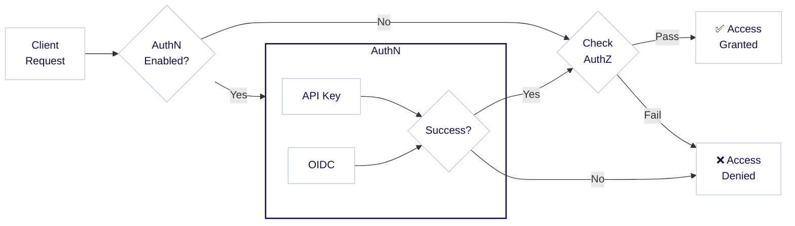
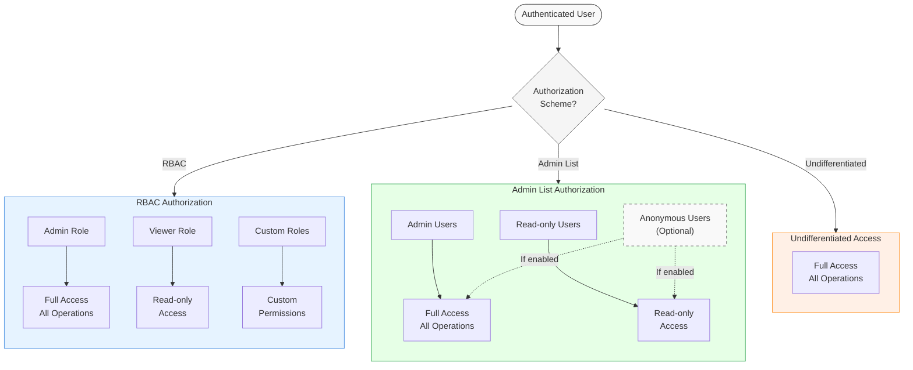

:::info Authentication and authorization
Authentication and authorization are closely related concepts, and sometimes abbreviated as `AuthN` and `AuthZ`. Authentication (`AuthN`) is the process of verifying the identity of a user, while authorization (`AuthZ`) is the process of determining what permissions the user has.
:::

## Authentication

Weaviate controls access through user authentication via API keys or OpenID Connect (OIDC), with an option for anonymous access. Users can then be assigned different [authorization](/deploy/configuration/authorization.md) levels, as shown in the diagram below.



For example, a user logging in with the API key `jane-secret` may be granted administrator permissions, while another user logging in with the API key `ian-secret` may be granted read-only permissions.

In summary, Weaviate allows the following authentication methods:

- [API key](/deploy/configuration/authentication.md#api-key-authentication)
- [OpenID Connect (OIDC)](/deploy/configuration/authentication.md#oidc-authentication)
- [Anonymous access](/deploy/configuration/authentication.md#anonymous-access) (no authentication, strongly discouraged except for development or evaluation)

Note that API key and OIDC authentication can be both enabled at the same time.

The way to configure authentication differs by your deployment method, depending on whether you are running Weaviate in Docker or Kubernetes. Below, we provide examples for both.

:::info What about Weaviate Cloud (WCD)?
For Weaviate Cloud (WCD) instances, authentication is pre-configured with OIDC and API key access. You can [authenticate against Weaviate](../connections/connect-cloud.mdx) with your WCD credentials using OIDC, or [with API keys](/cloud/manage-clusters/connect.mdx).
:::

### API key

For more details on how to work with API keys in Weaviate, check out the [authentication guide](/deploy/configuration/authentication.md#api-key-authentication).

We recommend using a client library to authenticate against Weaviate. See [How-to: Connect](docs/weaviate/connections/index.mdx) pages for more information. 

### OIDC

For more details on how to work with OIDC authentication in Weaviate, check out the [authentication guide](/deploy/configuration/authentication.md#oidc-authentication).

The OIDC standard allows for many different methods _(flows)_ of obtaining tokens. The appropriate method can vary depending on your situation, including configurations at the token issuer, and your requirements.

OIDC authentication flows are outside the scope of this documentation, but here are some options to consider:

1. Use the `client credentials flow` for machine-to-machine authorization. (Note that this authorizes an app, not a user.)
   - Validated using Okta and Azure as identity providers; GCP does not support client credentials grant flow (as of December 2022).
   - Weaviate's Python client directly supports this method.
   - Client credential flows usually do not come with a refresh token and the credentials are saved in the respective clients to acquire a new access token on expiration of the old one.
1. Use the `resource owner password flow` for trusted applications like [Weaviate Cloud](/cloud/manage-clusters/connect).
1. Use `hybrid flow` if Azure is your token issuer or if you would like to prevent exposing passwords.

### Support for Weaviate clients

If Weaviate Database is configured to use the `client credentials grant` flow or the `resource owner password flow`, a Weaviate client can instantiate a connection to Weaviate Database that incorporates the authentication flow.

import OIDCExamples from '/\_includes/code/connections/oidc-connect.mdx';

<OIDCExamples/>

### Get and pass tokens manually

<details>
  <summary>
    Manually obtaining and passing tokens
  </summary>

For cases or workflows where you may wish to manually obtain a token, we outline below the steps to do so, for the resource owner password flow and hybrid flow.

#### Resource owner password flow

1. Send a GET request to `WEAVIATE_INSTANCE_URL/v1/.well-known/openid-configuration` to fetch Weaviate's OIDC configuration (`wv_oidc_config`). Replace WEAVIATE_INSTANCE_URL with your instance URL.
1. Parse the `clientId` and `href` from `wv_oidc_config`.
1. Send a GET request to `href` to fetch the token issuer's OIDC configuration (`token_oidc_config`).
1. If `token_oidc_config` includes the optional `grant_types_supported` key, check that `password` is in the list of values.
   - If `password` is not in the list of values, the token issuer is likely not configured for `resource owner password flow`. You may need to reconfigure the token issuer or use another method.
   - If the `grant_types_supported` key is not available, you may need to contact the token issuer to see if `resource owner password flow` is supported.
1. Send a POST request to the `token_endpoint` of `token_oidc_config` with the body:
   - `{"grant_type": "password", "client_id": client_id, "username": USERNAME, "password": PASSWORD`. Replace `USERNAME` and `PASSWORD` with the actual values.
1. Parse the response (`token_resp`), and look for `access_token` in `token_resp`. This is your Bearer token.

#### Hybrid flow

1. Send a GET request to `WEAVIATE_INSTANCE_URL/v1/.well-known/openid-configuration` to fetch Weaviate's OIDC configuration (`wv_oidc_config`). Replace WEAVIATE_INSTANCE_URL with your instance URL.
2. Parse the `clientId` and `href` from `wv_oidc_config`
3. Send a GET request to `href` to fetch the token issuer's OIDC configuration (`token_oidc_config`)
4. Construct a URL (`auth_url`) with the following parameters, based on `authorization_endpoint` from `token_oidc_config`. This will look like the following:
   - `{authorization_endpoint}`?client_id=`{clientId}`&response_type=code%20id_token&response_mode=fragment&redirect_url=`{redirect_url}`&scope=openid&nonce=abcd
   - the `redirect_url` must have been [pre-registered](https://openid.net/specs/openid-connect-core-1_0.html#AuthRequest) with your token issuer.
5. Go to the `auth_url` in your browser, and log in if prompted. If successful, the token issuer will redirect the browser to the `redirect_url`, with additional parameters that include an `id_token` parameter.
6. Parse the `id_token` parameter value. This is your Bearer token.

#### Code example

This example demonstrate how to obtain an OIDC token.

```python
import requests
import re

url = "http://localhost:8080"  # <-- Replace with your actual Weaviate URL

# Get Weaviate's OIDC configuration
weaviate_open_id_config = requests.get(url + "/v1/.well-known/openid-configuration")
if weaviate_open_id_config.status_code == "404":
    print("Your Weaviate instance is not configured with openid")

response_json = weaviate_open_id_config.json()
client_id = response_json["clientId"]
href = response_json["href"]

# Get the token issuer's OIDC configuration
response_auth = requests.get(href)

if "grant_types_supported" in response_auth.json():
    # For resource owner password flow
    assert "password" in response_auth.json()["grant_types_supported"]

    username = "username"  # <-- Replace with the actual username
    password = "password"  # <-- Replace with the actual password

    # Construct the POST request to send to 'token_endpoint'
    auth_body = {
        "grant_type": "password",
        "client_id": client_id,
        "username": username,
        "password": password,
    }
    response_post = requests.post(response_auth.json()["token_endpoint"], auth_body)
    print("Your access_token is:")
    print(response_post.json()["access_token"])
else:
    # For hybrid flow
    authorization_url = response_auth.json()["authorization_endpoint"]
    parameters = {
        "client_id": client_id,
        "response_type": "code%20id_token",
        "response_mode": "fragment",
        "redirect_url": url,
        "scope": "openid",
        "nonce": "abcd",
    }
    # Construct 'auth_url'
    parameter_string = "&".join([key + "=" + item for key, item in parameters.items()])
    response_auth = requests.get(authorization_url + "?" + parameter_string)

    print("To login, open the following url with your browser:")
    print(authorization_url + "?" + parameter_string)
    print(
        "After the login you will be redirected, the token is the 'id_token' parameter of the redirection url."
    )

    # You could use this regular expression to parse the token
    resp_txt = "Redirection URL"
    token = re.search("(?<=id_token=).+(?=&)", resp_txt)[0]

print("Set as bearer token in the clients to access Weaviate.")
```

#### Token lifetime

The token has a configurable expiry time that is set by the token issuer. We suggest establishing a workflow to periodically obtain a new token before expiry.

</details>

### Add a Bearer to a Request

import APIKeyUsage from '/\_includes/clients/api-token-usage.mdx';

<APIKeyUsage />

For example, the cURL command looks like this:

```bash
curl https://localhost:8080/v1/objects -H "Authorization: Bearer ${WEAVIATE_API_KEY}" | jq
```

## Authorization

Weaviate provides differentiated access through authorization levels, based on the user's [authentication](#authentication) status. A user can be granted admin permission, read-only permission, or no permission at all. From `v1.29.0`, Weaviate also supports [Role-Based Access Control (RBAC)](./rbac/index.mdx) for more fine-grained control over user permissions.

The following diagram illustrates the flow of a user request through the authentication and authorization process:



The following authorization schemes are available in Weaviate:

- [Role-Based Access Control (RBAC)](../../deploy/configuration/authorization.md#role-based-access-control-rbac)
- [Admin list](../../deploy/configuration/authorization.md#admin-list)
- [Undifferentiated access](../../deploy/configuration/authorization.md#undifferentiated-access)

In the Admin list authorization scheme, [anonymous users](../../deploy/configuration/authorization.md#anonymous-users) can be granted permissions.

The way to configure authorization differs by your deployment method, depending on whether you are running Weaviate in Docker or Kubernetes. Below, we provide examples for both.

## Further resources

- [Configuration: Authentication](/deploy/configuration/authentication.md)
- [Configuration: Authorization](/deploy/configuration/authorization.md)
- [Configuration: Environment variables - Authentication and Authorization](/deploy/configuration/env-vars/index.md#authentication-and-authorization)

## Questions and feedback

import DocsFeedback from '/\_includes/docs-feedback.mdx';

<DocsFeedback/>
