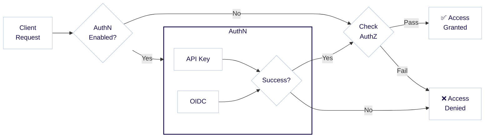

:::info Authentication and authorization
Authentication and authorization are closely related concepts, and sometimes abbreviated as `AuthN` and `AuthZ`. Authentication (`AuthN`) is the process of verifying the identity of a user, while authorization (`AuthZ`) is the process of determining what permissions the user has.
:::

## Authentication

Weaviate controls access through user authentication via API keys or OpenID Connect (OIDC), with an option for anonymous access. Users can then be assigned different [authorization](/deploy/configuration/authorization.md) levels, as shown in the diagram below.

```mermaid
flowchart LR
    %% Define main nodes
    Request["Client<br> Request"]
    AuthCheck{"AuthN<br> Enabled?"}
    AccessCheck{"Check<br> AuthZ"}
    Access["✅ Access<br> Granted"]
    Denied["❌ Access<br> Denied"]

    %% Define authentication method nodes
    subgraph auth ["AuthN"]
        direction LR
        API["API Key"]
        OIDC["OIDC"]
        AuthResult{"Success?"}
    end

    %% Define connections
    Request --> AuthCheck
    AuthCheck -->|"No"| AccessCheck
    AuthCheck -->|"Yes"| auth
    API --> AuthResult
    OIDC --> AuthResult
    AuthResult -->|"Yes"| AccessCheck
    AuthResult -->|"No"| Denied

    AccessCheck -->|"Pass"| Access
    AccessCheck -->|"Fail"| Denied

    %% Style nodes
    style Request fill:#ffffff,stroke:#B9C8DF,color:#130C49
    style AuthCheck fill:#ffffff,stroke:#B9C8DF,color:#130C49
    style AccessCheck fill:#ffffff,stroke:#B9C8DF,color:#130C49
    style Access fill:#ffffff,stroke:#B9C8DF,color:#130C49
    style Denied fill:#ffffff,stroke:#B9C8DF,color:#130C49
    style API fill:#ffffff,stroke:#B9C8DF,color:#130C49
    style OIDC fill:#ffffff,stroke:#B9C8DF,color:#130C49
    style AuthResult fill:#ffffff,stroke:#B9C8DF,color:#130C49

    %% Style subgraph
    style auth fill:#ffffff,stroke:#130C49,stroke-width:2px,color:#130C49
```

For example, a user logging in with the API key `jane-secret` may be granted administrator permissions, while another user logging in with the API key `ian-secret` may be granted read-only permissions.

API key and OIDC authentication can be both enabled at the same time. We recommend using a client library to authenticate against Weaviate. See [How-to: Connect](docs/weaviate/connections/index.mdx) pages for more information.

:::info What about Weaviate Cloud (WCD)?
For Weaviate Cloud (WCD) instances, authentication is pre-configured with API key access. You can [authenticate against Weaviate](../connections/connect-cloud.mdx) by [creating new API keys](/cloud/manage-clusters/connect.mdx).
:::

### API key

API key authentication is the simplest method to authenticate against Weaviate. Each user is assigned a unique API key, which is passed in the request header. For details on configuring API key authentication, see the [authentication guide](/deploy/configuration/authentication.md#api-key-authentication).

### OpenID Connect (OIDC)

[OpenID Connect (OIDC)](/deploy/configuration/authentication.md#oidc-authentication) enables authentication through an external identity provider (e.g., Okta, Azure AD, Google). OIDC supports multiple flows such as client credentials, resource owner password, and hybrid flow. For details on configuring OIDC and working with tokens, see the [OIDC configuration guide](/deploy/configuration/oidc).

### Anonymous access

[Anonymous access](/deploy/configuration/authentication.md#anonymous-access) allows unauthenticated requests. This is **strongly discouraged** except for local development or evaluation purposes, as it bypasses all identity verification.

## Authorization

Weaviate provides differentiated access through authorization levels, based on the user's [authentication](#authentication) status.

The following authorization schemes are available:

### RBAC (recommended)

[Role-Based Access Control (RBAC)](./rbac/index.mdx) provides fine-grained control over user permissions. With RBAC, you define roles with specific permissions and assign them to users. This is the **recommended authorization scheme** for production deployments.

RBAC supports:
- **Predefined roles**: `root` (full access) and `viewer` (read-only access)
- **Custom roles**: Create roles with specific permissions for collections, objects, tenants, backups, and more
- **Granular permissions**: Control access at the collection, tenant, and operation level using name filters and regex patterns

See [RBAC Overview](./rbac/index.mdx) for the full permissions model, and [Configuring RBAC](/deploy/configuration/configuring-rbac.md) for setup instructions.

### Admin list (legacy)

:::caution Prefer RBAC over Admin list
The Admin list authorization scheme only provides coarse-grained access control (admin or read-only). Use [RBAC](#rbac-recommended) instead for production deployments, as it provides much more flexible and secure permission management.
:::

The [Admin list](../../deploy/configuration/authorization.md#admin-list) scheme assigns users as either admin (full access) or read-only. [Anonymous users](../../deploy/configuration/authorization.md#anonymous-users) can optionally be granted permissions.

### Undifferentiated access

With [undifferentiated access](../../deploy/configuration/authorization.md#undifferentiated-access), all authenticated users have full access. This is only suitable for development or trusted single-user environments.

## Further resources

- [Configuration: Authentication](/deploy/configuration/authentication.md)
- [Configuration: Authorization](/deploy/configuration/authorization.md)
- [Configuration: OIDC](/deploy/configuration/oidc.md)
- [Configuration: RBAC](/weaviate/configuration/rbac/index.mdx)
- [Configuration: Environment variables - Authentication and Authorization](/deploy/configuration/env-vars/index.md#authentication-and-authorization)

## Questions and feedback

import DocsFeedback from '/\_includes/docs-feedback.mdx';

<DocsFeedback/>
