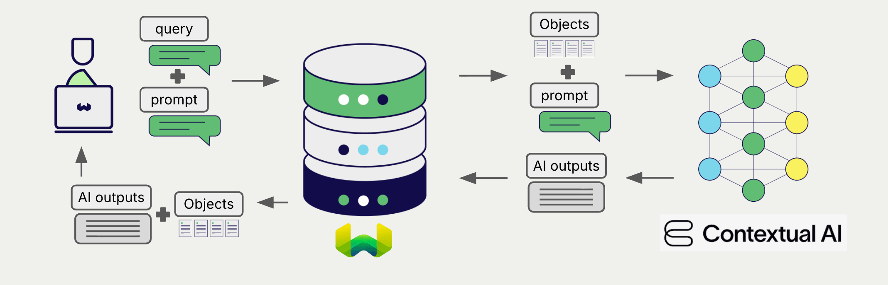
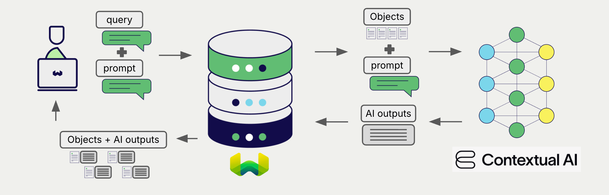
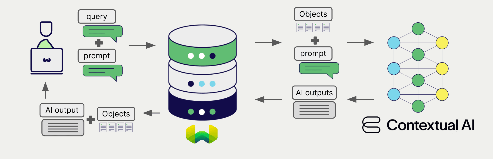

# Contextual AI Generative AI with Weaviate

:::info Added in `v1.34.0`
:::

import Tabs from '@theme/Tabs';
import TabItem from '@theme/TabItem';
import FilteredTextBlock from '@site/src/components/Documentation/FilteredTextBlock';
import PyConnect from '!!raw-loader!../_includes/provider.connect.py';
import TSConnect from '!!raw-loader!../_includes/provider.connect.ts';
import PyCode from '!!raw-loader!../_includes/provider.generative.py';
import TSCode from '!!raw-loader!../_includes/provider.generative.ts';

Weaviate's integration with Contextual AI's APIs allows you to access their models' capabilities directly from Weaviate.

[Configure a Weaviate collection](#configure-collection) to use a generative AI model with Contextual AI. Weaviate will perform retrieval augmented generation (RAG) using the specified model and your Contextual AI API key.

More specifically, Weaviate will perform a search, retrieve the most relevant objects, and then pass them to the Contextual AI generative model to generate outputs.

## Requirements

### Weaviate configuration

Your Weaviate instance must be configured with the Contextual AI generative AI integration (`generative-contextualai`) module.

  
For Weaviate Cloud (WCD) users

This integration is enabled by default on Weaviate Cloud (WCD) serverless instances.

  
For self-hosted users

- Check the [cluster metadata](/deploy/configuration/meta.md) to verify if the module is enabled.
- Follow the [how-to configure modules](../../configuration/modules.md) guide to enable the module in Weaviate.

### API credentials

You must provide a valid Contextual AI API key to Weaviate for this integration. Go to [Contextual AI](https://contextual.ai/) to sign up and obtain an API key.

Provide the API key to Weaviate using one of the following methods:

- Set the `CONTEXTUAL_API_KEY` environment variable that is available to Weaviate.
- Provide the API key at runtime, as shown in the examples below.

<Tabs className="code" groupId="languages">

 <TabItem value="py" label="Python">
    <FilteredTextBlock
      text={PyConnect}
      startMarker="# START ContextualAIInstantiation"
      endMarker="# END ContextualAIInstantiation"
      language="py"
    />
  </TabItem>

 <TabItem value="ts" label="JavaScript/TypeScript">
    <FilteredTextBlock
      text={TSConnect}
      startMarker="// START ContextualAIInstantiation"
      endMarker="// END ContextualAIInstantiation"
      language="ts"
    />
  </TabItem>

</Tabs>

## Configure collection

import MutableGenerativeConfig from '/_includes/mutable-generative-config.md';

<MutableGenerativeConfig />

[Configure a Weaviate index](../../manage-collections/generative-reranker-models.mdx#specify-a-generative-model-integration) as follows to use a Contextual AI generative AI model:

<Tabs className="code" groupId="languages">
  <TabItem value="py" label="Python">
    <FilteredTextBlock
      text={PyCode}
      startMarker="# START BasicGenerativeContextualAI"
      endMarker="# END BasicGenerativeContextualAI"
      language="py"
    />
  </TabItem>

  <TabItem value="ts" label="JavaScript/TypeScript">
    <FilteredTextBlock
      text={TSCode}
      startMarker="// START BasicGenerativeContextualAI"
      endMarker="// END BasicGenerativeContextualAI"
      language="ts"
    />
  </TabItem>

</Tabs>

### Select a model

You can specify one of the [available models](#available-models) for Weaviate to use, as shown in the following configuration example:

<Tabs className="code" groupId="languages">
  <TabItem value="py" label="Python">
    <FilteredTextBlock
      text={PyCode}
      startMarker="# START GenerativeContextualAICustomModel"
      endMarker="# END GenerativeContextualAICustomModel"
      language="py"
    />
  </TabItem>

  <TabItem value="ts" label="JavaScript/TypeScript">
    <FilteredTextBlock
      text={TSCode}
      startMarker="// START GenerativeContextualAICustomModel"
      endMarker="// END GenerativeContextualAICustomModel"
      language="ts"
    />
  </TabItem>

</Tabs>

You can [specify](#generative-parameters) one of the [available models](#available-models) for Weaviate to use. The [default model](#available-models) is used if no model is specified.

### Generative parameters

Configure the following generative parameters to customize the model behavior.

<Tabs className="code" groupId="languages">
  <TabItem value="py" label="Python">
    <FilteredTextBlock
      text={PyCode}
      startMarker="# START FullGenerativeContextualAI"
      endMarker="# END FullGenerativeContextualAI"
      language="py"
    />
  </TabItem>

  <TabItem value="ts" label="JavaScript/TypeScript">
    <FilteredTextBlock
      text={TSCode}
      startMarker="// START FullGenerativeContextualAI"
      endMarker="// END FullGenerativeContextualAI"
      language="ts"
    />
  </TabItem>

</Tabs>

For further details on model parameters, see the [Contextual AI API documentation](https://docs.contextual.ai/).

If a parameter is not specified, Weaviate uses the server-side default for that parameter. They are documented below.

- `DefaultContextualAIModel`           = `"v2"`
- `DefaultContextualAITemperature`     = `0.0`
- `DefaultContextualAITopP`            = `0.9`
- `DefaultContextualAIMaxNewTokens`    = `1024`
- `DefaultContextualAISystemPrompt`    = `""`
- `DefaultContextualAIAvoidCommentary` = `false`

## Select a model at runtime

Aside from setting the default model provider when creating the collection, you can also override it at query time.

<Tabs className="code" groupId="languages">
  <TabItem value="py" label="Python">
    <FilteredTextBlock
      text={PyCode}
      startMarker="# START RuntimeModelSelectionContextualAI"
      endMarker="# END RuntimeModelSelectionContextualAI"
      language="py"
    />
  </TabItem>
  <TabItem value="ts" label="JavaScript/TypeScript">
    <FilteredTextBlock
      text={TSCode}
      startMarker="// START RuntimeModelSelectionContextualAI"
      endMarker="// END RuntimeModelSelectionContextualAI"
      language="ts"
    />
  </TabItem>
</Tabs>

## Header parameters

You can provide the API key as well as some optional parameters at runtime through additional headers in the request. The following headers are available:

- `X-ContextualAI-Api-Key`: The Contextual AI API key.

Any additional headers provided at runtime will override the existing Weaviate configuration.

Provide the headers as shown in the [API credentials examples](#api-credentials) above.

## Retrieval augmented generation

After configuring the generative AI integration, perform RAG operations, either with the [single prompt](#single-prompt) or [grouped task](#grouped-task) method.

### Single prompt

To generate text for each object in the search results, use the single prompt method.

The example below generates outputs for each of the `n` search results, where `n` is specified by the `limit` parameter.

When creating a single prompt query, use braces `{}` to interpolate the object properties you want Weaviate to pass on to the language model. For example, to pass on the object's `title` property, include `{title}` in the query.

<Tabs className="code" groupId="languages">

 <TabItem value="py" label="Python">
    <FilteredTextBlock
      text={PyCode}
      startMarker="# START SinglePromptExample"
      endMarker="# END SinglePromptExample"
      language="py"
    />
  </TabItem>

 <TabItem value="ts" label="JavaScript/TypeScript">
    <FilteredTextBlock
      text={TSCode}
      startMarker="// START SinglePromptExample"
      endMarker="// END SinglePromptExample"
      language="ts"
    />
  </TabItem>

</Tabs>

### Grouped task

To generate one text for the entire set of search results, use the grouped task method.

In other words, when you have `n` search results, the generative model generates one output for the entire group.

<Tabs className="code" groupId="languages">

 <TabItem value="py" label="Python">
    <FilteredTextBlock
      text={PyCode}
      startMarker="# START GroupedTaskExample"
      endMarker="# END GroupedTaskExample"
      language="py"
    />
  </TabItem>

 <TabItem value="ts" label="JavaScript/TypeScript">
    <FilteredTextBlock
      text={TSCode}
      startMarker="// START GroupedTaskExample"
      endMarker="// END GroupedTaskExample"
      language="ts"
    />
  </TabItem>

</Tabs>

## References

### Available models

Currently, the following Contextual AI generative AI models are available for use with Weaviate:

- `v1`
- `v2` (default)

## Further resources

### Other integrations

- [Contextual AI reranker models + Weaviate](./reranker.md).

### Code examples

Once the integrations are configured at the collection, the data management and search operations in Weaviate work identically to any other collection. See the following model-agnostic examples:

- The [How-to: Manage collections](../../manage-collections/index.mdx) and [How-to: Manage objects](../../manage-objects/index.mdx) guides show how to perform data operations (i.e. create, read, update, delete collections and objects within them).
- The [How-to: Query & Search](../../search/index.mdx) guides show how to perform search operations (i.e. vector, keyword, hybrid) as well as retrieval augmented generation.

### References

- Contextual AI [Generate API documentation](https://docs.contextual.ai/api-reference/generate/generate)

## Questions and feedback

import DocsFeedback from '/_includes/docs-feedback.mdx';

<DocsFeedback/>
