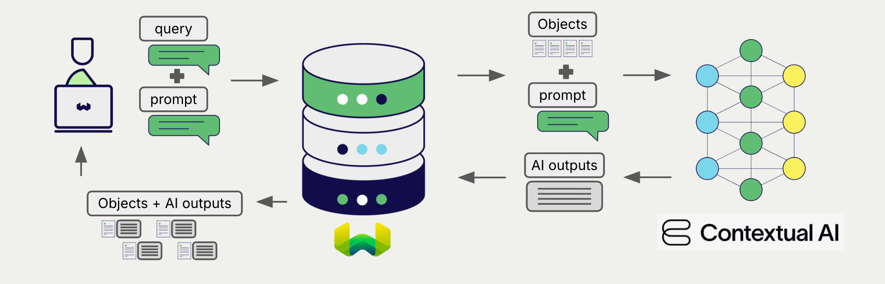

<!-- Note: for images, use https://docs.google.com/presentation/d/15opIcJuaIjEEcs_1Zm8B6pccox2p7_MHSjCnRv4dPfU/edit?usp=sharing -->

Contextual AI offers a wide range of models for natural language processing and generation. Weaviate seamlessly integrates with Contextual AI's APIs, allowing users to leverage Contextual AI's models directly from the Weaviate Database.

These integrations empower developers to build sophisticated AI-driven applications with ease.

## Integrations with Contextual AI

### Generative AI models for RAG

Contextual AI's generative AI models can generate human-like text based on given prompts and contexts.

[Weaviate's generative AI integration](./generative.md) enables users to perform retrieval augmented generation (RAG) directly from the Weaviate Database. This combines Weaviate's efficient storage and fast retrieval capabilities with Contextual AI's generative AI models to generate personalized and context-aware responses.

[Contextual AI generative AI integration page](./generative.md)

### Reranker models

Contextual AI's reranker models are designed to improve the relevance and ranking of search results.

[The Weaviate reranker integration](./reranker.md) allows users to easily refine their search results by leveraging Contextual AI's reranker models.

[Contextual AI reranker integration page](./reranker.md)

## Summary

These integrations enable developers to leverage Contextual AI's powerful models directly within Weaviate.

In turn, they simplify the process of building AI-driven applications to speed up your development process, so that you can focus on creating innovative solutions.

## Get started

You must provide a valid Contextual AI API key to Weaviate for these integrations. Go to [Contextual AI](https://contextual.ai/) to sign up and obtain an API key.

Then, go to the relevant integration page to learn how to configure Weaviate with the Contextual AI models and start using them in your applications.

- [Generative AI](./generative.md)
- [Reranker](./reranker.md)

## Questions and feedback

import DocsFeedback from '/_includes/docs-feedback.mdx';

<DocsFeedback/>
