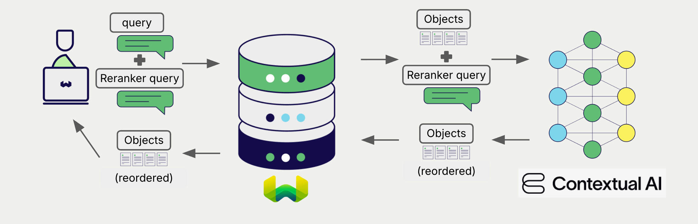

# Contextual AI Reranker Models with Weaviate

:::info Added in `v1.34.0`
:::

import Tabs from '@theme/Tabs';
import TabItem from '@theme/TabItem';
import FilteredTextBlock from '@site/src/components/Documentation/FilteredTextBlock';
import PyConnect from '!!raw-loader!../_includes/provider.connect.py';
import TSConnect from '!!raw-loader!../_includes/provider.connect.ts';
import PyCode from '!!raw-loader!../_includes/provider.reranker.py';
import TSCode from '!!raw-loader!../_includes/provider.reranker.ts';

Weaviate's integration with Contextual AI's APIs allows you to access their models' capabilities directly from Weaviate.

[Configure a Weaviate collection](#configure-the-reranker) to use a Contextual AI reranker model, and Weaviate will use the specified model and your Contextual AI API key to rerank search results.

This two-step process involves Weaviate first performing a search and then reranking the results using the specified model.

## Requirements

### Weaviate configuration

Your Weaviate instance must be configured with the Contextual AI reranker integration (`reranker-contextualai`) module.

  
For Weaviate Cloud (WCD) users

This integration is enabled by default on Weaviate Cloud (WCD) serverless instances.

  
For self-hosted users

- Check the [cluster metadata](/deploy/configuration/meta.md) to verify if the module is enabled.
- Follow the [how-to configure modules](../../configuration/modules.md) guide to enable the module in Weaviate.

### API credentials

You must provide a valid Contextual AI API key to Weaviate for this integration. Go to [Contextual AI](https://contextual.ai/) to sign up and obtain an API key.

Provide the API key to Weaviate using one of the following methods:

- Set the `CONTEXTUAL_API_KEY` environment variable that is available to Weaviate.
- Provide the API key at runtime, as shown in the examples below.

<Tabs className="code" groupId="languages">

 <TabItem value="py" label="Python">
    <FilteredTextBlock
      text={PyConnect}
      startMarker="# START ContextualAIInstantiation"
      endMarker="# END ContextualAIInstantiation"
      language="py"
    />
  </TabItem>

 <TabItem value="ts" label="JavaScript/TypeScript">
    <FilteredTextBlock
      text={TSConnect}
      startMarker="// START ContextualAIInstantiation"
      endMarker="// END ContextualAIInstantiation"
      language="ts"
    />
  </TabItem>

</Tabs>

## Configure the reranker

import MutableRerankerConfig from '/_includes/mutable-reranker-config.md';

<MutableRerankerConfig />

Configure a Weaviate collection to use a Contextual AI reranker model as follows:

<Tabs className="code" groupId="languages">
  <TabItem value="py" label="Python">
    <FilteredTextBlock
      text={PyCode}
      startMarker="# START RerankerContextualAIBasic"
      endMarker="# END RerankerContextualAIBasic"
      language="py"
    />
  </TabItem>

  <TabItem value="ts" label="JavaScript/TypeScript">
    <FilteredTextBlock
      text={TSCode}
      startMarker="// START RerankerContextualAIBasic"
      endMarker="// END RerankerContextualAIBasic"
      language="ts"
    />
  </TabItem>

</Tabs>

### Reranker parameters

Configure the reranker behavior, including the model to use, through the following parameters:

<Tabs className="code" groupId="languages">
  <TabItem value="py" label="Python">
    <FilteredTextBlock
      text={PyCode}
      startMarker="# START RerankerContextualAICustomModel"
      endMarker="# END RerankerContextualAICustomModel"
      language="py"
    />
  </TabItem>

  <TabItem value="ts" label="JavaScript/TypeScript">
    <FilteredTextBlock
      text={TSCode}
      startMarker="// START RerankerContextualAICustomModel"
      endMarker="// END RerankerContextualAICustomModel"
      language="ts"
    />
  </TabItem>

</Tabs>

The [default model](#available-models) is used if no model is specified.

For further details on model parameters, see the [Contextual AI API documentation](https://docs.contextual.ai/api-reference/rerank/rerank).

## Header parameters

You can provide the API key as well as some optional parameters at runtime through additional headers in the request. The following headers are available:

- `X-ContextualAI-Api-Key`: The Contextual AI API key.

Any additional headers provided at runtime will override the existing Weaviate configuration.

Provide the headers as shown in the [API credentials examples](#api-credentials) above.

## Reranking query

Once the reranker is configured, Weaviate performs [reranking operations](../../search/rerank.md) using the specified Contextual AI model.

More specifically, Weaviate performs an initial search, then reranks the results using the specified model.

Any search in Weaviate can be combined with a reranker to perform reranking operations.

<Tabs className="code" groupId="languages">

 <TabItem value="py" label="Python">
    <FilteredTextBlock
      text={PyCode}
      startMarker="# START RerankerQueryExample"
      endMarker="# END RerankerQueryExample"
      language="py"
    />
  </TabItem>

 <TabItem value="ts" label="JavaScript/TypeScript">
    <FilteredTextBlock
      text={TSCode}
      startMarker="// START RerankerQueryExample"
      endMarker="// END RerankerQueryExample"
      language="ts"
    />
  </TabItem>

</Tabs>

## Available models

- `ctxl-rerank-v1-instruct`
- `ctxl-rerank-v2-instruct-multilingual-mini`
- `ctxl-rerank-v2-instruct-multilingual` (default)

## Further resources

### Other integrations

- [Contextual AI generative models + Weaviate](./generative.md).

### Code examples

Once the integrations are configured at the collection, the data management and search operations in Weaviate work identically to any other collection. See the following model-agnostic examples:

- The [How-to: Manage collections](../../manage-collections/index.mdx) and [How-to: Manage objects](../../manage-objects/index.mdx) guides show how to perform data operations (i.e. create, read, update, delete collections and objects within them).
- The [How-to: Query & Search](../../search/index.mdx) guides show how to perform search operations (i.e. vector, keyword, hybrid) as well as retrieval augmented generation.

### References

- Contextual AI [Rerank API documentation](https://docs.contextual.ai/api-reference/rerank/rerank)

## Questions and feedback

import DocsFeedback from '/_includes/docs-feedback.mdx';

<DocsFeedback/>
