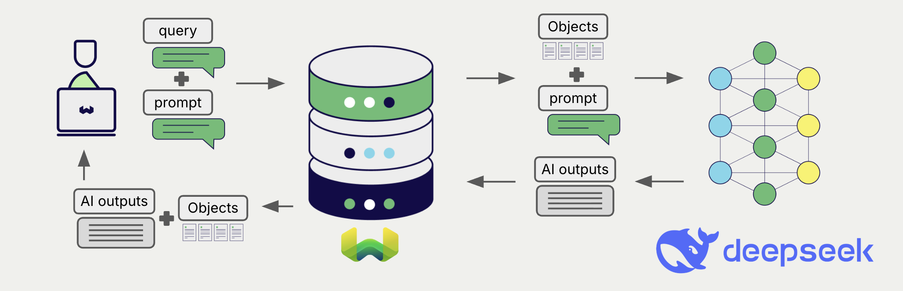
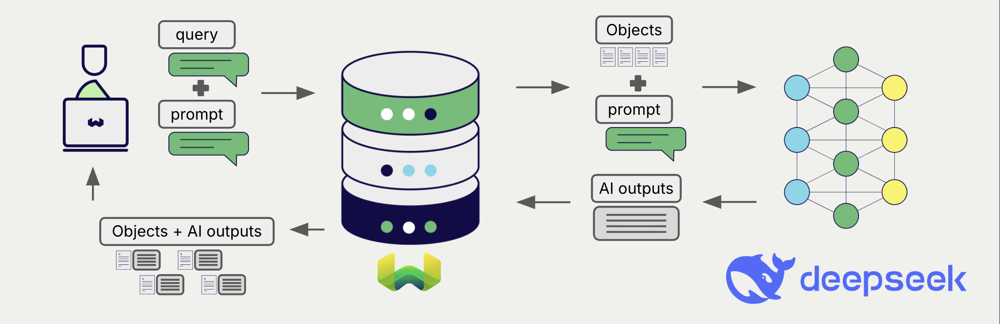

# DeepSeek Generative AI with Weaviate

import FilteredTextBlock from '@site/src/components/Documentation/FilteredTextBlock';
import PyConnect from '!!raw-loader!../_includes/provider.connect.py';
import PyCode from '!!raw-loader!../_includes/provider.generative.py';

Weaviate's integration with DeepSeek's API allows you to access their generative models' capabilities directly from Weaviate.

[Configure a Weaviate collection](#configure-collection) to use a generative AI model with DeepSeek. Weaviate will perform retrieval augmented generation (RAG) using the specified model and your DeepSeek API key.

More specifically, Weaviate will perform a search, retrieve the most relevant objects, and then pass them to the DeepSeek generative model to generate outputs.

:::info Code examples are Python-only for now
Examples for the other client languages will follow.
:::

## Requirements

### Weaviate configuration

Your Weaviate instance must be configured with the DeepSeek generative AI integration (`generative-deepseek`) module.

:::info Added in `v1.36.19`, `v1.37.10`, and `v1.38.2`
The `generative-deepseek` module is available from `v1.36.19` on the `v1.36` line, `v1.37.10` on the `v1.37` line, and `v1.38.2` on the `v1.38` line. Earlier patch releases on these lines do not include it.
:::

  
For Weaviate Cloud (WCD) users

This integration is enabled by default on Weaviate Cloud (WCD) instances.

  
For self-hosted users

- Check the [cluster metadata](/deploy/configuration/status.md#cluster-metadata) to verify if the module is enabled.
- Follow the [how-to configure modules](../../configuration/modules.md) guide to enable the module in Weaviate.
- To enable the module, include it in the `ENABLE_MODULES` environment variable available to Weaviate, e.g. `ENABLE_MODULES="generative-deepseek"` (add it to your existing comma-separated list if other modules are enabled).

### API credentials

You must provide a valid DeepSeek API key to Weaviate for this integration. Go to [DeepSeek](https://platform.deepseek.com/) to sign up and obtain an API key.

Provide the API key to Weaviate using one of the following methods:

- Set the `DEEPSEEK_APIKEY` environment variable that is available to Weaviate.
- Provide the API key at runtime, as shown in the examples below.

<FilteredTextBlock
  text={PyConnect}
  startMarker="# START DeepseekInstantiation"
  endMarker="# END DeepseekInstantiation"
  language="py"
/>

## Configure collection

import MutableGenerativeConfig from '/_includes/mutable-generative-config.md';

<MutableGenerativeConfig />

Always set `model` explicitly. The module's built-in default is a retired model alias, so a collection configured without a `model` points at a model that DeepSeek no longer serves. See [Available models](#available-models) for the current model names.

[Configure a Weaviate index](../../manage-collections/generative-reranker-models.mdx#specify-a-generative-model-integration) as follows to use a DeepSeek generative model:

<FilteredTextBlock
  text={PyCode}
  startMarker="# START GenerativeDeepseekCustomModel"
  endMarker="# END GenerativeDeepseekCustomModel"
  language="pyindent"
/>

### Select a model

Specify any current DeepSeek model name. See [Available models](#available-models) for the current names, and [Generative parameters](#generative-parameters) for the other settings you can configure alongside it.

You can also [override the model at query time](#select-a-model-at-runtime).

### Generative parameters

Configure the following generative parameters to customize the model behavior.

<FilteredTextBlock
  text={PyCode}
  startMarker="# START FullGenerativeDeepseek"
  endMarker="# END FullGenerativeDeepseek"
  language="pyindent"
/>

Weaviate checks `maxTokens` against a built-in ceiling only for the retired `deepseek-chat` and `deepseek-reasoner` aliases. For any current model, a `maxTokens` above the model's limit is accepted when you create the collection and fails later, as an error from DeepSeek at query time.

For further details on model parameters, see the [DeepSeek API documentation](https://api-docs.deepseek.com/).

## Select a model at runtime

Aside from setting the default model provider when creating the collection, you can also override it at query time.

<FilteredTextBlock
  text={PyCode}
  startMarker="# START RuntimeModelSelectionDeepseek"
  endMarker="# END RuntimeModelSelectionDeepseek"
  language="pyindent"
/>

## Header parameters

You can provide the API key as well as some optional parameters at runtime through additional headers in the request. The following headers are available:

- `X-Deepseek-Api-Key`: The DeepSeek API key.
- `X-Deepseek-Baseurl`: The base URL to use (e.g. a proxy) instead of the default DeepSeek URL.

`X-Deepseek-Api-Key` takes precedence over the `DEEPSEEK_APIKEY` environment variable. The API key is never part of the collection configuration, so if neither the header nor the environment variable is set, the request fails with `api key: no api key found`.

`X-Deepseek-Baseurl` takes precedence over a `baseURL` set at query time, which in turn takes precedence over the `baseURL` in the collection configuration. If none of them are set, Weaviate uses `https://api.deepseek.com`. Provide an API root rather than a full endpoint path, because Weaviate appends `/chat/completions` to it.

Provide the headers as shown in the [API credentials examples](#api-credentials) above.

## Retrieval augmented generation

After configuring the generative AI integration, perform RAG operations, either with the [single prompt](#single-prompt) or [grouped task](#grouped-task) method.

### Single prompt

To generate text for each object in the search results, use the single prompt method.

The example below generates outputs for each of the `n` search results, where `n` is specified by the `limit` parameter.

When creating a single prompt query, use braces `{}` to interpolate the object properties you want Weaviate to pass on to the language model. For example, to pass on the object's `title` property, include `{title}` in the query.

<FilteredTextBlock
  text={PyCode}
  startMarker="# START SinglePromptExample"
  endMarker="# END SinglePromptExample"
  language="py"
/>

### Grouped task

To generate one text for the entire set of search results, use the grouped task method.

In other words, when you have `n` search results, the generative model generates one output for the entire group.

<FilteredTextBlock
  text={PyCode}
  startMarker="# START GroupedTaskExample"
  endMarker="# END GroupedTaskExample"
  language="py"
/>

## References

### Available models

Weaviate forwards the configured model name to DeepSeek as-is. There is no allowlist on the Weaviate side, so any current DeepSeek model name is accepted.

The current model names are `deepseek-v4-flash` and `deepseek-v4-pro`. For the full list of models and pricing, see the [DeepSeek pricing page](https://api-docs.deepseek.com/quick_start/pricing) and the [DeepSeek API documentation](https://api-docs.deepseek.com/).

:::caution The module default is a retired model
The `deepseek-chat` and `deepseek-reasoner` aliases are retired and DeepSeek no longer serves them. They previously pointed at `deepseek-v4-flash` in its non-thinking and thinking modes respectively.

The built-in default model of the `generative-deepseek` module is still `deepseek-chat`, so a collection created without a `model` points at a retired alias. Set `model` on every collection you create.
:::

### Reasoning models

The `generative-deepseek` module returns only the model's message content. If you use a reasoning model, its separate reasoning (chain-of-thought) output is not surfaced through the integration.

Reasoning models can take much longer to respond than non-reasoning models. Weaviate applies the [`MODULES_CLIENT_TIMEOUT`](/deploy/configuration/env-vars/index.md#MODULES_CLIENT_TIMEOUT) environment variable to the whole request, including reading the response, and it defaults to 50 seconds. If reasoning queries time out, raise this value on your Weaviate instance.

## Further resources

### Code examples

Once the integration is configured at the collection, the data management and search operations in Weaviate work identically to any other collection. See the following model-agnostic examples:

- The [How-to: Manage collections](../../manage-collections/index.mdx) and [How-to: Manage objects](../../manage-objects/index.mdx) guides show how to perform data operations (i.e. create, read, update, delete collections and objects within them).
- The [How-to: Query & Search](../../search/index.mdx) guides show how to perform search operations (i.e. vector, keyword, hybrid) as well as retrieval augmented generation.

### References

- [DeepSeek API documentation](https://api-docs.deepseek.com/)

## Questions and feedback

import DocsFeedback from '/_includes/docs-feedback.mdx';

<DocsFeedback/>
