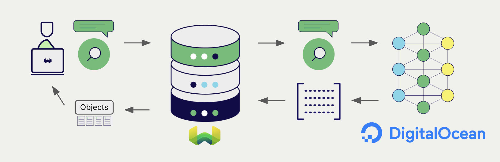

# DigitalOcean Embeddings with Weaviate

import Tabs from '@theme/Tabs';
import TabItem from '@theme/TabItem';
import FilteredTextBlock from '@site/src/components/Documentation/FilteredTextBlock';
import PyConnect from '!!raw-loader!../_includes/provider.connect.py';
import TSConnect from '!!raw-loader!../_includes/provider.connect.ts';
import PyCode from '!!raw-loader!../_includes/provider.vectorizer.py';
import TSCode from '!!raw-loader!../_includes/provider.vectorizer.ts';
import JavaV6Code from "!!raw-loader!/_includes/code/java-v6/src/test/java/ModelProvidersTest.java";
import CSharpCode from "!!raw-loader!/_includes/code/csharp/ModelProvidersTest.cs";

Weaviate's integration with [DigitalOcean's Serverless Inference](https://docs.digitalocean.com/products/inference/how-to/use-serverless-inference/) lets you access DigitalOcean-hosted embedding models directly from Weaviate.

[Configure a Weaviate vector index](#configure-the-vectorizer) to use a DigitalOcean embedding model, and Weaviate generates embeddings for imports and searches automatically using your DigitalOcean API key. This is the *vectorizer*.

At [import time](#data-import), Weaviate generates text object embeddings and saves them into the index. For [vector](#vector-near-text-search) and [hybrid](#hybrid-search) search operations, Weaviate converts text queries into embeddings.

## Requirements

### Weaviate configuration

Your Weaviate instance must have the `text2vec-digitalocean` module enabled.

  
For Weaviate Cloud (WCD) users

This integration is enabled by default on Weaviate Cloud (WCD) instances.

  
For self-hosted users

- Check the [cluster metadata](/deploy/configuration/status.md#cluster-metadata) to verify if the module is enabled.
- Follow the [how-to configure modules](../../configuration/modules.md) guide to enable the module in Weaviate.

### API credentials {#api-credentials}

You must provide a DigitalOcean API key to Weaviate for this integration. Generate one in the [DigitalOcean Cloud console](https://cloud.digitalocean.com/) and supply it via one of:

- Set the `DIGITALOCEAN_APIKEY` environment variable on the Weaviate server.
- Provide the `X-Digitalocean-Api-Key` header at request time, as shown below.

<Tabs className="code" groupId="languages">
  <TabItem value="py" label="Python">
    <FilteredTextBlock
      text={PyConnect}
      startMarker="# START DigitalOceanInstantiation"
      endMarker="# END DigitalOceanInstantiation"
      language="py"
    />
  </TabItem>
  <TabItem value="ts" label="JavaScript/TypeScript">
    <FilteredTextBlock
      text={TSConnect}
      startMarker="// START DigitalOceanInstantiation"
      endMarker="// END DigitalOceanInstantiation"
      language="ts"
    />
  </TabItem>
  <TabItem value="java" label="Java">
    <FilteredTextBlock
      text={JavaV6Code}
      startMarker="// START DigitalOceanInstantiation"
      endMarker="// END DigitalOceanInstantiation"
      language="java"
    />
  </TabItem>
  <TabItem value="csharp" label="C#">
    <FilteredTextBlock
      text={CSharpCode}
      startMarker="// START DigitalOceanInstantiation"
      endMarker="// END DigitalOceanInstantiation"
      language="csharp"
    />
  </TabItem>
</Tabs>

## Configure the vectorizer

[Configure a Weaviate index](../../manage-collections/vector-config.mdx#specify-a-vectorizer) to use a DigitalOcean Serverless Inference model by setting the vectorizer as follows:

<Tabs className="code" groupId="languages">
  <TabItem value="py" label="Python">
    <FilteredTextBlock
      text={PyCode}
      startMarker="# START BasicVectorizerDigitalOcean"
      endMarker="# END BasicVectorizerDigitalOcean"
      language="py"
    />
  </TabItem>
  <TabItem value="ts" label="JavaScript/TypeScript">
    <FilteredTextBlock
      text={TSCode}
      startMarker="// START BasicVectorizerDigitalOcean"
      endMarker="// END BasicVectorizerDigitalOcean"
      language="ts"
    />
  </TabItem>
  <TabItem value="java" label="Java">
    <FilteredTextBlock
      text={JavaV6Code}
      startMarker="// START BasicVectorizerDigitalOcean"
      endMarker="// END BasicVectorizerDigitalOcean"
      language="java"
    />
  </TabItem>
  <TabItem value="csharp" label="C#">
    <FilteredTextBlock
      text={CSharpCode}
      startMarker="// START BasicVectorizerDigitalOcean"
      endMarker="// END BasicVectorizerDigitalOcean"
      language="csharp"
    />
  </TabItem>
</Tabs>

### Vectorizer parameters

- `model`: **Required.** The DigitalOcean Serverless Inference model id, for example `qwen3-embedding-0.6b`. Query `GET /v1/models` on the inference endpoint to see the catalogue of available models for your account.
- `baseURL`: Optional. The base URL where API requests should go. Defaults to `https://inference.do-ai.run`. Override only if you're proxying or running against a non-default endpoint.

## Header parameters

You can override the API key per-request via headers. Headers provided at request time take precedence over the server-side `DIGITALOCEAN_APIKEY` environment variable:

- `X-Digitalocean-Api-Key`: The DigitalOcean API key for this request.

## Data import

After configuring the vectorizer, [import data](../../manage-objects/import.mdx) into Weaviate. Weaviate generates embeddings for text objects using [the configured model](#vectorizer-parameters).

:::tip Re-use existing vectors
If you already have a compatible model vector available, you can provide it directly to Weaviate. This can be useful if you have already generated embeddings using the same model and want to use them in Weaviate, such as when migrating data from another system.
:::

## Searches

Once the vectorizer is configured, Weaviate performs vector and hybrid searches using the specified DigitalOcean model.

### Vector (near text) search {#vector-near-text-search}

When you perform a [vector search](../../search/similarity.md#search-with-text), Weaviate converts the text query into an embedding using the configured DigitalOcean model and returns the most similar objects.

### Hybrid search {#hybrid-search}

When you perform a [hybrid search](../../search/hybrid.md), Weaviate fuses keyword and vector ranking. The text query is embedded with the configured DigitalOcean model; the keyword side uses Weaviate's inverted index.

## References

### Available models

DigitalOcean's Serverless Inference catalogue includes several embedding-capable models. See the [DigitalOcean Serverless Inference docs](https://docs.digitalocean.com/products/inference/how-to/use-serverless-inference/) for the live list — model availability and dimensions can change.

:::note Dimensions parameter currently not supported

DigitalOcean's `/v1/embeddings` endpoint does not accept a `dimensions` request field at the time of writing, even for [Matryoshka Representation Learning (MRL)](https://huggingface.co/blog/matryoshka)-capable models like `qwen3-embedding-0.6b` whose native output could otherwise be truncated. Weaviate intentionally does not forward a `dimensions` parameter to avoid silent no-ops; the embedding dimension is always the model's native size.

:::

## Further resources

### Other integrations

- [Weaviate model providers overview](../index.md)

### Code examples

Once the vectorizer is configured, Weaviate handles model inference transparently. The standard [client library how-tos](../../client-libraries/index.mdx) apply unchanged — no DigitalOcean-specific code is required at query or import time beyond the configuration shown above.

## Questions and feedback

import DocsFeedback from '/_includes/docs-feedback.mdx';

<DocsFeedback/>
