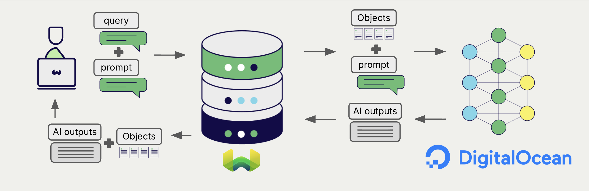
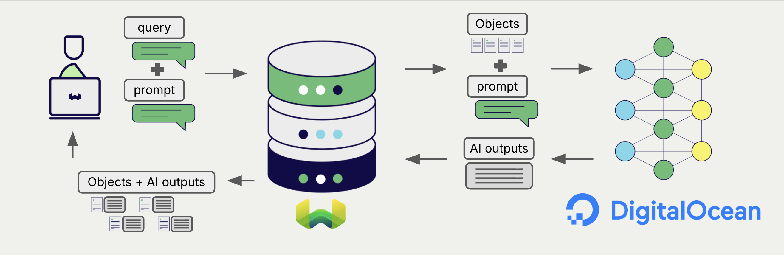
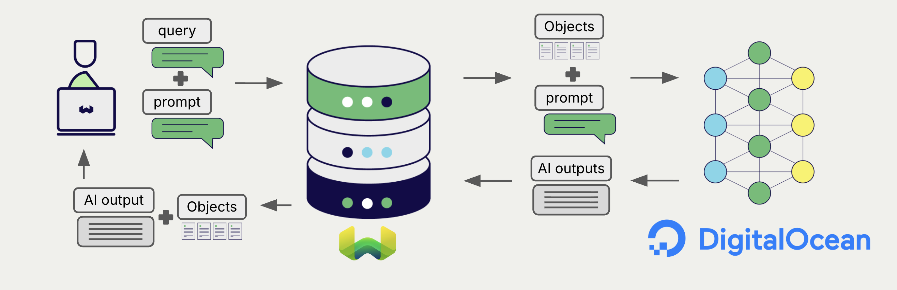

# DigitalOcean Generative AI with Weaviate

import FilteredTextBlock from '@site/src/components/Documentation/FilteredTextBlock';
import PyConnect from '!!raw-loader!../_includes/provider.connect.py';
import PyCode from '!!raw-loader!../_includes/provider.generative.py';

Weaviate's integration with [DigitalOcean's Serverless Inference](https://docs.digitalocean.com/products/inference/how-to/use-serverless-inference/) allows you to access their generative models' capabilities directly from Weaviate.

[Configure a Weaviate collection](#configure-collection) to use a generative AI model with DigitalOcean. Weaviate will perform retrieval augmented generation (RAG) using the specified model and your DigitalOcean API key.

More specifically, Weaviate will perform a search, retrieve the most relevant objects, and then pass them to the DigitalOcean generative model to generate outputs.

:::info Code examples are Python-only for now
Examples for the other client languages will follow.
:::

## Requirements

### Weaviate configuration

Your Weaviate instance must be configured with the DigitalOcean generative AI integration (`generative-digitalocean`) module.

:::info Added in `v1.37.15`, `v1.38.13`, and `v1.39.2`
:::

  
For Weaviate Cloud (WCD) users

This integration is enabled by default on Weaviate Cloud (WCD) instances.

  
For self-hosted users

- Check the [cluster metadata](/deploy/configuration/status.md#cluster-metadata) to verify if the module is enabled.
- Follow the [how-to configure modules](../../configuration/modules.md) guide to enable the module in Weaviate.

### API credentials

You must provide a valid DigitalOcean API key to Weaviate for this integration. Generate one in the [DigitalOcean Cloud console](https://cloud.digitalocean.com/) and supply it via one of:

- Set the `DIGITALOCEAN_APIKEY` environment variable on the Weaviate server.
- Provide the `X-Digitalocean-Api-Key` header at request time, as shown below.

<FilteredTextBlock
  text={PyConnect}
  startMarker="# START DigitalOceanInstantiation"
  endMarker="# END DigitalOceanInstantiation"
  language="py"
/>

## Configure collection

import MutableGenerativeConfig from '/_includes/mutable-generative-config.md';

<MutableGenerativeConfig />

[Configure a Weaviate index](../../manage-collections/generative-reranker-models.mdx#specify-a-generative-model-integration) as follows to use a DigitalOcean generative model:

<FilteredTextBlock
  text={PyCode}
  startMarker="# START GenerativeDigitalOceanCustomModel"
  endMarker="# END GenerativeDigitalOceanCustomModel"
  language="py"
/>

### Select a model

Set `model` to any model that DigitalOcean Serverless Inference serves for your account. See [Available models](#available-models) for where to find the current names, and [Generative parameters](#generative-parameters) for the other settings you can configure alongside it.

You can also [override the model at query time](#select-a-model-at-runtime).

### Generative parameters

Configure the following generative parameters to customize the model behavior.

<FilteredTextBlock
  text={PyCode}
  startMarker="# START FullGenerativeDigitalOcean"
  endMarker="# END FullGenerativeDigitalOcean"
  language="py"
/>

For further details on model parameters, see the [DigitalOcean chat completions documentation](https://docs.digitalocean.com/products/inference/how-to/use-chat-completions-api/).

## Select a model at runtime

Aside from setting the default model provider when creating the collection, you can also override it at query time.

<FilteredTextBlock
  text={PyCode}
  startMarker="# START RuntimeModelSelectionDigitalOcean"
  endMarker="# END RuntimeModelSelectionDigitalOcean"
  language="py"
/>

## Header parameters

You can provide the API key as well as some optional parameters at runtime through additional headers in the request. The following headers are available:

- `X-Digitalocean-Api-Key`: The DigitalOcean API key.
- `X-Digitalocean-Baseurl`: The base URL to use (e.g. a proxy) instead of the default DigitalOcean URL.

`X-Digitalocean-Api-Key` takes precedence over the `DIGITALOCEAN_APIKEY` environment variable. The API key is never part of the collection configuration, so if neither the header nor the environment variable is set, the request fails with `api key: no api key found`.

`X-Digitalocean-Baseurl` takes precedence over a `baseURL` set at query time, which in turn takes precedence over the `baseURL` in the collection configuration. If none of them are set, Weaviate uses `https://inference.do-ai.run`. Provide an API root rather than a full endpoint path, because Weaviate appends `/v1/chat/completions` to it.

Provide the headers as shown in the [API credentials examples](#api-credentials) above.

## Retrieval augmented generation

After configuring the generative AI integration, perform RAG operations, either with the [single prompt](#single-prompt) or [grouped task](#grouped-task) method.

### Single prompt

To generate text for each object in the search results, use the single prompt method.

The example below generates outputs for each of the `n` search results, where `n` is specified by the `limit` parameter.

When creating a single prompt query, use braces `{}` to interpolate the object properties you want Weaviate to pass on to the language model. For example, to pass on the object's `title` property, include `{title}` in the query.

<FilteredTextBlock
  text={PyCode}
  startMarker="# START SinglePromptExample"
  endMarker="# END SinglePromptExample"
  language="py"
/>

### Grouped task

To generate one text for the entire set of search results, use the grouped task method.

In other words, when you have `n` search results, the generative model generates one output for the entire group.

<FilteredTextBlock
  text={PyCode}
  startMarker="# START GroupedTaskExample"
  endMarker="# END GroupedTaskExample"
  language="py"
/>

## References

### Available models

Weaviate forwards the configured model name to DigitalOcean as-is. The `generative-digitalocean` module keeps no list of model names and does not check the name, so a name that DigitalOcean does not serve is accepted when you create the collection and fails later, as an error from DigitalOcean at query time.

For the models available to your account, query `GET /v1/models` on the inference endpoint, or see the [DigitalOcean Serverless Inference docs](https://docs.digitalocean.com/products/inference/how-to/use-serverless-inference/) for the live list, as model availability can change.

## Further resources

### Other integrations

- [DigitalOcean embedding models + Weaviate](./embeddings.md)
- [Weaviate model providers overview](../index.md)

### Code examples

Once the integration is configured at the collection, the data management and search operations in Weaviate work identically to any other collection. See the following model-agnostic examples:

- The [How-to: Manage collections](../../manage-collections/index.mdx) and [How-to: Manage objects](../../manage-objects/index.mdx) guides show how to perform data operations (i.e. create, read, update, delete collections and objects within them).
- The [How-to: Query & Search](../../search/index.mdx) guides show how to perform search operations (i.e. vector, keyword, hybrid) as well as retrieval augmented generation.

### References

- [DigitalOcean Serverless Inference documentation](https://docs.digitalocean.com/products/inference/how-to/use-serverless-inference/)
- [DigitalOcean chat completions API](https://docs.digitalocean.com/products/inference/how-to/use-chat-completions-api/)

## Questions and feedback

import DocsFeedback from '/_includes/docs-feedback.mdx';

<DocsFeedback/>
