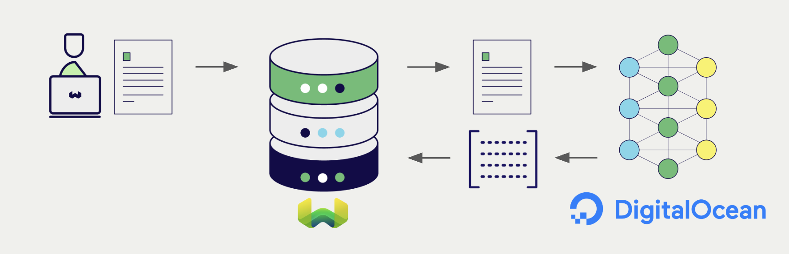

<!-- Note: for images, use https://docs.google.com/presentation/d/15opIcJuaIjEEcs_1Zm8B6pccox2p7_MHSjCnRv4dPfU/edit?usp=sharing -->

[DigitalOcean's Serverless Inference](https://docs.digitalocean.com/products/inference/how-to/use-serverless-inference/) hosts a curated set of open-weight embedding and language models behind a single OpenAI-compatible API. Weaviate integrates with DigitalOcean's embedding endpoint so you can vectorize and search data using DigitalOcean-hosted models directly from your Weaviate instance.

## Integrations with DigitalOcean

### Embedding models for vector search

DigitalOcean Serverless Inference exposes embedding models (e.g. `qwen3-embedding-0.6b`) over an OpenAI-compatible `/v1/embeddings` API at `https://inference.do-ai.run`.

[Weaviate integrates with DigitalOcean's embedding models](./embeddings.md) through the `text2vec-digitalocean` vectorizer module. Configure a vector index to use a DigitalOcean model and Weaviate generates embeddings for imports, vector searches, and hybrid searches automatically.

[DigitalOcean embedding integration page](./embeddings.md)

## Summary

This integration lets you leverage DigitalOcean's hosted embedding models from Weaviate without managing inference infrastructure yourself.

## Get started

Generate an API key in the [DigitalOcean Cloud console](https://cloud.digitalocean.com/) and supply it to Weaviate via the `DIGITALOCEAN_APIKEY` environment variable or the `X-Digitalocean-Api-Key` request header. Then see the embedding integration page:

- [Text Embeddings](./embeddings.md)

## Questions and feedback

import DocsFeedback from '/_includes/docs-feedback.mdx';

<DocsFeedback/>
