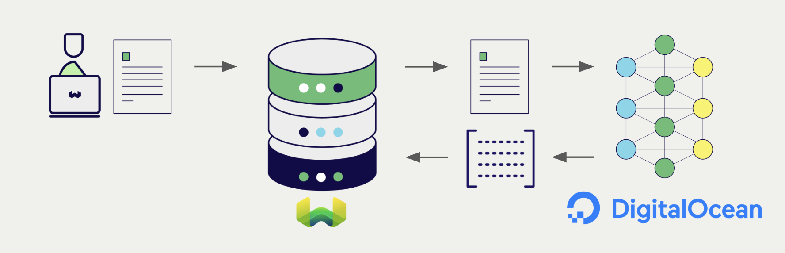

<!-- Note: for images, use https://docs.google.com/presentation/d/15opIcJuaIjEEcs_1Zm8B6pccox2p7_MHSjCnRv4dPfU/edit?usp=sharing -->

[DigitalOcean's Serverless Inference](https://docs.digitalocean.com/products/inference/how-to/use-serverless-inference/) hosts a curated set of open-weight embedding and language models behind a single OpenAI-compatible API. Weaviate integrates with DigitalOcean's embedding and chat completions endpoints so you can vectorize, search, and generate over your data using DigitalOcean-hosted models directly from your Weaviate instance.

:::note
Looking to *host* Weaviate on DigitalOcean? See [DigitalOcean Managed Weaviate](/deploy/installation-guides/digitalocean).
:::

## Integrations with DigitalOcean

### Embedding models for vector search

DigitalOcean Serverless Inference exposes embedding models (e.g. `qwen3-embedding-0.6b`) over an OpenAI-compatible `/v1/embeddings` API at `https://inference.do-ai.run`.

[Weaviate integrates with DigitalOcean's embedding models](./embeddings.md) through the `text2vec-digitalocean` vectorizer module. Configure a vector index to use a DigitalOcean model and Weaviate generates embeddings for imports, vector searches, and hybrid searches automatically.

[DigitalOcean embedding integration page](./embeddings.md)

### Generative AI models for RAG

DigitalOcean Serverless Inference exposes chat models (e.g. `llama-4-maverick`) over an OpenAI-compatible `/v1/chat/completions` API at `https://inference.do-ai.run`.

[Weaviate integrates with DigitalOcean's generative models](./generative.md) through the `generative-digitalocean` module. Configure a collection to use a DigitalOcean model and Weaviate performs retrieval augmented generation (RAG) over your search results automatically.

[DigitalOcean generative integration page](./generative.md)

## Summary

These integrations let you leverage DigitalOcean's hosted embedding and generative models from Weaviate without managing inference infrastructure yourself.

## Get started

Generate an API key in the [DigitalOcean Cloud console](https://cloud.digitalocean.com/) and supply it to Weaviate via the `DIGITALOCEAN_APIKEY` environment variable or the `X-Digitalocean-Api-Key` request header. The same key serves both integrations. Then see the integration pages:

- [Text Embeddings](./embeddings.md)
- [Generative AI](./generative.md)

## Questions and feedback

import DocsFeedback from '/_includes/docs-feedback.mdx';

<DocsFeedback/>
