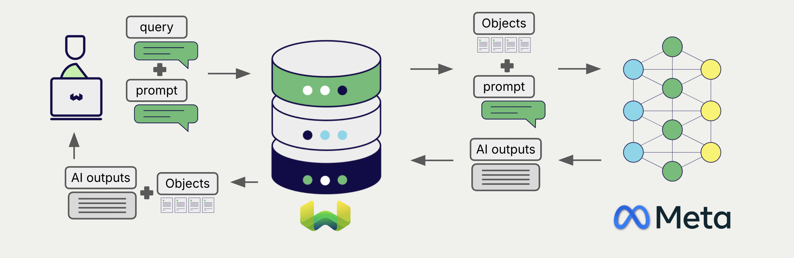
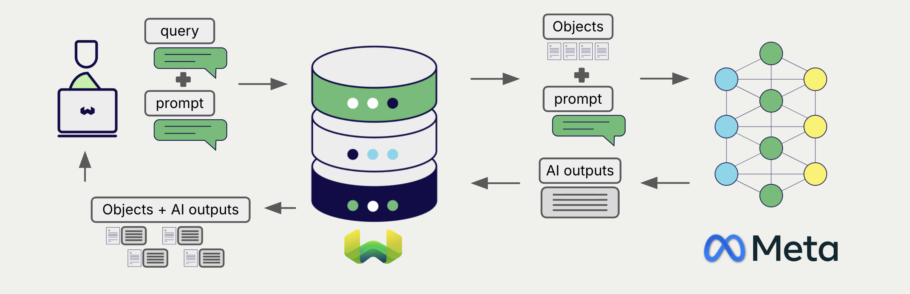

# Meta Generative AI with Weaviate

import Meta from '/_includes/feature-notes/meta.mdx';

<Meta/>

import Tabs from '@theme/Tabs';
import TabItem from '@theme/TabItem';
import FilteredTextBlock from '@site/src/components/Documentation/FilteredTextBlock';
import PyConnect from '!!raw-loader!../_includes/provider.connect.py';
import PyCode from '!!raw-loader!../_includes/provider.generative.py';

Weaviate's integration with [Meta's API](https://dev.meta.ai/docs/api-reference) allows you to access their generative models' capabilities directly from Weaviate.

[Configure a Weaviate collection](#configure-collection) to use a generative AI model with Meta. Weaviate will perform retrieval augmented generation (RAG) using the specified model and your Meta API key.

More specifically, Weaviate will perform a search, retrieve the most relevant objects, and then pass them to the Meta generative model to generate outputs.

{/* TODO(ivan): remove this admonition and name the minimum weaviate-client version once generative-meta ships in a client release */}
:::info Python client support is not released yet
Python client support for Meta is coming in an upcoming `weaviate-client` release. The `Configure.Generative.meta()` and `GenerativeConfig.meta()` helpers are already merged in the client's main branch. The snippets below do not run with the current client release.
:::

## Requirements

### Weaviate configuration

Your Weaviate instance must be configured with the Meta generative AI integration (`generative-meta`) module.

`generative-meta` is an API-based module. Weaviate enables API-based modules by default, so the module is present on any `v1.39.3` or later instance that has not disabled them.

Check the [cluster metadata](/deploy/configuration/status.md#cluster-metadata) to confirm that the module is enabled on your instance.

  
For self-hosted users

- Follow the [how-to configure modules](../../configuration/modules.md) guide to enable the module in Weaviate.
- If you set [`API_BASED_MODULES_DISABLED`](/deploy/configuration/env-vars#API_BASED_MODULES_DISABLED) to `true`, or you maintain your own [`ENABLE_MODULES`](/deploy/configuration/env-vars#ENABLE_MODULES) list, add `generative-meta` to `ENABLE_MODULES`.

### API credentials

You must provide a valid Meta API key to Weaviate for this integration. See the [Meta API documentation](https://dev.meta.ai/docs/api-reference) to obtain an API key.

Provide the API key to Weaviate using one of the following methods:

- Set the `META_APIKEY` environment variable that is available to Weaviate.
- Provide the API key at runtime, as shown in the examples below.

<Tabs className="code" groupId="languages">
  <TabItem value="py" label="Python">
    <FilteredTextBlock
      text={PyConnect}
      startMarker="# START MetaInstantiation"
      endMarker="# END MetaInstantiation"
      language="py"
    />
  </TabItem>
</Tabs>

## Configure collection

import MutableGenerativeConfig from '/_includes/mutable-generative-config.md';

<MutableGenerativeConfig />

[Configure a Weaviate index](../../manage-collections/generative-reranker-models.mdx#specify-a-generative-model-integration) as follows to use a Meta generative model:

<Tabs className="code" groupId="languages">
  <TabItem value="py" label="Python">
    <FilteredTextBlock
      text={PyCode}
      startMarker="# START BasicGenerativeMeta"
      endMarker="# END BasicGenerativeMeta"
      language="pyindent"
    />
  </TabItem>
</Tabs>

### Select a model

Name the model in the collection configuration:

<Tabs className="code" groupId="languages">
  <TabItem value="py" label="Python">
    <FilteredTextBlock
      text={PyCode}
      startMarker="# START GenerativeMetaCustomModel"
      endMarker="# END GenerativeMetaCustomModel"
      language="pyindent"
    />
  </TabItem>
</Tabs>

See [Available models](#available-models) for the names you can use and for the default. You can also [override the model at query time](#select-a-model-at-runtime).

### Generative parameters

Configure the following generative parameters to customize the model behavior.

<Tabs className="code" groupId="languages">
  <TabItem value="py" label="Python">
    <FilteredTextBlock
      text={PyCode}
      startMarker="# START FullGenerativeMeta"
      endMarker="# END FullGenerativeMeta"
      language="pyindent"
    />
  </TabItem>
</Tabs>

Weaviate has no default for `temperature`, `topP`, `maxTokens`, `frequencyPenalty`, `presencePenalty`, or `reasoningEffort`: any one you leave unset is omitted from the request, so Meta's own default applies.

For further details on model parameters, see the [Meta API documentation](https://dev.meta.ai/docs/api-reference).

## Select a model at runtime

Aside from setting the default model provider when creating the collection, you can also override it at query time.

<Tabs className="code" groupId="languages">
  <TabItem value="py" label="Python">
    <FilteredTextBlock
      text={PyCode}
      startMarker="# START RuntimeModelSelectionMeta"
      endMarker="# END RuntimeModelSelectionMeta"
      language="pyindent"
    />
  </TabItem>
</Tabs>

## Header parameters

You can provide the API key as well as some optional parameters at runtime through additional headers in the request. The following headers are available:

- `X-Meta-Api-Key`: The Meta API key.
- `X-Meta-Baseurl`: The base URL to use (e.g. a proxy) instead of the default Meta URL.

`X-Meta-Api-Key` takes precedence over the `META_APIKEY` environment variable. The API key is never part of the collection configuration, so if neither the header nor the environment variable is set, the request fails with `api key: no api key found neither in request header: X-Meta-Api-Key nor in environment variable under META_APIKEY`.

`X-Meta-Baseurl` takes precedence over a `baseURL` set at query time, which in turn takes precedence over the `baseURL` in the collection configuration. If none of them are set, Weaviate uses `https://api.meta.ai`. Provide an API root rather than a full endpoint path, because Weaviate appends `/v1/chat/completions` to it.

Provide the headers as shown in the [API credentials examples](#api-credentials) above.

## Retrieval augmented generation

After configuring the generative AI integration, perform RAG operations, either with the [single prompt](#single-prompt) or [grouped task](#grouped-task) method.

### Single prompt

To generate text for each object in the search results, use the single prompt method.

The example below generates outputs for each of the `n` search results, where `n` is specified by the `limit` parameter.

When creating a single prompt query, use braces `{}` to interpolate the object properties you want Weaviate to pass on to the language model. For example, to pass on the object's `title` property, include `{title}` in the query.

<Tabs className="code" groupId="languages">
  <TabItem value="py" label="Python">
    <FilteredTextBlock
      text={PyCode}
      startMarker="# START SinglePromptExample"
      endMarker="# END SinglePromptExample"
      language="py"
    />
  </TabItem>
</Tabs>

### Grouped task

To generate one text for the entire set of search results, use the grouped task method.

In other words, when you have `n` search results, the generative model generates one output for the entire group.

<Tabs className="code" groupId="languages">
  <TabItem value="py" label="Python">
    <FilteredTextBlock
      text={PyCode}
      startMarker="# START GroupedTaskExample"
      endMarker="# END GroupedTaskExample"
      language="py"
    />
  </TabItem>
</Tabs>

### RAG with images

You can also supply images as a part of the input when performing retrieval augmented generation in both single prompts and grouped tasks.

<Tabs className="code" groupId="languages">
  <TabItem value="py" label="Python">
    <FilteredTextBlock
      text={PyCode}
      startMarker="# START WorkingWithImagesMeta"
      endMarker="# END WorkingWithImagesMeta"
      language="pyindent"
    />
  </TabItem>
</Tabs>

## References

### Available models

Weaviate forwards the configured model name to Meta as-is. There is no allowlist on the Weaviate side, so any model name that Meta serves is accepted. An unknown name is accepted when you create the collection and fails later, as an error from Meta at query time.

If you do not set a model, Weaviate uses `muse-spark-1.2`.

For the list of models, see the [Meta API documentation](https://dev.meta.ai/docs/api-reference).

### Timeouts

Weaviate applies the [`MODULES_CLIENT_TIMEOUT`](/deploy/configuration/env-vars/index.md#MODULES_CLIENT_TIMEOUT) environment variable to the whole request, including reading the response, and it defaults to 50 seconds. A long generation, such as one with a high `reasoningEffort`, can exceed it. If queries time out, raise this value on your Weaviate instance.

## Further resources

### Code examples

Once the integration is configured at the collection, the data management and search operations in Weaviate work identically to any other collection. See the following model-agnostic examples:

- The [How-to: Manage collections](../../manage-collections/index.mdx) and [How-to: Manage objects](../../manage-objects/index.mdx) guides show how to perform data operations (i.e. create, read, update, delete collections and objects within them).
- The [How-to: Query & Search](../../search/index.mdx) guides show how to perform search operations (i.e. vector, keyword, hybrid) as well as retrieval augmented generation.

### References

- [Meta API documentation](https://dev.meta.ai/docs/api-reference)

## Questions and feedback

import DocsFeedback from '/_includes/docs-feedback.mdx';

<DocsFeedback/>
