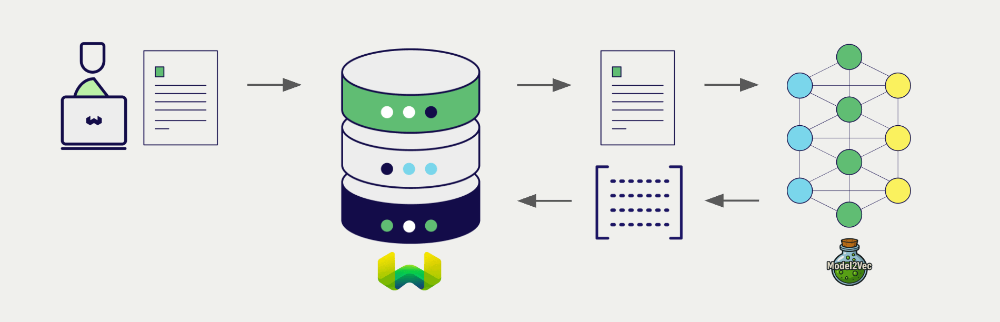
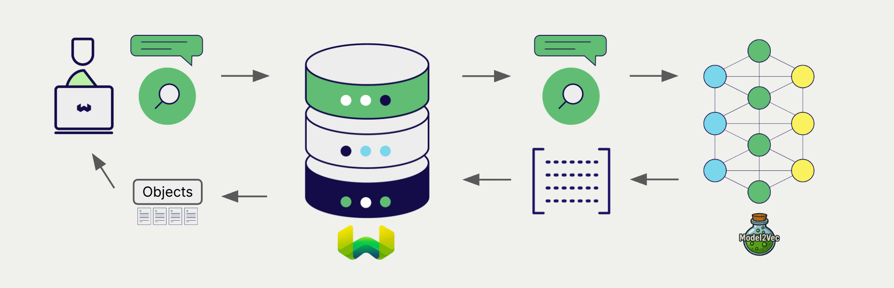

:::info Added in `v1.31.0`
:::

# Model2Vec Embeddings with Weaviate


import Tabs from '@theme/Tabs';
import TabItem from '@theme/TabItem';
import FilteredTextBlock from '@site/src/components/Documentation/FilteredTextBlock';
import PyConnect from '!!raw-loader!../_includes/provider.connect.local.py';
import TSConnect from '!!raw-loader!../_includes/provider.connect.local.ts';
import PyCode from '!!raw-loader!../_includes/provider.vectorizer.py';
import TSCode from '!!raw-loader!../_includes/provider.vectorizer.ts';

Weaviate's integration with Model2Vec's models allows you to access their models' capabilities directly from Weaviate.

[Configure a Weaviate vector index](#configure-the-vectorizer) to use an Model2Vec embedding model, and Weaviate will generate embeddings for various operations using the specified model via the Model2Vec inference container. This feature is called the *vectorizer*.

At [import time](#data-import), Weaviate generates text object embeddings and saves them into the index. For [vector](#vector-near-text-search) and [hybrid](#hybrid-search) search operations, Weaviate converts text queries into embeddings.



## Requirements

### Weaviate configuration

Your Weaviate instance must be configured with the Model2Vec vectorizer integration (`text2vec-model2vec`) module.

<details>
  <summary>For Weaviate Cloud (WCD) users</summary>

This integration is not available for Weaviate Cloud (WCD) serverless instances, as it requires a locally running Model2Vec instance.

</details>

<details>
  <summary>For self-hosted users</summary>

- Check the [cluster metadata](/deploy/configuration/meta.md) to verify if the module is enabled.
- Follow the [how-to configure modules](../../configuration/modules.md) guide to enable the module in Weaviate.

</details>

#### Configure the integration

To use this integration, you must configure the container image of the Model2Vec model, and the inference endpoint of the containerized model.

The following example shows how to configure the Model2Vec integration in Weaviate:

<Tabs groupId="languages">
<TabItem value="docker" label="Docker">

#### Docker Option 1: Use a pre-configured `docker-compose.yml` file

Follow the instructions on the [Weaviate Docker installation configurator](/deploy/installation-guides/docker-installation.md#configurator) to download a pre-configured `docker-compose.yml` file with a selected model
<br/>

#### Docker Option 2: Add the configuration manually

Alternatively, add the configuration to the `docker-compose.yml` file manually as in the example below.

```yaml
services:
  weaviate:
    # Other Weaviate configuration
    environment:
      MODEL2VEC_INFERENCE_API: http://text2vec-model2vec:8080  # Set the inference API endpoint
  text2vec-model2vec:  # Set the name of the inference container
    image: cr.weaviate.io/semitechnologies/model2vec-inference:minishlab-potion-base-32M
```

- `MODEL2VEC_INFERENCE_API` environment variable sets the inference API endpoint
- `text2vec-model2vec` is the name of the inference container
- `image` is the container image

</TabItem>
<TabItem value="k8s" label="Kubernetes">

Configure the Model2Vec integration in Weaviate by adding or updating the `text2vec-model2vec` module in the `modules` section of the Weaviate Helm chart values file. For example, modify the `values.yaml` file as follows:

```yaml
modules:

  text2vec-model2vec:

    enabled: true
    tag: minishlab-potion-base-8M
    repo: semitechnologies/model2vec-inference
    registry: cr.weaviate.io
```

See the [Weaviate Helm chart](https://github.com/weaviate/weaviate-helm/blob/master/weaviate/values.yaml) for an example of the `values.yaml` file including more configuration options.

</TabItem>
</Tabs>

### Credentials

As this integration connects to a local Model2Vec container, no additional credentials (e.g. API key) are required. Connect to Weaviate as usual, such as in the examples below.

<Tabs groupId="languages">

 <TabItem value="py" label="Python API v4">
    <FilteredTextBlock
      text={PyConnect}
      startMarker="# START BasicInstantiation"
      endMarker="# END BasicInstantiation"
      language="py"
    />
  </TabItem>

 <TabItem value="js" label="JS/TS API v3">
    <FilteredTextBlock
      text={TSConnect}
      startMarker="// START BasicInstantiation"
      endMarker="// END BasicInstantiation"
      language="ts"
    />
  </TabItem>

</Tabs>

## Configure the vectorizer

[Configure a Weaviate index](../../manage-collections/vector-config.mdx#specify-a-vectorizer) as follows to use a Model2Vec embedding model:

<Tabs groupId="languages">
  <TabItem value="py" label="Python API v4">
    <FilteredTextBlock
      text={PyCode}
      startMarker="# START BasicVectorizerModel2Vec"
      endMarker="# END BasicVectorizerModel2Vec"
      language="py"
    />
  </TabItem>

  <TabItem value="js" label="JS/TS API v3">
    <FilteredTextBlock
      text={TSCode}
      startMarker="// START BasicVectorizerModel2Vec"
      endMarker="// END BasicVectorizerModel2Vec"
      language="ts"
    />
  </TabItem>

</Tabs>

Note that for this integration, you specify the model to be used in the Weaviate configuration file.

import VectorizationBehavior from '/_includes/vectorization.behavior.mdx';

<details>
  <summary>Vectorization behavior</summary>

<VectorizationBehavior/>

</details>

## Data import

After configuring the vectorizer, [import data](../../manage-objects/import.mdx) into Weaviate. Weaviate generates embeddings for text objects using the specified model.

<Tabs groupId="languages">

 <TabItem value="py" label="Python API v4">
    <FilteredTextBlock
      text={PyCode}
      startMarker="# START BatchImportExample"
      endMarker="# END BatchImportExample"
      language="py"
    />
  </TabItem>

 <TabItem value="js" label="JS/TS API v3">
    <FilteredTextBlock
      text={TSCode}
      startMarker="// START BatchImportExample"
      endMarker="// END BatchImportExample"
      language="ts"
    />
  </TabItem>

</Tabs>

:::tip Re-use existing vectors
If you already have a compatible model vector available, you can provide it directly to Weaviate. This can be useful if you have already generated embeddings using the same model and want to use them in Weaviate, such as when migrating data from another system.
:::

## Searches

Once the vectorizer is configured, Weaviate will perform vector and hybrid search operations using the specified Model2Vec model.



### Vector (near text) search

When you perform a [vector search](../../search/similarity.md#search-with-text), Weaviate converts the text query into an embedding using the specified model and returns the most similar objects from the database.

The query below returns the `n` most similar objects from the database, set by `limit`.

<Tabs groupId="languages">

 <TabItem value="py" label="Python API v4">
    <FilteredTextBlock
      text={PyCode}
      startMarker="# START NearTextExample"
      endMarker="# END NearTextExample"
      language="py"
    />
  </TabItem>

 <TabItem value="js" label="JS/TS API v3">
    <FilteredTextBlock
      text={TSCode}
      startMarker="// START NearTextExample"
      endMarker="// END NearTextExample"
      language="ts"
    />
  </TabItem>

</Tabs>

### Hybrid search

:::info What is a hybrid search?
A hybrid search performs a vector search and a keyword (BM25) search, before [combining the results](../../search/hybrid.md) to return the best matching objects from the database.
:::

When you perform a [hybrid search](../../search/hybrid.md), Weaviate converts the text query into an embedding using the specified model and returns the best scoring objects from the database.

The query below returns the `n` best scoring objects from the database, set by `limit`.

<Tabs groupId="languages">

 <TabItem value="py" label="Python API v4">
    <FilteredTextBlock
      text={PyCode}
      startMarker="# START HybridExample"
      endMarker="# END HybridExample"
      language="py"
    />
  </TabItem>

 <TabItem value="js" label="JS/TS API v3">
    <FilteredTextBlock
      text={TSCode}
      startMarker="// START HybridExample"
      endMarker="// END HybridExample"
      language="ts"
    />
  </TabItem>

</Tabs>

## References

<!-- #### Example configuration -->

<!-- Hiding "full" examples as no other parameters exist than shown above -->

<!-- <Tabs groupId="languages">
  <TabItem value="py" label="Python API v4">
    <FilteredTextBlock
      text={PyCode}
      startMarker="# START FullVectorizerModel2Vec"
      endMarker="# END FullVectorizerModel2Vec"
      language="py"
    />
  </TabItem>

  <TabItem value="js" label="JS/TS API v3">
    <FilteredTextBlock
      text={TSCode}
      startMarker="// START FullVectorizerModel2Vec"
      endMarker="// END FullVectorizerModel2Vec"
      language="ts"
    />
  </TabItem>

</Tabs> -->

### Available models

For the latest list of available models, see the Docker Hub tags for the [model2vec-inference](https://hub.docker.com/r/semitechnologies/model2vec-inference/tags) container.

## Further resources

### Code examples

Once the integrations are configured at the collection, the data management and search operations in Weaviate work identically to any other collection. See the following model-agnostic examples:

- The [How-to: Manage collections](../../manage-collections/index.mdx) and [How-to: Manage objects](../../manage-objects/index.mdx) guides show how to perform data operations (i.e. create, read, update, delete collections and objects within them).
- The [How-to: Query & Search](../../search/index.mdx) guides show how to perform search operations (i.e. vector, keyword, hybrid) as well as retrieval augmented generation.

### External resources

- [Model2Vec documentation](https://minish.ai/packages/model2vec/introduction)

## Questions and feedback

import DocsFeedback from '/_includes/docs-feedback.mdx';

<DocsFeedback/>
