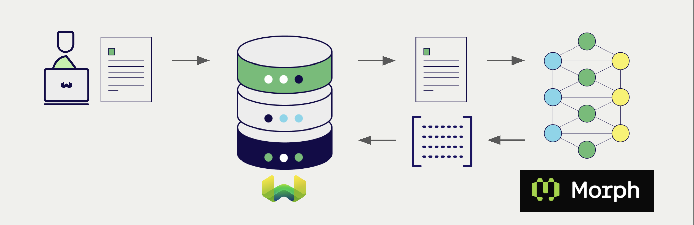
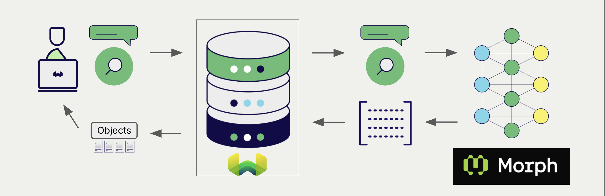

# Morph Embeddings with Weaviate

import Tabs from '@theme/Tabs';
import TabItem from '@theme/TabItem';
import FilteredTextBlock from '@site/src/components/Documentation/FilteredTextBlock';
import PyConnect from '!!raw-loader!../_includes/provider.connect.py';
import TSConnect from '!!raw-loader!../_includes/provider.connect.ts';
import PyCode from '!!raw-loader!../_includes/provider.vectorizer.py';
import TSCode from '!!raw-loader!../_includes/provider.vectorizer.ts';
import JavaV6Code from "!!raw-loader!/_includes/code/java-v6/src/test/java/ModelProvidersTest.java";
import CSharpCode from "!!raw-loader!/_includes/code/csharp/ModelProvidersTest.cs";

Weaviate's integration with [Morph's API](https://docs.morphllm.com/) lets you access Morph-hosted embedding models directly from Weaviate.

[Configure a Weaviate vector index](#configure-the-vectorizer) to use a Morph embedding model, and Weaviate generates embeddings for imports and searches automatically using your Morph API key. This is the *vectorizer*.

At [import time](#data-import), Weaviate generates text object embeddings and saves them into the index. For [vector](#vector-near-text-search) and [hybrid](#hybrid-search) search operations, Weaviate converts text queries into embeddings.



:::caution Morph lists the Embedding API as legacy
Morph's own documentation labels the Embedding API as legacy and planned for deprecation. Check the current status in [Morph's documentation](https://docs.morphllm.com/) before you build on this integration.
:::

## Requirements

### Weaviate configuration

Your Weaviate instance must have the `text2vec-morph` module enabled. The module is available in Weaviate `v1.32.6` and later.

<details>
  <summary>For Weaviate Cloud (WCD) users</summary>

This integration is enabled by default on Weaviate Cloud (WCD) instances.

</details>

<details>
  <summary>For self-hosted users</summary>

- Check the [cluster metadata](/deploy/configuration/status.md#cluster-metadata) to verify if the module is enabled.
- Follow the [how-to configure modules](../../configuration/modules.md) guide to enable the module in Weaviate.

</details>

### API credentials {#api-credentials}

You must provide a Morph API key to Weaviate for this integration. Generate one in the [Morph dashboard](https://morphllm.com/) and supply it via one of:

- Set the `MORPH_APIKEY` environment variable on the Weaviate server.
- Provide the `X-Openai-Api-Key` header at request time, as shown below.

Weaviate builds Morph requests with its OpenAI-compatible client, so the request header is `X-Openai-Api-Key`. There is no Morph-specific header. A key provided in the header takes precedence over the server environment variable.

:::caution The missing-key error names the wrong environment variable
When no key is available, Weaviate reports:

```
no api key found neither in request header: X-Openai-Api-Key nor in environment variable under OPENAI_APIKEY
```

The header name in that message is correct, but the environment variable name is not. This integration reads `MORPH_APIKEY`. Setting `OPENAI_APIKEY` does not make it work.
:::

<Tabs className="code" groupId="languages">
  <TabItem value="py" label="Python">
    <FilteredTextBlock
      text={PyConnect}
      startMarker="# START MorphInstantiation"
      endMarker="# END MorphInstantiation"
      language="py"
    />
  </TabItem>
  <TabItem value="ts" label="JavaScript/TypeScript">
    <FilteredTextBlock
      text={TSConnect}
      startMarker="// START MorphInstantiation"
      endMarker="// END MorphInstantiation"
      language="ts"
    />
  </TabItem>
  <TabItem value="java" label="Java">
    <FilteredTextBlock
      text={JavaV6Code}
      startMarker="// START MorphInstantiation"
      endMarker="// END MorphInstantiation"
      language="java"
    />
  </TabItem>
  <TabItem value="csharp" label="C#">
    <FilteredTextBlock
      text={CSharpCode}
      startMarker="// START MorphInstantiation"
      endMarker="// END MorphInstantiation"
      language="csharp"
    />
  </TabItem>
</Tabs>

:::note One header serves two integrations
`X-Openai-Api-Key` is also the header for the [OpenAI integration](../openai/embeddings.md). A single request therefore cannot carry different keys for the two integrations. If you use both in the same instance, set the server environment variables instead so each integration gets its own key.
:::

## Configure the vectorizer

[Configure a Weaviate index](../../manage-collections/vector-config.mdx#specify-a-vectorizer) to use a Morph embedding model by setting the vectorizer as follows:

<Tabs className="code" groupId="languages">
  <TabItem value="py" label="Python">
    <FilteredTextBlock
      text={PyCode}
      startMarker="# START BasicVectorizerMorph"
      endMarker="# END BasicVectorizerMorph"
      language="py"
    />
  </TabItem>
  <TabItem value="ts" label="JavaScript/TypeScript">
    <FilteredTextBlock
      text={TSCode}
      startMarker="// START BasicVectorizerMorph"
      endMarker="// END BasicVectorizerMorph"
      language="ts"
    />
  </TabItem>
  <TabItem value="java" label="Java">
    <FilteredTextBlock
      text={JavaV6Code}
      startMarker="// START BasicVectorizerMorph"
      endMarker="// END BasicVectorizerMorph"
      language="java"
    />
  </TabItem>
  <TabItem value="csharp" label="C#">
    <FilteredTextBlock
      text={CSharpCode}
      startMarker="// START BasicVectorizerMorph"
      endMarker="// END BasicVectorizerMorph"
      language="csharp"
    />
  </TabItem>
</Tabs>

import VectorizationBehavior from '/_includes/vectorization.behavior.mdx';

<details>
  <summary>Vectorization behavior</summary>

<VectorizationBehavior/>

</details>

### Vectorizer parameters

- `model`: The Morph model id. Defaults to `morph-embedding-v3`.
- `baseURL`: The scheme and host that requests are sent to. Defaults to `https://api.morphllm.com`.
- `endpoint`: The API path that Weaviate appends to the base URL. Defaults to `/v1/embeddings`. Set it if the service you target uses a different path.

For how Weaviate combines `baseURL` and `endpoint` into a request URL, see [Header parameters](#header-parameters).

:::info `endpoint` availability
Added in `v1.38.2` (backported to `v1.36.19` and `v1.37.10`).
:::

Weaviate stores `baseURL` and `model` in the collection configuration even when you do not set them, because the module supplies a default for each. `endpoint` is different: it appears in the stored configuration only when you set it explicitly. If you read a collection back and see no `endpoint`, the default path applies.

No `dimensions` parameter is sent, so the embedding dimension is always the model's native size.

#### Example configuration

The following examples set the Morph-specific options. Client libraries do not all expose the same options, so each example shows what that client supports.

<Tabs className="code" groupId="languages">
  <TabItem value="py" label="Python">
    <FilteredTextBlock
      text={PyCode}
      startMarker="# START FullVectorizerMorph"
      endMarker="# END FullVectorizerMorph"
      language="py"
    />
  </TabItem>
  <TabItem value="ts" label="JavaScript/TypeScript">
    <FilteredTextBlock
      text={TSCode}
      startMarker="// START FullVectorizerMorph"
      endMarker="// END FullVectorizerMorph"
      language="ts"
    />
  </TabItem>
  <TabItem value="java" label="Java">
    <FilteredTextBlock
      text={JavaV6Code}
      startMarker="// START FullVectorizerMorph"
      endMarker="// END FullVectorizerMorph"
      language="java"
    />
  </TabItem>
  <TabItem value="csharp" label="C#">
    <FilteredTextBlock
      text={CSharpCode}
      startMarker="// START FullVectorizerMorph"
      endMarker="// END FullVectorizerMorph"
      language="csharp"
    />
  </TabItem>
</Tabs>

## Header parameters

You can provide the API key and the base URL at runtime through headers. Headers provided at request time take precedence over the collection configuration and over the server environment variable:

- `X-Openai-Api-Key`: The Morph API key for this request.
- `X-Openai-Baseurl`: The base URL to use instead of the default.

Provide the headers as shown in the [API credentials examples](#api-credentials) above.

:::note How Weaviate builds the request URL

Weaviate builds the request URL by appending the `endpoint` path (`/v1/embeddings` by default) to the base URL. The base URL supplies the scheme and host; `endpoint` supplies only the path. A value in `endpoint` cannot redirect requests to a different host.

If a base URL already carries a path, that path is kept and the `endpoint` path is appended to it.

There is no header that overrides `endpoint`. Set it in the collection configuration.

:::

:::note Error messages name the OpenAI API
Because Weaviate uses its OpenAI-compatible client for this integration, upstream failures are reported as `connection to: OpenAI API failed with status: ...` even when the request was sent to Morph.
:::

## Data import

After configuring the vectorizer, [import data](../../manage-objects/import.mdx) into Weaviate. Weaviate generates embeddings for text objects using [the configured model](#vectorizer-parameters).

:::tip Re-use existing vectors
If you already have a compatible model vector available, you can provide it directly to Weaviate. This can be useful if you have already generated embeddings using the same model and want to use them in Weaviate, such as when migrating data from another system.
:::

## Searches

Once the vectorizer is configured, Weaviate performs vector and hybrid searches using the specified Morph model.



### Vector (near text) search {#vector-near-text-search}

When you perform a [vector search](../../search/similarity.md#search-with-text), Weaviate converts the text query into an embedding using the configured Morph model and returns the most similar objects.

### Hybrid search {#hybrid-search}

When you perform a [hybrid search](../../search/hybrid.md), Weaviate fuses keyword and vector ranking. The text query is embedded with the configured Morph model; the keyword side uses Weaviate's inverted index.

## References

### Available models

Weaviate does not restrict which model id you can set, so any model the Morph API accepts can be used. `morph-embedding-v3` is the default. Morph's [list models endpoint](https://docs.morphllm.com/api-reference/endpoint/models) returns the model ids your key can use. Check it before you rely on a model id, as availability and dimensions can change.

## Further resources

### Other integrations

- [Weaviate model providers overview](../index.md)

### Code examples

Once the vectorizer is configured, Weaviate handles model inference transparently. The standard [client library how-tos](../../client-libraries/index.mdx) apply unchanged. No Morph-specific code is required at query or import time beyond the configuration shown above.

## Questions and feedback

import DocsFeedback from '/_includes/docs-feedback.mdx';

<DocsFeedback/>
