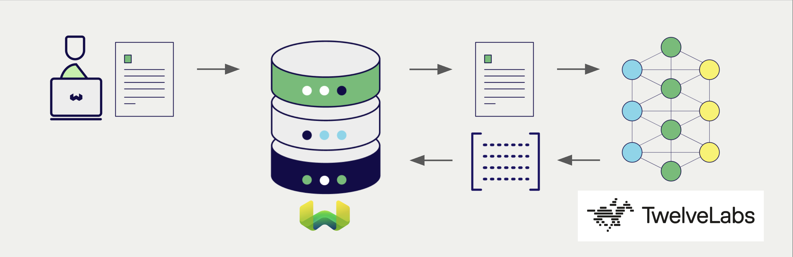
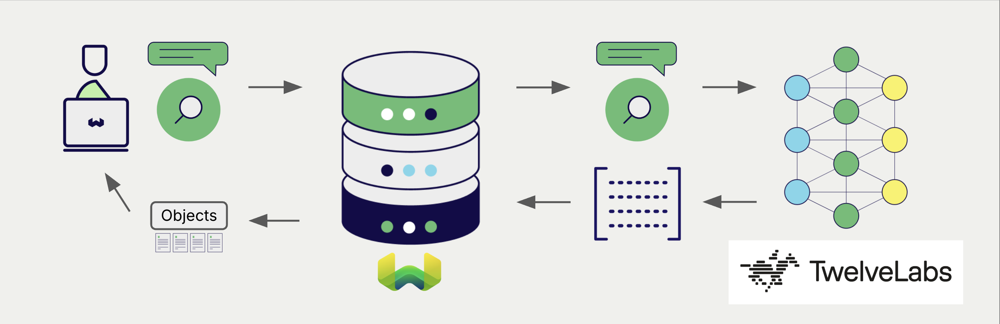

# TwelveLabs Multimodal Embeddings with Weaviate

import Tabs from '@theme/Tabs';
import TabItem from '@theme/TabItem';
import FilteredTextBlock from '@site/src/components/Documentation/FilteredTextBlock';
import PyConnect from '!!raw-loader!../_includes/provider.connect.py';
import PyCode from '!!raw-loader!../_includes/provider.vectorizer.py';

Weaviate's integration with TwelveLabs' APIs allows you to access their models' capabilities directly from Weaviate.

[Configure a Weaviate vector index](#configure-the-vectorizer) to use a TwelveLabs embedding model, and Weaviate will generate embeddings for various operations using the specified model and your TwelveLabs API key. This feature is called the *vectorizer*.

At [import time](#data-import), Weaviate generates multimodal object embeddings and saves them into the index. For [vector](#vector-near-text-search) and [hybrid](#hybrid-search) search operations, Weaviate converts text queries into embeddings. [Multimodal search operations](#vector-near-image-search) are also supported.

:::caution Text and images only
TwelveLabs is best known for video understanding, but this integration vectorizes **text and images only**. Video and audio are not supported.

The vectorizer reads only the `textFields` and `imageFields` settings, and only `nearText` and `nearImage` search operations are available. Weaviate stores a `videoFields` entry if you add one to a collection definition, but nothing reads it, so it has no effect.
:::



## Requirements

### Weaviate configuration

Your Weaviate instance must be configured with the TwelveLabs vectorizer integration (`multi2vec-twelvelabs`) module.

:::info Added in `v1.38.9`
This integration is available in Weaviate `v1.38.9`, `v1.39.0` and later.
:::

<details>
  <summary>For Weaviate Cloud (WCD) users</summary>

This integration is enabled by default on Weaviate Cloud (WCD) instances.

</details>

<details>
  <summary>For self-hosted users</summary>

- Check the [cluster metadata](/deploy/configuration/status.md#cluster-metadata) to verify if the module is enabled.
- Follow the [how-to configure modules](../../configuration/modules.md) guide to enable the module in Weaviate.

</details>

### API credentials

You must provide a valid TwelveLabs API key to Weaviate for this integration. Go to [TwelveLabs](https://www.twelvelabs.io/) to sign up and obtain an API key.

Provide the API key to Weaviate using one of the following methods:

- Set the `TWELVELABS_APIKEY` environment variable that is available to Weaviate.
- Provide the API key at runtime, as shown in the examples below.

<Tabs className="code" groupId="languages">

 <TabItem value="py" label="Python">
    <FilteredTextBlock
      text={PyConnect}
      startMarker="# START TwelveLabsInstantiation"
      endMarker="# END TwelveLabsInstantiation"
      language="py"
    />
  </TabItem>

  <TabItem value="curl" label="cURL">

```bash
curl http://localhost:8080/v1/graphql \
  -H "Content-Type: application/json" \
  -H "X-Twelvelabs-Api-Key: $TWELVELABS_APIKEY" \
  -H "X-Twelvelabs-Baseurl: https://api.twelvelabs.io/v1.3" \
  -d '{"query": "{ Get { DemoCollection(nearText: {concepts: [\"A holiday film\"]}, limit: 2) { title } } }"}'
```

  </TabItem>

</Tabs>

The `X-Twelvelabs-Baseurl` header is optional. It overrides the base URL that is set in the collection definition for the duration of the request.

## Configure the vectorizer

[Configure a Weaviate index](../../manage-collections/vector-config.mdx#specify-a-vectorizer) as follows to use a TwelveLabs embedding model.

Name the properties that hold your text in `textFields`, and the properties that hold your base64 encoded images in `imageFields`. Set at least one of the two. A collection that names no fields cannot produce a vector, and inserts into it fail with a `more than one embedding found for object` error.

<Tabs className="code" groupId="languages">
  <TabItem value="py" label="Python">
    <FilteredTextBlock
      text={PyCode}
      startMarker="# START BasicMMVectorizerTwelveLabs"
      endMarker="# END BasicMMVectorizerTwelveLabs"
      language="py"
    />
  </TabItem>

  <TabItem value="curl" label="cURL">

```bash
curl -X POST http://localhost:8080/v1/schema \
  -H "Content-Type: application/json" \
  -d '{
    "class": "DemoCollection",
    "properties": [
      {"name": "title", "dataType": ["text"]},
      {"name": "poster", "dataType": ["blob"]}
    ],
    "vectorConfig": {
      "title_vector": {
        "vectorizer": {
          "multi2vec-twelvelabs": {
            "textFields": ["title"],
            "imageFields": ["poster"],
            "weights": {
              "textFields": [0.1],
              "imageFields": [0.9]
            }
          }
        },
        "vectorIndexType": "hnsw"
      }
    }
  }'
```

  </TabItem>

</Tabs>

:::info Client availability
A typed configuration API for this integration is currently available in the Python client only. If `Configure.Vectors.multi2vec_twelvelabs` is missing from your installation, upgrade to the latest Python client version.

With any other client library, configure the vectorizer by sending the collection definition as shown in the cURL example above, or by passing the equivalent module configuration map that your client accepts. Data import and search operations are not specific to this integration and work with every client library.
:::

### Select a model

You can specify one of the [available models](#available-models) for the vectorizer to use, as shown in the following configuration example.

<Tabs className="code" groupId="languages">
  <TabItem value="py" label="Python">
    <FilteredTextBlock
      text={PyCode}
      startMarker="# START MMVectorizerTwelveLabsCustomModel"
      endMarker="# END MMVectorizerTwelveLabsCustomModel"
      language="py"
    />
  </TabItem>

  <TabItem value="curl" label="cURL">

```bash
curl -X POST http://localhost:8080/v1/schema \
  -H "Content-Type: application/json" \
  -d '{
    "class": "DemoCollection",
    "properties": [
      {"name": "title", "dataType": ["text"]},
      {"name": "poster", "dataType": ["blob"]}
    ],
    "vectorConfig": {
      "title_vector": {
        "vectorizer": {
          "multi2vec-twelvelabs": {
            "textFields": ["title"],
            "imageFields": ["poster"],
            "model": "marengo3.0"
          }
        },
        "vectorIndexType": "hnsw"
      }
    }
  }'
```

  </TabItem>

</Tabs>

You can [specify](#vectorizer-parameters) one of the [available models](#available-models) for Weaviate to use. The [default model](#available-models) is used if no model is specified.

import VectorizationBehavior from '/_includes/vectorization.behavior.mdx';

<details>
  <summary>Vectorization behavior</summary>

<VectorizationBehavior/>

</details>

### Vectorizer parameters

The following examples show how to configure TwelveLabs-specific options.

<Tabs className="code" groupId="languages">
  <TabItem value="py" label="Python">
    <FilteredTextBlock
      text={PyCode}
      startMarker="# START FullMMVectorizerTwelveLabs"
      endMarker="# END FullMMVectorizerTwelveLabs"
      language="py"
    />
  </TabItem>

  <TabItem value="curl" label="cURL">

```bash
curl -X POST http://localhost:8080/v1/schema \
  -H "Content-Type: application/json" \
  -d '{
    "class": "DemoCollection",
    "properties": [
      {"name": "title", "dataType": ["text"]},
      {"name": "poster", "dataType": ["blob"]}
    ],
    "vectorConfig": {
      "title_vector": {
        "vectorizer": {
          "multi2vec-twelvelabs": {
            "textFields": ["title"],
            "imageFields": ["poster"],
            "weights": {
              "textFields": [0.1],
              "imageFields": [0.9]
            },
            "model": "marengo3.0",
            "baseURL": "https://api.twelvelabs.io/v1.3"
          }
        },
        "vectorIndexType": "hnsw"
      }
    }
  }'
```

  </TabItem>

</Tabs>

The collection definition accepts the following settings:

| Setting | Description |
| --- | --- |
| `textFields` | Names of the `text` and `text[]` properties to vectorize. Each element of a `text[]` property is vectorized separately. |
| `imageFields` | Names of the properties that hold base64 encoded images, typically `blob` properties. A `text[]` property listed here is ignored. |
| `weights` | Relative weights for combining the field vectors, given as `textFields` and `imageFields` arrays. Each array must have the same number of entries as the field list it weights. The weights are normalized so that they sum to 1. If no weights are set, all fields are weighted equally. |
| `model` | The model to use. The default is `marengo3.0`. |
| `baseURL` | The base URL of the TwelveLabs API. The default is `https://api.twelvelabs.io/v1.3`. |

In the Python client, these settings are named `text_fields`, `image_fields`, `model` and `base_url`. Weights are set per field with `Multi2VecField(name=..., weight=...)`.

:::note Settings that have no effect
Weaviate writes a `vectorizeClassName` setting into every collection that uses this integration, but this integration does not read it. Its value does not change the vectors that are produced, and the collection name is never included in the vectorized text.

The per-property `skip` and `vectorizePropertyName` settings also have no effect here. Property selection is determined only by `textFields` and `imageFields` membership, and property names are never vectorized.
:::

For further details on model parameters, see the [TwelveLabs documentation](https://docs.twelvelabs.io/).

## Data import

After configuring the vectorizer, [import data](../../manage-objects/import.mdx) into Weaviate. Weaviate generates embeddings for text and image objects using the specified model.

Provide image data as a base64 encoded string. A `data:<mediatype>;base64,` prefix is accepted and stripped before decoding. A property that is listed in `imageFields` but does not hold valid base64 data fails the import with a `decode base64 image` error.

<Tabs className="code" groupId="languages">

 <TabItem value="py" label="Python">
    <FilteredTextBlock
      text={PyCode}
      startMarker="# START MMBatchImportExample"
      endMarker="# END MMBatchImportExample"
      language="py"
    />
  </TabItem>

</Tabs>

:::warning This integration is not rate limited
Weaviate does not throttle its requests to TwelveLabs for this integration, and it does not read rate limit response headers. It sends one request per text value and one request per image, and it processes batches of ten objects in parallel, so a large import can produce a high request rate.

If TwelveLabs rejects a request, the error surfaces as a failed import for that object and is not retried. Pace large imports from the client side, for example by importing in smaller batches.
:::

:::tip Re-use existing vectors
If you already have a compatible model vector available, you can provide it directly to Weaviate. This can be useful if you have already generated embeddings using the same model and want to use them in Weaviate, such as when migrating data from another system.
:::

## Searches

Once the vectorizer is configured, Weaviate will perform vector and hybrid search operations using the specified TwelveLabs model.



The examples below use the Python client. Search operations are not specific to this integration, so see the [How-to: Query & Search](../../search/index.mdx) guides for the equivalent examples in the other client libraries.

### Vector (near text) search

When you perform a [vector search](../../search/similarity.md#search-with-text), Weaviate converts the text query into an embedding using the specified model and returns the most similar objects from the database.

The query below returns the `n` most similar objects from the database, set by `limit`.

<Tabs className="code" groupId="languages">

 <TabItem value="py" label="Python">
    <FilteredTextBlock
      text={PyCode}
      startMarker="# START NearTextExample"
      endMarker="# END NearTextExample"
      language="py"
    />
  </TabItem>

</Tabs>

### Hybrid search

:::info What is a hybrid search?
A hybrid search performs a vector search and a keyword (BM25) search, before [combining the results](../../search/hybrid.md#change-the-fusion-method) to return the best matching objects from the database.
:::

When you perform a [hybrid search](../../search/hybrid.md), Weaviate converts the text query into an embedding using the specified model and returns the best scoring objects from the database.

The query below returns the `n` best scoring objects from the database, set by `limit`.

<Tabs className="code" groupId="languages">

 <TabItem value="py" label="Python">
    <FilteredTextBlock
      text={PyCode}
      startMarker="# START HybridExample"
      endMarker="# END HybridExample"
      language="py"
    />
  </TabItem>

</Tabs>

### Vector (near image) search

When you perform a [near image search](../../search/similarity.md#search-with-image), Weaviate converts the query into an embedding using the specified model and returns the most similar objects from the database.

To perform a near image search, convert the image query into a base64 string and pass it to the search query.

The query below returns the `n` most similar objects to the input image from the database, set by `limit`.

<Tabs className="code" groupId="languages">

 <TabItem value="py" label="Python">
    <FilteredTextBlock
      text={PyCode}
      startMarker="# START NearImageExample"
      endMarker="# END NearImageExample"
      language="py"
    />
  </TabItem>

</Tabs>

## References

### Available models

The default model is `marengo3.0`, which produces 512-dimensional vectors.

Weaviate does not validate the model name, so you can set any model that the TwelveLabs embedding endpoint accepts for your account. Weaviate does not publish the list of accepted names; see the [TwelveLabs documentation on creating embeddings](https://docs.twelvelabs.io/v1.3/docs/guides/create-embeddings) for the models that are currently available.

## Further resources

### Code examples

Once the integrations are configured at the collection, the data management and search operations in Weaviate work identically to any other collection. See the following model-agnostic examples:

- The [How-to: Manage collections](../../manage-collections/index.mdx) and [How-to: Manage objects](../../manage-objects/index.mdx) guides show how to perform data operations (i.e. create, read, update, delete collections and objects within them).
- The [How-to: Query & Search](../../search/index.mdx) guides show how to perform search operations (i.e. vector, keyword, hybrid) as well as retrieval augmented generation.

### External resources

- [TwelveLabs documentation](https://docs.twelvelabs.io/)

## Questions and feedback

import DocsFeedback from '/_includes/docs-feedback.mdx';

<DocsFeedback/>
