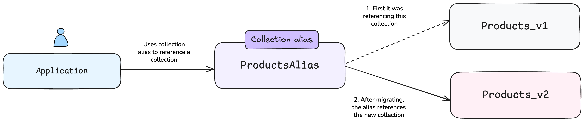

import SkipLink from "/src/components/SkipValidationLink";
import Tabs from "@theme/Tabs";
import TabItem from "@theme/TabItem";
import FilteredTextBlock from "@site/src/components/Documentation/FilteredTextBlock";
import PyCode from "!!raw-loader!/_includes/code/howto/manage-data.aliases.py";
import TSCode from "!!raw-loader!/_includes/code/howto/manage-data.aliases.ts";
import GoCode from "!!raw-loader!/_includes/code/howto/go/docs/manage-data.aliases_test.go";
import JavaV6Code from "!!raw-loader!/_includes/code/java-v6/src/test/java/ManageCollectionsAliasTest.java";
import CSharpCode from "!!raw-loader!/_includes/code/csharp/ManageCollectionsAliasTest.cs";
import JavaCode from "!!raw-loader!/_includes/code/howto/java/src/test/java/io/weaviate/docs/manage-data.collection-aliases.java";

In this tutorial, we will explore how to use **collection aliases** in Weaviate to perform zero-downtime migrations. Collection aliases are alternative names for Weaviate collections that allow you to reference a collection by multiple names. This powerful feature enables you to migrate to new collection schemas, update configurations, or reorganize your data without any service interruption.

## Prerequisites

Before starting this tutorial, ensure you have the following:

- An instance of Weaviate (e.g. on [Weaviate Cloud](/go/console?utm_content=tutorial), or locally), version `v1.32` or newer.
- Your preferred Weaviate [client library](../client-libraries/index.mdx) installed.
- Basic familiarity with Weaviate collections and data import.

:::tip See the Quickstart guide

For information on how to set up Weaviate and install the client library, see the [cloud](../quickstart/index.md) or [local](../quickstart/local.md) Quickstart guide.

:::

## Introduction

Traditional collection migrations require significant downtime. The typical workflow involves:

1. Creating a new collection
2. Stopping your application
3. Migrating data
4. Updating all collection references in your code
5. Restarting your application

This process causes service interruption and requires code changes. With aliases, you can eliminate both issues.

### What are collection aliases?

A collection alias is a pointer to an underlying collection. When you query using an alias, Weaviate automatically routes the request to the target collection. Think of it like a symbolic link in a file system or a DNS alias for a website.

Collection aliases are ideal for **schema migrations** (updating properties or vectorization settings), **A/B testing**, and **disaster recovery**. They add minimal routing overhead and enable instant switching between collection versions without code changes.

import CollectionAliasUsage from "/_includes/collection-alias-usage.mdx";

<CollectionAliasUsage />

### How aliases enable zero-downtime migration

Aliases allow you to keep your application code unchanged as it references the stable alias name. You can switch between collections instantly and roll back quickly if needed.

The migration process becomes:

1. Create a new collection with updated schema
2. Migrate data (while the old collection serves traffic)
3. Update the alias to point to the new collection (instant switch)
4. Delete the old collection after verification

## Tutorial: Migrating a products collection

Let's walk through a complete migration scenario where we need to add a new field to an existing collection of products.

### Step 1: Connect to Weaviate

First, connect to your Weaviate instance using your preferred client library.

<Tabs className="code" groupId="languages">
  <TabItem value="py" label="Python">
    <FilteredTextBlock
      text={PyCode}
      startMarker="# START ConnectToWeaviate"
      endMarker="# END ConnectToWeaviate"
      language="py"
    />
  </TabItem>
  <TabItem value="ts" label="JavaScript/TypeScript">
    <FilteredTextBlock
      text={TSCode}
      startMarker="// START ConnectToWeaviate"
      endMarker="// END ConnectToWeaviate"
      language="ts"
    />
  </TabItem>
  <TabItem value="go" label="Go">
    <FilteredTextBlock
      text={GoCode}
      startMarker="// START ConnectToWeaviate"
      endMarker="// END ConnectToWeaviate"
      language="go"
    />
  </TabItem>
  <TabItem value="java6" label="Java v6">
    <FilteredTextBlock
      text={JavaV6Code}
      startMarker="// START ConnectToWeaviate"
      endMarker="// END ConnectToWeaviate"
      language="java"
    />
  </TabItem>
  <TabItem value="java" label="Java v5 (Deprecated)">
    <FilteredTextBlock
      text={JavaCode}
      startMarker="// START ConnectToWeaviate"
      endMarker="// END ConnectToWeaviate"
      language="java"
    />
  </TabItem>
  <TabItem value="csharp" label="C#">
    <FilteredTextBlock
      text={CSharpCode}
      startMarker="// START ConnectToWeaviate"
      endMarker="// END ConnectToWeaviate"
      language="csharp"
    />
  </TabItem>
</Tabs>

### Step 2: Create the original collection

Let's create our initial products collection and populate it with data.

<Tabs className="code" groupId="languages">
  <TabItem value="py" label="Python">
    <FilteredTextBlock
      text={PyCode}
      startMarker="# START Step1CreateOriginal"
      endMarker="# END Step1CreateOriginal"
      language="py"
    />
  </TabItem>
  <TabItem value="ts" label="JavaScript/TypeScript">
    <FilteredTextBlock
      text={TSCode}
      startMarker="// START Step1CreateOriginal"
      endMarker="// END Step1CreateOriginal"
      language="ts"
    />
  </TabItem>
  <TabItem value="go" label="Go">
    <FilteredTextBlock
      text={GoCode}
      startMarker="// START Step1CreateOriginal"
      endMarker="// END Step1CreateOriginal"
      language="go"
    />
  </TabItem>
  <TabItem value="java6" label="Java v6">
    <FilteredTextBlock
      text={JavaV6Code}
      startMarker="// START Step1CreateOriginal"
      endMarker="// END Step1CreateOriginal"
      language="java"
    />
  </TabItem>
  <TabItem value="java" label="Java v5 (Deprecated)">
    <FilteredTextBlock
      text={JavaCode}
      startMarker="// START Step1CreateOriginal"
      endMarker="// END Step1CreateOriginal"
      language="java"
    />
  </TabItem>
  <TabItem value="csharp" label="C#">
    <FilteredTextBlock
      text={CSharpCode}
      startMarker="// START Step1CreateOriginal"
      endMarker="// END Step1CreateOriginal"
      language="csharp"
    />
  </TabItem>
</Tabs>

### Step 3: Create an alias for production access

Now create an alias that your application will use. This decouples your application code from the specific collection version.

<Tabs className="code" groupId="languages">
  <TabItem value="py" label="Python">
    <FilteredTextBlock
      text={PyCode}
      startMarker="# START Step2CreateAlias"
      endMarker="# END Step2CreateAlias"
      language="py"
    />
  </TabItem>
  <TabItem value="ts" label="JavaScript/TypeScript">
    <FilteredTextBlock
      text={TSCode}
      startMarker="// START Step2CreateAlias"
      endMarker="// END Step2CreateAlias"
      language="ts"
    />
  </TabItem>
  <TabItem value="go" label="Go">
    <FilteredTextBlock
      text={GoCode}
      startMarker="// START Step2CreateAlias"
      endMarker="// END Step2CreateAlias"
      language="go"
    />
  </TabItem>
  <TabItem value="java6" label="Java v6">
    <FilteredTextBlock
      text={JavaV6Code}
      startMarker="// START Step2CreateAlias"
      endMarker="// END Step2CreateAlias"
      language="java"
    />
  </TabItem>
  <TabItem value="java" label="Java v5 (Deprecated)">
    <FilteredTextBlock
      text={JavaCode}
      startMarker="// START Step2CreateAlias"
      endMarker="// END Step2CreateAlias"
      language="java"
    />
  </TabItem>
  <TabItem value="csharp" label="C#">
    <FilteredTextBlock
      text={CSharpCode}
      startMarker="// START Step2CreateAlias"
      endMarker="// END Step2CreateAlias"
      language="csharp"
    />
  </TabItem>
</Tabs>

### Step 4: Use the alias in your application

Your application code should reference the alias, not the underlying collection. This ensures it continues working regardless of which collection version is active.

<Tabs className="code" groupId="languages">
  <TabItem value="py" label="Python">
    <FilteredTextBlock
      text={PyCode}
      startMarker="# START MigrationUseAlias"
      endMarker="# END MigrationUseAlias"
      language="py"
    />
  </TabItem>
  <TabItem value="ts" label="JavaScript/TypeScript">
    <FilteredTextBlock
      text={TSCode}
      startMarker="// START MigrationUseAlias"
      endMarker="// END MigrationUseAlias"
      language="ts"
    />
  </TabItem>
  <TabItem value="go" label="Go">
    <FilteredTextBlock
      text={GoCode}
      startMarker="// START MigrationUseAlias"
      endMarker="// END MigrationUseAlias"
      language="go"
    />
  </TabItem>
  <TabItem value="java6" label="Java v6">
    <FilteredTextBlock
      text={JavaV6Code}
      startMarker="// START MigrationUseAlias"
      endMarker="// END MigrationUseAlias"
      language="java"
    />
  </TabItem>
  <TabItem value="java" label="Java v5 (Deprecated)">
    <FilteredTextBlock
      text={JavaCode}
      startMarker="// START MigrationUseAlias"
      endMarker="// END MigrationUseAlias"
      language="java"
    />
  </TabItem>
  <TabItem value="csharp" label="C#">
    <FilteredTextBlock
      text={CSharpCode}
      startMarker="// START MigrationUseAlias"
      endMarker="// END MigrationUseAlias"
      language="csharp"
    />
  </TabItem>
</Tabs>

The key point is that your application code doesn't need to know whether it's accessing `Products_v1` or `Products_v2` - it just uses the stable alias name.

### Step 5: Create the new collection with updated schema

Now let's create a new version of the collection with an additional field (e.g., adding a `category` property).

<Tabs className="code" groupId="languages">
  <TabItem value="py" label="Python">
    <FilteredTextBlock
      text={PyCode}
      startMarker="# START Step3NewCollection"
      endMarker="# END Step3NewCollection"
      language="py"
    />
  </TabItem>
  <TabItem value="ts" label="JavaScript/TypeScript">
    <FilteredTextBlock
      text={TSCode}
      startMarker="// START Step3NewCollection"
      endMarker="// END Step3NewCollection"
      language="ts"
    />
  </TabItem>
  <TabItem value="go" label="Go">
    <FilteredTextBlock
      text={GoCode}
      startMarker="// START Step3NewCollection"
      endMarker="// END Step3NewCollection"
      language="go"
    />
  </TabItem>
  <TabItem value="java6" label="Java v6">
    <FilteredTextBlock
      text={JavaV6Code}
      startMarker="// START Step3NewCollection"
      endMarker="// END Step3NewCollection"
      language="java"
    />
  </TabItem>
  <TabItem value="java" label="Java v5 (Deprecated)">
    <FilteredTextBlock
      text={JavaCode}
      startMarker="// START Step3NewCollection"
      endMarker="// END Step3NewCollection"
      language="java"
    />
  </TabItem>
  <TabItem value="csharp" label="C#">
    <FilteredTextBlock
      text={CSharpCode}
      startMarker="// START Step3NewCollection"
      endMarker="// END Step3NewCollection"
      language="csharp"
    />
  </TabItem>
</Tabs>

### Step 6: Migrate data to the new collection

Copy data from the old collection to the new one, adding default values for new fields or transforming data as needed.

<Tabs className="code" groupId="languages">
  <TabItem value="py" label="Python">
    <FilteredTextBlock
      text={PyCode}
      startMarker="# START Step4MigrateData"
      endMarker="# END Step4MigrateData"
      language="py"
    />
  </TabItem>
  <TabItem value="ts" label="JavaScript/TypeScript">
    <FilteredTextBlock
      text={TSCode}
      startMarker="// START Step4MigrateData"
      endMarker="// END Step4MigrateData"
      language="ts"
    />
  </TabItem>
  <TabItem value="go" label="Go">
    <FilteredTextBlock
      text={GoCode}
      startMarker="// START Step4MigrateData"
      endMarker="// END Step4MigrateData"
      language="go"
    />
  </TabItem>
  <TabItem value="java6" label="Java v6">
    <FilteredTextBlock
      text={JavaV6Code}
      startMarker="// START Step4MigrateData"
      endMarker="// END Step4MigrateData"
      language="java"
    />
  </TabItem>
  <TabItem value="java" label="Java v5 (Deprecated)">
    <FilteredTextBlock
      text={JavaCode}
      startMarker="// START Step4MigrateData"
      endMarker="// END Step4MigrateData"
      language="java"
    />
  </TabItem>
  <TabItem value="csharp" label="C#">
    <FilteredTextBlock
      text={CSharpCode}
      startMarker="// START Step4MigrateData"
      endMarker="// END Step4MigrateData"
      language="csharp"
    />
  </TabItem>
</Tabs>

### Step 7: Update the alias (instant switch)

This is the magic moment - update the alias to point to the new collection. This switch is instantaneous, and all queries using the `ProductsAlias` alias now access the new collection.

<Tabs className="code" groupId="languages">
  <TabItem value="py" label="Python">
    <FilteredTextBlock
      text={PyCode}
      startMarker="# START Step5UpdateAlias"
      endMarker="# END Step5UpdateAlias"
      language="py"
    />
  </TabItem>
  <TabItem value="ts" label="JavaScript/TypeScript">
    <FilteredTextBlock
      text={TSCode}
      startMarker="// START Step5UpdateAlias"
      endMarker="// END Step5UpdateAlias"
      language="ts"
    />
  </TabItem>
  <TabItem value="go" label="Go">
    <FilteredTextBlock
      text={GoCode}
      startMarker="// START Step5UpdateAlias"
      endMarker="// END Step5UpdateAlias"
      language="go"
    />
  </TabItem>
  <TabItem value="java6" label="Java v6">
    <FilteredTextBlock
      text={JavaV6Code}
      startMarker="// START Step5UpdateAlias"
      endMarker="// END Step5UpdateAlias"
      language="java"
    />
  </TabItem>
  <TabItem value="java" label="Java v5 (Deprecated)">
    <FilteredTextBlock
      text={JavaCode}
      startMarker="// START Step5UpdateAlias"
      endMarker="// END Step5UpdateAlias"
      language="java"
    />
  </TabItem>
  <TabItem value="csharp" label="C#">
    <FilteredTextBlock
      text={CSharpCode}
      startMarker="// START Step5UpdateAlias"
      endMarker="// END Step5UpdateAlias"
      language="csharp"
    />
  </TabItem>
</Tabs>

### Step 8: Verify and clean up

After verifying that everything works correctly with the new collection, you can safely delete the old one.

<Tabs className="code" groupId="languages">
  <TabItem value="py" label="Python">
    <FilteredTextBlock
      text={PyCode}
      startMarker="# START Step6Cleanup"
      endMarker="# END Step6Cleanup"
      language="py"
    />
  </TabItem>
  <TabItem value="ts" label="JavaScript/TypeScript">
    <FilteredTextBlock
      text={TSCode}
      startMarker="// START Step6Cleanup"
      endMarker="// END Step6Cleanup"
      language="ts"
    />
  </TabItem>
  <TabItem value="go" label="Go">
    <FilteredTextBlock
      text={GoCode}
      startMarker="// START Step6Cleanup"
      endMarker="// END Step6Cleanup"
      language="go"
    />
  </TabItem>
  <TabItem value="java6" label="Java v6">
    <FilteredTextBlock
      text={JavaV6Code}
      startMarker="// START Step6Cleanup"
      endMarker="// END Step6Cleanup"
      language="java"
    />
  </TabItem>
  <TabItem value="java" label="Java v5 (Deprecated)">
    <FilteredTextBlock
      text={JavaCode}
      startMarker="// START Step6Cleanup"
      endMarker="// END Step6Cleanup"
      language="java"
    />
  </TabItem>
  <TabItem value="csharp" label="C#">
    <FilteredTextBlock
      text={CSharpCode}
      startMarker="// START Step6Cleanup"
      endMarker="// END Step6Cleanup"
      language="csharp"
    />
  </TabItem>
</Tabs>

## Summary

This tutorial demonstrated how to use collection aliases in Weaviate for zero-downtime migrations. Key takeaways:

- **Aliases are pointers** to collections that enable instant switching between versions
- **Zero downtime** is achieved by preparing the new collection while the old one serves traffic
- **Application code remains unchanged** when using aliases instead of direct collection names
- **Rollback is simple** - just point the alias back to the previous collection

Collection aliases are essential for production Weaviate deployments where uptime is critical. They enable confident migrations, A/B testing, and flexible deployment strategies without service interruption.

## Further resources

- [How-to: Collection aliases](../manage-collections/collection-aliases.mdx)
- <SkipLink href="/weaviate/api/rest#tag/schema">
    Reference: REST - Schema
  </SkipLink>

## Questions and feedback

import DocsFeedback from "/_includes/docs-feedback.mdx";

<DocsFeedback />
