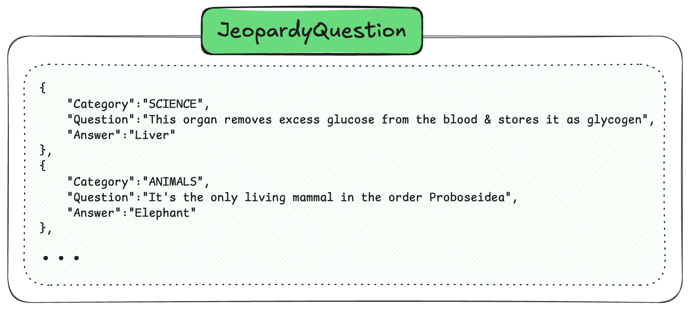

import SkipLink from "/src/components/SkipValidationLink";
import Tabs from "@theme/Tabs";
import TabItem from "@theme/TabItem";
import FilteredTextBlock from "@site/src/components/Documentation/FilteredTextBlock";
import PyCode from "!!raw-loader!/docs/weaviate/tutorials/_includes/bulk-import.py";

In this tutorial, we will explore how to efficiently import large datasets into Weaviate using batch imports. You'll learn the differences between client-side and server-side batching, when to use each approach, and best practices for optimal performance.

## Prerequisites

Before starting this tutorial, ensure you have:

- An instance of Weaviate (e.g. on [Weaviate Cloud](/go/console?utm_content=tutorial), or locally), version `v1.36` or newer for server-side batching
- Your preferred Weaviate [client library](../client-libraries/index.mdx) installed
- An API key for your inference API (OpenAI, Cohere, etc.) if using vectorization
- A dataset to import (we'll provide a sample)

## Introduction

Weaviate offers multiple methods for importing your data:

1. **[Object creation](../manage-objects/create.mdx)**: You create the objects in the database one-by-one with individual requests.
1. **[Loading from backup](/deploy/configuration/backups.md)**: If you created a backup of an existing collection, you can restore/import it in another Weaviate instance.
1. **Client-side batch imports**: Import objects in larger batches by controlling the batch size and timing manually.
1. **Server-side batch imports**: The server automatically manages the import flow for optimal performance and is recommended for most use cases as it automatically optimizes throughput.

When importing data into Weaviate, **always use batch imports** instead of importing objects one by one. Batch imports can improve performance by 100x or more by:

- Reducing network overhead through fewer HTTP requests
- Enabling parallel processing
- Optimizing database write operations

Let's walk through importing data using both approaches. We'll create a collection for Jeopardy questions and import sample data.

## Step 1: Connect to Weaviate

First, connect to your Weaviate instance.

<Tabs className="code" groupId="languages">
  <TabItem value="py" label="Python">
    <FilteredTextBlock
      text={PyCode}
      startMarker="# START ConnectToWeaviate"
      endMarker="# END ConnectToWeaviate"
      language="py"
    />
  </TabItem>
</Tabs>

## Step 2: Create a collection

This is what our data looks like:

Create a collection to store the Jeopardy questions.

<Tabs className="code" groupId="languages">
  <TabItem value="py" label="Python">
    <FilteredTextBlock
      text={PyCode}
      startMarker="# START CreateCollection"
      endMarker="# END CreateCollection"
      language="py"
    />
  </TabItem>
</Tabs>

## Step 3: Prepare your data

Load the data from the JSON file.

<Tabs className="code" groupId="languages">
  <TabItem value="py" label="Python">
    <FilteredTextBlock
      text={PyCode}
      startMarker="# START LoadData"
      endMarker="# END LoadData"
      language="py"
    />
  </TabItem>
</Tabs>

## Step 4: Import the data

### Option A: Server-side batching

import SsbStatus from '/_includes/ssb-status.mdx';

<SsbStatus/>

Server-side batching automatically manages the import flow using a feedback loop between client and server. The server monitors its workload and tells the client how much data to send next.

- Client opens a persistent connection to the server
- Client sends data in chunks based on server feedback
- Server manages an internal queue and applies backpressure when needed
- Errors are streamed back asynchronously without interrupting the flow

<Tabs className="code" groupId="languages">
  <TabItem value="py" label="Python">
    <FilteredTextBlock
      text={PyCode}
      startMarker="# START ServerSideBatch"
      endMarker="# END ServerSideBatch"
      language="py"
    />
  </TabItem>
</Tabs>

The benefits of server-side batching are:

- **No manual tuning**: Server automatically determines optimal batch size
- **Automatic backpressure**: Prevents server overload during heavy operations
- **Better resilience**: Handles cluster scaling events gracefully
- **Simplified code**: Less configuration needed

### Option B: Client-side batching

Client-side batching gives you direct control over batch size and timing. You configure parameters like batch size and manage the import flow manually.

<Tabs className="code" groupId="languages">
  <TabItem value="py" label="Python">
    <FilteredTextBlock
      text={PyCode}
      startMarker="# START ClientSideBatch"
      endMarker="# END ClientSideBatch"
      language="py"
    />
  </TabItem>
</Tabs>

Use the following tips for configuring client-side batching:

- **Default**: Start with 100 objects per batch
- **Large objects**: Reduce to 20-50 for objects with long texts or custom vectors
- **Small objects**: Increase to 200-500 for simple objects
- Monitor CPU and memory usage to find optimal size

## Error handling

Proper error handling is crucial for batch imports. A `200` HTTP status only means the request was received - individual objects may still fail.

<Tabs className="code" groupId="languages">
  <TabItem value="py" label="Python">
    <FilteredTextBlock
      text={PyCode}
      startMarker="# START ErrorHandling"
      endMarker="# END ErrorHandling"
      language="py"
    />
  </TabItem>
</Tabs>

## Verify import

After importing, verify the data was successfully added.

<Tabs className="code" groupId="languages">
  <TabItem value="py" label="Python">
    <FilteredTextBlock
      text={PyCode}
      startMarker="# START VerifyImport"
      endMarker="# END VerifyImport"
      language="py"
    />
  </TabItem>
</Tabs>

## Importing with custom vectors

If you have pre-computed vectors, you can include them in the import.

<Tabs className="code" groupId="languages">
  <TabItem value="py" label="Python">
    <FilteredTextBlock
      text={PyCode}
      startMarker="# START CustomVectors"
      endMarker="# END CustomVectors"
      language="py"
    />
  </TabItem>
</Tabs>

## Best practices

### Performance optimization

1. **Use multiple shards**: Even on a single node, sharding improves import speed
2. **Monitor CPU usage**: Use `htop` to ensure CPUs are fully utilized
3. **Parallelize imports**: Run multiple import processes if CPUs aren't maxed out
4. **Set resource limits**: Configure `LIMIT_RESOURCES=True` to avoid out of memory issues

### Choosing batch parameters

For **client-side batching**:

- Start with `batch_size=100`
- Increase `concurrent_requests` to 2-4 for better throughput
- Adjust based on object size and available resources

For **server-side batching**:

- No configuration needed - the server handles optimization
- Focus on error handling and monitoring

### Large dataset strategies

When importing millions of objects:

1. **Split your dataset** into manageable chunks
2. **Use checkpointing** to resume failed imports
3. **Monitor progress** with regular status updates
4. **Implement retry logic** for transient failures

Example of chunked import with progress tracking:

<Tabs className="code" groupId="languages">
  <TabItem value="py" label="Python">
    <FilteredTextBlock
      text={PyCode}
      startMarker="# START ChunkedImport"
      endMarker="# END ChunkedImport"
      language="py"
    />
  </TabItem>
</Tabs>

## Summary

This tutorial covered efficient bulk data import in Weaviate:

- **Always use batch imports** for better performance.
- **Server-side batching** automatically optimizes throughput with no manual tuning.
- **Client-side batching** provides direct control when needed.
- **Error handling is critical** - check for object-level failures even with HTTP 200 responses.
- **Monitor and optimize** based on your data and infrastructure.

## Further resources

- [How-to: Batch import](../manage-objects/import.mdx)
- <SkipLink href="/weaviate/api/rest#tag/batch">
    API Reference: Batch operations
  </SkipLink>
- [Concepts: Data import](../concepts/data-import.mdx)

## Questions and feedback

import DocsFeedback from "/_includes/docs-feedback.mdx";

<DocsFeedback />
