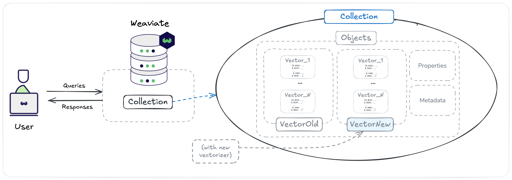
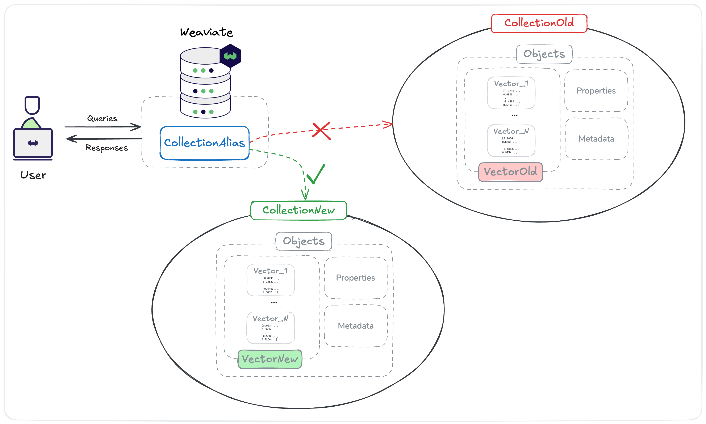

import Tabs from "@theme/Tabs";
import TabItem from "@theme/TabItem";
import FilteredTextBlock from "@site/src/components/Documentation/FilteredTextBlock";
import PyCode from "!!raw-loader!/docs/weaviate/tutorials/_includes/vectorizer-migration.py";

# Switching vectorizers in Weaviate

This tutorial demonstrates two methods for migrating a Weaviate collection to a new vectorizer (embedding model) with minimal disruption to ongoing services. These techniques are helpful for scenarios such as model upgrades, provider changes, or performance optimization.

## Prerequisites

Before starting this tutorial, ensure you have:

- A [Weaviate Cloud](https://console.weaviate.cloud) instance (version `v1.32` or newer)
- Python 3.8+ installed
- Required Python packages installed:
  ```bash
  pip install weaviate-client datasets
  ```
- Environment variables set for your Weaviate Cloud credentials:
  ```bash
  export WEAVIATE_URL="your-weaviate-cloud-url"
  export WEAVIATE_API_KEY="your-api-key"
  ```
- Basic familiarity with Weaviate collections and vector search

:::tip Get started with Weaviate Cloud

Sign up for a free Weaviate Cloud sandbox at [console.weaviate.cloud](https://console.weaviate.cloud)

:::

## Introduction

In a production environment, you might need to change your embedding model for several reasons. You may want to adopt a newer model for **performance improvements** like better search accuracy, or switch models due to the **deprecation** of your current model.

There are three basic steps when it comes to switching embedding models:

1. **Baseline performance analysis**  
   Select a representative subset of the data. Using the existing embedding model, calculate a baseline for query/search accuracy. This metric will serve as the benchmark for comparison.

1. **New model evaluation**  
   Generate new vector embeddings for the identical data sample using the updated model. Re-calculate the query/search accuracy using these new embeddings.

1. **Decision & deployment**  
   Compare the accuracy results from the new model against the established baseline. If the new embeddings demonstrate a clear improvement in performance, proceed with deploying the updated model system-wide.

This tutorial demonstrates two approaches for switching vectorizers in you application:

- [**Method A: Adding new vectors**](#method-a-add-new-vector)  
  This method allows multiple vectors per data object within a single collection. It's ideal for testing new models alongside existing ones and keeping all the data in one collection.
- [**Method B: Collection aliases**](#method-b-collection-aliases-migration)  
  This approach uses aliases to instantly switch between separate collections. It's perfect for a complete model replacement, minimizing risk and providing an immediate rollback option.

## Step 0: Create a demo collection (optional)

If you want to follow this tutorial locally and execute the code snippets, you can check out the collapsible element below for steps on how to create a collection and import a demo dataset with precomputed vector embeddings.

<details>
<summary><b>Step 0:</b> Setup a collection and populate it with demo data</summary>

#### Step 0.1: Connect to Weaviate Cloud

First, establish a connection to your Weaviate Cloud instance:

<FilteredTextBlock
  text={PyCode}
  startMarker="# START Method1Connect"
  endMarker="# END Method1Connect"
  language="py"
/>

#### Step 0.2: Create a collection

Create a collection that accepts self-provided vectors. We will use the existing embeddings from the [HuggingFace e-commerce dataset](https://huggingface.co/datasets/weaviate/agents/viewer/query-agent-ecommerce):

<FilteredTextBlock
  text={PyCode}
  startMarker="# START Method1CreateCollection"
  endMarker="# END Method1CreateCollection"
  language="py"
/>

#### Step 0.3: Import data

We'll use the Weaviate ECommerce dataset from Hugging Face, which contains clothing items with pre-computed embeddings. This dataset represents a real-world scenario where you have existing vector embeddings that need migration.

The dataset includes:

- Product information (name, description, category, price, brand, etc.)
- Pre-computed 768-dimensional vectors

<FilteredTextBlock
  text={PyCode}
  startMarker="# START ImportEcommerceData"
  endMarker="# END ImportEcommerceData"
  language="py"
/>

Import your e-commerce data along with the pre-computed vectors:

<FilteredTextBlock
  text={PyCode}
  startMarker="# START Method1ImportData"
  endMarker="# END Method1ImportData"
  language="py"
/>

#### Step 0.4: Query with original vectors

Verify that searches work with your original vectors:

<FilteredTextBlock
  text={PyCode}
  startMarker="# START Method1QueryOriginal"
  endMarker="# END Method1QueryOriginal"
  language="py"
/>

</details>

## Method A: Add new vector

Named vectors allow you to have multiple vector representations in the same collection. Once a new vector is created and all the objects in the database are vectorized, you can use the new vector instead of the original one.



### Step 1: Add new vector with Weaviate Embeddings

Add a new vector using Weaviate's built-in embedding service [Weaviate Embeddings](/cloud/embeddings):

<FilteredTextBlock
  text={PyCode}
  startMarker="# START Method1AddNewVector"
  endMarker="# END Method1AddNewVector"
  language="py"
/>

import ModelProvider from "/_includes/embedding-model-providers.mdx";

<details>
  <summary>Choose a different embedding model</summary>
  <ModelProvider />
</details>

### Step 2: Trigger vectorization

Update all objects to generate embeddings with the new vectorizer. We use a minimal update that doesn't change properties:

<FilteredTextBlock
  text={PyCode}
  startMarker="# START Method1TriggerVectorization"
  endMarker="# END Method1TriggerVectorization"
  language="py"
/>

### Step 3: Query with the new vector

Now you can query using the new vector:

<FilteredTextBlock
  text={PyCode}
  startMarker="# START Method1QueryNewVector"
  endMarker="# END Method1QueryNewVector"
  language="py"
/>

## Method B: Collection aliases migration

Collection aliases allow instant switching between collections with different vectorizers.



### Step 1: Create collection alias and query using alias

Create an alias that your application will use:

<FilteredTextBlock
  text={PyCode}
  startMarker="# START Method2CreateAlias"
  endMarker="# END Method2CreateAlias"
  language="py"
/>

Your application should always use the alias:

<FilteredTextBlock
  text={PyCode}
  startMarker="# START Method2QueryAlias"
  endMarker="# END Method2QueryAlias"
  language="py"
/>

### Step 2: Create new collection with Weaviate Embeddings

Create a new collection using the Weaviate Embeddings vectorizer:

<FilteredTextBlock
  text={PyCode}
  startMarker="# START Method2CreateNew"
  endMarker="# END Method2CreateNew"
  language="py"
/>

<details>
  <summary>Choose a different embedding model</summary>
  <ModelProvider />
</details>

### Step 3: Migrate data to new collection

Copy data to the new collection (vectors will be auto-generated):

<FilteredTextBlock
  text={PyCode}
  startMarker="# START Method2MigrateData"
  endMarker="# END Method2MigrateData"
  language="py"
/>

### Step 4: Switch the alias and query using alias

Update the alias to point to the new collection:

<FilteredTextBlock
  text={PyCode}
  startMarker="# START Method2SwitchAlias"
  endMarker="# END Method2SwitchAlias"
  language="py"
/>

After verification, remove the old collection:

<FilteredTextBlock
  text={PyCode}
  startMarker="# START Method2Cleanup"
  endMarker="# END Method2Cleanup"
  language="py"
/>

## Choosing the right method

Use **new vectors** when:

- You want to **test multiple models** simultaneously
- You prefer keeping **all data in one collection**
- You want to **experiment** with different search strategies

Use **collection aliases** when:

- You want **rollback** capability
- You prefer **complete isolation** between old and new setups
- You're doing a **one-time migration** to a new model

## Best practices

1. **Test thoroughly**: Always test the new vectorizer with a subset of data first
2. **Monitor quality**: Compare search results between old and new models
3. **Plan for rollback**: Keep the old setup available until you're confident
4. **Consider costs**: Different vectorizers have different pricing models
5. **Document changes**: Track which model versions and configurations you're using

## Summary

This tutorial demonstrated two powerful approaches for migrating vectorizers in Weaviate:

- **Adding new vectors**: Creating new vector embeddings in an existing collection
- **Collection aliases**: Best for instant switching between collections with different vectorizers

## Further resources

- [Manage collections: Collection aliases](../manage-collections/collection-aliases.mdx)
- [Manage collection: Add new vectors](../manage-collections/vector-config.mdx#add-new-named-vectors)

## Questions and feedback

import DocsFeedback from "/_includes/docs-feedback.mdx";

<DocsFeedback />
