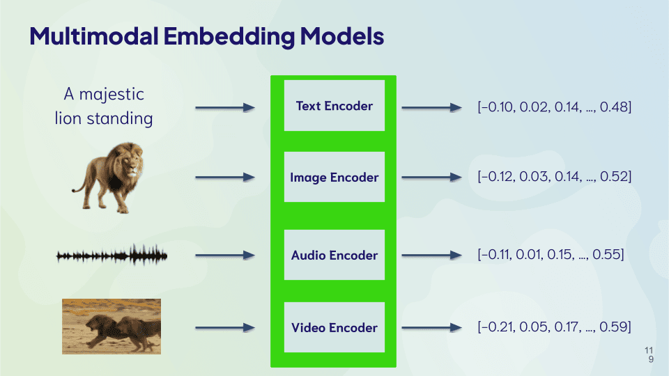

import Tabs from '@theme/Tabs';
import TabItem from '@theme/TabItem';
import FilteredTextBlock from '@site/src/components/Documentation/FilteredTextBlock';
import TSCode from '!!raw-loader!./_snippets/10_strengths.ts';

## <i class="fa-solid fa-square-chevron-right"></i> 概要

これらの検索タイプはそれぞれ異なる特性を持ち、そのため強みも異なります。

各検索タイプの相対的な強みを見ていきましょう。

## <i class="fa-solid fa-square-chevron-right"></i> ベクトル検索の強み

### <i class="fa-solid fa-chalkboard"></i> ロバスト性

ベクトルとは、対象オブジェクトの意味を数値で表現したものです。そのため、意味に影響しない変化に対してもベクトル検索はロバストです。

具体的には、たとえば 「 cat 」 のベクトルは、綴りが大きく異なる 「 kitten 」「 feline 」「 pet 」 のベクトルとも近くなります。

ベクトル検索を使って 「 cat 」 と 「 kitten 」 を検索した例をご覧ください。

<Tabs groupId="languages">

 <TabItem value="ts" label="JS/TS Client v3">
    <FilteredTextBlock
      text={TSCode}
      startMarker="// START robustnessExampleWords"
      endMarker="// END robustnessExampleWords"
      language="ts"
    />
  </TabItem>

</Tabs>

結果は、「 cat 」 と 「 kitten 」 が非常に近いことがわかります。

つまり、モデルが意味を「理解」できるため、「 cat 」 と 「 kitten 」 のベクトルは意味的に近いということです。

<FilteredTextBlock
  text={TSCode}
  startMarker="// START responseRobustnessExampleWords"
  endMarker="// END responseRobustnessExampleWords"
  language="json"
/>

同様に、「 cat 」 のスペルミスである 「 caat 」 や 「 catt 」 のベクトルも、「 cat 」 のベクトルと近くなります。

<Tabs groupId="languages">

 <TabItem value="ts" label="JS/TS Client v3">
    <FilteredTextBlock
      text={TSCode}
      startMarker="// START robustnessExampleSpelling"
      endMarker="// END robustnessExampleSpelling"
      language="ts"
    />
  </TabItem>

</Tabs>

ここでも、結果はほぼ同一になります。

<FilteredTextBlock
  text={TSCode}
  startMarker="// START responseRobustnessExampleSpelling"
  endMarker="// END responseRobustnessExampleSpelling"
  language="json"
/>

このロバスト性こそがベクトル検索の大きな強みです。検索者はデータセット内で使われている正確な単語を知っている必要がありません。検索対象の概念がはっきり定義されていない場合や、検索者がデータセットに詳しくない場合に特に役立ちます。

### <i class="fa-solid fa-chalkboard"></i> 汎用性

ベクトル検索は汎用性も高いです。テキスト、画像、音声など複数のデータモダリティや、多言語にわたる検索に利用できます。

ベクトルは対象の意味を数値化したものなので、モダリティや言語が異なっていても、同じ意味なら同じベクトルで表現できます。

実際に、複数モダリティまたは複数言語（あるいはその両方）をまたいで検索できるモデルも存在します。これは、モダリティや言語にかかわらずデータを比較可能なベクトルへ変換できるモデルを使用することで実現しています。

## <i class="fa-solid fa-square-chevron-right"></i> キーワード検索の強み

### <i class="fa-solid fa-chalkboard"></i> 正確性

キーワード検索は、正確な一致を見つける必要があるシーンに最適です。学術研究、ドメイン特化データの検索、技術的トラブルシューティングなど、検索したい正確な用語が存在する場面で特に有用です。

検索語と完全に一致する結果を返せることで、ユーザーは自身のクエリに対して最も関連性の高い情報を確実に得られます。

具体的な例として、以下では 「 imaging 」 を検索します。

<Tabs groupId="languages">

 <TabItem value="ts" label="JS/TS Client v3">
    <FilteredTextBlock
      text={TSCode}
      startMarker="// START bm25Example"
      endMarker="// END bm25Example"
      language="ts"
    />
  </TabItem>

</Tabs>

結果を確認すると、

<FilteredTextBlock
  text={TSCode}
  startMarker="// START bm25Results"
  endMarker="// END bm25Results"
  language="json"
/>

キーワード検索で 「 imaging 」 を検索すると、その単語を含む 1 件の結果のみが返されます。
## <i class="fa-solid fa-square-chevron-right"></i> ハイブリッド検索の強み

ハイブリッド検索の主な強みは、そのレジリエンスです。詳細を見ていきましょう。

### <i class="fa-solid fa-chalkboard"></i> レジリエンス

ハイブリッド検索は、ベクトル検索とキーワード検索の両方から上位結果を組み合わせるため、いずれかの検索方式の弱点を補完できます。

以下のハイブリッド検索の例をご覧ください。

<Tabs groupId="languages">

 <TabItem value="ts" label="JS/TS Client v3">
    <FilteredTextBlock
      text={TSCode}
      startMarker="// START hybridExample"
      endMarker="// END hybridExample"
      language="ts"
    />
  </TabItem>

</Tabs>

ここで結果を確認してみましょう。

<FilteredTextBlock
  text={TSCode}
  startMarker="// START hybridResults"
  endMarker="// END hybridResults"
  language="json"
/>

キーワード検索による「imaging」の結果に加えて、意味的に関連性の高い「X-rays」の結果も取得できていることがわかります。

ハイブリッド検索はベクトル検索とキーワード検索の結果を組み合わせることで、少なくともどちらか一方で高いスコアを持つオブジェクトを見つけられます。このアプローチにより、両検索方式が相互補完的に働きます。

<!-- ## <i class="fa-solid fa-square-chevron-right"></i> Review

<Quiz questions={varName} />

Any quiz questions

### <i class="fa-solid fa-pen-to-square"></i> Review exercise

:::note <i class="fa-solid fa-square-terminal"></i> Exercise
Try out ...
:::

### <i class="fa-solid fa-lightbulb-on"></i> Key takeaways

:::info
Add summary
:::

## Questions and feedback

import DocsFeedback from '/_includes/docs-feedback.mdx';

<DocsFeedback/>

import Quiz from '/src/components/Academy/quiz.js'
const varName = [{
  questionText: 'questionText',
  answerOptions: [
    {
      answerText: 'answerOne',
      isCorrect: false,
      feedback: 'feedbackOne',
    },
    {
      answerText: 'answerTwo',
      isCorrect: false,
      feedback: 'feedbackTwo',
    },
    {
      answerText: 'answerThree',
      isCorrect: false,
      feedback: 'feedbackThree',
    },
  ]
}]; -->