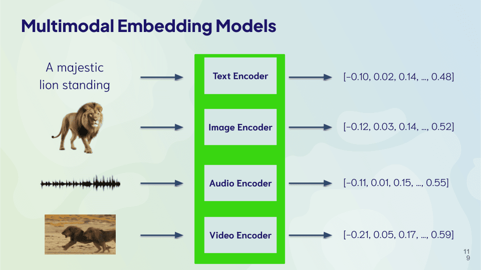

import Tabs from '@theme/Tabs';
import TabItem from '@theme/TabItem';
import FilteredTextBlock from '@site/src/components/Documentation/FilteredTextBlock';
import PyCode from '!!raw-loader!./_snippets/10_strengths.py';

## <i class="fa-solid fa-square-chevron-right"></i> 概要

これらの異なる検索タイプは、それぞれ特性が異なるため強みも異なります。

ここでは各検索タイプの相対的な強みを見ていきます。

## <i class="fa-solid fa-square-chevron-right"></i> ベクトル検索の強み

### <i class="fa-solid fa-chalkboard"></i> 頑健性

ベクトルは、対象オブジェクトの意味を数値で表現したものです。そのため、意味を変えない変更に対してベクトル検索は頑健です。

具体的な例として、「 cat 」のベクトルは、綴りが大きく異なる「 kitten 」「 feline 」「 pet 」などのベクトルとも近くなります。

以下では、「 cat 」と「 kitten 」をベクトル検索した結果を確認します。

<Tabs groupId="languages">

 <TabItem value="py" label="Python">
    <FilteredTextBlock
      text={PyCode}
      startMarker="# START robustnessExampleWords"
      endMarker="# END robustnessExampleWords"
      language="py"
    />
  </TabItem>

</Tabs>

ご覧のとおり、「 cat 」と「 kitten 」の検索結果は非常に似ています。

つまり、モデルが意味を「理解」できるため、「 cat 」と「 kitten 」のベクトルは意味的に近いのです。

<FilteredTextBlock
  text={PyCode}
  startMarker="# START responseRobustnessExampleWords"
  endMarker="# END responseRobustnessExampleWords"
  language="json"
/>

同様に、「 cat 」のベクトルは、綴りを誤った「 caat 」や「 catt 」のベクトルとも近くなります。

<Tabs groupId="languages">

 <TabItem value="py" label="Python">
    <FilteredTextBlock
      text={PyCode}
      startMarker="# START robustnessExampleSpelling"
      endMarker="# END robustnessExampleSpelling"
      language="py"
    />
  </TabItem>

</Tabs>

ここでは結果はほぼ同一になります。

<FilteredTextBlock
  text={PyCode}
  startMarker="# START responseRobustnessExampleSpelling"
  endMarker="# END responseRobustnessExampleSpelling"
  language="json"
/>

この頑健性こそがベクトル検索の大きな強みです。検索者はデータセットで使用されている正確な単語を知る必要がありません。特に、検索対象の概念が明確に定義されていない場合や、検索者がデータセットに詳しくない場合に有用です。

### <i class="fa-solid fa-chalkboard"></i> 多様性

ベクトル検索は多用途でもあります。テキスト・画像・音声など複数のデータモダリティ、および複数言語を対象に検索できます。

ベクトルは対象オブジェクトの意味を数値で表現しているため、モダリティや言語が異なっても同じ意味であれば同じベクトルで表現できます。

実際、複数モダリティや複数言語（あるいはその両方）をまたいで検索できるモデルも存在します。これは、モダリティや言語に依存せず、すべてのデータを比較可能なベクトルに変換できるモデルを使用することで実現しています。

## <i class="fa-solid fa-square-chevron-right"></i> キーワード検索の強み

### <i class="fa-solid fa-chalkboard"></i> 精確性

キーワード検索は、正確な一致を見つける必要がある場面に最適です。学術研究、ドメイン固有データの検索、技術的なトラブルシューティングなど、検索すべき正確な用語が存在するシナリオで特に有用です。

検索語に完全一致する結果を返せることで、ユーザーは自分のクエリに最も関連する情報を受け取れます。

具体的には、次の例では「 imaging 」で検索します。

<Tabs groupId="languages">

 <TabItem value="py" label="Python">
    <FilteredTextBlock
      text={PyCode}
      startMarker="# START bm25Example"
      endMarker="# END bm25Example"
      language="py"
    />
  </TabItem>

</Tabs>

結果を確認します。

<FilteredTextBlock
  text={PyCode}
  startMarker="# START bm25Results"
  endMarker="# END bm25Results"
  language="json"
/>

キーワード検索で「 imaging 」を検索すると、その単語を含む 1 件のみが返されます。
## <i class="fa-solid fa-square-chevron-right"></i> ハイブリッド検索の強み

ハイブリッド検索の大きな強みは、そのレジリエンスです。これについて詳しく見ていきましょう。

### <i class="fa-solid fa-chalkboard"></i> レジリエンス

ハイブリッド検索は、 ベクトル 検索とキーワード検索の双方で上位にランク付けされた結果を組み合わせるため、レジリエンスがあります。これにより、それぞれの検索方式の弱点を補うことができます。

以下のハイブリッド検索の例をご覧ください。

<Tabs groupId="languages">

 <TabItem value="py" label="Python">
    <FilteredTextBlock
      text={PyCode}
      startMarker="# START hybridExample"
      endMarker="# END hybridExample"
      language="py"
    />
  </TabItem>

</Tabs>

ここで結果を確認できます。

<FilteredTextBlock
  text={PyCode}
  startMarker="# START hybridResults"
  endMarker="# END hybridResults"
  language="json"
/>

上記のキーワード検索結果（ " imaging " ）に加えて、意味的に関連する結果（ " X-rays " ）も取得できていることがわかります。

ハイブリッド検索は、 ベクトル 検索とキーワード検索の両方の結果を組み合わせるため、少なくともどちらか一方で高いスコアを得たオブジェクトを見つけ出します。このアプローチにより、各検索方式を相互に補完する効果が得られます。

<!-- ## <i class="fa-solid fa-square-chevron-right"></i> Review

<Quiz questions={varName} />

Any quiz questions

### <i class="fa-solid fa-pen-to-square"></i> Review exercise

:::note <i class="fa-solid fa-square-terminal"></i> Exercise
Try out ...
:::

### <i class="fa-solid fa-lightbulb-on"></i> Key takeaways

:::info
Add summary
:::

## Questions and feedback

import DocsFeedback from '/_includes/docs-feedback.mdx';

<DocsFeedback/>

import Quiz from '/src/components/Academy/quiz.js'
const varName = [{
  questionText: 'questionText',
  answerOptions: [
    {
      answerText: 'answerOne',
      isCorrect: false,
      feedback: 'feedbackOne',
    },
    {
      answerText: 'answerTwo',
      isCorrect: false,
      feedback: 'feedbackTwo',
    },
    {
      answerText: 'answerThree',
      isCorrect: false,
      feedback: 'feedbackThree',
    },
  ]
}]; -->