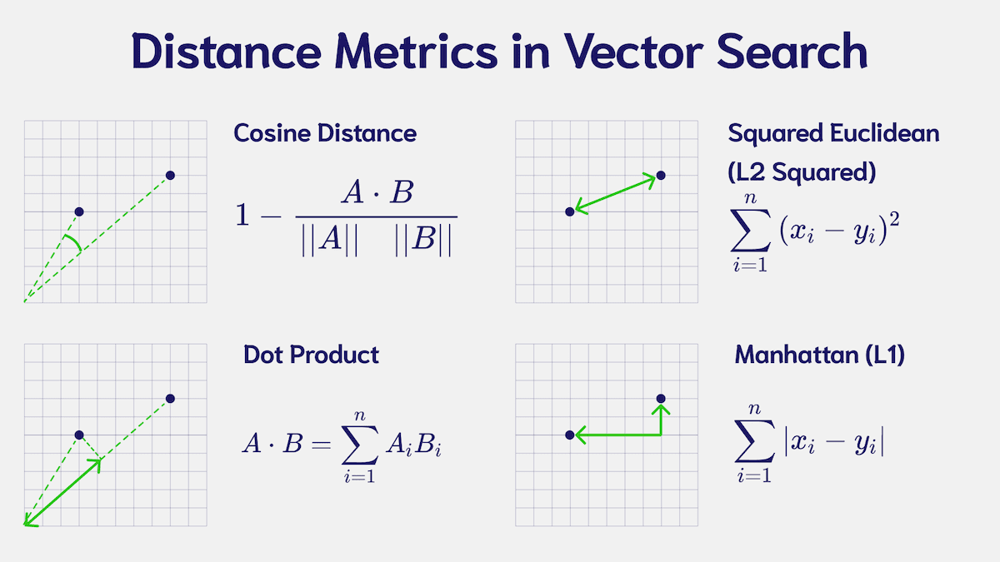

import Tabs from '@theme/Tabs';
import TabItem from '@theme/TabItem';
import FilteredTextBlock from '@site/src/components/Documentation/FilteredTextBlock';
import PyCode from '!!raw-loader!./_snippets/100_config.py';

「flat」インデックスは、シンプルで効率的な ベクトル インデックスの一種で、小規模な ベクトル コレクションに最適です。

## <i class="fa-solid fa-square-chevron-right"></i> 主なポイント

flat インデックスは「マップ」データ型を模倣した、非常にシンプルな ベクトル インデックスです。各 ベクトル の位置のみを保持し、検索時にはクエリ ベクトル とコレクション内の各 ベクトル を比較します。予想どおり、必要リソースは非常に少なくて済みますが、 ベクトル 数が増えるにつれて検索速度が低下します。

このインデックスが力を発揮するのは、多数の小規模コレクションが存在する大規模ユースケースです。たとえばマルチテナント環境で各エンドユーザーごとに 1 つのコレクションを持つ場合です。典型例としてはメモアプリがあり、各エンドユーザーが自分専用のメモコレクションを持つ、といったケースです。

このような環境では、各エンドユーザーがマルチテナント コレクション内の「テナント」として扱われ、それぞれが独立した ベクトル インデックスを持ちます。flat インデックスはまさにこのユースケースに最適です。

### <i class="fa-solid fa-chalkboard"></i> トレードオフ

flat インデックスの最大の妥協点はスケーラビリティがないことです。コレクション内の ベクトル 数が増えると、それに比例して検索時間も線形に増加します。これは各 ベクトル をクエリ ベクトル と比較する必要があるためです。

### <i class="fa-solid fa-chalkboard"></i> リソース要件

flat インデックスは、 ベクトル 自体ではなくその位置のみを保存するため、必要なメモリは非常に少なくて済みます。

特にデータベース全体が成長しても、その成長が各インデックス（テナント）の数によるもので、各インデックス内の ベクトル 数が少ない場合には大きなメリットがあります。

### <i class="fa-solid fa-chalkboard"></i> 距離メトリック

インデックスで使用する距離メトリックは、 ベクトル 間の距離をどのように計算するかを決定します。

コレクション内の ベクトル に合ったメトリックを選択する必要があります。適切なメトリックを知るには、 ベクトル を生成したモデルのドキュメントを参照してください。

Weaviate のデフォルトメトリックは cosine ですが、[他にもさまざまなメトリック](/weaviate/config-refs/distances.md) を利用できます。

迷った場合は、多くのモデルで採用されている cosine 距離が堅牢なデフォルト選択肢となります。

### <i class="fa-solid fa-chalkboard"></i> 量子化

flat インデックスで量子化を有効にすると、圧縮済み ベクトル を用いて検索時間を短縮できます。なお、完全な ベクトル も保存されており、初回検索後の再スコアリングに使用されます。

これにより、 ベクトル 数が増えるにつれて線形に増加する検索時間をある程度緩和できます。ただし、flat インデックスのスケーラビリティの限界自体は変わりません。

量子化について詳しくは [Weaviate Academy のコース](../compression/index.md) をご覧ください。

## <i class="fa-solid fa-square-chevron-right"></i> Weaviate でフラット インデックスを設定する

これらの各パラメータは、Weaviate でコレクションを作成する際に指定できます。`vector_cache_max_objects` は、量子化を有効にし、その内部で ベクトル キャッシュを有効にした場合にのみ使用されます。

### <i class="fa-solid fa-code"></i> コード例

<FilteredTextBlock
  text={PyCode}
  startMarker="# START CustomConfigFlat"
  endMarker="# END CustomConfigFlat"
  language="py"
/>

## <i class="fa-solid fa-square-chevron-right"></i> さらに詳しく

- [コンセプト: ベクトル インデックス](/weaviate/concepts/indexing/vector-index.md)
- [リファレンス: ベクトル インデックスのパラメータ](/weaviate/config-refs/indexing/vector-index.mdx)
- [コレクションの管理方法](../../../weaviate/manage-collections/index.mdx)
- [Weaviate Academy: 圧縮](../compression/index.md)

## 質問とフィードバック

import DocsFeedback from '/_includes/docs-feedback.mdx';

<DocsFeedback/>