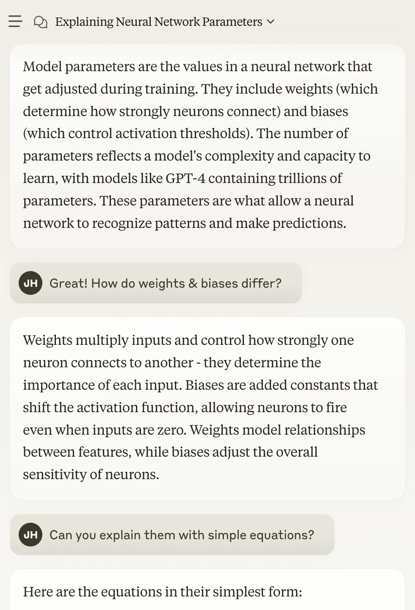
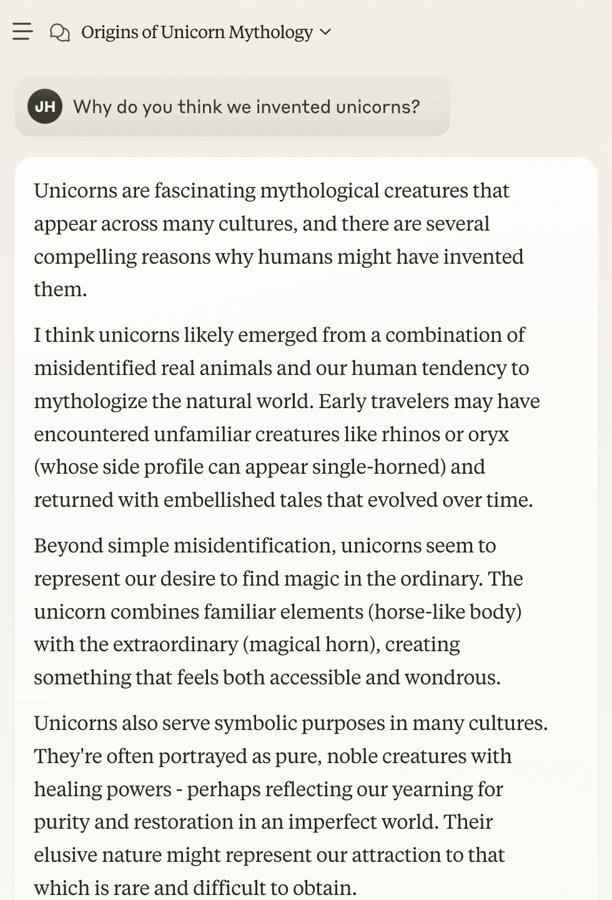
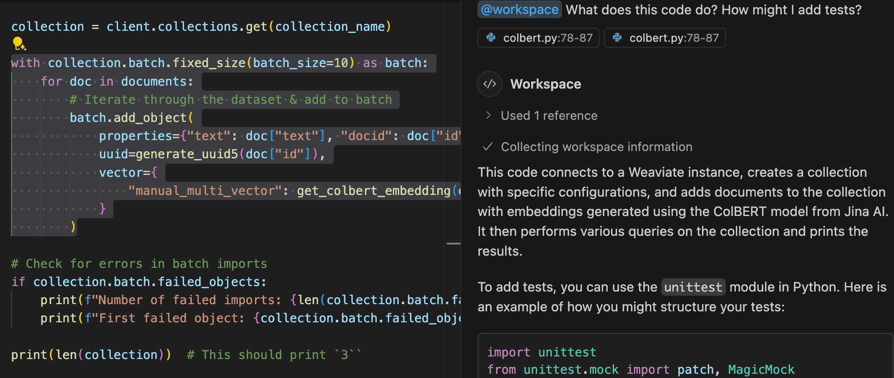

## <i class="fa-solid fa-chalkboard-user"></i> AI モデルの使用例

私たちは、 AI モデルがこれまで人間にしかできないと考えられていたタスクに取り組めることを知っています。いくつか具体的な例を見てみましょう。

### <i class="fa-solid fa-chalkboard"></i> 画像生成

 AI モデルは、あなたのテキスト記述に合わせて、想像どおりの画像を生成できます。

<figure>

| プロンプト | 生成された画像 |
| --- | --- |
| `a sleek looking robot cowboy riding on a big, cute, cartoon unicorn, on the moon.` |  |

<figcaption>OpenAI の AI モデル DALL-E によって生成された画像</figcaption>
</figure>

### <i class="fa-solid fa-chalkboard"></i> 言語理解

彼らは、大きな話題から小さな話題まで、私たちと対話することもできます。

<figure>

| AI との技術的な会話 | AI とのカジュアルな会話 |
| --- | --- |
|  |  |

<figcaption>Anthropic の AI モデル claude との会話</figcaption>
</figure>

### <i class="fa-solid fa-chalkboard"></i> コード補完

実際、多くの人がすでに日々のワークフローで、コードのような複雑なタスクですら、これらを相棒として利用しています。

<figure>

<figcaption> VSCode で Microsoft Copilot を使用</figcaption>
</figure>

### <i class="fa-solid fa-chalkboard"></i> 表： AI モデルの種類

以下は、入力と出力形式をまとめ、具体例を添えた AI モデルのより広い概要です。

<figure>

| 種類 | 入力 | 出力形式 | 出力の意味 | モデル / 利用例 | 入力例 | 出力例 |
| --- | --- | --- | --- | --- | --- | --- |
| 大規模（またはビジョン）言語モデル | テキスト（または テキスト + 画像） | テキスト | 入力テキストへの回答 | claude-3-7-sonnet, gemini-2.0 | フランスの首都はどこですか？ | フランスの首都はパリです |
| 画像生成モデル | テキスト | 画像 | 入力内容の画像化 | Stable diffusion, Dall-E | かわいい赤い犬の画像 |  |
| 埋め込みモデル | テキスト | 数値配列 | 意味を数値的に捉える | Word2vec, sentence-transformers | かわいい赤い犬の画像 | [0.0149, 0.8932, …, 0.0589] |
| 画像分類器 | 画像 | 数値配列 | カテゴリの確率 | ResNet, 疾病検出モデル |  | [0.958, 0.042] |
| 回帰モデル | 数値 | 数値 | 数値予測 | 住宅価格予測, 電力需要予測 | [4, 950, 1985, 2010, 10011, 0] | 2585913 |

<figcaption>AI モデルの概要</figcaption>
</figure>

## <i class="fa-solid fa-chalkboard-user"></i> AI モデルは人間のように思考するか

今日では、 AI モデルはこれらの驚くべきタスク（そしてそれ以上）を、人間レベルの質と驚異的な速度で実行できます。しかし、 AI モデルは重要な点で人間とは大きく異なります。

 AI は統計を「大好物」としています。より正確に言えば、統計の魔法だけで動いています。

本質的に、 AI モデルは統計を利用して、さまざまな種類の入力を出力へと変換します。内部について説明する前に、 AI モデルの仕事を（非常に複雑な）パターンマッチングだと考えると良いかもしれません。そのため、 大規模言語モデルを [確率論的オウム](https://en.wikipedia.org/wiki/Stochastic_parrot) と表現する人もいます。

とはいえ、彼らが非常に優れたツールであることに疑いはありません。そして、これらのモデルを最大限に活用するには、内部をある程度理解しておくと役に立ちます。

## <i class="fa-solid fa-chalkboard-user"></i> AI モデルとは

 AI モデルの世界を探索し始めると、たくさんの専門用語に出会います。最上位のレベルですら、「機械学習」「深層学習」「ニューラルネットワーク」、そして本書で使用している「 AI モデル」などの用語を耳にするでしょう。

それでは、これらの違いは何でしょうか。以下のように捉えることができます。

- **人工知能 (AI)** は、機械が人間の知能を模倣できるようにするあらゆる技術を包括する幅広い用語です。  
- **機械学習 (ML)** は、 AI システムを構築するための特定の手法です。 ML システムはルールベースではなく、データから学習してパターンを見つけ出し、その予測能力を得ます。  
- **深層学習 (DL)** は、 多層（つまり「深い」）の人工ニューラルネットワークに基づく機械学習の一分野です。コンピュータビジョンや自然言語処理など、近年の AI モデルの多くは深層学習モデルによって実現されています。  
- **ニューラルネットワーク (NN)** は、深層学習モデルのアーキテクチャを指します。相互接続されたノード（ニューロン）の層で構成され、情報をネットワーク内で処理してから回答を生成します。

ご覧のとおり、これらは技術的な具体性や深さが異なります。本コースでは「 AI モデル」を総称として使います。 ML、 DL、 NN は、 AI 機能を提供するための具体的なツールと考えてください。

本書の文脈で最も一般的に使用する AI モデルは、生成モデルと埋め込みモデルです。生成モデルは情報を分析・変換するのに役立ち、埋め込みモデルは分析・変換するために最適な文脈情報を検索するのに役立ちます。（注：これらのモデルはほとんどの場合、深層学習モデルです。）

しかし、この単純さに惑わされないでください。同じモデルタイプ内でも非常に多くの微妙な違いがあり、開発者としては多くの落とし穴があります。

つまり、正しく扱えば、大きなチャンスがあるということです。まもなく、これらのモデルタイプ（そして遭遇するかもしれないその他のモデル）を詳しく見ていきます。

それでも、これらのモデルには共通点も多く存在します。これから、そのいくつかの側面を見ていきましょう。

## 質問とフィードバック

import DocsFeedback from '/_includes/docs-feedback.mdx';

<DocsFeedback/>