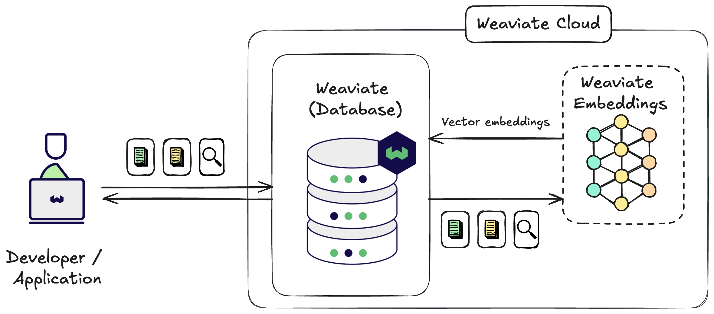

Weaviate Embeddings は、Weaviate Cloud ユーザー向けのマネージド埋め込み推論サービスです。データとクエリの埋め込みを、Weaviate Cloud データベース インスタンスから直接、簡単に生成できます。

:::info
Weaviate Embeddings は有料サービスで、Weaviate Cloud インスタンスでのみご利用いただけます。  
**Sandbox クラスターを使用すると無料でお試しいただけます。**
:::

Weaviate Embeddings を使うと、Weaviate Cloud データベース インスタンスから直接、データとクエリの埋め込みを生成できます。

これにより、外部でベクトル埋め込みを生成したり、追加のモデルプロバイダーを管理したりすることなく、[キーワード](/weaviate/search/bm25)、[ベクトル](/weaviate/search/similarity)、および[ハイブリッド検索](/weaviate/search/hybrid)を実行できます。

:::tip Quickstart
Weaviate Embeddings をすぐに使い始めたい場合は、**[クイックスタート ガイド](/cloud/embeddings/quickstart)** をご覧ください。
:::

<!--
## Key Features

Simplified embedding management through:

- **[Model selection](/cloud/embeddings/models)**: Choose from our hand-picked selection of embedding models to generate embeddings that suit your use case.
- **[Single authentication](#authentication)**: Your Weaviate Cloud credentials are used for authorization.
- **[Unified billing](/cloud/embeddings/administration#pricing-and-billing)**: Your billing and usage can be managed in one place through Weaviate Cloud.
-->

## 利用可能なモデル

Weaviate Embeddings で利用できるモデルは次のとおりです。

- **[`Snowflake/snowflake-arctic-embed-m-v1.5`](/cloud/embeddings/models#snowflake-arctic-embed-m-v1.5)**
- **[`Snowflake/snowflake-arctic-embed-l-v2.0`](/cloud/embeddings/models#snowflake-arctic-embed-l-v2.0)**

## 認証

Weaviate Embeddings を利用するには、[Weaviate Cloud クラスターへの接続](/cloud/manage-clusters/connect)だけで十分です。  
追加の認証は不要で、Weaviate Embeddings サービスはすべてのクラスターでデフォルトで有効になっています。  
[クライアント ライブラリ](/weaviate/client-libraries)を使用して接続する場合でも、[OIDC](/weaviate/configuration/authz-authn#oidc)などで接続する場合でも、サービスをご利用いただけます。

## 使用制限

<!-- TODO[g-despot] Don't hardcode these values here if possible -->
Weaviate Embeddings では、無料の Sandbox クラスターに対するリクエストにのみ使用制限を設けています。  
Sandbox クラスターのレートリミットは、クラスターあたり 1 日 `2000` リクエストです。

:::info
[バッチ インポート](/weaviate/manage-objects/import)でデータをベクトル化する場合、1 バッチの最大サイズは `200` オブジェクトです。  
つまり、無料の Sandbox クラスターでは最大 `400 000` 個の埋め込み（`2000`（リクエスト） × `200`（オブジェクト/リクエスト））を生成できます。
:::

## 必要条件

import Requirements from '/_includes/weaviate-embeddings-requirements.mdx';

<Requirements />

## データ プライバシー

Weaviate Embeddings はステートレス サービスで、データを保存しません。

Weaviate Embeddings に提供されたデータは、埋め込みを生成する目的のみに使用されます。当社は、お客様のデータをトレーニングやモデル改善など、ほかの目的で保存または使用することはありません。

### サービスとデータの所在地

Weaviate Embeddings は、アメリカ合衆国にあるインフラストラクチャを利用しています。  
Weaviate Embeddings を利用することで、データが処理のために米国へ転送されることに同意したものとみなされます。

今後、ほかのリージョンへサービスを拡大する可能性があります。

## 追加リソース

- [Weaviate Embeddings: クイックスタート](/cloud/embeddings/quickstart)
- [Weaviate Embeddings: モデルの選択](/cloud/embeddings/models)
- [Weaviate Embeddings: 管理](/cloud/embeddings/administration)
- [モデル プロバイダー統合: Weaviate Embeddings](/weaviate/model-providers/weaviate/embeddings.md)

## サポートとフィードバック

import SupportAndTrouble from '/_includes/wcs/support-and-troubleshoot.mdx';

<SupportAndTrouble />

