import Tabs from "@theme/Tabs";
import TabItem from "@theme/TabItem";
import FilteredTextBlock from "@site/src/components/Documentation/FilteredTextBlock";
import PyConnect from "!!raw-loader!/docs/weaviate/model-providers/_includes/provider.connect.weaviate.py";
import TSConnect from "!!raw-loader!/docs/weaviate/model-providers/_includes/provider.connect.weaviate.ts";
import GoConnect from "!!raw-loader!/_includes/code/howto/go/docs/model-providers/1-connect-weaviate-embeddings/main.go";
import JavaConnect from "!!raw-loader!/_includes/code/howto/java/src/test/java/io/weaviate/docs/model_providers/ConnectWeaviateEmbeddingsTest.java";
import PyCode from "!!raw-loader!/docs/weaviate/model-providers/_includes/provider.vectorizer.py";
import TSCode from "!!raw-loader!/docs/weaviate/model-providers/_includes/provider.vectorizer.ts";
import GoCode from "!!raw-loader!/_includes/code/howto/go/docs/model-providers/2-usage-text/main.go";
import JavaCode from "!!raw-loader!/_includes/code/howto/java/src/test/java/io/weaviate/docs/model_providers/UsageWeaviateTextEmbeddingsArcticEmbedLV20.java";
import JavaImportQueries from "!!raw-loader!/_includes/code/howto/java/src/test/java/io/weaviate/docs/model_providers/ImportAndQueries.java";

想定所要時間: 30 分
 
 

:::info 学べること

このクイックスタートでは、 Weaviate Cloud と **Weaviate Embeddings** を組み合わせて以下を行う方法を学びます。

1. Weaviate Cloud インスタンスをセットアップします。（10 分）
2. Weaviate Embeddings を使ってデータを追加しベクトル化します。（10 分）
3. セマンティック（ベクトル）検索とハイブリッド検索を実行します。（10 分）

```mermaid
flowchart LR
    %% Define nodes with white backgrounds and darker borders
    A1["Create a new<br> cluster"] --> A2["Install client<br> library"]
    A2 --> A3["Connect to<br> Weaviate Cloud"]
    A3 --> B1["Configure the<br> vectorizer"]
    B1 --> B2["Import<br> objects"]
    B2 --> C1["Semantic (vector)<br> search"]

    %% Group nodes in subgraphs with brand colors
    subgraph sg1 ["1\. Setup"]
        A1
        A2
        A3
    end

    subgraph sg2 ["2\. Populate"]
        B1
        B2
    end

    subgraph sg3 ["3\. Query"]
        C1
    end

    %% Style nodes with white background and darker borders
    style A1 fill:#ffffff,stroke:#B9C8DF,color:#130C49
    style A2 fill:#ffffff,stroke:#B9C8DF,color:#130C49
    style A3 fill:#ffffff,stroke:#B9C8DF,color:#130C49
    style B1 fill:#ffffff,stroke:#B9C8DF,color:#130C49
    style B2 fill:#ffffff,stroke:#B9C8DF,color:#130C49
    style C1 fill:#ffffff,stroke:#B9C8DF,color:#130C49

    %% Style subgraphs with brand colors
    style sg1 fill:#ffffff,stroke:#61BD73,stroke-width:2px,color:#130C49
    style sg2 fill:#ffffff,stroke:#130C49,stroke-width:2px,color:#130C49
    style sg3 fill:#ffffff,stroke:#7AD6EB,stroke-width:2px,color:#130C49
```

注意:

- ここに掲載しているコード例は自己完結型です。コピー＆ペーストしてご自身の環境でそのままお試しいただけます。

:::

## 必要条件

Weaviate Embeddings を利用するには、次が必要です。

<!-- TODO[g-despot]: Update prerequisites with correct client versions -->

- Weaviate `1.28.5` 以上で稼働する Weaviate Cloud Sandbox
- Weaviate Embeddings をサポートする Weaviate クライアント ライブラリ  
  - **Python** クライアント バージョン `4.9.5` 以上  
  - **JavaScript/TypeScript** クライアント バージョン `3.2.5` 以上  
  - **Go/Java** クライアントはまだ公式サポートされていません。以下の例のように、インスタンス化時に `X-Weaviate-Api-Key` と `X-Weaviate-Cluster-Url` ヘッダーを手動で渡す必要があります。

## ステップ 1: Weaviate をセットアップ

### 1.1 新しいクラスターの作成

無料の **Sandbox** クラスターを Weaviate Cloud に作成するには、**[こちらの手順](/cloud/manage-clusters/create#create-a-cluster)** に従ってください。

import LatestWeaviateVersion from "/_includes/latest-weaviate-version.mdx";

<LatestWeaviateVersion />

### 1.2 クライアント ライブラリをインストール

Weaviate を操作する際には [クライアント ライブラリ](/weaviate/client-libraries) の利用を推奨します。以下の手順に従って、公式クライアント ライブラリ（[Python](/weaviate/client-libraries/python)、[JavaScript/TypeScript](/weaviate/client-libraries/typescript)、[Go](/weaviate/client-libraries/go)、[Java](/weaviate/client-libraries/java)）のいずれかをインストールしてください。

import CodeClientInstall from "/_includes/code/quickstart/clients.install.mdx";

<CodeClientInstall />

### 1.3 Weaviate Cloud に接続

Weaviate Embeddings は Weaviate Cloud と統合されています。 Weaviate Cloud の認証情報が、 Weaviate Embeddings へのアクセス許可に使用されます。

<Tabs groupId="languages">
  <TabItem value="py" label="Python API v4">
    <FilteredTextBlock
      text={PyConnect}
      startMarker="# START WeaviateInstantiation"
      endMarker="# END WeaviateInstantiation"
      language="py"
    />
  </TabItem>
  <TabItem value="js" label="JS/TS API v3">
    <FilteredTextBlock
      text={TSConnect}
      startMarker="// START WeaviateInstantiation"
      endMarker="// END WeaviateInstantiation"
      language="ts"
    />
  </TabItem>
  <TabItem value="go" label="Go">
    <FilteredTextBlock
      text={GoConnect}
      startMarker="// START WeaviateInstantiation"
      endMarker="// END WeaviateInstantiation"
      language="goraw"
    />
  </TabItem>
  <TabItem value="java" label="Java">
    <FilteredTextBlock
      text={JavaConnect}
      startMarker="// START WeaviateInstantiation"
      endMarker="// END WeaviateInstantiation"
      language="javaraw"
    />
  </TabItem>
</Tabs>

## ステップ 2: データベースを準備する

### 2.1 コレクションを定義する

次に、データを格納するコレクションを定義します。コレクションを作成する際には、ベクトライザーが使用する [利用可能なモデル](/cloud/embeddings/models) のいずれかを指定する必要があります。このモデルが、データからベクトル埋め込みを生成します。

<Tabs groupId="languages">
  <TabItem value="py" label="Python API v4">
    <FilteredTextBlock
      text={PyCode}
      startMarker="# START SnowflakeArcticEmbedLV20"
      endMarker="# END SnowflakeArcticEmbedLV20"
      language="py"
    />
  </TabItem>
  <TabItem value="js" label="JS/TS API v3">
    <FilteredTextBlock
      text={TSCode}
      startMarker="// START SnowflakeArcticEmbedLV20"
      endMarker="// END SnowflakeArcticEmbedLV20"
      language="ts"
    />
  </TabItem>
  <TabItem value="go" label="Go">
    <FilteredTextBlock
      text={GoCode}
      startMarker="// START SnowflakeArcticEmbedLV20"
      endMarker="// END SnowflakeArcticEmbedLV20"
      language="goraw"
    />
  </TabItem>
  <TabItem value="java" label="Java">
    <FilteredTextBlock
      text={JavaCode}
      startMarker="// START SnowflakeArcticEmbedLV20"
      endMarker="// END SnowflakeArcticEmbedLV20"
      language="java"
    />
  </TabItem>
</Tabs>

利用可能なモデルの詳細については、[モデルを選択](/cloud/embeddings/models) ページをご覧ください。

### 2.2 オブジェクトのインポート

ベクトライザーを設定したら、[データをインポート](/weaviate/manage-objects/import.mdx) して Weaviate に取り込みます。Weaviate は指定したモデルを使用してテキストオブジェクトの埋め込みを生成します。

<Tabs groupId="languages">
  <TabItem value="py" label="Python API v4">
    <FilteredTextBlock
      text={PyCode}
      startMarker="# START BatchImportExample"
      endMarker="# END BatchImportExample"
      language="py"
    />
  </TabItem>
  <TabItem value="js" label="JS/TS API v3">
    <FilteredTextBlock
      text={TSCode}
      startMarker="// START BatchImportExample"
      endMarker="// END BatchImportExample"
      language="ts"
    />
  </TabItem>
  <TabItem value="go" label="Go">
    <FilteredTextBlock
      text={GoCode}
      startMarker="// START BatchImportExample"
      endMarker="// END BatchImportExample"
      language="goraw"
    />
  </TabItem>
  <TabItem value="java" label="Java">
    <FilteredTextBlock
      text={JavaImportQueries}
      startMarker="// START BatchImportExample"
      endMarker="// END BatchImportExample"
      language="java"
    />
  </TabItem>
</Tabs>

## ステップ 3：データのクエリ

ベクトライザーが設定されると、Weaviate は指定したモデルを使用してベクトル検索を実行します。

### ベクトル（ near text ）検索

[ベクトル検索](/weaviate/search/similarity.md#search-with-text) を実行すると、Weaviate はテキストクエリを指定したモデルで埋め込みに変換し、データベースから最も類似したオブジェクトを返します。

以下のクエリは、`limit` で指定した数だけデータベースから最も類似した  n  個のオブジェクトを返します。

<Tabs groupId="languages">
  <TabItem value="py" label="Python API v4">
    <FilteredTextBlock
      text={PyCode}
      startMarker="# START NearTextExample"
      endMarker="# END NearTextExample"
      language="py"
    />
  </TabItem>
  <TabItem value="js" label="JS/TS API v3">
    <FilteredTextBlock
      text={TSCode}
      startMarker="// START NearTextExample"
      endMarker="// END NearTextExample"
      language="ts"
    />
  </TabItem>
  <TabItem value="go" label="Go">
    <FilteredTextBlock
      text={GoCode}
      startMarker="// START NearTextExample"
      endMarker="// END NearTextExample"
      language="goraw"
    />
  </TabItem>
  <TabItem value="java" label="Java">
    <FilteredTextBlock
      text={JavaImportQueries}
      startMarker="// START NearTextExample"
      endMarker="// END NearTextExample"
      language="java"
    />
  </TabItem>
</Tabs>

## 次のステップ

import CardsSection from "/src/components/CardsSection";

export const nextStepsData = [
  {
    title: "Choose a model",
    description:
      "Check out which additional models are available through Weaviate Embeddings.",
    link: "/cloud/embeddings/models",
    icon: "fa fa-list-alt",
  },
  {
    title: "Explore hybrid search",
    description:
      "Discover how hybrid search combines keyword matching and semantic search.",
    link: "/weaviate/search/hybrid",
    icon: "fa fa-search",
  },
];

<CardsSection items={nextStepsData} />
 

## サポートとフィードバック

import SupportAndTrouble from "/_includes/wcs/support-and-troubleshoot.mdx";

<SupportAndTrouble />

