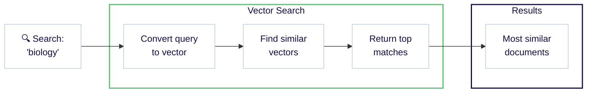
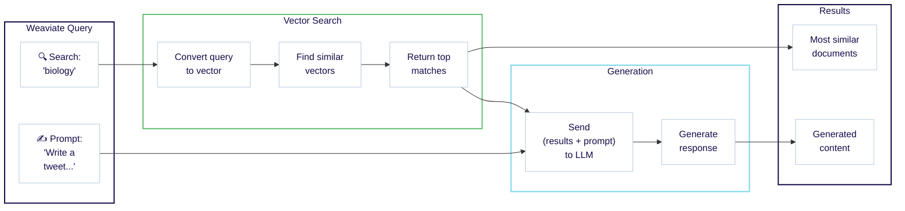

```mermaid
flowchart LR
    %% Define nodes with white backgrounds and darker borders
    A1["Create a<br> cluster"] --> A2["Install client<br> library"]
    A2 --> A3["Connect to<br> Weaviate"]
    A3 --> B1["Define collection"]
    B1 --> B2["Import data"]
    B2 --> C1["Semantic search"]
    C1 --> C2["RAG<br> (Generate)"]

    %% Group nodes in subgraphs with brand colors

    subgraph sg1 ["1\. Connect"]
        A1
        A2
        A3
    end

    subgraph sg2 ["2\. Populate"]
        B1
        B2
    end

    subgraph sg3 ["3\. Query"]
        C1
        C2
    end

    %% Style nodes with white background and darker borders
    style A1 fill:#ffffff,stroke:#B9C8DF,color:#130C49
    style A2 fill:#ffffff,stroke:#B9C8DF,color:#130C49
    style A3 fill:#ffffff,stroke:#B9C8DF,color:#130C49
    style B1 fill:#ffffff,stroke:#B9C8DF,color:#130C49
    style B2 fill:#ffffff,stroke:#B9C8DF,color:#130C49
    style C1 fill:#ffffff,stroke:#B9C8DF,color:#130C49
    style C2 fill:#ffffff,stroke:#B9C8DF,color:#130C49

    %% Style subgraphs with brand colors
    style sg1 fill:#ffffff,stroke:#61BD73,stroke-width:2px,color:#130C49
    style sg2 fill:#ffffff,stroke:#130C49,stroke-width:2px,color:#130C49
    style sg3 fill:#ffffff,stroke:#7AD6EB,stroke-width:2px,color:#130C49
```

import Tabs from '@theme/Tabs';
import TabItem from '@theme/TabItem';

<span class="badge badge--secondary">想定所要時間: 30 分</span>
<br />
<br />

:::info 学習内容

このクイックスタートでは、Weaviate Cloud と [Weaviate Embeddings](/cloud/embeddings) を組み合わせて、以下を行う方法を学びます。

1. Weaviate インスタンスをセットアップする。 (10 分)  
1. データを追加してベクトル化する。 (10 分)  
1. セマンティック検索および 検索拡張生成 (RAG) を実行する。 (10 分)



注意:

- ここで紹介するコード例は自己完結型です。コピー＆ペーストしてご自身の環境でお試しください。

:::

## 前提条件

- [Weaviate Cloud アカウント](./platform/create-account.mdx)
- 最後のステップで Retrieval Augmented Generation (RAG) を実行するには、[Cohere](https://dashboard.cohere.com/) アカウントが必要です。無料の Cohere トライアル API キーを利用できます。別の [モデルプロバイダー](/weaviate/model-providers) を使用する場合は、Cohere の代わりにそちらをご利用ください。

<hr />

## ステップ 1: Weaviate Cloud のセットアップ

### 1.1 クラスターの作成

Weaviate では次のクラスター オプションを提供しています。

- **Sandbox クラスター**: 開発目的向けの無料短期クラスター  
- **Serverless クラスター**: 本番環境向けの永続的なクラスター  

[Weaviate Cloud コンソール](https://console.weaviate.cloud) にアクセスし、無料の Sandbox インスタンスを作成します。

<div
  style={{
    position: 'relative',
    paddingBottom: 'calc(54.10879629629629% + 50px)',
    height: 0,
  }}
>
  <iframe
    id="xrgwlygc1p"
    src="https://app.guideflow.com/embed/xrgwlygc1p"
    width="100%"
    height="100%"
    style={{ overflow: 'hidden', position: 'absolute', border: 'none' }}
    scrolling="no"
    allow="clipboard-read; clipboard-write"
    webKitAllowFullScreen
    mozAllowFullScreen
    allowFullScreen
    allowTransparency="true"
  />
  <script
    src="https://app.guideflow.com/assets/opt.js"
    data-iframe-id="xrgwlygc1p"
  ></script>
</div>

<br />

:::note

- クラスターのプロビジョニングには通常 1〜3 分かかります。  
- クラスターが準備完了すると、Weaviate Cloud はクラスター名の横にチェックマーク (`✔️`) を表示します。  
- 一意性を保つため、Sandbox クラスター名にはランダムなサフィックスが追加されます。  

:::

import LatestWeaviateVersion from '/_includes/latest-weaviate-version.mdx';

<LatestWeaviateVersion />

### 1.2 クライアント ライブラリのインストール

Weaviate Cloud コンソールにはクエリ インターフェースが含まれていますが、ほとんどの操作は [Weaviate クライアント](/weaviate/client-libraries/index.mdx) を介して行います。クライアントは複数のプログラミング言語で提供されています。プロジェクトに適したものを選択してください。

言語ごとのインストール手順:

import CodeClientInstall from '/_includes/code/quickstart/clients.install.mdx';

<CodeClientInstall />

### 1.3 Weaviate Cloud インスタンスへの接続

これで Weaviate インスタンスに接続できます。必要な情報は以下のとおりです。

- **REST Endpoint URL**  
- **Administrator API Key**

両方とも [WCD コンソール](https://console.weaviate.cloud) から取得できます。インタラクティブな例を参照してください。

:::note

Weaviate バージョン `v1.30` 以降の新規クラスターでは、デフォルトで [RBAC (Role-Based Access Control)](/weaviate/configuration/rbac/index.mdx) が有効になっています。これらのクラスターには API キーが付属していないため、自身で API キーを作成し、`admin`、`viewer` またはカスタムロールを割り当てる必要があります。 

:::

<div
  style={{
    position: 'relative',
    paddingBottom: 'calc(54.10879629629629% + 50px)',
    height: 0,
  }}
>
  <iframe
    id="mk6zxyws6p"
    src="https://app.guideflow.com/embed/mk6zxyws6p"
    width="100%"
    height="100%"
    style={{ overflow: 'hidden', position: 'absolute', border: 'none' }}
    scrolling="no"
    allow="clipboard-read; clipboard-write"
    webKitAllowFullScreen
    mozAllowFullScreen
    allowFullScreen
    allowTransparency="true"
  />
  <script
    src="https://app.guideflow.com/assets/opt.js"
    data-iframe-id="mk6zxyws6p"
  ></script>
</div>

<br />

:::info REST と gRPC のエンドポイント

Weaviate は REST と gRPC の両方のプロトコルをサポートしています。Weaviate Cloud デプロイでは REST エンドポイント URL のみを指定すれば、クライアントが自動的に gRPC を設定します。

:::

**REST Endpoint URL** と **Admin API key** を取得したら、Sandbox インスタンスに接続して Weaviate を操作できます。

以下の例では、Weaviate に接続し、クラスターの状態を確認する基本操作を実行します。

import ConnectIsReady from '/_includes/code/quickstart/quickstart.is_ready.mdx';

<ConnectIsReady />

エラーが表示されなければ準備完了です。次のステップでは、簡単なクラスター状態チェックをより実用的な操作に置き換えていきます。

<hr />


## ステップ 2: データベースの投入

### 2.1 コレクションの定義

次の例では `Question` という _コレクション_ を作成します。内容は以下のとおりです。

- 取り込み時とクエリ時にベクトルを生成するための [Weaviate Embeddings モデル統合](/weaviate/model-providers/weaviate/embeddings.md)
- 検索拡張生成 (RAG) 用の Cohere [生成 AI 統合](/weaviate/model-providers/cohere/generative.md)

import CreateCollection from '/_includes/code/quickstart/quickstart.create_collection.mdx';

<CreateCollection />

このコードを実行して、データを追加できるコレクションを作成します。

:::info 使用されるモデルは？

コレクション定義でモデルを任意指定することもできます。上記ではモデルを指定していないため、これらの統合は Weaviate が定義したデフォルトモデルを使用します。

<br />

詳しくは [モデルプロバイダー統合](/weaviate/model-providers/index.md) セクションをご覧ください。

:::

### 2.2 データの読み込み

これでコレクションにデータを追加できます。

次の例では、

- オブジェクトを読み込み、
- バッチ処理で対象コレクション (`Question`) に追加します。

:::tip バッチインポート

([バッチインポート](/weaviate/manage-objects/import.mdx)) は複数のオブジェクトを 1 回のリクエストで送信するため、大量データを追加する最も効率的な方法です。詳しくは [How-to: Batch import](/weaviate/manage-objects/import.mdx) ガイドをご覧ください。

:::

import ImportObjects from '/_includes/code/quickstart/quickstart.import_objects.mdx';

<ImportObjects />

このコードを実行してデモデータを追加します。

<hr />

## ステップ 3: データのクエリ

Weaviate は、目的のデータを見つけるための多彩なクエリツールを提供しています。ここではいくつかの検索を試してみましょう。

### 3.1 セマンティック検索 {#semantic-search}

セマンティック検索は意味に基づいて結果を取得します。Weaviate では `nearText` と呼ばれます。

次の例では、`biology` と最も意味が近い 2 つのオブジェクトを検索します。

import QueryNearText from '/_includes/code/quickstart/quickstart.query.neartext.mdx';

<QueryNearText />

このコードを実行してクエリを実行します。`DNA` と `species` のエントリーが見つかるはずです。

<details>
  <summary>JSON 形式の例示的な完全応答</summary>

```json
{
  {
    "answer": "DNA",
    "question": "In 1953 Watson & Crick built a model of the molecular structure of this, the gene-carrying substance",
    "category": "SCIENCE"
  },
  {
    "answer": "species",
    "question": "2000 news: the Gunnison sage grouse isn't just another northern sage grouse, but a new one of this classification",
    "category": "SCIENCE"
  }
}
```

</details>

完全応答を確認すると、`biology` という単語がどこにも含まれていないことがわかります。

それでも Weaviate は生物学関連のエントリーを返しました。これは意味を捉えた _ベクトル埋め込み_ によって可能となっています。内部的には、セマンティック検索はベクトル、つまりベクトル埋め込みによって実現されています。

以下は Weaviate におけるワークフローを示した図です。



:::info ベクトルはどこから来たのですか？

Weaviate は [Weaviate Embeddings](/cloud/embeddings) サービスを使用して、インポート時に各オブジェクトのベクトル埋め込みを生成しました。クエリ時にも、`biology` をベクトルに変換しています。

これは任意設定であることは前述のとおりです。独自のベクトルを用意したい場合は、[スターターガイド: Bring Your Own Vectors](/weaviate/starter-guides/custom-vectors.mdx) をご覧ください。

:::

:::tip さらに利用できる検索タイプ

Weaviate は多様な検索に対応しています。たとえば [類似度検索](/weaviate/search/similarity.md)、[キーワード検索](/weaviate/search/bm25.md)、[ハイブリッド検索](/weaviate/search/hybrid.md)、[フィルタ検索](/weaviate/search/filters.md) の How-to ガイドをご覧ください。

:::

### 3.2 検索拡張生成

検索拡張生成 (RAG)、別名 生成検索 は、大規模言語モデル (LLM) などの生成 AI モデルのパワーと、データベースの最新かつ正確な情報を組み合わせたものです。

RAG は、_ユーザークエリ_ と _データベースから取得したデータ_ を組み合わせて大規模言語モデル (LLM) にプロンプトを与えることで機能します。

次の図は、Weaviate における RAG のワークフローを示しています。



以下の例では、`biology` の検索結果とツイート生成のプロンプトを組み合わせています。

import QueryRAG from '/_includes/code/quickstart/quickstart.query.rag.mdx';

<QueryRAG />

:::info ヘッダー内の Cohere API キー

このコードには Cohere API キー用の追加ヘッダーが含まれている点に注意してください。Weaviate はこのキーを使用して Cohere の生成 AI モデルにアクセスし、検索拡張生成 (RAG) を行います。

:::

このコードを実行してクエリを実行します。次のような応答が返ってくるはずです (内容は異なる場合があります)。

```text
🧬 In 1953 Watson & Crick built a model of the molecular structure of DNA, the gene-carrying substance! 🧬🔬

🦢 2000 news: the Gunnison sage grouse isn't just another northern sage grouse, but a new species! 🦢🌿 #ScienceFacts #DNA #SpeciesClassification
```

どこかで見覚えのある内容ながら新しい応答になっているはずです。これは [セマンティック検索](#semantic-search) セクションで確認した `DNA` と `species` のエントリーが使用されているためです。

RAG の強みは、独自データを変換できる点にあります。Weaviate は検索と生成をわずか数行のコードで組み合わせられるようサポートします。

<hr />


## 次のステップ

Weaviate についてさらに学ぶために、以下の追加リソースをご利用ください:

import CardsSection from "/src/components/CardsSection";

export const nextStepsData = [
  {
    title: "Serverless Cloud",
    description:(
      <span>
        If you need a production-ready and persistent instance, create a{' '}
        <b>Serverless cluster</b>.
      </span>
    ),
    link: "/cloud/manage-clusters/create",
    icon: "fa fa-server",
  },
  {
    title: "Weaviate Database: Documentation",
    description:
      "To learn how Weaviate can help you build your AI project, check out the Weaviate documentation.",
    link: "/weaviate/",
    icon: "fa fa-book",
  },
];

<CardsSection items={nextStepsData} />

## サポートとフィードバック

import SupportAndTrouble from '/_includes/wcs/support-and-troubleshoot.mdx';

<SupportAndTrouble />

