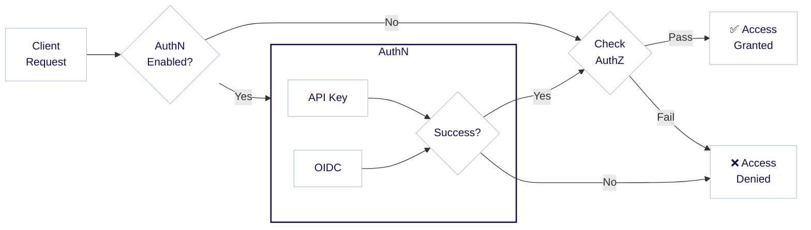

:::info 認証と認可
認証と認可は密接に関連する概念で、`AuthN` と `AuthZ` と略されることがあります。認証 (`AuthN`) はユーザーの身元を検証するプロセスであり、認可 (`AuthZ`) はユーザーが持つ権限を決定するプロセスです。
:::

Weaviate は API キーまたは OpenID Connect (OIDC) によるユーザー認証を通じてアクセスを制御し、匿名アクセスを許可するオプションも提供します。その後、ユーザーに対して下図のように異なる [認可](./authorization.md) レベルを割り当てることができます。



たとえば、API キー `jane-secret` でログインしたユーザーには管理者権限を付与し、`ian-secret` でログインした別のユーザーには読み取り専用権限を付与するといった運用が可能です。

まとめると、Weaviate では次の認証方法を利用できます。

- API キー
- OpenID Connect (OIDC)
- 匿名アクセス (認証なし。開発や評価目的を除き推奨されません)

API キー認証と OIDC 認証は同時に有効化できます。

認証の設定方法はデプロイ方法によって異なり、Docker か Kubernetes かで設定が変わります。以下にそれぞれの例を示します。

:::info Weaviate Cloud (WCD) について
Weaviate Cloud (WCD) インスタンスでは、OIDC と API キーによる認証があらかじめ設定されています。WCD の資格情報で OIDC を使って [Weaviate へ認証](/weaviate/connections/connect-cloud.mdx) するか、[API キー](/cloud/manage-clusters/connect.mdx) を用いて接続できます。
:::

## API キー認証

API キー認証はシンプルかつ効果的なユーザー認証方法です。各ユーザーには一意の API キーが割り当てられ、そのキーでユーザーを認証します。

### API キー: データベースユーザー

[データベースユーザーをプログラムから作成](/weaviate/configuration/rbac/manage-users.mdx#create-a-user) する際、各ユーザーには作成時に固有の API キーが割り当てられます。これらの API キーは [再生成 (ローテーション)](/weaviate/configuration/rbac/manage-users.mdx#rotate-user-api-key) することも可能です。 

### API キー: Docker

API キー認証は環境変数で設定できます。Docker Compose では、以下のように構成ファイル (`docker-compose.yml`) に設定します。

```yaml
services:
  weaviate:
    ...
    environment:
      ...
      # Disable anonymous access.
      AUTHENTICATION_ANONYMOUS_ACCESS_ENABLED: 'false'

      # Enables API key authentication.
      AUTHENTICATION_APIKEY_ENABLED: 'true'

      # List one or more keys in plaintext separated by commas. Each key corresponds to a specific user identity below.
      AUTHENTICATION_APIKEY_ALLOWED_KEYS: 'user-a-key,user-b-key'

      # List one or more user identities, separated by commas. Each identity corresponds to a specific key above.
      AUTHENTICATION_APIKEY_USERS: 'user-a,user-b'
```

この設定では以下を行っています。
- 匿名アクセスを無効化
- API キー認証を有効化
- `AUTHENTICATION_APIKEY_ALLOWED_KEYS` に平文の API キーを定義
- `AUTHENTICATION_APIKEY_USERS` で API キーにユーザーを関連付け

これらのユーザーには、後述の認可設定に基づいて権限を割り当てられます。

import DynamicUserManagement from '/_includes/configuration/dynamic-user-management.mdx';

<DynamicUserManagement />

:::note
次のいずれかの方法で設定してください。
- すべての API キーに対して 1 つのユーザーを設定する  
- API キーごとに 1 つのユーザーを設定する (ユーザー数と API キー数を一致させる)

列挙されたすべてのユーザーが認可設定にも含まれていることを確認してください。
:::

### API キー: Kubernetes

Helm を用いた Kubernetes デプロイでは、`values.yaml` の `authentication` セクションで API キー認証を設定します。以下は例です。

```yaml
authentication:
  anonymous_access:
    # Disable anonymous access.
    enabled: false

  apikey:
    # Enables API key authentication.
    enabled: true

    # List one or more keys in plaintext separated by commas. Each key corresponds to a specific user identity below.
    allowed_keys:
      - user-a-key
      - user-b-key

    # List one or more user identities, separated by commas. Each identity corresponds to a specific key above.
    users:
      - user-a
      - user-b
```

この設定では以下を行っています。

- 匿名アクセスを無効化
- API キー認証を有効化
- `allowed_keys` に平文の API キーを定義
- `users` で API キーにユーザーを関連付け

:::warning 環境変数が優先されます
API キーを環境変数で設定した場合、その設定が `values.yaml` より優先されます。Helm の設定を使用する場合は、該当する環境変数を設定しないでください。
:::

本番環境でのセキュリティを高めるため、API キーを Kubernetes のシークレットに格納し、平文ではなく環境変数経由で参照する方法を推奨します。

## OIDC 認証

OIDC 認証では、リソース (Weaviate) がアイデンティティプロバイダーから発行されたトークンを検証します。アイデンティティプロバイダーがユーザーを認証してトークンを発行し、Weaviate がそのトークンを検証します。

一例として、Weaviate インスタンスがリソース、Weaviate Cloud (WCD) がアイデンティティプロバイダー、そして Weaviate クライアントがユーザーの代理として振る舞う構成が考えられます。

OpenID Connect Discovery を実装する任意の「OpenID Connect」互換トークン発行者は Weaviate と互換性があります。

ここでは Weaviate をリソースとして設定する方法を説明します。

<details>
  <summary>
    OIDC について詳しく
  </summary>

[OpenID Connect](https://openid.net/connect/) (OAuth2 に基づく) では、外部のアイデンティティプロバイダー兼トークン発行者 (以下「トークン発行者」) がユーザー管理を担当します。

OIDC 認証では、トークン発行者から有効なトークンを取得し、それを Weaviate へのすべてのリクエストのヘッダーに含める必要があります。REST と GraphQL の両方に適用されます。

Weaviate がトークン (JSON Web Token、JWT) を受け取ると、設定されたトークン発行者によって署名されたものであるかを検証します。署名が正しければトークン内容を信頼し、その情報に基づいてユーザーを認証します。

</details>

:::tip TIP: OIDC と RBAC
[user management API](/weaviate/configuration/rbac/manage-users.mdx#oidc-user-permissions-management) を使用すると、[ロールベースアクセス制御 (RBAC)](/weaviate/configuration/rbac/index.mdx) を通じて OIDC ユーザーにカスタムロールと権限を割り当てられます。
:::

### OIDC: Docker

OIDC 認証を利用するには、以下の環境変数を構成ファイルに追加して Weaviate を設定します。

`docker-compose.yml` の例は次のとおりです。

```yaml
services:
  weaviate:
    ...
    environment:
      ...
      # enabled (optional - defaults to false) turns OIDC auth on. All other fields in
      # this section will only be validated if enabled is set to true.
      AUTHENTICATION_OIDC_ENABLED: 'true'

      # issuer (required) tells weaviate how to discover the token issuer. This
      # endpoint must implement the OpenID Connect Discovery spec, so that weaviate
      # can retrieve the issuer's public key.
      #
      # The example URL below uses the path structure commonly found with keycloak
      # where an example realm 'my-weaviate-usecase' was created. The exact
      # path structure depends on the token issuer. See the token issuer's documentation
      # about which endpoint implements OIDC Discovery.
      AUTHENTICATION_OIDC_ISSUER: 'http://my-token-issuer/auth/realms/my-weaviate-usecase'

      # client_id (required unless skip_client_id_check is set to true) tells
      # Weaviate to check for a particular OAuth 2.0 client_id in the audience claim.
      # This is to prevent that a token which was signed by the correct issuer
      # but never intended to be used with Weaviate can be used for authentication.
      #
      # For more information on what clients are in OAuth 2.0, see
      # https://tools.ietf.org/html/rfc6749#section-1.1
      AUTHENTICATION_OIDC_CLIENT_ID: 'my-weaviate-client'

      # username_claim (required) tells Weaviate which claim in the token to use for extracting
      # the username. The username will be passed to the authorization plugin.
      AUTHENTICATION_OIDC_USERNAME_CLAIM: 'email'

      # skip_client_id_check (optional, defaults to false) skips the client_id
      # validation in the audience claim as outlined in the section above.
      # Not recommended to set this option as it reduces security, only set this
      # if your token issuer is unable to provide a correct audience claim
      AUTHENTICATION_OIDC_SKIP_CLIENT_ID_CHECK: 'false'

      # scope (optional) these will be used by clients as default scopes for authentication
      AUTHENTICATION_OIDC_SCOPES: ''
```

:::info OIDC と Azure
2022 年 11 月時点で、Microsoft Azure の OIDC 実装に他と異なる点があることを確認しています。Azure を使用していて問題が発生する場合は、[こちらの外部ブログ記事](https://xsreality.medium.com/making-azure-ad-oidc-compliant-5734b70c43ff) が参考になるかもしれません。
:::


### OIDC：Kubernetes

Helm を使用した Kubernetes デプロイメントでは、`values.yaml` ファイルの `authentication` セクションで OIDC 認証を構成できます。以下は設定例です。

```yaml
authentication:
  anonymous_access:
    # Disable anonymous access.
    enabled: false
  oidc:
    # enabled (optional - defaults to false) turns OIDC auth on. All other fields in
    # this section will only be validated if enabled is set to true.
    enabled: true

    # issuer (required) tells weaviate how to discover the token issuer. This
    # endpoint must implement the OpenID Connect Discovery spec, so that weaviate
    # can retrieve the issuer's public key.
    #
    # The example URL below uses the path structure commonly found with keycloak
    # where an example realm 'my-weaviate-usecase' was created. The exact
    # path structure depends on the token issuer. See the token issuer's documentation
    # about which endpoint implements OIDC Discovery.
    issuer: 'http://my-token-issuer/auth/realms/my-weaviate-usecase'

    # client_id (required unless skip_client_id_check is set to true) tells
    # Weaviate to check for a particular OAuth 2.0 client_id in the audience claim.
    # This is to prevent that a token which was signed by the correct issuer
    # but never intended to be used with Weaviate can be used for authentication.
    #
    # For more information on what clients are in OAuth 2.0, see
    # https://tools.ietf.org/html/rfc6749#section-1.1
    client_id: 'my-weaviate-client'

    # username_claim (required) tells Weaviate which claim in the token to use for extracting
    # the username. The username will be passed to the authorization plugin.
    username_claim: 'email'

    # skip_client_id_check (optional, defaults to false) skips the client_id
    # validation in the audience claim as outlined in the section above.
    # Not recommended to set this option as it reduces security, only set this
    # if your token issuer is unable to provide a correct audience claim
    skip_client_id_check: 'false'

    # scope (optional) these will be used by clients as default scopes for authentication
    scopes: ''

    # groups_claim: ''
```

### 注記：OIDC トークン発行者の設定

OIDC トークン発行者の設定は本ドキュメントの範囲外ですが、出発点としていくつかの選択肢を示します。

- 単一ユーザーなどのシンプルなユースケースの場合、OIDC トークン発行者として Weaviate Cloud (WCD) を使用できます。その手順は次のとおりです。  
    - WCD アカウントをお持ちでない場合は、[こちら](https://console.weaviate.cloud/) からサインアップしてください。  
    - Docker Compose ファイル (例：`docker-compose.yml`) で次を指定します。  
      - `AUTHENTICATION_OIDC_ISSUER` に `https://auth.wcs.api.weaviate.io/auth/realms/SeMI` を issuer として設定  
      - `AUTHENTICATION_OIDC_CLIENT_ID` に `wcs` を client id として設定  
      - `AUTHORIZATION_ADMINLIST_ENABLED: 'true'` で adminlist を有効化し、`AUTHORIZATION_ADMINLIST_USERS` に WCD アカウントのメールアドレスを追加  
      - `AUTHENTICATION_OIDC_USERNAME_CLAIM` に `email` を username claim として設定  

- さらにカスタマイズが必要な場合は、[Okta](https://www.okta.com/) などの商用 OIDC プロバイダーを利用できます。  
- もう一つの選択肢として、自身で OIDC トークン発行者サーバーを運用する方法もあります。これは最も複雑ですが柔軟性の高い解決策です。代表的な OSS には Java ベースの [Keycloak](https://www.keycloak.org/) や Golang ベースの [dex](https://github.com/dexidp/dex) があります。

:::info
デフォルトでは、Weaviate はトークンに指定された client id が audience クレームに含まれているか検証します。トークン発行者がこの機能をサポートしていない場合は、下記の設定で無効化できます。
:::

## Anonymous Access

Weaviate は匿名リクエストを受け付けるように構成できますが、開発または評価目的以外での使用は強く非推奨です。

明示的な認証なしでリクエストを送信したユーザーは、`user: anonymous` として認証されます。

authorization プラグインを使用して、この `anonymous` ユーザーに適用する権限を指定できます。匿名アクセスを完全に無効にしている場合、許可された認証方式を伴わないリクエストは `401 Unauthorized` を返します。

### Anonymous access：Docker

Docker Compose で匿名アクセスを有効にするには、次の環境変数を設定ファイルに追加します。

```yaml
services:
  weaviate:
    ...
    environment:
      ...
      AUTHENTICATION_ANONYMOUS_ACCESS_ENABLED: 'true'
```

### Anonymous access：Kubernetes

Kubernetes で匿名アクセスを有効にするには、`values.yaml` ファイルに次の設定を追加します。

```yaml
authentication:
  anonymous_access:
    enabled: true
```

## 参考資料

- [設定：Authorization と RBAC](./authorization.md)
- [リファレンス：環境変数 / 認証と認可](/deploy/configuration/env-vars#authentication-and-authorization)

## 質問とフィードバック

import DocsFeedback from '/_includes/docs-feedback.mdx';

<DocsFeedback/>

