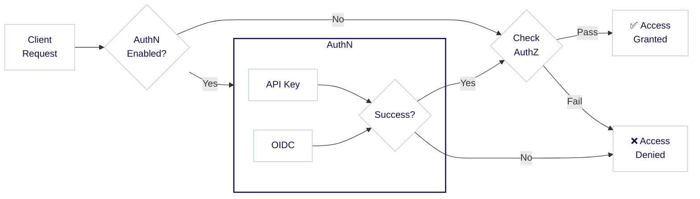

:::info Authentication and authorization
認証と認可は密接に関連する概念で、しばしば `AuthN` と `AuthZ` と略されます。認証 ( `AuthN` ) はユーザーの身元を検証するプロセスであり、認可 ( `AuthZ` ) はユーザーが持つ権限を決定するプロセスです。
:::

Weaviate は、 API キーまたは OpenID Connect ( OIDC ) を使用したユーザー認証によってアクセスを制御し、匿名アクセスもオプションとして提供します。ユーザーには、下図のように異なる [認可](./authorization.md) レベルを割り当てることができます。



たとえば、 API キー `jane-secret` でログインしたユーザーには管理者権限が付与され、 API キー `ian-secret` でログインした別のユーザーには読み取り専用権限が付与される、といった使い分けが可能です。

まとめると、 Weaviate では次の認証方法を利用できます。

- API キー
- OpenID Connect ( OIDC )
- 匿名アクセス ( 認証なし。本番環境以外の開発・評価時のみ推奨 )

API キー認証と OIDC 認証は同時に有効化できます。

認証の設定方法は、 Docker で実行するか Kubernetes で実行するかといったデプロイ方法によって異なります。以下では両方の例を示します。

:::info What about Weaviate Cloud (WCD)?
Weaviate Cloud ( WCD ) インスタンスでは、 OIDC と API キーのアクセスがあらかじめ設定されています。 WCD の認証情報を使用して [OIDC で Weaviate に認証](/weaviate/connections/connect-cloud.mdx) するか、[API キー](/cloud/manage-clusters/connect.mdx) を用いて接続できます。
:::

## API キー認証

API キー認証は、ユーザーを認証するための簡単かつ効果的な方法です。各ユーザーには一意の API キーが割り当てられ、そのキーを用いて認証が行われます。

### API キー: データベースユーザー

[プログラムでデータベースユーザーを作成](/weaviate/configuration/rbac/manage-users.mdx#create-a-user) すると、各ユーザーには作成時に固有の API キーが割り当てられます。これらの API キーは [再生成 ( ローテーション )](/weaviate/configuration/rbac/manage-users.mdx#rotate-user-api-key) することも可能です。 

### API キー: Docker

API キー認証は環境変数で設定できます。 Docker Compose では、以下の例のように構成ファイル ( `docker-compose.yml` ) に設定します。

```yaml
services:
  weaviate:
    ...
    environment:
      ...
      # Disable anonymous access.
      AUTHENTICATION_ANONYMOUS_ACCESS_ENABLED: 'false'

      # Enables API key authentication.
      AUTHENTICATION_APIKEY_ENABLED: 'true'

      # List one or more keys in plaintext separated by commas. Each key corresponds to a specific user identity below.
      AUTHENTICATION_APIKEY_ALLOWED_KEYS: 'user-a-key,user-b-key'

      # List one or more user identities, separated by commas. Each identity corresponds to a specific key above.
      AUTHENTICATION_APIKEY_USERS: 'user-a,user-b'
```

この設定は次のことを行います。
- 匿名アクセスを無効化
- API キー認証を有効化
- `AUTHENTICATION_APIKEY_ALLOWED_KEYS` に平文の API キーを定義
- `AUTHENTICATION_APIKEY_USERS` に API キーと関連付けるユーザーを定義

これらのユーザーには、認可設定に基づいて権限を割り当てられます。

import DynamicUserManagement from '/_includes/configuration/dynamic-user-management.mdx';

<DynamicUserManagement />

:::note
次のいずれかを選択できます。
- すべての API キーに対して 1 人のユーザーを設定する  
- API キーごとに 1 人のユーザーを定義する ( ユーザー数と API キー数を一致させる )

列挙したすべてのユーザーが認可設定にも含まれていることを確認してください。
:::

### API キー: Kubernetes

Kubernetes で Helm を使用する場合、 API キー認証は `values.yaml` の `authentication` セクションで設定できます。以下に例を示します。

```yaml
authentication:
  anonymous_access:
    # Disable anonymous access.
    enabled: false

  apikey:
    # Enables API key authentication.
    enabled: true

    # List one or more keys in plaintext separated by commas. Each key corresponds to a specific user identity below.
    allowed_keys:
      - user-a-key
      - user-b-key

    # List one or more user identities, separated by commas. Each identity corresponds to a specific key above.
    users:
      - user-a
      - user-b
```

この設定は次のことを行います。

- 匿名アクセスを無効化
- API キー認証を有効化
- `allowed_keys` に平文の API キーを定義
- `users` に API キーと関連付けるユーザーを定義

:::warning Environment Variables Take Precedence
環境変数で API キーを設定した場合、その設定が `values.yaml` の値より優先されます。 Helm の値を使用する場合は、対応する環境変数を設定しないようにしてください。
:::

本番環境でのセキュリティを強化するために、 API キーを Kubernetes のシークレットに格納し、 Helm の値に平文ではなく環境変数として参照する方法も推奨されます。

## OIDC 認証

OIDC 認証では、リソース ( Weaviate ) がアイデンティティプロバイダーによって発行されたトークンを検証する必要があります。アイデンティティプロバイダーはユーザーを認証し、トークンを発行し、それを Weaviate が検証します。

一例として、 Weaviate インスタンスがリソースとして機能し、 Weaviate Cloud ( WCD ) がアイデンティティプロバイダーとして機能し、 Weaviate クライアントがユーザーの代理として動作します。

OpenID Connect Discovery を実装する「 OpenID Connect 」互換のトークン発行者であれば、 Weaviate と互換性があります。

本ドキュメントでは、リソースとしての Weaviate をどのように設定するかを説明します。

<details>
  <summary>詳細: OIDC について</summary>

[OpenID Connect](https://openid.net/connect/) ( OAuth2 をベース ) では、外部のアイデンティティプロバイダー兼トークン発行者 ( 以降「トークン発行者」 ) がユーザー管理を担当します。

OIDC 認証では、トークン発行者から有効なトークンを取得し、それを Weaviate へのリクエストヘッダーに含める必要があります。これは REST と GraphQL の両方のリクエストに当てはまります。

Weaviate がトークン ( JSON Web Token または JWT ) を受け取ると、設定されたトークン発行者によって実際に署名されているかを検証します。署名が正しければ、トークンの内容は信頼され、その情報に基づいてユーザーが認証されます。

</details>

:::tip TIP: OIDC and RBAC
[ユーザー管理 API](/weaviate/configuration/rbac/manage-users.mdx#oidc-user-permissions-management) を使用すると、 [ロールベースアクセス制御 ( RBAC )](/weaviate/configuration/rbac/index.mdx) により OIDC ユーザーにカスタムロールと権限を割り当てることができます。
:::

### OIDC: Docker

OIDC ベースの認証を Weaviate に設定するには、次の環境変数を構成ファイルに追加します。

例として、 `docker-compose.yml` は次のようになります。

```yaml
services:
  weaviate:
    ...
    environment:
      ...
      # enabled (optional - defaults to false) turns OIDC auth on. All other fields in
      # this section will only be validated if enabled is set to true.
      AUTHENTICATION_OIDC_ENABLED: 'true'

      # issuer (required) tells weaviate how to discover the token issuer. This
      # endpoint must implement the OpenID Connect Discovery spec, so that weaviate
      # can retrieve the issuer's public key.
      #
      # The example URL below uses the path structure commonly found with keycloak
      # where an example realm 'my-weaviate-usecase' was created. The exact
      # path structure depends on the token issuer. See the token issuer's documentation
      # about which endpoint implements OIDC Discovery.
      AUTHENTICATION_OIDC_ISSUER: 'http://my-token-issuer/auth/realms/my-weaviate-usecase'

      # client_id (required unless skip_client_id_check is set to true) tells
      # Weaviate to check for a particular OAuth 2.0 client_id in the audience claim.
      # This is to prevent that a token which was signed by the correct issuer
      # but never intended to be used with Weaviate can be used for authentication.
      #
      # For more information on what clients are in OAuth 2.0, see
      # https://tools.ietf.org/html/rfc6749#section-1.1
      AUTHENTICATION_OIDC_CLIENT_ID: 'my-weaviate-client'

      # username_claim (required) tells Weaviate which claim in the token to use for extracting
      # the username. The username will be passed to the authorization plugin.
      AUTHENTICATION_OIDC_USERNAME_CLAIM: 'email'

      # skip_client_id_check (optional, defaults to false) skips the client_id
      # validation in the audience claim as outlined in the section above.
      # Not recommended to set this option as it reduces security, only set this
      # if your token issuer is unable to provide a correct audience claim
      AUTHENTICATION_OIDC_SKIP_CLIENT_ID_CHECK: 'false'

      # scope (optional) these will be used by clients as default scopes for authentication
      AUTHENTICATION_OIDC_SCOPES: ''
```

:::info OIDC and Azure
2022 年 11 月時点で、 Microsoft Azure の OIDC 実装は他と比較していくつかの違いがあることを確認しています。 Azure を利用していて問題が発生する場合は、[こちらの外部ブログ記事](https://xsreality.medium.com/making-azure-ad-oidc-compliant-5734b70c43ff) が参考になるかもしれません。
:::


### OIDC：Kubernetes

Helm を使用した Kubernetes デプロイメントでは、OIDC 認証を `authentication` セクション配下の `values.yaml` ファイルで設定できます。以下は設定例です。

```yaml
authentication:
  anonymous_access:
    # Disable anonymous access.
    enabled: false
  oidc:
    # enabled (optional - defaults to false) turns OIDC auth on. All other fields in
    # this section will only be validated if enabled is set to true.
    enabled: true

    # issuer (required) tells weaviate how to discover the token issuer. This
    # endpoint must implement the OpenID Connect Discovery spec, so that weaviate
    # can retrieve the issuer's public key.
    #
    # The example URL below uses the path structure commonly found with keycloak
    # where an example realm 'my-weaviate-usecase' was created. The exact
    # path structure depends on the token issuer. See the token issuer's documentation
    # about which endpoint implements OIDC Discovery.
    issuer: 'http://my-token-issuer/auth/realms/my-weaviate-usecase'

    # client_id (required unless skip_client_id_check is set to true) tells
    # Weaviate to check for a particular OAuth 2.0 client_id in the audience claim.
    # This is to prevent that a token which was signed by the correct issuer
    # but never intended to be used with Weaviate can be used for authentication.
    #
    # For more information on what clients are in OAuth 2.0, see
    # https://tools.ietf.org/html/rfc6749#section-1.1
    client_id: 'my-weaviate-client'

    # username_claim (required) tells Weaviate which claim in the token to use for extracting
    # the username. The username will be passed to the authorization plugin.
    username_claim: 'email'

    # skip_client_id_check (optional, defaults to false) skips the client_id
    # validation in the audience claim as outlined in the section above.
    # Not recommended to set this option as it reduces security, only set this
    # if your token issuer is unable to provide a correct audience claim
    skip_client_id_check: 'false'

    # scope (optional) these will be used by clients as default scopes for authentication
    scopes: ''

    # groups_claim: ''
```

### 注記：OIDC トークン発行者の設定

import WCDOIDCWarning from '/_includes/wcd-oidc.mdx';

<WCDOIDCWarning/>

OIDC トークン発行者の設定は本ドキュメントの範囲外ですが、出発点としていくつかの選択肢を示します。

- 単一ユーザーなどのシンプルなユースケースの場合、OIDC トークン発行者として Weaviate Cloud (WCD) を利用できます。手順は次のとおりです。  
    - WCD アカウントをお持ちでない場合は、[こちらからサインアップ](https://console.weaviate.cloud/)してください。  
    - Docker Compose ファイル（例：`docker-compose.yml`）で以下を指定します。  
      - 発行者 (`AUTHENTICATION_OIDC_ISSUER`) に `https://auth.wcs.api.weaviate.io/auth/realms/SeMI`  
      - クライアント ID (`AUTHENTICATION_OIDC_CLIENT_ID`) に `wcs`  
      - 管理者リストを有効化 (`AUTHORIZATION_ADMINLIST_ENABLED: 'true'`) し、`AUTHORIZATION_ADMINLIST_USERS` にご自身の WCD アカウントのメールアドレスを追加  
      - ユーザー名クレーム (`AUTHENTICATION_OIDC_USERNAME_CLAIM`) に `email`
- さらに高度にカスタマイズしたい場合は、[Okta](https://www.okta.com/) のような商用 OIDC プロバイダーを利用できます。
- 代替案として、独自に OIDC トークン発行サーバーを運用することもできます。これは最も複雑ですが柔軟に構成可能な方法です。代表的な OSS には Java ベースの [Keycloak](https://www.keycloak.org/) や Golang ベースの [dex](https://github.com/dexidp/dex) があります。

:::info
デフォルトでは、Weaviate はトークンの audience クレームに指定されたクライアント ID が含まれているかを検証します。トークン発行者がこの機能をサポートしていない場合は、後述の設定で無効化できます。
:::

## 匿名アクセス

Weaviate は匿名リクエストを受け付けるよう構成できます。ただし、開発や評価目的以外で使用することは強く推奨しません。

明示的な認証なしでリクエストを送信したユーザーは `user: anonymous` として認証されます。

authorization プラグインを使用して、この `anonymous` ユーザーに適用する権限を指定できます。匿名アクセスを無効にしている場合、許可されていない認証方式のリクエストは `401 Unauthorized` を返します。

### 匿名アクセス：Docker

Docker Compose で匿名アクセスを有効にするには、次の環境変数を設定ファイルに追加します。

```yaml
services:
  weaviate:
    ...
    environment:
      ...
      AUTHENTICATION_ANONYMOUS_ACCESS_ENABLED: 'true'
```

### 匿名アクセス：Kubernetes

Kubernetes で匿名アクセスを有効にするには、`values.yaml` ファイルに次の設定を追加します。

```yaml
authentication:
  anonymous_access:
    enabled: true
```

## 参考資料

- [構成：認可と RBAC](./authorization.md)
- [リファレンス：環境変数 / 認証と認可](/deploy/configuration/env-vars#authentication-and-authorization)

## 質問とフィードバック

import DocsFeedback from '/_includes/docs-feedback.mdx';

<DocsFeedback/>


