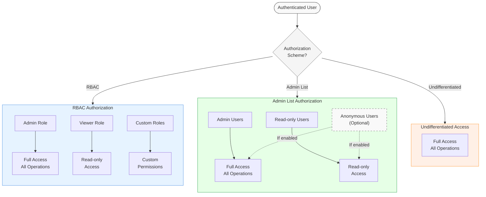

:::info 認証と認可
認証と認可は密接に関連する概念で、しばしば `AuthN` と `AuthZ` と省略されます。認証（`AuthN`）はユーザーの身元を確認するプロセスであり、認可（`AuthZ`）はそのユーザーがどのような権限を持つかを決定するプロセスです。
:::

 Weaviate は、ユーザーの [authentication](./authentication.md) 状態に基づいて [authorization](./authorization.md) レベルによる差別化されたアクセスを提供します。ユーザーには管理者権限、読み取り専用権限、または権限なしを付与できます。`v1.29.0` から、 Weaviate はユーザー権限をより細かく制御できる [Role-Based Access Control (RBAC)](/weaviate/configuration/rbac) もサポートしています。

次の図は、ユーザーリクエストが認証と認可を通過するフローを示しています。



## 利用可能な認可方式

 Weaviate では、次の認可方式が利用できます。

- [ロールベースアクセス制御 (RBAC)](#ロールベースアクセス制御-rbac)
- [管理者リスト](#管理者リスト)
- [区別のないアクセス](#区別のないアクセス)

管理者リスト方式では、[匿名ユーザー](#匿名ユーザー) に権限を付与できます。

認可の設定方法は、 Weaviate を Docker で実行するか Kubernetes で実行するかなど、デプロイ方法によって異なります。以下では、両方の例を示します。

:::info Weaviate Cloud (WCD) について
 Weaviate Cloud (WCD) インスタンスでは、認可は管理者リスト方式であらかじめ設定されています。OIDC を使用して WCD 資格情報で [ Weaviate に認証](/weaviate/connections/connect-cloud.mdx) するか、[管理者または読み取り専用 API キー](/cloud/manage-clusters/connect.mdx) で接続できます。  
<br/>

RBAC アクセスは将来のリリースで WCD に追加される予定です。
:::

## ロールベースアクセス制御 (RBAC)

:::info `v1.29` から利用可能
ロールベースアクセス制御 (RBAC) は、バージョン `v1.29` から Weaviate で一般利用可能です。
:::

ロールベースアクセス制御 (RBAC) は、ユーザーのロールに基づいてリソースへのアクセスを制限する方法です。 Weaviate では、RBAC を使用して **ロール** を定義し、そのロールに **権限** を割り当てることができます。ユーザーをロールに割り当てると、そのロールに関連付けられた権限を継承します。

RBAC の設定方法やロール・ユーザー管理の例については、専用の **[RBAC ドキュメント](/weaviate/configuration/rbac/index.mdx)** を参照してください。 Weaviate インスタンスでの [RBAC の設定](/deploy/configuration/configuring-rbac.md) や [ロールとユーザーの管理](/weaviate/configuration/rbac/manage-roles.mdx) 方法が記載されています。

## 管理者リスト

「管理者リスト」認可方式では、 Weaviate 内のすべての操作を実行できるフル権限を持つ管理者ユーザーと、読み取り操作のみを実行できる読み取り専用ユーザーのリストを指定できます。

これらの権限はカスタマイズや拡張ができません。より細かい権限制御が必要な場合は、[RBAC](#ロールベースアクセス制御-rbac) を利用してください。

管理者リスト方式は RBAC と併用できません。

### 管理者リスト: Docker

管理者リスト認可は環境変数で設定できます。Docker Compose では、以下のように `docker-compose.yml` に設定します。

```yaml
services:
  weaviate:
    ...
    environment:
      ...
      # Example authentication configuration using API keys
      # OIDC access can also be used with RBAC
      AUTHENTICATION_ANONYMOUS_ACCESS_ENABLED: 'false'
      AUTHENTICATION_APIKEY_ENABLED: 'true'
      AUTHENTICATION_APIKEY_ALLOWED_KEYS: 'user-a-key,user-b-key,user-c-key'
      AUTHENTICATION_APIKEY_USERS: 'user-a,user-b,user-c'

      # Authorization configuration
      # Enable admin list
      AUTHORIZATION_ADMINLIST_ENABLED: 'true'

      # Provide pre-configured roles to users
      # This assumes that the relevant user has been authenticated and identified
      #
      # You MUST define at least one admin user
      AUTHORIZATION_ADMINLIST_USERS: 'user-a'
      AUTHORIZATION_ADMINLIST_READONLY_USERS: 'user-b'
```

この設定では以下を行っています。
- 管理者リスト認可を有効化
- `user-a` を組み込みの管理者権限ユーザーとして設定
- `user-b` を組み込みの閲覧者権限ユーザーとして設定

この構成では、`user-c` には権限がありません。

### 管理者リスト: Kubernetes

Helm を使用した Kubernetes デプロイでは、`values.yaml` の `authorization` セクションで API キー認証を設定します。以下はその例です。

```yaml
# Example authentication configuration using API keys
authentication:
  anonymous_access:
    enabled: false
  apikey:
    enabled: true
    allowed_keys:
      - user-a-key
      - user-b-key
      - user-c-key
    users:
      - user-a
      - user-b
      - user-c

# Authorization configuration
authorization:
  admin_list:
    # Enable admin list
    enabled: true

    # Provide pre-configured roles to users
    # This assumes that the relevant user has been authenticated and identified
    #
    # You MUST define at least one admin user
    users:
    - user-a
    read_only_users:
    - user-b
```

### 匿名ユーザー

匿名ユーザーは Weaviate では `anonymous` として識別されます。管理者リスト認可方式では、匿名ユーザーに権限を付与できます。RBAC 方式は匿名ユーザーに対応していません。

管理者リスト方式で匿名ユーザーに権限を与えるには、以下のように設定で `anonymous` キーワードを使用します。

import Tabs from '@theme/Tabs';
import TabItem from '@theme/TabItem';

<Tabs groupId="platforms">

  <TabItem value="docker" label="Docker">

```yaml
services:
  weaviate:
    ...
    environment:
      ...
      # Enable anonymous access
      AUTHENTICATION_ANONYMOUS_ACCESS_ENABLED: 'true'

      # Configure admin user API key
      AUTHORIZATION_ADMINLIST_ENABLED: 'true'
      AUTHENTICATION_APIKEY_ALLOWED_KEYS: 'user-a-key'
      AUTHENTICATION_APIKEY_USERS: 'user-a'

      # Enable admin list and provide admin access to "user-a" only
      AUTHORIZATION_ADMINLIST_USERS: 'user-a'
      # Provide read-only access to anonymous users
      AUTHORIZATION_ADMINLIST_READONLY_USERS: 'anonymous'
```

  </TabItem>

  <TabItem value="kubernetes" label="Kubernetes">

```yaml
# Example authentication configuration using API keys
authentication:
  # Enable anonymous access
  anonymous_access:
    enabled: true

  # Enable admin list and configure admin user API key
  apikey:
    enabled: true
    allowed_keys:
      - user-a-key
    users:
      - user-a

authorization:
  # Enable admin list and provide admin access to "user-a" only
  admin_list:
    # Enable admin list
    enabled: true
    users:
    - user-a
    # Provide read-only access to anonymous users
    read_only_users:
    - anonymous
```

  </TabItem>

</Tabs>

## 区別のないアクセス

 Weaviate は、たとえば認証を無効にして匿名アクセスを有効にすることで、区別のないアクセスを提供するように設定できます。本番環境では推奨されず、開発や評価目的に限って使用してください。

## さらに詳しく

- [設定: 認証](./authentication.md)
- [設定: RBAC](/weaviate/configuration/rbac/index.mdx)
- [リファレンス: 環境変数 / 認証と認可](/deploy/configuration/env-vars/index.md#authentication-and-authorization)

## 質問とフィードバック

import DocsFeedback from '/_includes/docs-feedback.mdx';

<DocsFeedback/>

