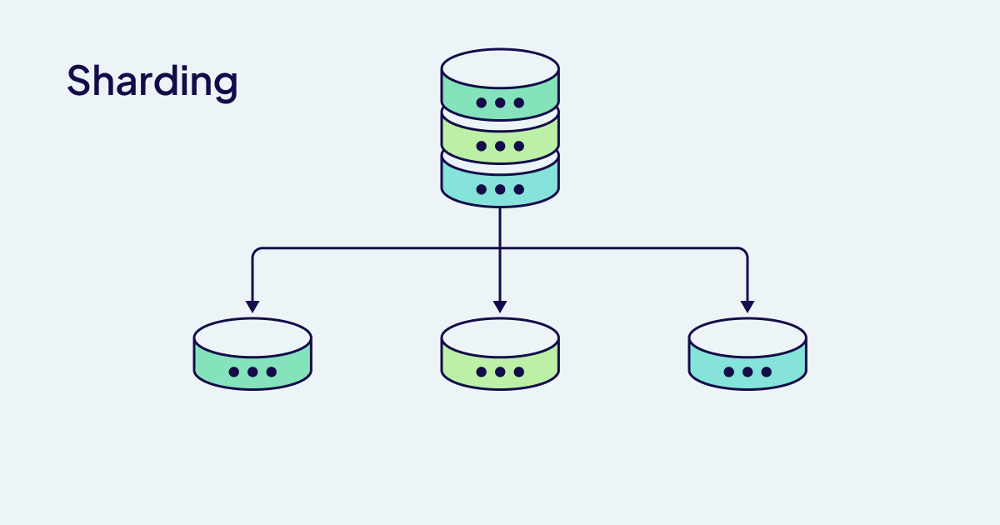

import FilteredTextBlock from '@site/src/components/Documentation/FilteredTextBlock';
import TabItem from '@theme/TabItem';
import Tabs from '@theme/Tabs';
import PyCode from '!!raw-loader!/_includes/code/howto/manage-data.collections.py';
import PyCodeV3 from '!!raw-loader!/_includes/code/howto/manage-data.collections-v3.py';
import TSCode from '!!raw-loader!/_includes/code/howto/manage-data.collections.ts';
import TSCodeLegacy from '!!raw-loader!/_includes/code/howto/manage-data.collections-v2.ts';
import JavaCode from '!!raw-loader!/_includes/code/howto/java/src/test/java/io/weaviate/docs/manage-data.classes.java';
import GoCode from '!!raw-loader!/_includes/code/howto/go/docs/manage-data.classes_test.go';


Weaviate には、デプロイをスケールさせるための 2 つの補完的な強み ― シャーディングとレプリケーション ― があります。  
シャーディングはデータを分割して複数ノードに分散させることで、単一マシンでは処理できないほど大きなデータセットを扱えるようにします。  
一方、レプリケーションはデータの冗長コピーを作成し、個々のノードが障害やメンテナンスで停止しても高可用性を維持します。  
どちらのスケーリング方式も単独で優れていますが、両者を組み合わせることで真の力を発揮します。

これらの機能を活用し、大規模かつ堅牢なデプロイを構築する方法を見ていきましょう!

## Scaling Methods


### Replication

レプリケーションはデータの冗長コピーを作成し、高可用性が必要な場合に役立ちます。


### Sharding

シャーディングはデータをノード間で分割し、単一ノードでは扱えない大規模データセットに対応します。




### Choosing your strategy

<table className="decision-matrix">
  <colgroup>
    <col style={{ width: '25%' }} />
    <col style={{ width: '15%' }} />
    <col style={{ width: '15%' }} />
    <col style={{ width: '15%' }} />
    <col style={{ width: '30%' }} />
  </colgroup>
  <thead>
    <tr>
      <th>要件 / 目的</th>
      <th>シャーディング</th>
      <th>レプリケーション</th>
      <th>両方併用</th>
      <th>主な検討事項</th>
    </tr>
  </thead>
  <tbody>
    <tr>
      <td>
        <strong>単一ノードでは収まらないデータセットを扱う</strong>
      </td>
      <td className="access-cell" style={{ textAlign: 'center' }}>
        <div className="access-level">はい</div>
      </td>
      <td className="access-cell" style={{ textAlign: 'center' }}>
        <div className="access-level">いいえ</div>
      </td>
      <td className="access-cell" style={{ textAlign: 'center' }}>
        <div className="access-level">はい</div>
      </td>
      <td className="constraints-cell">
        <div className="constraints-level">
          <p><strong>どれくらいのデータを保存しますか？</strong></p>
          <ul>
            <li>
              ベクトルの次元数と数がメモリ要件を決定します
            </li>
            <li>
              シャーディングでこれを複数ノードに分散します
            </li>
          </ul>
        </div>
      </td>
    </tr>
    <tr>
      <td>
        <strong>クエリスループットを向上させる</strong>
      </td>
      <td className="access-cell" style={{ textAlign: 'center' }}>
        <div className="access-level">たぶん*</div>
      </td>
      <td className="access-cell" style={{ textAlign: 'center' }}>
        <div className="access-level">はい</div>
      </td>
      <td className="access-cell" style={{ textAlign: 'center' }}>
        <div className="access-level">はい</div>
      </td>
      <td className="constraints-cell">
        <div className="constraints-level">
          <p><strong>読み取り中心のワークロードですか？</strong></p>
          <ul>
            <li>
              レプリケーションにより読み取りクエリをノード間で分散できます
            </li>
            <li>
              シャーディングは特定のクエリパターンで効果を発揮する場合があります
            </li>
          </ul>
        </div>
      </td>
    </tr>
    <tr>
      <td>
        <strong>データインポートを高速化する</strong>
      </td>
      <td className="access-cell" style={{ textAlign: 'center' }}>
        <div className="access-level">はい</div>
      </td>
      <td className="access-cell" style={{ textAlign: 'center' }}>
        <div className="access-level">いいえ</div>
      </td>
      <td className="access-cell" style={{ textAlign: 'center' }}>
        <div className="access-level">はい</div>
      </td>
      <td className="constraints-cell">
        <div className="constraints-level">
          <p><strong>インポート速度が優先事項ですか？</strong></p>
          <ul>
            <li>
              シャーディングによりインポートを並列処理できます
            </li>
            <li>
              レプリケーションはインポート時にオーバーヘッドが発生します
            </li>
          </ul>
        </div>
      </td>
    </tr>
    <tr>
      <td>
        <strong>高可用性を確保する</strong>
      </td>
      <td className="access-cell" style={{ textAlign: 'center' }}>
        <div className="access-level">いいえ</div>
      </td>
      <td className="access-cell" style={{ textAlign: 'center' }}>
        <div className="access-level">はい</div>
      </td>
      <td className="access-cell" style={{ textAlign: 'center' }}>
        <div className="access-level">はい</div>
      </td>
      <td className="constraints-cell">
        <div className="constraints-level">
          <p><strong>ダウンタイムを許容できますか？</strong></p>
          <ul>
            <li>
              レプリケーションはノード障害時の冗長性を提供します
            </li>
            <li>
              レプリケーションがない場合、シャード消失 = データ消失
            </li>
          </ul>
        </div>
      </td>
    </tr>
    <tr>
      <td>
        <strong>ゼロダウンタイムのアップグレードを実現する</strong>
      </td>
      <td className="access-cell" style={{ textAlign: 'center' }}>
        <div className="access-level">いいえ</div>
      </td>
      <td className="access-cell" style={{ textAlign: 'center' }}>
        <div className="access-level">はい</div>
      </td>
      <td className="access-cell" style={{ textAlign: 'center' }}>
        <div className="access-level">はい</div>
      </td>
      <td className="constraints-cell">
        <div className="constraints-level">
          <p><strong>継続運用はどれほど重要ですか？</strong></p>
          <ul>
            <li>
              レプリケーションによりローリングアップデートが可能です
            </li>
            <li>
              本番システムでは通常必須の機能です
            </li>
          </ul>
        </div>
      </td>
    </tr>
    <tr>
      <td>
        <strong>リソース利用を最適化する</strong>
      </td>
      <td className="access-cell" style={{ textAlign: 'center' }}>
        <div className="access-level">はい</div>
      </td>
      <td className="access-cell" style={{ textAlign: 'center' }}>
        <div className="access-level">たぶん*</div>
      </td>
      <td className="access-cell" style={{ textAlign: 'center' }}>
        <div className="access-level">たぶん*</div>
      </td>
      <td className="constraints-cell">
        <div className="constraints-level">
          <p><strong>リソースが制約されていますか？</strong></p>
          <ul>
            <li>
              シャーディングは負荷を効率的に分散します
            </li>
            <li>
              レプリケーションはリソースにオーバーヘッドを追加します
            </li>
          </ul>
        </div>
      </td>
    </tr>
    <tr>
      <td>
        <strong>地理的分散</strong>
      </td>
      <td className="access-cell" style={{ textAlign: 'center' }}>
        <div className="access-level">いいえ</div>
      </td>
      <td className="access-cell" style={{ textAlign: 'center' }}>
        <div className="access-level">はい</div>
      </td>
      <td className="access-cell" style={{ textAlign: 'center' }}>
        <div className="access-level">はい</div>
      </td>
      <td className="constraints-cell">
        <div className="constraints-level">
          <p><strong>マルチリージョンサポートが必要ですか？</strong></p>
          <ul>
            <li>
              レプリカを複数リージョンにデプロイできます
            </li>
            <li>
              地理的に分散したユーザーのレイテンシを低減します
            </li>
          </ul>
        </div>
      </td>
    </tr>
  </tbody>
</table>

**これは一部の解決策となり得ますが、設定によって異なります。*

### シャーディング：分割統治

データをシャーディングすることを決めたら、設定を行いましょう:

<Tabs groupId="languages">
  <TabItem value="py" label="Python Client v4">
    <FilteredTextBlock
      text={PyCode}
      startMarker="# START ShardingSettings"
      endMarker="# END ShardingSettings"
      language="py"
    />
  </TabItem>

  <TabItem value="js" label="JS/TS Client v3">
    <FilteredTextBlock
      text={TSCode}
      startMarker="// START ShardingSettings"
      endMarker="// END ShardingSettings"
      language="ts"
    />
  </TabItem>

    <TabItem value="js2" label="JS/TS Client v2">
    <FilteredTextBlock
      text={TSCodeLegacy}
      startMarker="// START ShardingSettings"
      endMarker="// END ShardingSettings"
      language="tsv2"
    />
  </TabItem>

</Tabs>

#### パラメーター

これらのパラメーターでコレクションシャードを設定します。

| Parameter             | Type | Description |
| :-------------------- | :--- | :---------- |
| `desiredCount`        | 整数 | *Immutable, Optional*。コレクションインデックスの物理シャード数の目標を制御します。デフォルトではクラスタ内のノード数と同じですが、明示的に少なく設定することも可能です。ノード数より大きく設定した場合、一部のノードが複数のシャードを保持します。 |
| `virtualPerPhysical`  | 整数 | *Immutable, Optional*。１ つの物理シャードに対応する仮想シャード数を定義します。デフォルトは `128` です。 |
| `desiredVirtualCount` | 整数 | *Read-only*。`desiredCount * virtualPerPhysical` で計算される、仮想シャードの合計目標数を示します。 |

### レプリケーション：無数のクローン

データを常に利用可能に保つためにレプリケーションを設定しましょう。

import RaftRFChangeWarning from '/_includes/1-25-replication-factor.mdx';

<RaftRFChangeWarning/>

[非同期レプリケーション](/deploy/configuration/replication.md#async-replication-settings) や [削除解決戦略](/weaviate/concepts/replication-architecture/consistency.md#deletion-resolution-strategies) などのレプリケーション設定を行います。

<Tabs groupId="languages">
  <TabItem value="py" label="Python Client v4">
    <FilteredTextBlock
      text={PyCode}
      startMarker="# START AllReplicationSettings"
      endMarker="# END AllReplicationSettings"
      language="py"
      docRefs={[
        "weaviate.collections.classes.html#weaviate.collections.classes.config.Configure"
      ]}
    />
  </TabItem>

  <TabItem value="js" label="JS/TS Client v3">
    <FilteredTextBlock
      text={TSCode}
      startMarker="// START AllReplicationSettings"
      endMarker="// END AllReplicationSettings"
      language="ts"
    />
  </TabItem>

  <TabItem value="js2" label="JS/TS Client v2">
    <FilteredTextBlock
      text={TSCodeLegacy}
      startMarker="// START AllReplicationSettings"
      endMarker="// END AllReplicationSettings"
      language="tsv2"
    />
  </TabItem>
  <TabItem value="curl" label="cURL">

```bash
curl \
-X POST \
-H "Content-Type: application/json" \
-d '{
    "class": "Article",
    "properties": [
        {
            "dataType": [
                "string"
            ],
            "description": "Title of the article",
            "name": "title"
        }
    ],
    "replicationConfig": {
      "factor": 3,
      "asyncEnabled": true,
      "deletionStrategy": "TimeBasedResolution"
    }
}' \
http://localhost:8080/v1/schema
```

</TabItem>
</Tabs>

高可用性を実現する環境では、シャーディングとレプリケーションを組み合わせることで、それぞれの機能を活かした強力なタッグとなり、デプロイを高い可用性で維持できます。`ASYNC_REPLICATION` 環境変数（バージョン 1.29 で導入）を活用すれば、水平スケーリングの力を最大限に引き出せます。

## 質問とフィードバック

import DocsFeedback from '/_includes/docs-feedback.mdx';

<DocsFeedback/>

