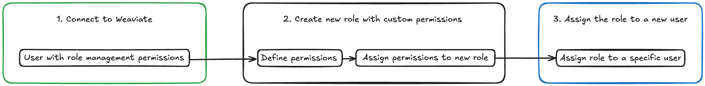

import Link from '@docusaurus/Link';
import Tabs from '@theme/Tabs';
import TabItem from '@theme/TabItem';
import FilteredTextBlock from '@site/src/components/Documentation/FilteredTextBlock';
import PyCode from '!!raw-loader!/_includes/code/python/howto.configure.rbac.permissions.py';
import TSCode from '!!raw-loader!/_includes/code/typescript/howto.configure.rbac.permissions.ts';
import RolePyCode from '!!raw-loader!/_includes/code/python/howto.configure.rbac.roles.py';
import UserPyCode from '!!raw-loader!/_includes/code/python/howto.configure.rbac.users.py';
import RoleTSCode from '!!raw-loader!/_includes/code/typescript/howto.configure.rbac.roles.ts';

**Role-Based Access Control (RBAC)** は、Weaviate インスタンスへのアクセスと変更を管理できる強力なセキュリティ機構です。ここでは、権限を細かく設定したロールを定義し、それらをユーザーに割り当てることで Weaviate で RBAC を設定する方法を解説します。これにより、データの読み書きからコレクションやテナントの管理まで、特定の操作を実行できるユーザーを限定することができます。

## 導入

以下のステップを順に説明します。

- **ステップ 1: Weaviate への接続**  
  必要なロール管理権限を持つユーザーで認証されていることを確認します。
- **ステップ 2: カスタムロールの作成**  
  読み取り、書き込み、テナント管理など、特定の権限を持つロールを定義します。
- **ステップ 3: 新しいユーザーへのロール割り当て**  
  これらのロールを新規ユーザーに適用し、リソースごとのアクセスを制限します。



このガイドを終える頃には、Weaviate デプロイに RBAC を実装するための明確な手順を理解し、AI 搭載アプリケーションに不可欠なセキュリティ層を追加できるようになります。

---

作成するロールは次のとおりです。

- **[読み取りおよび書き込み権限](#read-and-write-permissions):** `rw_role`  
  コレクションとデータへの読み取り・書き込みアクセスを許可するカスタムロールを作成し、ユーザーに割り当てる方法を学びます。
- **[閲覧権限](#viewer-permissions):** `viewer_role`  
  特定のコレクションに対して読み取り専用アクセスに制限するロールを設定します。
- **[テナント権限](#tenant-permissions):** `tenant_manager`  
  テナントの作成、読み取り、更新を含む管理権限を持つロールを構成します。

## 前提条件

このチュートリアルを始める前に、次のものを用意してください。

- ローカルで Weaviate インスタンスを実行するための Docker  
- お好みの Weaviate [クライアントライブラリ](/weaviate/client-libraries/index.mdx) がインストールされていること

### ローカルインスタンス - `root` ユーザー

このチュートリアルを進めるには、`root` ロールが割り当てられているユーザーで Weaviate に接続する必要があります。これにより、ロールと権限を管理できます。

`docker-compose.yml` という Docker Compose ファイルを作成し、次の設定をコピーしてください。

```yaml
---
services:
  weaviate:
    command:
      - --host
      - 0.0.0.0
      - --port
      - '8080'
      - --scheme
      - http
    image: cr.weaviate.io/semitechnologies/weaviate:||site.weaviate_version||
    ports:
      - 8080:8080
      - 50051:50051
    volumes:
      - weaviate_data:/var/lib/weaviate
    restart: on-failure:0
    environment:
      QUERY_DEFAULTS_LIMIT: 25
      PERSISTENCE_DATA_PATH: '/var/lib/weaviate'
      ENABLE_API_BASED_MODULES: 'true'
      CLUSTER_HOSTNAME: 'node1'
      AUTHENTICATION_ANONYMOUS_ACCESS_ENABLED: 'false'
      AUTHENTICATION_DB_USERS_ENABLED: 'true'
      AUTHENTICATION_APIKEY_ENABLED: 'true'
      AUTHENTICATION_APIKEY_ALLOWED_KEYS: 'root-user-key'
      AUTHENTICATION_APIKEY_USERS: 'root-user'
      AUTHORIZATION_ENABLE_RBAC: 'true'
      AUTHORIZATION_RBAC_ROOT_USERS: 'root-user'
volumes:
  weaviate_data:
```

この設定内の環境変数は以下を行います。

- RBAC を有効化します。
- `root-user` を組み込みの root / 管理者権限を持つユーザーとして設定します。

まず `root-user` で Weaviate に接続し、新しいロールを作成したら `custom-user` というユーザーを作成し、そのロールを割り当てます。

## 読み取り/書き込み権限

### ステップ 1: Weaviate 接続

ロールを管理できる十分な権限を持つユーザーで Weaviate に接続していることを確認してください。これは、[Weaviate 設定](/deploy/configuration/configuring-rbac.md) 時に組み込みの `root` ロールを使用するか、ユーザーに [`manage_roles` 権限](/weaviate/configuration/rbac/manage-roles.mdx#role-management-permissions) を付与することで実現できます。

<Tabs groupId="languages">
  <TabItem value="py" label="Python Client v4">
    <FilteredTextBlock
      text={RolePyCode}
      startMarker="# START AdminClient"
      endMarker="# END AdminClient"
      language="py"
    />
  </TabItem>
  <TabItem value="js" label="JS/TS Client v3">
    <FilteredTextBlock
      text={RoleTSCode}
      startMarker="// START AdminClient"
      endMarker="// END AdminClient"
      language="ts"
    />
  </TabItem>
  <TabItem value="go" label="Go">

```go
// Go support coming soon
```

  </TabItem>
  <TabItem value="java" label="Java">

```java
// Java support coming soon
```

  </TabItem>
</Tabs>

### ステップ 2: カスタム権限付きロールの作成

このロールは `TargetCollection` で始まるコレクションに対して読み取り・書き込み権限を付与し、ノードとクラスターメタデータに対して読み取り権限を付与します。

<Tabs groupId="languages">
  <TabItem value="py" label="Python Client v4">
    <FilteredTextBlock
      text={PyCode}
      startMarker="# START ReadWritePermissionDefinition"
      endMarker="# END ReadWritePermissionDefinition"
      language="py"
    />
  </TabItem>
  <TabItem value="js" label="JS/TS Client v3">
    <FilteredTextBlock
      text={TSCode}
      startMarker="// START ReadWritePermissionDefinition"
      endMarker="// END ReadWritePermissionDefinition"
      language="ts"
    />
  </TabItem>
  <TabItem value="go" label="Go">

```go
// Go support coming soon
```

  </TabItem>
  <TabItem value="java" label="Java">

```java
// Java support coming soon
```

  </TabItem>
</Tabs>


### ステップ 3: 新しいユーザーへのロール割り当て

まず、新しいユーザー `custom-user` を作成します:

<Tabs groupId="languages">
  <TabItem value="py" label="Python Client v4">
    <FilteredTextBlock
      text={UserPyCode}
      startMarker="# START CreateUser"
      endMarker="# END CreateUser"
      language="py"
    />
  </TabItem>
  <TabItem value="js" label="JS/TS Client v3">

```ts
// TS support coming soon
```

  </TabItem>
  <TabItem value="go" label="Go">

```go
// Go support coming soon
```

  </TabItem>
  <TabItem value="java" label="Java">

```java
// Java support coming soon
```

  </TabItem>
</Tabs>

次に、`custom-user` にロール `rw_role` を割り当てます:

<Tabs groupId="languages">
  <TabItem value="py" label="Python Client v4">
    <FilteredTextBlock
      text={PyCode}
      startMarker="# START ReadWritePermissionAssignment"
      endMarker="# END ReadWritePermissionAssignment"
      language="py"
    />
  </TabItem>
  <TabItem value="js" label="JS/TS Client v3">
    <FilteredTextBlock
      text={TSCode}
      startMarker="// START ReadWritePermissionAssignment"
      endMarker="// END ReadWritePermissionAssignment"
      language="ts"
    />
  </TabItem>
  <TabItem value="go" label="Go">

```go
// Go support coming soon
```

  </TabItem>
  <TabItem value="java" label="Java">

```java
// Java support coming soon
```

  </TabItem>
</Tabs>

## ビューアー権限

### ステップ 1: Weaviate への接続

ロールを管理する十分な権限を持つユーザーで Weaviate に接続していることを確認します。  
これは、[Weaviate の設定](/deploy/configuration/configuring-rbac) 時にあらかじめ定義されている `root` ロールを使用するか、ユーザーに [`manage_roles` 権限](/weaviate/configuration/rbac/manage-roles#role-management) を付与することで実現できます。

<Tabs groupId="languages">
  <TabItem value="py" label="Python Client v4">
    <FilteredTextBlock
      text={RolePyCode}
      startMarker="# START AdminClient"
      endMarker="# END AdminClient"
      language="py"
    />
  </TabItem>
  <TabItem value="js" label="JS/TS Client v3">
    <FilteredTextBlock
      text={RoleTSCode}
      startMarker="// START AdminClient"
      endMarker="// END AdminClient"
      language="ts"
    />
  </TabItem>
  <TabItem value="go" label="Go">

```go
// Go support coming soon
```

  </TabItem>
  <TabItem value="java" label="Java">

```java
// Java support coming soon
```

  </TabItem>
</Tabs>

### ステップ 2: カスタム権限を持つ新しいロールの作成

これにより、`TargetCollection` で始まるコレクションに対するビューアー権限が付与されます。

<Tabs groupId="languages">
  <TabItem value="py" label="Python Client v4">
    <FilteredTextBlock
      text={PyCode}
      startMarker="# START ViewerPermissionDefinition"
      endMarker="# END ViewerPermissionDefinition"
      language="py"
    />
  </TabItem>
  <TabItem value="js" label="JS/TS Client v3">
    <FilteredTextBlock
      text={TSCode}
      startMarker="// START ViewerPermissionDefinition"
      endMarker="// END ViewerPermissionDefinition"
      language="ts"
    />
  </TabItem>
  <TabItem value="go" label="Go">

```go
// Go support coming soon
```

  </TabItem>
  <TabItem value="java" label="Java">

```java
// Java support coming soon
```

  </TabItem>
</Tabs>

### ステップ 3: 新規ユーザーへのロール割り当て

最初に、新しいユーザー `custom-user` を作成します:

<Tabs groupId="languages">
  <TabItem value="py" label="Python Client v4">
    <FilteredTextBlock
      text={UserPyCode}
      startMarker="# START CreateUser"
      endMarker="# END CreateUser"
      language="py"
    />
  </TabItem>
  <TabItem value="js" label="JS/TS Client v3">

```ts
// TS support coming soon
```

  </TabItem>
  <TabItem value="go" label="Go">

```go
// Go support coming soon
```

  </TabItem>
  <TabItem value="java" label="Java">

```java
// Java support coming soon
```

  </TabItem>
</Tabs>

次に、`viewer_role` を `custom-user` に割り当てます:

<Tabs groupId="languages">
  <TabItem value="py" label="Python Client v4">
    <FilteredTextBlock
      text={PyCode}
      startMarker="# START ViewerPermissionAssignment"
      endMarker="# END ViewerPermissionAssignment"
      language="py"
    />
  </TabItem>
  <TabItem value="js" label="JS/TS Client v3">
    <FilteredTextBlock
      text={TSCode}
      startMarker="// START ViewerPermissionAssignment"
      endMarker="// END ViewerPermissionAssignment"
      language="ts"
    />
  </TabItem>
  <TabItem value="go" label="Go">

```go
// Go support coming soon
```

  </TabItem>
  <TabItem value="java" label="Java">

```java
// Java support coming soon
```

  </TabItem>
</Tabs>

## テナント権限

### ステップ 1: Weaviate への接続

ロールを管理できる十分な権限を持つユーザーで Weaviate に接続されていることを確認してください。  
これは、[Weaviate 構成](/deploy/configuration/configuring-rbac.md) で用意されている `root` ロールを使用するか、ユーザーに [`manage_roles` 権限](/weaviate/configuration/rbac/manage-roles.mdx#role-management-permissions) を付与することで達成できます。

<Tabs groupId="languages">
  <TabItem value="py" label="Python Client v4">
    <FilteredTextBlock
      text={RolePyCode}
      startMarker="# START AdminClient"
      endMarker="# END AdminClient"
      language="py"
    />
  </TabItem>
  <TabItem value="js" label="JS/TS Client v3">
    <FilteredTextBlock
      text={RoleTSCode}
      startMarker="// START AdminClient"
      endMarker="// END AdminClient"
      language="ts"
    />
  </TabItem>
  <TabItem value="go" label="Go">

```go
// Go support coming soon
```

  </TabItem>
  <TabItem value="java" label="Java">

```java
// Java support coming soon
```

  </TabItem>
</Tabs>

### ステップ 2: カスタム権限を持つ新規ロールの作成

このロールは以下の権限を付与します:
- `TargetCollection` で始まるコレクション内の `TargetTenant` で始まるテナントを完全に管理
- `TargetCollection` で始まるコレクション内の `TargetTenant` で始まるテナントのデータを作成、読み取り、更新、および削除

<Tabs groupId="languages">
  <TabItem value="py" label="Python Client v4">
    <FilteredTextBlock
      text={PyCode}
      startMarker="# START MTPermissionsExample"
      endMarker="# END MTPermissionsExample"
      language="py"
    />
  </TabItem>
  <TabItem value="js" label="JS/TS Client v3">
    <FilteredTextBlock
      text={TSCode}
      startMarker="// START MTPermissionsExample"
      endMarker="// END MTPermissionsExample"
      language="ts"
    />
  </TabItem>
  <TabItem value="go" label="Go">

```go
// Go support coming soon
```

  </TabItem>
  <TabItem value="java" label="Java">

```java
// Java support coming soon
```

  </TabItem>
</Tabs>

### ステップ 3: 新規ユーザーへのロール割り当て

まず、`custom-user` という新しいユーザーを作成します:

<Tabs groupId="languages">
  <TabItem value="py" label="Python Client v4">
    <FilteredTextBlock
      text={UserPyCode}
      startMarker="# START CreateUser"
      endMarker="# END CreateUser"
      language="py"
    />
  </TabItem>
  <TabItem value="js" label="JS/TS Client v3">

```ts
// TS support coming soon
```

  </TabItem>
  <TabItem value="go" label="Go">

```go
// Go support coming soon
```

  </TabItem>
  <TabItem value="java" label="Java">

```java
// Java support coming soon
```

  </TabItem>
</Tabs>

次に、`tenant_manager` ロールを `custom-user` に割り当てます:

<Tabs groupId="languages">
  <TabItem value="py" label="Python Client v4">
    <FilteredTextBlock
      text={PyCode}
      startMarker="# START MTPermissionsAssignment"
      endMarker="# END MTPermissionsAssignment"
      language="py"
    />
  </TabItem>
  <TabItem value="js" label="JS/TS Client v3">
    <FilteredTextBlock
      text={TSCode}
      startMarker="// START MTPermissionsAssignment"
      endMarker="// END MTPermissionsAssignment"
      language="ts"
    />
  </TabItem>
  <TabItem value="go" label="Go">

```go
// Go support coming soon
```

  </TabItem>
  <TabItem value="java" label="Java">

```java
// Java support coming soon
```

  </TabItem>
</Tabs>

## 概要

このチュートリアルは、 Weaviate における RBAC の設定方法を包括的に解説し、カスタマイズしたロールとパーミッションによってユーザー アクセスを管理し、ベクトル データベースのセキュリティを強化する方法を紹介します。

ロール管理権限を持つユーザーで Weaviate に接続するところから始め、さまざまなアクセス レベル向けにカスタム ロールを作成する手順を示します。コレクションとデータを管理するための読み取り・書き込み権限を持つロールの設定、読み取り専用アクセスのための viewer パーミッションの構成、そしてテナント操作を管理する tenant パーミッションの確立方法を学べます。

## 追加リソース

- [RBAC: 設定](/deploy/configuration/configuring-rbac.md)
- [RBAC: ロールの管理](/weaviate/configuration/rbac/manage-roles.mdx)
- [RBAC: ユーザーの管理](/weaviate/configuration/rbac/manage-users.mdx)

## 質問とフィードバック

import DocsFeedback from '/_includes/docs-feedback.mdx';

<DocsFeedback />

