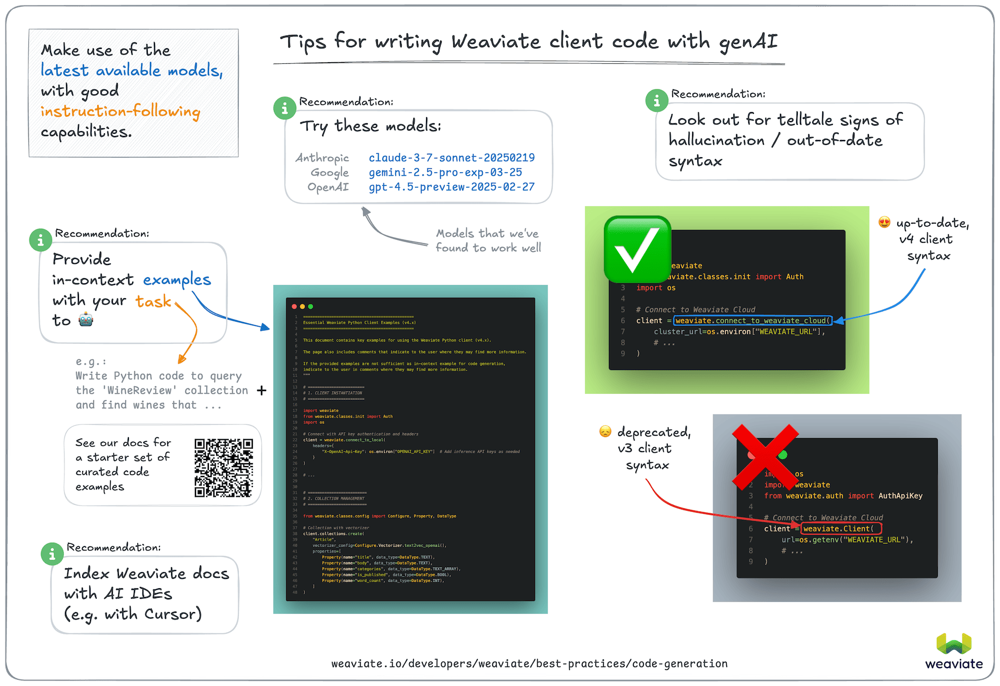

# AI ベースの Weaviate コード生成（vibe-coding）

生成 AI モデルはコードの自動生成能力を急速に高めています。このプラクティスは一般に「vibe-coding」や「AI 支援コーディング」と呼ばれます。開発を加速できる一方で、古い情報や不足した学習データに起因するハルシネーションなどの落とし穴も存在します。

ここでは、私たちの経験を基に、生成 AI モデルやツールを用いて Weaviate クライアントライブラリのコードを書く際のヒントを紹介します。

## 具体的な推奨事項

### 高性能なモデル

2025 年 4 月時点で、以下のモデルがコード生成において高い性能を示しました（[Python v4 クライアントライブラリ](/weaviate/client-libraries/python/index.mdx)のコード生成の正確性で評価）。

- Anthropic `claude-3-7-sonnet-20250219`
- Google `gemini-2.5-pro-exp-03-25`
- OpenAI `gpt-4.5-preview-2025-02-27` /

Python クライアントライブラリを使用している場合は、上記モデルのいずれかを試し、ご自身のユースケースでの性能を確認してみてください。

これらのモデルはいずれもゼロショット（タスクの説明のみ）では完全ではありませんでしたが、インコンテキスト例を与えると大半の場合で正しいコードを生成できました。

### インコンテキストのコード例

上記の LLM は、インコンテキスト例を提供すると性能が大幅に向上しました。達成したいタスクに関連するインコンテキスト例を提示することで、より良い結果が得られます。

まずは、下記に用意したコード例をプロンプトにコピー＆ペーストしてみてください。

import CodeExamples from '!!raw-loader!/_includes/code/python/best-practices.python.ai.py';
import CodeBlock from '@theme/CodeBlock';

  <CodeBlock language="python">{CodeExamples}</CodeBlock>

 

上記のコード例だけでは不十分な場合、次の方法を試してください。

- Weaviate ドキュメントの該当セクションからコード例を収集する。
- Weaviate ドキュメントの `Ask AI` 機能を使い、特定タスクの実装例を検索し、そのコードをプロンプトに含める。

:::tip Small models
一般に、小規模モデルはゼロショットのコード生成が得意ではありません。しかし、Anthropic の `claude-3-5-haiku-20241022` や OpenAI の `gpt-4.1` / `gpt-4.1-mini` は、インコンテキスト例を与えるとかなり優れたコードを生成できました。
:::

## 一般的なヒント

上記の具体的な推奨に加え、次の一般的なヒントも参考にしてください。

### 最新モデルの活用

すでにお気に入りのモデルプロバイダーがある場合でも、最新モデルを試してみると性能が向上する可能性があります。

新しいモデルはより新しいデータで学習されており、ゼロショットのコード生成に強くなっていることが多いです。特に、2024 年に全面改修された Weaviate Python クライアントのようにコードベースが大きく変わった場合は重要です。

### 指示追従性の高いモデルを探す

モデルによっては、インコンテキストで与えた instructions をより忠実に守ります。

こうしたモデルは、最新のインコンテキスト例を尊重してコードを生成してくれる可能性が高いです。

### 生成コードをハルシネーションの兆候がないか確認する

生成されたコードにハルシネーションが含まれていないか必ず確認してください。

Weaviate Python クライアントの場合、`weaviate.Client` クラスで接続しようとしているコードは古い v3 クライアントの書き方で、v4 には存在しません。これはハルシネーションや古い情報の典型的なサインです。

最新バージョンでは、接続には `weaviate.connect_to_xyz()` 系のヘルパー関数と `WeaviateClient` クラスを使用します。

### 追加ドキュメントをインデックス化する

Cursor のような AI コーディングツールには、追加のドキュメントをインデックス化できるものがあります。これにより、コード生成に必要な文脈を増やし、IDE に対して「インデックス済みドキュメントを基にコードを生成して」と促すことができます。

利用中の IDE にこの機能があるか、また使い方を確認してみてください。

### Weaviate エージェントの利用を検討する

[Weaviate エージェント](/agents) は、[クエリ](/agents/query)・[データ変換](/agents/transformation/)・[コンテンツのパーソナライズ](/agents/personalization) など、特定タスク用に設計された事前構築済みのエージェントサービスです。

Weaviate Cloud ユーザーは自然言語でインスタンスと対話できるため、一部のユースケースでは AI コード生成ツールより適している場合があります。

## このページ改善へのご協力

上記の推奨事項は、生成 AI モデルでコード生成を行った私たちの経験に基づいています。

このページの内容を体系的に収集するため、[こちらのリポジトリ](https://github.com/weaviate-tutorials/weaviate-vibe-eval)で一連の評価を実施しました。

各テストでは、Weaviate Python クライアント v4 のコードをさまざまな LLM で生成し、生成コードが正常に実行できるかを評価しました。各タスクはゼロショットと、インコンテキスト例ありで少なくとも 1 回ずつ実施しています。

結果の一部は [このディレクトリ](https://github.com/weaviate-tutorials/weaviate-vibe-eval/tree/main/example_results) にまとめています。

小規模な評価であり、あくまでガイドライン提供が目的です。独自に評価を行いたい方はリポジトリをご覧ください。

質問やフィードバックは、[GitHub](https://github.com/weaviate-tutorials/weaviate-vibe-eval/issues) で issue を開いてお知らせください。

## 質問・フィードバック

import DocsFeedback from '/_includes/docs-feedback.mdx';

<DocsFeedback/>

