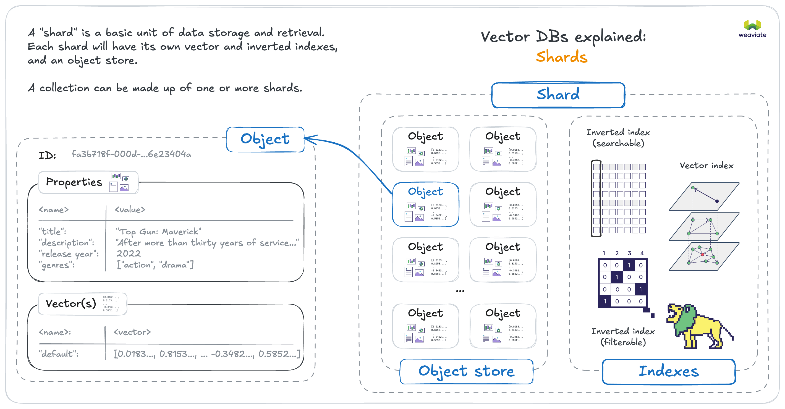
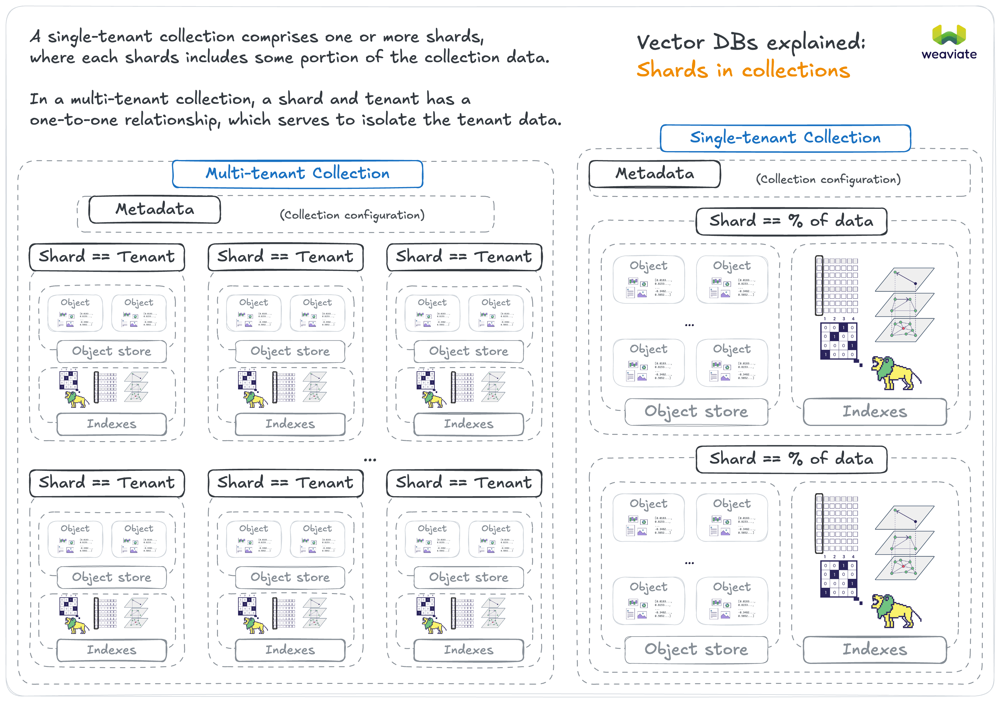

Weaviate は、クラスター内で複数ノードを構成して実行することで水平スケーリングできます。ここでは、Weaviate をスケールさせるさまざまな方法、スケーリング時に考慮すべき要素、および水平スケーリングに関連する Weaviate のアーキテクチャについて説明します。

## 基本概念

### シャード

Weaviate のコレクションは 1 つ以上の「シャード」で構成され、これがデータ保存および取得の基本単位となります。シャードは独自の ベクトル インデックス、転置インデックス、オブジェクトストアを持ちます。各シャードは異なるノードに配置でき、分散データ保存と処理を可能にします。

シングルテナント コレクションにおけるユニーク シャード数は、コレクション作成時にのみ設定できます。ほとんどの場合、Weaviate にシャード数を任せれば十分ですが、パフォーマンスやデータ分散の理由で手動設定したい場合もあります。

マルチテナント コレクションでは、各テナントが 1 つのシャードに相当します。つまり、マルチテナント コレクションのユニーク シャード数はテナント数と同じです。

### レプリカ

設定に応じて、各シャードは 1 つ以上の「レプリカ」を持ち、異なるノードに配置できます。これは「高可用性」構成と呼ばれ、同じデータが複数ノードに存在します。これにより読み取りスループットと耐障害性が向上します。

希望するレプリカ数（レプリケーションファクター）は Weaviate で設定できます。これは [`REPLICATION_MINIMUM_FACTOR` 環境変数](/docs/deploy/configuration/env-vars/index.md) でクラスター全体のデフォルトとして設定するか、[コレクション単位](/docs/weaviate/manage-collections/multi-node-setup.mdx#replication-settings)で設定してグローバルデフォルトを上書きできます。

## Weaviate をスケールさせる動機
一般的には、水平スケールを行う動機は（少なくとも） 3 つあり、それぞれ異なる構成につながります。

### 動機 1: データセット最大サイズ
[HNSW グラフのメモリフットプリント](./resources.md#the-role-of-memory) により、データセットを複数サーバー（「ノード」）に分散したい場合があります。この構成では、単一コレクションを複数シャードに分け、それらをノード間で分散させます。

Weaviate はインポート時とクエリ時に必要なオーケストレーションを自動で行います。

複数シャードを実行する際のトレードオフについては [シャーディングとレプリケーション](#sharding-vs-replication) を参照してください。

**解決策: クラスター内の複数ノードにシャーディング**

:::note
クラスター全体でのシャーディング機能は Weaviate `v1.8.0` で追加されました。
:::

### 動機 2: クエリ スループット向上
単一の Weaviate ノードで処理できるより多くのクエリを受ける場合、追加ノードを配置してユーザーのクエリに応答させることが望ましいです。

複数ノードにシャーディングする代わりに、同一データを複数ノードへレプリケートできます。このプロセスも全自動で、レプリケーションファクターを指定するだけです。シャーディングとレプリケーションを組み合わせることも可能です。

**解決策: クラスター内の複数ノードへクラスをレプリケート**

### 動機 3: 高可用性

Weaviate で重要な負荷を処理する際、ノードが完全に障害を起こしてもクエリを提供し続けたい場合があります。障害はソフトウェアまたは OS レベルのクラッシュ、あるいはハードウェア障害が原因かもしれません。予期せぬクラッシュ以外にも、ゼロダウンタイムのアップデートや保守作業を許容できます。

高可用性構成を運用するには、クラスを複数ノード間でレプリケートする必要があります。

**解決策: クラスター内の複数ノードへクラスをレプリケート**

## シャーディングとレプリケーション

上記の動機で、クラスを複数ノードにシャーディングする場合とレプリケートする場合、またはその両方が必要となる場面を説明しました。ここでは、シャードおよび / またはレプリカ構成の影響を紹介します。

:::note
以下のシナリオはすべて、シャーディング数やレプリケーションファクターを増やす際にクラスターサイズも合わせて調整することを前提としています。シャード数またはレプリケーションファクターがクラスターのノード数より少ない場合、以下の利点は適用されません。*
:::

### シャーディングを増やす利点
* より大きなデータセットを扱える  
* インポート速度が向上する  

複数 CPU を効率的に使用するには、コレクションに複数シャードを作成してください。最速のインポートには、単一ノードであっても複数シャードを作成することを推奨します。

### シャーディングを増やす欠点
* シャード ノードを追加してもクエリ スループットは向上しない  

### レプリケーションを増やす利点
* システムが高可用性になる  
* レプリケーションを増やすとクエリ スループットがほぼ線形に向上する  

### レプリケーションを増やす欠点
* レプリカ ノードを追加してもインポート速度は向上しない  

### シャーディングキー（パーティションキー）
Weaviate はオブジェクトの特性を基に、どのシャードに属するかを決定します。`v1.8.0` 時点では、シャーディングキーは常にオブジェクトの UUID です。シャーディングアルゴリズムには 64bit Murmur-3 ハッシュを使用しています。今後、他のプロパティやアルゴリズムが追加される可能性があります。

なお、マルチテナント コレクションでは各テナントが 1 つのシャードに相当します。

## シャード レプリカの移動

:::info `v1.32` で追加
:::

シャード レプリカを 1 つのノードから別のノードへ移動またはコピーできます。これはノード間の負荷を均衡させたい場合や、コレクションの一部のレプリケーションファクターを変更したい場合に有用です。

詳細な操作手順は [こちら](/docs/deploy/configuration/replica-movement.mdx) を参照してください。

### シャード レプリカ移動のユースケース

1. **負荷分散**: 特定ノードの負荷が高い場合、シャード レプリカを移動することでクラスター全体の負荷を均等化できます。  
2. **スケーリング**: クラスターをスケーリング（例: 負荷増加に対応するノード追加）する際、新しいノードへシャード レプリカを移動し、データを均等に分散させます。  
3. **ノード保守または交換**: ノードが保守（例: ハードウェアのアップグレード）や交換を必要とする場合、保守期間中も可用性を維持できるよう、シャード レプリカを一時的または交換用ノードへ移動します。  

## ノードディスカバリー

デフォルトでは、クラスター内の Weaviate ノードは [Hashicorp の Memberlist](https://github.com/hashicorp/memberlist) を使用した gossip ライク プロトコルでノード状態や障害状況を通信します。

Weaviate は、特にクラスター運用時に Kubernetes 上での実行を最適化しています。[Weaviate Helm チャート](/deploy/installation-guides/k8s-installation.md#weaviate-helm-chart) は `StatefulSet` とヘッドレス `Service` を利用してノードディスカバリーを自動設定します。必要なのは希望ノード数を指定することだけです。

  
ノードディスカバリー用 FQDN

:::caution `v1.25.15` で追加され `v1.30` で削除

これは実験的機能でした。利用時はご注意ください。

:::

IP アドレスベースのノードディスカバリーが最適でない場合があります。そのような場合は、`RAFT_ENABLE_FQDN_RESOLVER` と `RAFT_FQDN_RESOLVER_TLD` [環境変数](/deploy/configuration/env-vars/index.md#multi-node-instances) を設定して、完全修飾ドメイン名 (FQDN) ベースのノードディスカバリーを有効化できます。

この機能を有効にすると、Weaviate はメタデータ（例: Raft）通信においてノード名を IP アドレスへ解決する際、FQDN リゾルバーを使用します。

:::info FQDN: メタデータ変更のみに適用
この機能は、[Raft をコンセンサスメカニズムとして使用する](./replication-architecture/cluster-architecture.md#metadata-replication-raft)メタデータ変更にのみ利用されます。データの読み書き操作には影響しません。
:::

#### FQDN を使用したノード検出の例

 FQDN を使用すると、複数のクラスタ間で IP アドレスが再利用されている場合に、あるクラスタのノードが別のクラスタのノードを誤って検出してしまう状況を回避できます。

 また、サービス (たとえば Kubernetes) を使用している場合に、サービスの IP が実際のノードの IP と異なり、サービスがノードへの接続をプロキシするケースでも有用です。

#### FQDN ノード検出の環境変数

`RAFT_ENABLE_FQDN_RESOLVER` は Boolean フラグです。 このフラグを有効にすると、 FQDN リゾルバーが有効になります。 `true` に設定すると、 Weaviate は FQDN リゾルバーを使用してノード名をノードの IP アドレスへ解決します。 `false` に設定すると、 Weaviate は memberlist ルックアップを使用してノード名をノードの IP アドレスへ解決します。 既定値は `false` です。

`RAFT_FQDN_RESOLVER_TLD` は文字列で、ノード ID を IP アドレスに解決するときに `[node-id].[tld]` という形式で末尾に付加されます。ここで `[tld]` はトップレベルドメインです。

 この機能を使用するには、 `RAFT_ENABLE_FQDN_RESOLVER` を `true` に設定してください。

## シャードおよび/またはレプリケーションシャードのノードアフィニティ

 Weaviate は、空きディスク容量が最も多いノードを選択しようとします。

 これは、新しいクラスを作成するときにのみ適用され、既存の単一クラスにデータを追加するときには適用されません。

  
<code>v1.18.1</code> 以前の挙動

 バージョン `v1.8.0` から `v1.18.0` では、ユーザーは特定のシャードまたはレプリケーションシャードのノードアフィニティを指定できませんでした。

 シャードは、ランダムに選ばれたノードから開始して、ラウンドロビン方式で「ライブ」ノードに割り当てられていました。

## 整合性と現時点での制限

* `v1.25.0` から、 Weaviate は選出されたリーダーによって調整されるログベースのアルゴリズムである [ Raft コンセンサスアルゴリズム](https://raft.github.io/) を採用しました。 これにより、スキーマを同時に変更できるという追加の利点が得られます。 Kubernetes ユーザーの場合は、アップグレード前に [`1.25 移行ガイド`](/deploy/migration/weaviate-1-25.md) をご覧ください。 アップグレードするには、既存の StatefulSet を削除する必要があります。
* `v1.8.0` 以降、クラスタ全体にスキーマ変更をブロードキャストするプロセスでは、二相トランザクションの形式が使用されていますが、現時点ではトランザクションの実行中にノード障害が発生すると耐えられません。
* `v1.8.0` 以降、クラスタの動的スケーリングはまだ完全にはサポートされていません。 既存のクラスタに新しいノードを追加することは可能ですが、シャードの所有権には影響しません。 データが存在する場合、ノードを削除する前にシャードが他のノードへ移動されないため、既存のノードはまだ削除できません。

## 質問とフィードバック

import DocsFeedback from '/_includes/docs-feedback.mdx';

<DocsFeedback/>