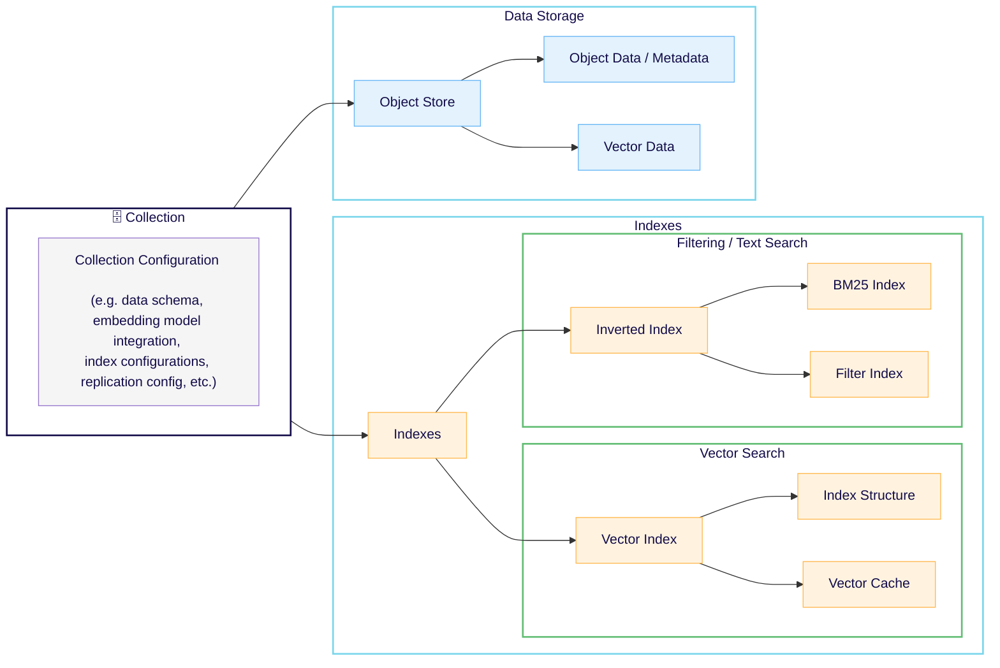
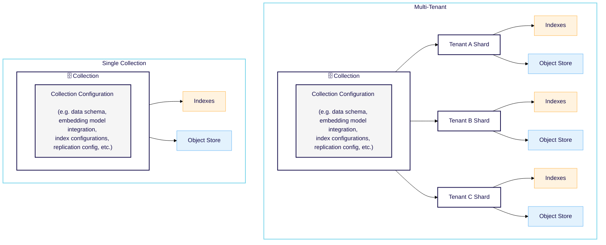

import SkipLink from '/src/components/SkipValidationLink'

## データオブジェクトの概念

Weaviate の各データオブジェクトは `collection` に属し、1 つ以上の `properties` を持ちます。

Weaviate は `data objects` をクラスベースのコレクションに格納します。データオブジェクトは JSON ドキュメントとして表現されます。通常、オブジェクトには機械学習モデルから生成された `vector` が含まれます。このベクトルは `embedding`、`vector embedding` と呼ばれることもあります。

各コレクションには同じ `class` のオブジェクトが含まれます。これらのオブジェクトは共通の `schema` で定義されます。



import InitialCaps from '/_includes/schemas/initial-capitalization.md'

<InitialCaps />

### JSON ドキュメントとしてのオブジェクト

たとえば、 Alice Munro という著者の情報を保存するとします。JSON 形式では次のようになります。

```json
{
    "name": "Alice Munro",
    "age": 91,
    "born": "1931-07-10T00:00:00.0Z",
    "wonNobelPrize": true,
    "description": "Alice Ann Munro is a Canadian short story writer who won the Nobel Prize in Literature in 2013. Munro's work has been described as revolutionizing the architecture of short stories, especially in its tendency to move forward and backward in time."
}
```

### ベクトル

データオブジェクトには `vector` 表現を付加することもできます。ベクトルは数値の配列で、`"vector"` プロパティに保存されます。

この例では、`Alice Munro` のデータオブジェクトには小さなベクトルが付いています。このベクトルは、 Alice に関するテキストや画像などの情報を、機械学習モデルが数値の配列へ変換したものです。

```json
{
    "id": "779c8970-0594-301c-bff5-d12907414002",
    "class": "Author",
    "properties": {
        "name": "Alice Munro",
        (...)
    },
    "vector": [
        -0.16147631,
        -0.065765485,
        -0.06546908
    ]
}
```

データのベクトルを生成するには、Weaviate のベクトライザー [modules](./modules.md) のいずれかを使用するか、ご自身のベクトライザーを利用できます。

### コレクション

コレクションは、同じスキーマ定義を共有するオブジェクトの集合です。

この例では、`Author` コレクションにはさまざまな著者を表すオブジェクトが格納されています。

<!-- [Alice Munro
Born: July 10, 1931 (age 91)
Nobel Prize Winner

"Alice Ann Munro is a Canadian short story writer who won the Nobel Prize in Literature in 2013. Munro's work has been described as revolutionizing the architecture of short stories, especially in its tendency to move forward and backward in time...."
]

[Paul Krugman
Born: February 28, 1953 (age 69)
Nobel Prize Winner

"Paul Robin Krugman is an American economist and public intellectual, who is..."
] -->

コレクションは次のようになります。

```json
[{
    "id": "dedd462a-23c8-32d0-9412-6fcf9c1e8149",
    "class": "Author",
    "properties": {
        "name": "Alice Munro",
        "age": 91,
        "born": "1931-07-10T00:00:00.0Z",
        "wonNobelPrize": true,
        "description": "Alice Ann Munro is a Canadian short story writer who won the Nobel Prize in Literature in 2013. Munro's work has been described as revolutionizing the architecture of short stories, especially in its tendency to move forward and backward in time."
    },
    "vector": [
        -0.16147631,
        -0.065765485,
        -0.06546908
    ]
}, {
    "id": "779c8970-0594-301c-bff5-d12907414002",
    "class": "Author",
    "properties": {
        "name": "Paul Krugman",
        "age": 69,
        "born": "1953-02-28T00:00:00.0Z",
        "wonNobelPrize": true,
        "description": "Paul Robin Krugman is an American economist and public intellectual, who is Distinguished Professor of Economics at the Graduate Center of the City University of New York, and a columnist for The New York Times. In 2008, Krugman was the winner of the Nobel Memorial Prize in Economic Sciences for his contributions to New Trade Theory and New Economic Geography."
    },
    "vector": [
        -0.93070928,
        -0.03782172,
        -0.56288009
    ]
}]
```

各コレクションは独自のベクトル空間を持ちます。つまり、異なるコレクションでは同じオブジェクトでも異なる埋め込みを持つことができます。

### UUID

Weaviate に保存されるすべてのオブジェクトには [UUID](https://en.wikipedia.org/wiki/Universally_unique_identifier) が割り当てられます。UUID はあらゆるコレクションを通じて一意性を保証します。

常に同じオブジェクトが同じ UUID を持つようにしたい場合は、[決定論的 UUID を使用](../manage-objects/import.mdx#specify-an-id-value) できます。これは UUID を変更せずにオブジェクトを更新したいときに便利です。

ID を指定しなかった場合、Weaviate がランダムな UUID を自動生成します。

並び順が指定されていないリクエストでは、Weaviate は UUID の昇順で処理します。したがって、[オブジェクトの一覧取得](../search/basics.md#list-objects)、[cursor API](../manage-objects/read-all-objects.mdx) の利用、または [オブジェクトの削除](../manage-objects/delete.mdx#delete-multiple-objects-by-id) など、順序が指定されていないリクエストはすべて UUID の昇順で処理されます。

### クロスリファレンス

import CrossReferencePerformanceNote from '/_includes/cross-reference-performance-note.mdx';

<CrossReferencePerformanceNote />

データオブジェクトに関連がある場合、それらの関係を表現するために [クロスリファレンス](../manage-collections/cross-references.mdx) を使用できます。Weaviate のクロスリファレンスは関連情報を取得するためのリンクのようなものです。関係を表現しますが、元のオブジェクトのベクトルは変更しません。

リファレンスを作成するには、片方のコレクションのプロパティを使用して、もう一方のコレクションで関連するプロパティの値を指定します。

#### クロスリファレンスの例

たとえば、「Paul Krugman writes for the New York Times」という文は、 Paul Krugman と New York Times の間の関係を示しています。この関係を表現するには、New York Times を表す `Publication` オブジェクトと、Paul Krugman を表す `Author` オブジェクトの間にクロスリファレンスを作成します。

New York Times の `Publication` オブジェクトは次のようになります。`"id"` フィールドにある UUID に注目してください。

```json
{
    "id": "32d5a368-ace8-3bb7-ade7-9f7ff03eddb6",
    "class": "Publication",
    "properties": {
        "name": "The New York Times"
    },
    "vector": [...]
}
```

Paul Krugman の `Author` オブジェクトには、関係を表す新しいプロパティ `writesFor` が追加されています。

```json
{
    "id": "779c8970-0594-301c-bff5-d12907414002",
    "class": "Author",
    "properties": {
        "name": "Paul Krugman",
        ...
// highlight-start
        "writesFor": [
            {
                "beacon": "weaviate://localhost/32d5a368-ace8-3bb7-ade7-9f7ff03eddb6",
                "href": "/v1/objects/32d5a368-ace8-3bb7-ade7-9f7ff03eddb6"
            }
        ],
// highlight-end
    },
    "vector": [...]
}
```

`beacon` サブプロパティの値は、New York Times の `Publication` オブジェクトの `id` の値です。

クロスリファレンスは方向性を持ちます。双方向リンクにするには、`Publication` コレクションに `hasAuthors` プロパティを追加し、`Author` コレクションを参照させます。

### 複数ベクトル埋め込み（名前付きベクトル）

import MultiVectorSupport from '/_includes/multi-vector-support.mdx';

<MultiVectorSupport />

#### コレクション作成後に名前付きベクトルを追加する

:::info Added in `v1.31`
:::

名前付きベクトルは、コレクション作成後でも既存のコレクション定義に追加できます。これにより、コレクションを削除・再作成することなく、オブジェクトに新しいベクトル表現を追加できます。

既存のコレクション定義に新しい名前付きベクトルを追加した場合、**既存オブジェクトの新しい名前付きベクトルは空のまま** であることに注意してください。追加後に作成または更新されたオブジェクトのみが、新しいベクトル埋め込みを受け取ります。

これにより、コレクション内のすべての既存オブジェクトをベクトル化する時間やコストが大量に発生するといった予期しない副作用を防げます。

既存オブジェクトにも新しい名前付きベクトルを設定したい場合は、既存オブジェクトの UUID とベクトルを含めてオブジェクトを更新してください。これにより、新しい名前付きベクトルのベクトル化プロセスがトリガーされます。

<!-- TODO: I wonder we should show an example - maybe once the vectorizer syntax is updated with 1.32 -->

:::caution レガシー（名前なし）ベクトライザーでは利用できません
コレクション作成後に名前付きベクトルを追加できる機能は、名前付きベクトルで設定されたコレクションにのみ利用できます。
:::

## データ スキーマ

Weaviate では、データを追加する前に データ スキーマ が必要です。ただし、スキーマ を手動で作成する必要はありません。スキーマ を提供しない場合、Weaviate は入力データに基づいて スキーマ を生成します。

import SchemaDef from '/_includes/definition-schema.md';

<SchemaDef/>

:::note スキーマ と タクソノミー
Weaviate の データ スキーマ はタクソノミーとは少し異なります。タクソノミーには階層があります。タクソノミー・オントロジー・スキーマ の関係については、Weaviate の [ブログ記事](https://medium.com/semi-technologies/taxonomies-ontologies-and-schemas-how-do-they-relate-to-weaviate-9f76739fc695) をご覧ください。
:::

スキーマ は次の役割を果たします:

1. コレクションとプロパティを定義します。  
1. 異なるエンベディングを使用するコレクション間も含め、コレクションをリンクするクロスリファレンスを定義します。  
1. モジュールの動作、ANN インデックス設定、リバース インデックス、その他の機能をコレクション単位で設定できます。  

スキーマ の設定方法の詳細は、[スキーマ チュートリアル](../starter-guides/managing-collections/index.mdx) または [How-to: Manage collections](../manage-collections/index.mdx) をご覧ください。

## マルチテナンシー

:::info Multi-tenancy availability
- `v1.20` で マルチテナンシー が追加されました
:::

クラスタ内のデータを分離するには、マルチテナンシー を使用します。Weaviate はクラスタを シャード に分割し、各シャード は 1 つのテナントのデータのみを保持します。



シャーディングの利点:

- データの分離  
- 高速で効率的なクエリ  
- シンプルかつ堅牢なセットアップとクリーンアップ  

テナント シャード は軽量です。1 ノードあたり 50,000 個以上の アクティブ シャード を簡単に扱えます。つまり、およそ 20 ノード で 同時に 1M の アクティブ テナント をサポートできます。

マルチテナンシー は、複数の顧客のデータを保存したい場合や、複数のプロジェクトのデータを保存したい場合に特に有用です。

:::caution テナント削除 ＝ テナントデータ削除
テナントを削除すると、そのテナントに対応するシャードが削除されます。結果として、テナントを削除すると そのテナントのすべてのオブジェクトも削除されます。
:::

### テナント 状態

:::info Multi-tenancy availability
- テナントのアクティビティ ステータス設定は `v1.21` で追加  
- `OFFLOADED` ステータスは `v1.26` で追加  
:::

テナントには、その利用可否と保存場所を示す アクティビティ ステータス (テナント状態) があります。テナントは `ACTIVE`、`INACTIVE`、`OFFLOADED`、`OFFLOADING`、`ONLOADING` のいずれかです。

- `ACTIVE` テナントは読み書きが可能な状態でロードされています。  
- その他の状態では、テナントは読み書き不可で、アクセスしようとするとエラーになります。  
    - `INACTIVE` テナントはローカル ディスクに保存され、すぐにアクティブ化できます。  
    - `OFFLOADED` テナントはクラウド ストレージに保存されます。頻繁にアクセスしないテナントの長期保存に便利です。  
    - `OFFLOADING` テナントはクラウド ストレージへ移動中です。一時的な状態で、ユーザーは指定できません。  
    - `ONLOADING` テナントはクラウド ストレージからロード中です。一時的な状態で、ユーザーは指定できません。`ONLOADING` テナントは `ACTIVE` または `INACTIVE` へウォームアップされている最中かもしれません。  

テナントの管理詳細は [Multi-tenancy operations](../manage-collections/multi-tenancy.mdx) をご覧ください。

| Status | 利用可 | 説明 | ユーザー指定可 |
| :-- | :-- | :-- | :-- |
| `ACTIVE` | Yes | 読み書き可能な状態でロードされています。 | Yes |
| `INACTIVE` | No | ローカル ディスクに保存され、読み書き不可。アクセスするとエラーになります。 | Yes |
| `OFFLOADED` | No | クラウド ストレージに保存され、読み書き不可。アクセスするとエラーになります。 | Yes |
| `OFFLOADING` | No | クラウド ストレージへ移動中で、読み書き不可。アクセスするとエラーになります。 | No |
| `ONLOADING` | No | クラウド ストレージからロード中で、読み書き不可。アクセスするとエラーになります。 | No |

:::info Tenant status renamed in `v1.26`
`v1.26` で `HOT` は `ACTIVE` に、`COLD` は `INACTIVE` に名称変更されました。
:::

:::info テナント状態の伝播
テナント状態の変更がクラスタ全体に行き渡るまで、特にマルチノード クラスタでは時間がかかることがあります。

<br/>

たとえば、オフロードされたテナントを再アクティブ化した後でも、データがすぐには利用可能にならない場合があります。同様に、テナントをオフロードした直後にデータがすぐに利用不可にならない場合もあります。これは、[テナント状態は最終的整合性](../concepts/replication-architecture/consistency.md#tenant-states-and-data-objects) を持ち、変更がクラスタ内のすべてのノードへ伝播する必要があるためです。
:::

#### オフロードされたテナント

:::info Added in `v1.26.0`
:::

import OffloadingLimitation from '/_includes/offloading-limitation.mdx';

<OffloadingLimitation/>

テナントをオフロードするには、対応する `offload-<storage>` モジュールが Weaviate クラスタで [有効化](../configuration/modules.md) されている必要があります。

テナントをオフロードすると、そのテナント シャード 全体がクラウド ストレージへ移動します。これは、頻繁にアクセスしないテナントを長期保存するのに便利です。オフロードされたテナントは、クラスタへ再ロードされるまで読み書きできません。

### バックアップ

:::caution バックアップには Inactive または Offloaded テナントは含まれません
マルチテナント コレクションのバックアップには `active` テナントのみが含まれ、`inactive` や `offloaded` テナントは含まれません。すべてのデータを含めるには、バックアップ作成前に [テナントをアクティブ化](../manage-collections/multi-tenancy.mdx#manage-tenant-states) してください。
:::

### テナンシー と ID

各テナンシーは名前空間のようなものです。そのため、異なるテナントが同じオブジェクト ID を持つことも理論上は可能です。命名衝突を避けるため、マルチテナント クラスタではオブジェクト ID に テナント ID を組み合わせ、テナントをまたいで一意となる ID を生成します。

### テナンシー と クロスリファレンス

マルチテナンシー では、一部のクロスリファレンスがサポートされています。

サポートされるクロスリファレンス:

- マルチテナンシー オブジェクト から 非マルチテナンシー オブジェクト への参照  
- 同一テナント内での、マルチテナンシー オブジェクト 同士の参照  

サポートされないクロスリファレンス:

- 非マルチテナンシー オブジェクト から マルチテナンシー オブジェクト への参照  
- 異なるテナント間の マルチテナンシー オブジェクト 同士の参照  

### 主な機能

- 各テナントは専用の高性能 ベクトル インデックスを持ちます。専用インデックスにより、共有インデックス空間を検索するのではなく、各テナントがクラスタ上で唯一のユーザーであるかのように高速に応答します。  
- 各テナントのデータは専用シャードに隔離されます。これにより、削除が高速で、他のテナントに影響しません。  
- スケールアウトするには、クラスタにノードを追加するだけです。Weaviate は既存テナントを再分散しませんが、新しいテナントは最もリソース使用率の低いノードに配置されます。  

:::info 関連ページ
- [How-to: Manage Data | Multi-tenancy operations](../manage-collections/multi-tenancy.mdx)
- [Multi-tenancy ブログ](https://weaviate.io/blog/multi-tenancy-vector-search)
:::

### 監視メトリクス

モニタリング用にテナントをグループ化するには、システム設定ファイルで [`PROMETHEUS_MONITORING_GROUP = true`](/deploy/configuration/env-vars/index.md) を設定します。

### ノードあたりのテナント数

ノードあたりのテナント数は、オペレーティングシステムの制約によって決まります。テナント数は、プロセスごとの Linux の open file 制限を超えることはできません。

たとえば、`n1-standard-8` マシンで構築した 9 ノードのテストクラスターでは、約 170k のアクティブテナントを保持できます。ノードあたり 18,000 ～ 19,000 のテナントが存在します。

これらの数値はアクティブテナントにのみ関係します。未使用のテナントを [`inactive` に設定](../manage-collections/multi-tenancy.mdx#manage-tenant-states) した場合、プロセスごとの open file 制限は適用されません。

## 関連ページ

以下もご参照ください。

- [How-to: マルチテナンシー操作](../manage-collections/multi-tenancy.mdx)
- <SkipLink href="/weaviate/api/rest#tag/schema">リファレンス: REST API: Schema</SkipLink>
- [How-to: コレクションを管理する](../manage-collections/index.mdx)

## まとめ

* スキーマはコレクションとプロパティを定義します。
* コレクションには JSON ドキュメントで記述されたデータオブジェクトが含まれます。
* データオブジェクトには ベクトル とプロパティを含めることができます。
* ベクトル は機械学習モデルから生成されます。
* 異なるコレクションは異なる ベクトル 空間を表します。
* クロスリファレンスはスキーマ間でオブジェクトをリンクします。
* マルチテナンシーは各テナントのデータを分離します。

## ご質問とフィードバック

import DocsFeedback from '/_includes/docs-feedback.mdx';

<DocsFeedback/>