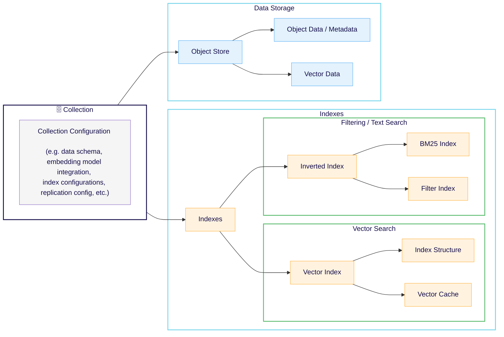
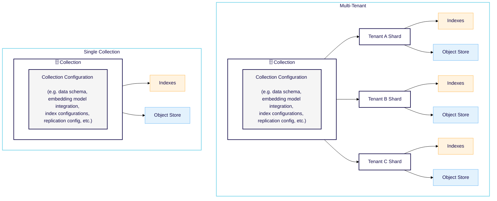

import SkipLink from '/src/components/SkipValidationLink'

## データオブジェクトの概念

Weaviate に保存される各 `data object` は `collection` に属し、1 つ以上の `properties` を持ちます。

Weaviate は `data objects` をクラスベースのコレクションに保存します。データオブジェクトは JSON ドキュメントとして表現されます。オブジェクトには通常、機械学習モデルから生成された `vector` が含まれます。ベクトルは `embedding`、または `vector embedding` とも呼ばれます。

各コレクションには同じ `class` のオブジェクトが含まれます。オブジェクトは共通の `schema` によって定義されます。



import InitialCaps from '/_includes/schemas/initial-capitalization.md'

<InitialCaps />

### オブジェクトとしての JSON ドキュメント

例えば、作家 Alice Munro についての情報を保存するとします。JSON 形式では次のようになります。

```json
{
    "name": "Alice Munro",
    "age": 91,
    "born": "1931-07-10T00:00:00.0Z",
    "wonNobelPrize": true,
    "description": "Alice Ann Munro is a Canadian short story writer who won the Nobel Prize in Literature in 2013. Munro's work has been described as revolutionizing the architecture of short stories, especially in its tendency to move forward and backward in time."
}
```

### ベクトル

`vector` 表現をデータオブジェクトに付加することもできます。ベクトルは `"vector"` プロパティの下に格納される数値の配列です。

この例では、`Alice Munro` のデータオブジェクトに小さなベクトルが付いています。このベクトルは Alice に関するストーリーや画像などの情報を、機械学習モデルが数値配列へ変換したものです。

```json
{
    "id": "779c8970-0594-301c-bff5-d12907414002",
    "class": "Author",
    "properties": {
        "name": "Alice Munro",
        (...)
    },
    "vector": [
        -0.16147631,
        -0.065765485,
        -0.06546908
    ]
}
```

ベクトルを生成するには、Weaviate のベクトライザー [modules](./modules.md) のいずれかを使用するか、ご自身のベクトライザーを利用してください。

### コレクション

コレクションは、同じスキーマ定義を共有するオブジェクトの集まりです。

この例では、`Author` コレクションが異なる作家を表すオブジェクトを保持します。

<!-- [Alice Munro
Born: July 10, 1931 (age 91)
Nobel Prize Winner

"Alice Ann Munro is a Canadian short story writer who won the Nobel Prize in Literature in 2013. Munro's work has been described as revolutionizing the architecture of short stories, especially in its tendency to move forward and backward in time...."
]

[Paul Krugman
Born: February 28, 1953 (age 69)
Nobel Prize Winner

"Paul Robin Krugman is an American economist and public intellectual, who is..."
] -->

コレクションは次のようになります。

```json
[{
    "id": "dedd462a-23c8-32d0-9412-6fcf9c1e8149",
    "class": "Author",
    "properties": {
        "name": "Alice Munro",
        "age": 91,
        "born": "1931-07-10T00:00:00.0Z",
        "wonNobelPrize": true,
        "description": "Alice Ann Munro is a Canadian short story writer who won the Nobel Prize in Literature in 2013. Munro's work has been described as revolutionizing the architecture of short stories, especially in its tendency to move forward and backward in time."
    },
    "vector": [
        -0.16147631,
        -0.065765485,
        -0.06546908
    ]
}, {
    "id": "779c8970-0594-301c-bff5-d12907414002",
    "class": "Author",
    "properties": {
        "name": "Paul Krugman",
        "age": 69,
        "born": "1953-02-28T00:00:00.0Z",
        "wonNobelPrize": true,
        "description": "Paul Robin Krugman is an American economist and public intellectual, who is Distinguished Professor of Economics at the Graduate Center of the City University of New York, and a columnist for The New York Times. In 2008, Krugman was the winner of the Nobel Memorial Prize in Economic Sciences for his contributions to New Trade Theory and New Economic Geography."
    },
    "vector": [
        -0.93070928,
        -0.03782172,
        -0.56288009
    ]
}]
```

各コレクションには独自のベクトル空間があります。つまり、同じオブジェクトでもコレクションが異なれば異なる埋め込みを持つことができます。

### UUID

Weaviate に保存されるすべてのオブジェクトには [UUID](https://en.wikipedia.org/wiki/Universally_unique_identifier) が付与されます。UUID はすべてのコレクション間で一意性を保証します。

同じオブジェクトに常に同じ UUID を持たせたい場合は、[deterministic UUID を使用](../manage-objects/import.mdx#specify-an-id-value) できます。これは、UUID を変更せずにオブジェクトを更新したいときに便利です。

ID を指定しない場合、Weaviate がランダムな UUID を自動生成します。

並び替えを指定しないリクエストでは、Weaviate は UUID 昇順で処理します。そのため、[オブジェクト一覧取得](../search/basics.md#list-objects)、[cursor API](../manage-objects/read-all-objects.mdx) の利用、または [オブジェクト削除](../manage-objects/delete.mdx#delete-multiple-objects-by-id) などのリクエストは、他に順序指定がない限り UUID 昇順で処理されます。

### クロスリファレンス

import CrossReferencePerformanceNote from '/_includes/cross-reference-performance-note.mdx';

<CrossReferencePerformanceNote />

データオブジェクト間に関係がある場合、[cross-references](../manage-collections/cross-references.mdx) を使ってその関係を表現できます。Weaviate のクロスリファレンスはリンクのようなもので、関連情報の取得を助けます。クロスリファレンスは関係を捉えますが、基となるオブジェクトのベクトルは変化しません。

リファレンスを作成するには、片方のコレクションのプロパティを使って、もう一方のコレクションの関連プロパティの値を指定します。

#### クロスリファレンス例

例えば「Paul Krugman は The New York Times に寄稿している」という関係を表すには、The New York Times を示す `Publication` オブジェクトと、Paul Krugman を示す `Author` オブジェクトの間にクロスリファレンスを作成します。

The New York Times の `Publication` オブジェクトは次のとおりです。`"id"` フィールドにある UUID に注目してください。

```json
{
    "id": "32d5a368-ace8-3bb7-ade7-9f7ff03eddb6",
    "class": "Publication",
    "properties": {
        "name": "The New York Times"
    },
    "vector": [...]
}
```

Paul Krugman の `Author` オブジェクトでは、新しいプロパティ `writesFor` を追加して関係を表現します。

```json
{
    "id": "779c8970-0594-301c-bff5-d12907414002",
    "class": "Author",
    "properties": {
        "name": "Paul Krugman",
        ...
// highlight-start
        "writesFor": [
            {
                "beacon": "weaviate://localhost/32d5a368-ace8-3bb7-ade7-9f7ff03eddb6",
                "href": "/v1/objects/32d5a368-ace8-3bb7-ade7-9f7ff03eddb6"
            }
        ],
// highlight-end
    },
    "vector": [...]
}
```

`beacon` サブプロパティの値には、The New York Times の `Publication` オブジェクトの `id` が入ります。

クロスリファレンスは方向性を持ちます。双方向リンクにするには、`Publication` コレクションに `hasAuthors` プロパティを追加し、`Author` コレクションへ向けて戻りリンクを設定します。

### 複数ベクトル埋め込み（名前付きベクトル）

import MultiVectorSupport from '/_includes/multi-vector-support.mdx';

<MultiVectorSupport />

## データ スキーマ

Weaviate ではデータを追加する前にスキーマが必要です。ただし、スキーマを手動で作成する必要はありません。提供しなかった場合、Weaviate が受信データに基づいてスキーマを生成します。

import SchemaDef from '/_includes/definition-schema.md';

<SchemaDef/>

:::note Schema vs. Taxonomy
Weaviate のデータスキーマはタクソノミーとは少し異なります。タクソノミーには階層があります。タクソノミー、オントロジー、スキーマの関係については、Weaviate の [ブログ記事](https://medium.com/semi-technologies/taxonomies-ontologies-and-schemas-how-do-they-relate-to-weaviate-9f76739fc695) をご覧ください。
:::

スキーマには以下の役割があります。

1. コレクションとプロパティを定義します。  
1. 異なる埋め込みを使用するコレクション間も含め、コレクションをリンクするクロスリファレンスを定義します。  
1. モジュールの動作、ANN インデックス設定、リバースインデックスなどの機能をコレクション単位で設定できるようにします。  

スキーマの設定方法の詳細は、[スキーマチュートリアル](../starter-guides/managing-collections/index.mdx) もしくは [How-to: Manage collections](../manage-collections/index.mdx) をご覧ください。
## マルチテナンシー

:::info Multi-tenancy availability
- マルチテナンシーは `v1.20` で追加されました
:::

クラスター内でデータを分離するには、マルチテナンシーを使用します。Weaviate はクラスターをシャードに分割し、各シャードは 1 つのテナントのデータのみを保持します。



シャーディングには次の利点があります。

- データの分離
- 高速で効率的なクエリ
- シンプルかつ堅牢なセットアップとクリーンアップ

テナントシャードは非常に軽量です。ノードあたり 50,000 個以上のアクティブシャードを簡単に持つことができます。つまり、およそ 20 ノードで 1M の同時アクティブテナントをサポートできます。

マルチテナンシーは、複数の顧客のデータを保存したい場合や、複数のプロジェクトのデータを保存したい場合に特に便利です。

:::caution Tenant deletion == Tenant data deletion
テナントを削除すると、そのシャードも削除されます。その結果、テナントを削除すると、そのテナントの全オブジェクトも削除されます。
:::

### テナント状態

:::info Multi-tenancy availability
- テナントのアクティブ状態設定は `v1.21` で追加
- `OFFLOADED` 状態は `v1.26` で追加
:::

テナントは、その可用性と保存場所を示すアクティビティステータス（テナント状態）を持ちます。テナントは `ACTIVE`、`INACTIVE`、`OFFLOADED`、`OFFLOADING`、`ONLOADING` のいずれかです。

- `ACTIVE` テナントはロード済みで、読み書き操作が可能です。  
- それ以外の状態では読み書きアクセスはできず、アクセス試行はエラーメッセージを返します。  
    - `INACTIVE` テナントはローカルディスクに保存され、すぐにアクティブ化できます。  
    - `OFFLOADED` テナントはクラウドストレージに保存されます。頻繁にアクセスされないテナントの長期保存に便利です。  
    - `OFFLOADING` テナントはクラウドストレージへ移動中です。この状態は一時的で、ユーザーが指定することはできません。  
    - `ONLOADING` テナントはクラウドストレージからロード中です。この状態も一時的で、ユーザーが指定することはできません。`ONLOADING` テナントは `ACTIVE` または `INACTIVE` 状態へウォームアップ中の場合があります。  

詳細は [マルチテナンシー操作](../manage-collections/multi-tenancy.mdx) をご覧ください。

| Status | Available | Description | User-specifiable |
| :-- | :-- | :-- | :-- |
| `ACTIVE` | Yes | 読み書き可能な状態でロードされています。 | Yes |
| `INACTIVE` | No | ローカルディスクに保存。読み書き不可で、アクセス試行はエラーを返します。 | Yes |
| `OFFLOADED` | No | クラウドストレージに保存。読み書き不可で、アクセス試行はエラーを返します。 | Yes |
| `OFFLOADING` | No | クラウドストレージへ移動中。読み書き不可で、アクセス試行はエラーを返します。 | No |
| `ONLOADING` | No | クラウドストレージからロード中。読み書き不可で、アクセス試行はエラーを返します。 | No |

:::info Tenant status renamed in `v1.26`
`v1.26` で `HOT` は `ACTIVE` に、`COLD` は `INACTIVE` に名称変更されました。
:::

:::info Tenant state propagation
テナント状態の変更がクラスター全体に反映されるまでには時間がかかる場合があります。特にマルチノードクラスターでは顕著です。

<br/>

たとえば、オフロード済みテナントを再アクティブ化しても、データがすぐに利用可能にならない可能性があります。同様に、テナントをオフロードしても、データがすぐに利用不可にならない場合があります。これは [テナント状態が最終的に整合](../concepts/replication-architecture/consistency.md#tenant-states-and-data-objects) するため、変更がクラスター内のすべてのノードへ伝搬する必要があるためです。
:::

#### オフロード済みテナント

:::info Added in `v1.26.0`
:::

import OffloadingLimitation from '/_includes/offloading-limitation.mdx';

<OffloadingLimitation/>

テナントをオフロードするには、対象の `offload-<storage>` モジュールが Weaviate クラスターで [有効化](../configuration/modules.md) されている必要があります。

テナントをオフロードすると、テナントシャード全体がクラウドストレージへ移動されます。これは、頻繁にアクセスされないテナントを長期保存するのに便利です。オフロードされたテナントは、クラスターに再ロードされるまで読み書き操作はできません。

### バックアップ

:::caution Backups do not include inactive or offloaded tenants
マルチテナントコレクションのバックアップには `active` テナントのみが含まれ、`inactive` や `offloaded` テナントは含まれません。すべてのデータをバックアップに含めるには、事前に [テナントをアクティブ化](../manage-collections/multi-tenancy.mdx#manage-tenant-states) してください。
:::

### テナンシーと ID

各テナンシーは名前空間のようなものなので、理論上は異なるテナントが同じ ID を持つオブジェクトを持てます。命名の問題を避けるため、マルチテナントクラスターではテナント ID とオブジェクト ID を組み合わせて、テナント間で一意な ID を生成します。

### テナンシーとクロスリファレンス

マルチテナンシーは一部のクロスリファレンスをサポートします。

サポートされるクロスリファレンス:

- マルチテナンシーオブジェクトから非マルチテナンシーオブジェクトへの参照  
- 同じテナント内のマルチテナンシーオブジェクト間の参照  

サポートされないクロスリファレンス:

- 非マルチテナンシーオブジェクトからマルチテナンシーオブジェクトへの参照  
- 異なるテナントに属するマルチテナンシーオブジェクト間の参照  

### 主な機能

- 各テナントは専用の高性能 ベクトル インデックスを持ちます。専用インデックスによりクエリが高速化され、共有インデックス空間を検索するのではなく、各テナントがクラスター上で唯一のユーザーであるかのように応答します。  
- 各テナントのデータは専用シャードに隔離されます。これにより削除が高速で、他のテナントへ影響しません。  
- スケールアウトするには、クラスターに新しいノードを追加します。Weaviate は既存テナントを再分散しませんが、新しいテナントはリソース使用率が最も低いノードに追加されます。  

:::info Related pages
- [ハウツー: データ管理 | マルチテナンシー操作](../manage-collections/multi-tenancy.mdx)
- [マルチテナンシーブログ](https://weaviate.io/blog/multi-tenancy-vector-search)
:::

### 監視指標

テナントをグループ化して監視するには、システム設定ファイルで [`PROMETHEUS_MONITORING_GROUP = true`](/deploy/configuration/env-vars/index.md) を設定してください。

### ノードあたりのテナント数

ノードあたりのテナント数は、オペレーティングシステムの制約により決まります。テナント数は Linux のプロセスごとの open file 制限を超えることはできません。

たとえば、`n1-standard-8` マシン 9 ノードで構築したテストクラスターでは、約 170k のアクティブテナントを保持しています。ノードあたり 18,000〜19,000 テナントです。

これらの数はアクティブテナントのみを対象としています。[未使用テナントを `inactive` に設定](../manage-collections/multi-tenancy.mdx#manage-tenant-states) すれば、プロセスごとの open file 制限は適用されません。
## 関連ページ

詳細については、次を参照してください。

- [How-to: マルチテナンシー操作](../manage-collections/multi-tenancy.mdx)
- <SkipLink href="/weaviate/api/rest#tag/schema">参考: REST API: スキーマ</SkipLink>
- [How-to: コレクションの管理](../manage-collections/index.mdx)

## 概要

* スキーマはコレクションとプロパティを定義します。
* コレクションには、JSON ドキュメントで記述されるデータオブジェクトが含まれます。
* データオブジェクトはベクトルとプロパティを含むことができます。
* ベクトルは機械学習モデルから生成されます。
* 異なるコレクションは異なるベクトル空間を表します。
* クロスリファレンスはスキーマ間でオブジェクトをリンクします。
* マルチテナンシーはテナントごとにデータを分離します。

## 質問とフィードバック

import DocsFeedback from '/_includes/docs-feedback.mdx';

<DocsFeedback/>