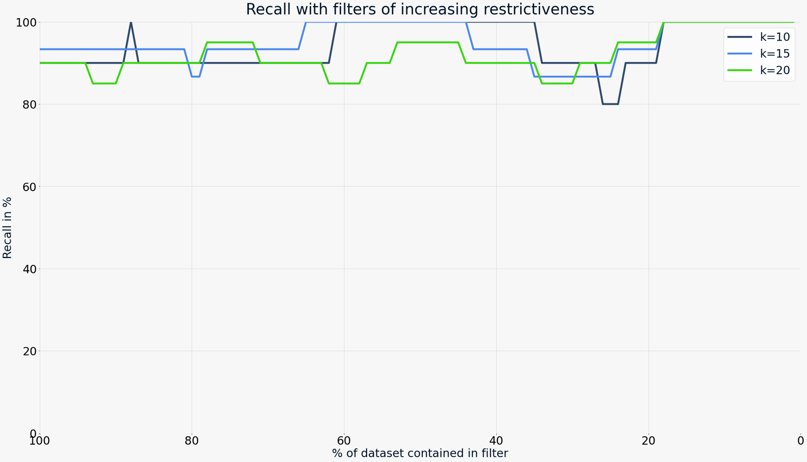

Weaviate は強力なフィルタ付き ベクトル検索機能を提供しており、ベクトル検索と構造化されたスカラー フィルターを組み合わせることができます。これにより、クエリ ベクトルに最も近いベクトルのうち、特定の条件を満たすものを検索できます。

Weaviate におけるフィルタ付き ベクトル検索はプリフィルタリングという概念に基づいています。これは、ベクトル検索を実行する前にフィルターを構築する方式です。一般的なプリフィルタリング実装とは異なり、Weaviate のプリフィルタリングはブルートフォース ベクトル検索を必要とせず、高い効率を実現しています。

`v1.27` から、Weaviate は [`ACORN`](#acorn) フィルター戦略を実装しました。このフィルタリング手法は、特にフィルターとクエリ ベクトルの相関が低い場合に、大規模データセットでの性能を大きく向上させます。

## ポストフィルタリングとプリフィルタリング

プリフィルタリングを利用できないシステムでは、通常ポストフィルタリングを行います。これはまずベクトル検索を実行し、その後フィルター条件を満たさない結果を除外する方式です。これには次の 2 つの大きな欠点があります。

1. フィルターが既に絞り込まれた候補リストに適用されるため、検索結果に何件含まれるかを予測しづらい。
2. フィルターが非常に厳しい場合（データセット全体のごく一部しか一致しない場合）、元のベクトル検索結果に一致するものが 1 件も含まれない可能性がある。

プリフィルタリングはこれらの制限を克服します。プリフィルタリングでは、ベクトル検索を開始する前に許可リスト（allow-list）を作成し、検索はこのリストに含まれる候補のみを対象とします。

:::note
著者によっては「プリフィルタリング」と「シングルステージフィルタリング」を区別し、前者はブルートフォース検索を伴い後者は伴わないと定義する場合があります。本ドキュメントではこの区別を行いません。Weaviate は転置インデックスと HNSW インデックスを組み合わせているため、プリフィルタリングでもブルートフォース検索に頼る必要がないからです。
:::

## Weaviate における効率的なプリフィルタ付き検索

[ストレージについてのセクション](./storage.md) で、シャードを構成する要素を詳細に説明しました。特に重要なのは、各シャードが HNSW インデックスのすぐ隣に転置インデックスを保持していることです。これにより効率的なプリフィルタリングが実現します。プロセスは次のとおりです。

1. 転置インデックス（従来の検索エンジンと同様）を使用して、対象候補の許可リストを作成します。このリストは `uint64` の ID の集合であり、大きくなっても効率が低下しません。
2. ベクトル検索を実行し、許可リストを HNSW インデックスに渡します。インデックスは通常どおりノードのエッジを辿りますが、許可リストに含まれる ID だけを結果集合に追加します。終了条件はフィルターなしの検索と同じで、希望する件数に達し、追加候補が結果品質を向上させなくなった時点で検索を停止します。

## フィルターストラテジー

`v1.27` 現在、HNSW インデックスタイプ向けに `sweeping` と `acorn` の 2 種類のフィルターストラテジーをサポートしています。

### ACORN

:::info Added in `1.27`
:::

Weaviate `1.27` では、新しいフィルタリングアルゴリズムとして [`ACORN`](https://arxiv.org/html/2403.04871v1) 論文をベースにした実装を追加しました。Weaviate ではこれを `ACORN` と呼びますが、実際の実装は論文に着想を得た独自実装です（本ドキュメントでの `ACORN` は Weaviate 実装を指します）。

`ACORN` アルゴリズムは、[HNSW インデックス](./indexing/vector-index.md#hierarchical-navigable-small-world-hnsw-index) でのフィルタ付き検索を高速化するため、次のように動作します。

- フィルターを満たさないオブジェクトは距離計算の対象外にします。
- 複数ホップで候補の近傍を評価することで、HNSW グラフの関連領域へより早く到達します。
- フィルターに一致する追加のエントリポイントをランダムにシードし、フィルタリング領域への収束を加速します。

`ACORN` アルゴリズムは、特にフィルターとクエリ ベクトルの相関が低い場合に有効です。つまり、フィルターがクエリ ベクトルに最も近いグラフ領域の多くのオブジェクトを除外する場合に効果を発揮します。

社内テストでは、相関が低く制限的なフィルター条件下で、特に大規模データセットにおいて `ACORN` が大幅に高速化することを確認しています。もしこれがボトルネックになっている場合は、`ACORN` の有効化を推奨します。

`v1.27` では、対象の HNSW ベクトルインデックスの [コレクション設定](../manage-collections/vector-config.mdx#set-vector-index-parameters) で `filterStrategy` フィールドを設定することで `ACORN` アルゴリズムを有効化できます。

### Sweeping

既存であり、現在のデフォルトフィルターストラテジーは `sweeping` です。この方式は HNSW グラフを「スイープ（掃引）」する概念に基づいています。

アルゴリズムはルートノードから開始し、グラフを走査しながらクエリ ベクトルとの距離を評価し、フィルターの「許可リスト」をコンテキストとして保持します。フィルターを満たさないノードはスキップし、走査を継続します。このプロセスを、所定の件数に到達するまで繰り返します。

## `indexFilterable` {#indexFilterable}

:::info Added in `1.18`
:::

Weaviate `v1.18.0` では、Roaring Bitmap を利用してマッチベースのフィルタリングを高速化する `indexFilterable` インデックスを追加しました。Roaring Bitmap はデータをチャンクに分け、それぞれに適切なストレージ戦略を適用して効率化を図ります。これにより高いデータ圧縮率と高速な集合演算が実現し、Weaviate のフィルタリング速度が向上します。

大規模データセットを扱う場合、フィルタリング性能が大幅に向上する可能性が高いため、移行して再インデックスすることを推奨します。

また、弊社チームは基盤となる Roaring Bitmap ライブラリをメンテナンスし、問題への対処や改善を行っています。

#### `text` プロパティ向け `indexFilterable`

:::info Added in `1.19`
:::

`1.19` 以降、`text` プロパティ向けの Roaring Bitmap インデックスが利用可能です。この実装では `filterable` と `searchable` の 2 つのインデックスに分割され、従来の単一インデックスを置き換えます。新しい `indexFilterable` と `indexSearchable` パラメーターを設定して、Roaring Set インデックスと BM25 用 Map インデックスを生成するかを決定できます（どちらもデフォルトで有効）。

#### `indexFilterable` への移行 {#migration-to-indexFilterable}

Weaviate `1.18.0` 未満を使用している場合は、`1.18.0` 以降へアップグレードし、新しいインデックスを作成する 1 回限りのプロセスを実行することで Roaring Bitmap を利用できます。Weaviate が Roaring Bitmap インデックスを作成すると、その後はバックグラウンドで動作し、作業を高速化します。

この挙動は <code>REINDEX<wbr />_SET_TO<wbr />_ROARINGSET<wbr />_AT_STARTUP</code> [環境変数](/deploy/configuration/env-vars/index.md) で制御できます。再インデックスを行いたくない場合は、アップグレード前に `false` に設定してください。

:::info Read more
Weaviate の Roaring Bitmap 実装の詳細は、[インラインドキュメント](https://pkg.go.dev/github.com/weaviate/weaviate/adapters/repos/db/lsmkv/roaringset) をご覧ください。
:::

## `indexRangeFilters`

:::info Added in `1.26`
:::

Weaviate `1.26` では、数値範囲でのフィルタリングに対応した範囲ベースインデックス `indexRangeFilters` を導入しました。このインデックスは `int`、`number`、`date` プロパティに利用できます（これらの配列型には対応していません）。

内部的には、範囲インデックスは Roaring Bitmap のスライスとして実装されています。このデータ構造により、64 ビット整数として保存できる値に限定されます。

`indexRangeFilters` は新規プロパティでのみ利用可能です。既存プロパティを範囲インデックスへ変換することはできません。

## プリフィルタ付き検索のリコール

Weaviate 独自の HNSW 実装は、HNSW グラフ内のリンクを通常どおり辿りつつ、結果集合を評価する際にのみフィルター条件を適用するため、グラフの整合性が保たれます。そのため、フィルター付き検索のリコールは通常、フィルターなし検索と同等です。

次の図は、制限度合いの異なるフィルターを示しています。左（データセットの 100% に一致）から右（1% に一致）に進むにつれてフィルターが厳しくなりますが、`k=10`、`k=15`、`k=20` のフィルター付き ベクトル検索でもリコールは低下していません。

<!-- TODO - replace this graph with ACORN test figures -->

## フラット検索への切り替え (Cutoff)

<!-- Need to update this section with ACORN figures. -->

`v1.8.0` では、フィルターが極端に厳しくなった場合に自動でフラット（ブルートフォース） ベクトル検索へ切り替える機能が導入されました。このシナリオはベクトル検索とスカラー検索を組み合わせた場合にのみ適用されます。HNSW が特定のフィルターでフラット検索へ切り替える必要がある理由の詳細は、[medium](https://medium.com/data-science/effects-of-filtered-hnsw-searches-on-recall-and-latency-434becf8041c) の記事をご参照ください。要するに、フィルターが非常に制限的な場合（データセットのごく一部しか一致しない場合）、HNSW のトラバーサルは実質的に網羅的になります。つまり、フィルターが厳しくなるほど、HNSW の性能は全データセットに対するブルートフォース検索に近づきます。ただし、このようにフィルターでデータセットを小さな集合に絞り込んでいる場合は、同じブルートフォースに近い性能でも、対象を一致集合のみに限定して検索する方が効率的です。

次の図は制限度合いの異なるフィルターを示しています。左（0%）から右（100%）へ進むほどフィルターが厳しくなります。**点線より右側** はデータセットの約 15% をカットオフ値としてブルートフォース検索に切り替えています。

比較として、同じフィルターを純粋な HNSW（カットオフなし）で実行した場合は以下のようになります。

カットオフ値は、各コレクションの [スキーマ内 `vectorIndexConfig` 設定](/weaviate/config-refs/indexing/vector-index.mdx#hnsw-index) で個別に設定できます。

<!-- TODO - replace figures with updated post-roaring bitmaps figures -->

:::note Roaring Bitmap による性能向上
`v1.18.0` 以降、転置インデックスに Roaring Bitmap を実装したことにより、特に大きな許可リストを扱う場合のフィルタリング時間が短縮されました。上記グラフの *青色* 領域は、特に図の左側で最も大きく削減されます。
:::

<!-- ## Performance of vector searches with cached filters

The following was run single-threaded (i.e. you can add more CPU threads to increase throughput) on a dataset of 1M objects with random vectors of 384d with a warm filter cache (pre-`Roaring bitmap` implementation).

Each search uses a completely unique (random) search vector, meaning that only the filter portion is cached, but not the vector search portion, i.e. on `count=100`, 100 unique query vectors were used with the same filter. -->

<!-- TODO - replace table with updated post-roaring bitmaps figures -->

<!--  -->

<!-- :::note
Wildcard filters show considerably worse performance than exact match filters. This is because - even with caching - multiple rows need to be read from disk to make sure that no stale entries are served when using wildcards. See also "Automatic Cache Invalidation" below.
::: -->

<!-- ## Automatic Cache Invalidation

The cache is built in a way that it cannot ever serve a stale entry. Any write to the inverted index updates a hash for the specific row. This hash is used as part of the key in the cache. This means that if the underlying inverted index is changed, the new query would first read the updated hash and then run into a cache miss (as opposed to ever serving a stale entry). The cache has a fixed size and entries for stale hashes - which cannot be accessed anymore - are overwritten when it runs full. -->
## 追加リソース
:::info 関連ページ
- [リファレンス: GraphQL API](../api/graphql/index.md)
:::

## 質問とフィードバック

import DocsFeedback from '/_includes/docs-feedback.mdx';

<DocsFeedback/>