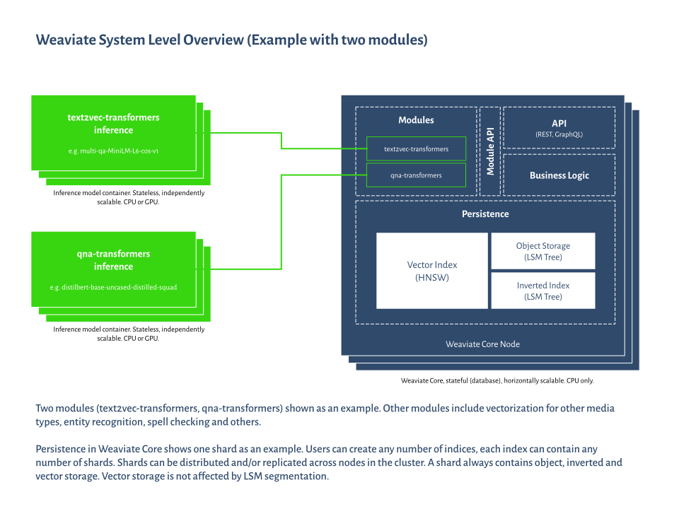

<!-- :::caution Migrated From:
- `Core knowledge`
  - `Data objects` from `Core knowledge/Basics`
  - `Modules`: Combines theoretical explanations from `Configuration/Modules` + `Modules/Index`
- `Architecture`
- `Vector indexing` from `Vector Index (ANN) Plugins:Index` + `HNSW`
  - Note: Configuration options from `HNSW` are now in `References: Configuration/Vector index#How to configure HNSW`
::: -->

**コンセプト** セクションでは、Weaviate とそのアーキテクチャに関するさまざまな側面を解説し、最大限に活用するための理解を助けます。これらのセクションはどの順番でもお読みいただけます。

:::info
実践的なガイドをお求めの場合は、[クイックスタート チュートリアル](/weaviate/quickstart/index.md) をご覧ください。
:::

## Core concepts

**[データ構造](./data.md)**

- Weaviate がデータ オブジェクトをどのように保存・表現し、相互にリンクするかを解説します。

**[モジュール](./modules.md)**

- Weaviate のモジュール システムの概要、モジュールでできること、既存のモジュール タイプ、およびカスタム モジュールについて説明します。

**[インデックス作成](./indexing/index.md)**

- 転置 インデックス と ANN インデックスを用いたデータのインデックス方法と、設定可能なオプションについて読めます。

**[ベクトル インデックス作成](./indexing/vector-index.md)**

- HNSW アルゴリズム、距離計測法、設定可能なオプションなど、Weaviate の ベクトル インデックス作成のアーキテクチャについて詳しく解説します。

**[ベクトル 量子化](./vector-quantization.md)**

- Weaviate の ベクトル 量子化オプションについて詳しく読めます。

## Weaviate アーキテクチャ

以下の図は、Weaviate のアーキテクチャを 30,000 フィートの視点で示しています。

この図の各コンポーネントについては、以下のガイドで学べます。

**[シャード内ストレージの詳細](./storage.md)**
  * Weaviate がデータを保存する方法
  * Weaviate が書き込みを永続化する方法
  * 転置 インデックス、 ベクトル インデックス、オブジェクト ストアがどのように相互作用するか

**[Weaviate を水平スケールする方法](./cluster.md)**
  * スケールするさまざまな動機
  * シャーディング vs. レプリケーション
  * クラスターの設定
  * 一貫性

**[リソース計画方法](./resources.md)**
  *  CPU 、メモリ、 GPU の役割
  * クラスターを適切にサイズ設定する方法
  * 特定のプロセスを高速化する方法
  * ボトルネックを防ぐ方法

**[フィルター付き ベクトル 検索](./filtering.md)**
  * ベクトル 検索とフィルターを組み合わせる
  * HNSW と 転置 インデックスを組み合わせることで、高リコールかつ高速なフィルター付きクエリを実現する方法を学ぶ

**[ユーザー向けインターフェイス](./interface.md)**
  * ユーザー向け API の設計哲学
  * REST と GraphQL API の役割

**[レプリケーション アーキテクチャ](./replication-architecture/index.md)**
  * レプリケーションについて
  * Weaviate の実装
  * ユースケース

## 質問とフィードバック

import DocsFeedback from '/_includes/docs-feedback.mdx';

<DocsFeedback/>