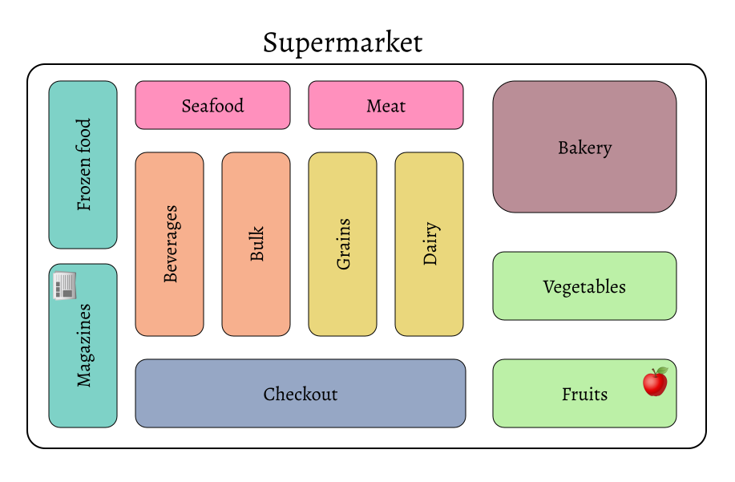
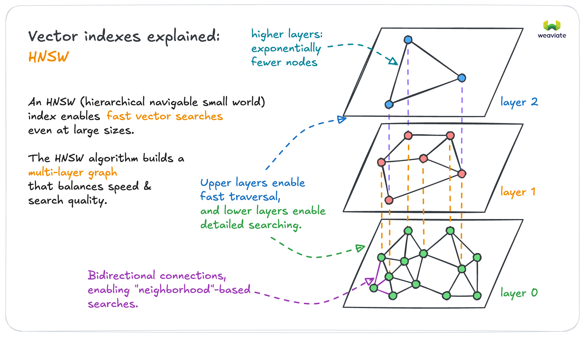
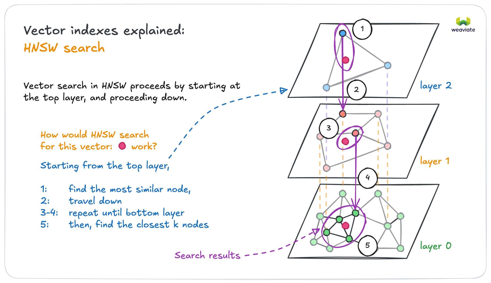
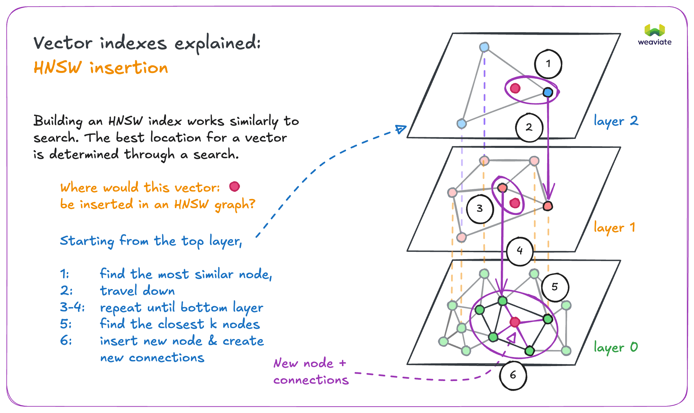
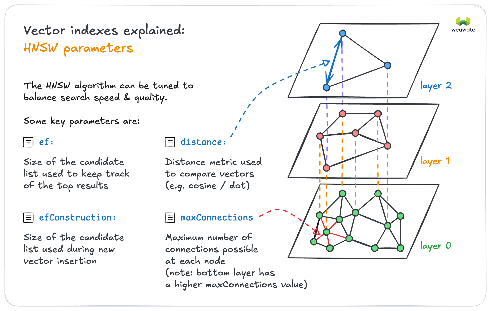

ベクトルインデックスとは何でしょうか？ それはベクトルデータベースの主要な構成要素で、[検索精度をわずかに犠牲にするだけで検索速度を **大幅に向上**](https://weaviate.io/blog/vector-search-explained) させる（[ HNSW インデックス](#hierarchical-navigable-small-world-hnsw-index)）、または多数のデータサブセットを小さなメモリフットプリントで効率的に保存する（[ フラットインデックス](#flat-index)）ために役立ちます。 [ 動的インデックス](#dynamic-index) はフラットインデックスとして始まり、閾値を超えてスケールした際に動的に HNSW インデックスへ切り替えることも可能です。

Weaviate の ベクトルファーストなストレージシステムは、ベクトルインデックスを用いたすべてのストレージ操作を処理します。データをベクトルファーストな方法で保存すると、セマンティックまたはコンテキストベースの検索が可能になるだけでなく、パフォーマンスを低下させることなく *非常に* 大量のデータを保存できます（水平スケールや十分なシャード数が確保されている場合）。

Weaviate がサポートするベクトルインデックスの種類は次のとおりです。  
* [ flat インデックス ](#flat-index)：小規模なデータセット向けに設計された、シンプルで軽量なインデックス。  
* [ HNSW インデックス ](#hierarchical-navigable-small-world-hnsw-index)：ビルドには時間がかかるより複雑なインデックスですが、クエリの時間計算量が対数オーダーのため大規模データセットでも高いスケーラビリティを発揮します。  
* [ 動的インデックス ](#dynamic-index)：オブジェクト数が増えるにつれて、フラットインデックスから HNSW インデックスへ自動的に切り替えられます。  

:::caution Experimental feature
`v1.25` から利用可能です。この機能は実験段階です。ご利用の際はご注意ください。
:::

このページでは、ベクトルインデックスとは何か、そして Weaviate の ベクトルデータベースでどのような役割を果たすのかを説明します。

:::info ベクトルインデックスとは
ベクトルデータベースにおいて、ベクトルインデックスはベクトル埋め込みを整理し、効率的な類似検索を可能にするデータ構造です。適切なインデックス付けはパフォーマンスに直結し、シンプルなフラットインデックスから HNSW のような高度な方式まで、それぞれ目的に応じた使い分けが必要です。
:::

## ベクトルインデックスの必要性

[ ベクトル埋め込み](https://weaviate.io/blog/vector-embeddings-explained) は意味を表現する優れた方法です。ベクトルをどのようにインデックス化するかを理解することは、ベクトルデータベースを効果的に扱うために極めて重要です。ベクトル埋め込みは配列であり、テキスト、画像、動画などさまざまなデータタイプから意味を捉えることができます。要素数は「次元」と呼ばれ、高次元ベクトルはより多くの情報を持ちますが、取り扱いは難しくなります。

ベクトルデータベースは高次元ベクトルの取り扱いを容易にします。検索を例に取ると、ベクトルデータベースはセマンティック類似度を効率的に測定します。 [ 類似検索](../../search/similarity.md) を実行すると、Weaviate はクエリをベクトル化し、そのベクトルと類似したベクトルを持つオブジェクトをデータベースから探し出します。

ベクトルは多次元空間における座標に例えられます。以下のグラフは、*単語* を 2 次元空間で表現したごくシンプルな例です。

このグラフでは `Apple` と `Banana` が互いに近く、`Newspaper` と `Magazine` も互いに近い位置にありますが、前者のペアと後者のペアは離れています。同一ペア内の距離が小さいのは、それぞれのベクトル埋め込みが類似しているためです。一方、ペア間の距離が大きいのは、ベクトル間に大きな差異があるためです。直感的にいえば、果物同士は似ていますが、果物と読み物は似ていません。

詳しくは [ GloVe](https://github.com/stanfordnlp/GloVe) や [ ベクトル埋め込み](https://weaviate.io/blog/vector-embeddings-explained#what-exactly-are-vector-embeddings) をご覧ください。


別の例えとして、スーパーマーケットの商品配置があります。`Apple` が `Banana` の近くに置かれているのは自然ですが、`Magazine` を探す場合には果物売り場から離れ、例えば `Newspaper` がある通路へ向かうでしょう。Weaviate でも、使用するモジュールによってはこのように概念の意味をベクトルに保存できます。単語やテキストだけでなく、画像、動画、DNA 配列などもベクトル化してインデックス化できます。どのモデルを使うかについては [こちら](/weaviate/modules/index.md) をご覧ください。



:::tip
ブログ記事 [Vector search explained](https://weaviate.io/blog/vector-search-explained) もぜひご覧ください。
:::

それでは、Weaviate がサポートするさまざまなアプローチでベクトルをインデックス化する方法を見ていきましょう。最初に紹介するのは HNSW インデックスです。

## Hierarchical Navigable Small World (HNSW) インデックス

**Hierarchical Navigable Small World (HNSW)** は多層グラフ上で動作するアルゴリズムであり、このアルゴリズムで作成されたベクトルインデックスも HNSW インデックスと呼ばれます。HNSW インデックスはクエリが非常に高速ですが、新しいベクトルを追加する際の再構築はリソースを多く消費する場合があります。

Weaviate の `hnsw` インデックスは、Hierarchical Navigable Small World（[ HNSW](https://arxiv.org/abs/1603.09320)）アルゴリズムの [カスタム実装](../../more-resources/faq.md#q-does-weaviate-use-hnswlib) であり、完全な [ CRUD サポート](https://db-engines.com/en/blog_post/87) を提供します。

ビルド時には HNSW アルゴリズムが複数のレイヤーを作成します。クエリ時には、これらのレイヤーを活用して近似最近傍 (ANN) を高速かつ効率的に生成します。

以下は HNSW を利用したベクトルインデックスのイメージです。



各オブジェクトは複数のレイヤーに存在する場合がありますが、すべてのオブジェクトは最下層（図中のレイヤー 0）に必ず存在します。レイヤー 0 のデータオブジェクトは互いに非常に密接に接続されています。上位レイヤーに行くほどデータオブジェクトと接続は少なくなります。上位レイヤーのデータオブジェクトは下位レイヤーのオブジェクトに対応しており、各レイヤーはその下のレイヤーより指数関数的にオブジェクト数が少なくなります。HNSW アルゴリズムはこの階層構造を活用し、大量データを効率的に処理します。



検索クエリが来ると、HNSW アルゴリズムはまず最上位レイヤーで最も近いデータポイントを探します。次に 1 つ下のレイヤーに降り、そのレイヤーで上位レイヤーのポイントに最も近いデータポイントを探します。これが最近傍です。このプロセスを繰り返し、最下層に到達すると検索クエリに最も近いデータオブジェクトを返します。

上位レイヤーにはオブジェクトが少ないため、HNSW は検索対象を大幅に絞り込めます。単一レイヤーのみのデータストアでは、無関係なオブジェクトも多数探索しなければならず、効率が落ちます。

HNSW は高速かつメモリ効率に優れた類似検索手法です。キャッシュには最上位レイヤーのみを保持し、下位レイヤーはクエリに近いオブジェクトだけを追加するため、他の手法と比べてメモリ使用量が少なくて済みます。

図をもう一度見ると、検索ベクトルが最上位レイヤーの部分結果に接続し、それがレイヤー 1、そしてレイヤー 0 の結果集合へと導く様子がわかります。これにより、検索クエリと無関係なオブジェクトをスキップできます。

ベクトルを HNSW インデックスに挿入する手順も同様です。HNSW アルゴリズムは最上位レイヤーで最も近いオブジェクトを探し、下位レイヤーへ移動していき、最適な場所に新しいベクトルを挿入します。その後、新しいベクトルをそのレイヤーの既存ベクトルに接続します。



### 検索品質と速度のトレードオフ管理

HNSW のパラメーターを調整することで、検索品質と速度のバランスを取ることができます。



`ef` パラメーターは検索速度と品質のバランスを決定づける重要な設定です。

`ef` は検索時に HNSW アルゴリズムが使用する動的リストのサイズを指定します。`ef` を大きくすると探索範囲が広がり精度が向上しますが、クエリは遅くなる可能性があります。逆に `ef` を小さくすると高速になりますが、精度が下がる場合があります。

たとえばリアルタイム性が最重要なアプリケーションでは、多少精度を犠牲にしても `ef` を小さくする方が適しています。一方、分析や研究など精度が最優先の場面では、クエリ時間が長くなっても `ef` を大きく設定するのが望ましいでしょう。

`ef` は固定値として設定することも、動的に設定することもできます。動的 `ef` を使用すると、Weaviate が実行時のクエリ要件に基づき速度とリコールのバランスを最適化します。

動的 `ef` を有効にするには `ef`: -1 を指定します。Weaviate はクエリのレスポンス制限に基づき ANN リストのサイズを調整します。この計算は `dynamicEfMin`、`dynamicEfMax`、`dynamicEfFactor` の値も考慮します。

### Dynamic ef

`ef` パラメーターはクエリ時の ANN リストのサイズを制御します。固定サイズを指定する代わりに、Weaviate に動的に設定させることも可能です。動的 `ef` を選択した場合、Weaviate は複数のオプションを用意してリストサイズを制御します。

ANN リストの長さはクエリで設定したレスポンスの limit によって決まります。Weaviate は limit を基準にし、`dynamicEf` パラメーターで指定した値を用いてリストサイズを調整します。

- `dynamicEfMin` はリスト長の下限を設定します。  
- `dynamicEfMax` はリスト長の上限を設定します。  
- `dynamicEfFactor` はリストのレンジを設定します。  

リコールを高く保つため、limit が小さくても実際の動的 `ef` 値は `dynamicEfMin` を下回りません。

大きな結果セットを取得する際でも検索速度を確保するため、動的 `ef` 値は `dynamicEfMax` を超えません。limit が `dynamicEfMax` より大きい場合は、`dynamicEfMax` は影響せず、動的 `ef` 値は limit と同じになります。

ANN リストの長さは、Weaviate が limit に `dynamicEfFactor` を掛けた値を基準に計算し、`dynamicEfMin` と `dynamicEfMax` で補正します。

次の GraphQL クエリは limit を 4 に設定しています。

```graphql
{
  Get {
    JeopardyQuestion(limit: 4) {
      answer
      question
    }
  }
}
```

コレクション側で動的 `ef` が設定されているとします。

```json
  "vectorIndexConfig": {
     "ef": -1,
     "dynamicEfMin": 5
     "dynamicEfMax": 25
     "dynamicEfFactor": 10
  }
```

結果として得られる検索リストは次の特徴を持ちます。

- 最大 40 オブジェクト (「dynamicEfFactor": 10 × limit: 4)  
- 最小 5 オブジェクト ("dynamicEfMin": 5)  
- 最大 25 オブジェクト ("dynamicEfMax": 25)  
- 実際のサイズは 5 〜 25 オブジェクト  

ローカル環境で [Weaviate の `docker-compose.yml` ファイル](/deploy/installation-guides/docker-installation.md) を使ってインスタンスを起動する場合、`QUERY_DEFAULTS_LIMIT` 環境変数が適切なデフォルトのクエリ limit を設定します。メモリエラーを防ぐため、`QUERY_DEFAULTS_LIMIT` は `QUERY_MAXIMUM_RESULTS` よりかなり低く設定されています。

デフォルト limit を変更するには、Weaviate インスタンスを構成する際に `QUERY_DEFAULTS_LIMIT` の値を編集してください。
### 削除処理

クリーンアップは非同期プロセスで、削除や更新後に  HNSW グラフを再構築します。クリーンアップ前はオブジェクトが削除済みとしてマークされますが、依然として  HNSW グラフに接続されたままです。クリーンアップ中にエッジが再割り当てされ、オブジェクトは完全に削除されます。

### 非同期インデクシング

:::caution Experimental
`v1.22` から利用可能です。これは実験的機能のため、慎重にご利用ください。
:::

この機能はベクトル インデックス、特に  HNSW インデックスにのみ関連します。

非同期インデクシングは、以下の方法で有効化できます。  
- オープンソース版をご利用の場合、環境変数 `ASYNC_INDEXING` を `true` に設定してください。  
- Weaviate Cloud の場合、Weaviate Cloud Console で「Enable async indexing」スイッチをオンにしてください。

同期インデクシングでは、ベクトル インデックスはオブジェクト ストアとロックステップで更新されます。  HNSW インデックスの更新は特にインデックス サイズが大きくなるにつれて高コストになり、その結果インデクシング処理がボトルネックとなってユーザー リクエスト完了までの時間を遅くする可能性があります。

非同期インデクシングを有効化すると、すべてのベクトル インデクシング操作がキューを経由します。これはバッチインポートだけでなく、単一オブジェクトのインポート、削除、更新にも適用されます。

そのため、オブジェクト ストアは迅速に更新されてユーザー リクエストを完了し、ベクトル インデックスはバックグラウンドで更新されます。非同期インデクシングは大量データのインポートで特に有用です。

この機能により、オブジェクト作成から  HNSW インデックスでのベクトル検索が可能になるまでの間に短い遅延が発生します。ノードごとのキュー内オブジェクト数は[こちら](/deploy/configuration/nodes.md)で監視できます。

:::info Changes in `v1.28`
Weaviate `v1.22` から `v1.27` までは、非同期インデクシング機能はバッチインポート操作のみに影響し、インメモリキューを使用していました。  
<br/>

`v1.28` 以降、この機能は単一オブジェクトのインポート、削除、更新にも拡張されました。加えて、インメモリキューは永続的なオンディスクキューに置き換えられました。この変更により、インデクシング操作の堅牢性が向上し、ロック競合とメモリ使用量の削減によってパフォーマンスも改善されます。  
<br/>

オンディスクキューの使用によりディスク使用量がわずかに増加する場合がありますが、総ディスク使用量に対してはごく小さな割合であると想定されます。
:::

## フラット インデックス

:::info Added in `v1.23`
:::

**フラット インデックス**は、データベースにおけるベクトル インデックス実装の基本的な方法の一つです。その名のとおりシンプルで軽量、構築が高速でメモリ使用量もごく小さく済みます。このインデックスは、たとえば SaaS 製品や分離されたレコードセットのデータベースなど、各エンドユーザー（テナント）が独自の隔離されたデータセットを持つユースケースに適しています。

フラット インデックスはディスク上に 1 層でデータオブジェクトを保持するため、メモリフットプリントが非常に小さいのが特徴です。マルチテナンシー ユースケースのような小規模コレクションに適した選択肢です。

一方でフラット インデックスは、`hnsw` インデックスの対数時間計算量とは異なり、データオブジェクト数に対して線形時間計算量を持つため、大規模コレクションへのスケールには向きません。

## 動的インデックス

:::caution Experimental feature
`v1.25` から利用可能です。これは実験的機能のため、慎重にご利用ください。
:::

import DynamicAsyncRequirements from '/_includes/dynamic-index-async-req.mdx';

<DynamicAsyncRequirements/>

フラット インデックスはオブジェクト数が少ないユースケースに最適で、メモリオーバーヘッドが低くレイテンシも良好です。オブジェクト数が増えるにつれて  HNSW インデックスの方が検索性能面で有利になります。動的インデックスの目的は、スケール時にメモリフットプリントが大きくなる代わりにクエリ時間のレイテンシを短縮することです。

動的インデックスを設定すると、オブジェクト数が事前に設定した閾値（デフォルトでは  10,000 ）を超えたときにフラットから  HNSW インデックスへ自動的に切り替わります。この機能は非同期インデクシングが有効な場合のみ動作します。インポート中に閾値に達すると、すべてのデータが非同期キューに溜まり、バックグラウンドで  HNSW インデックスが構築され、準備が整い次第フラットから  HNSW へスワップされます。

現在のところ、これはフラットから  HNSW への一方向のアップグレードのみをサポートしており、削除によってオブジェクト数が閾値を下回ってもフラットに戻すことはできません。

これはマルチテナント環境で特に有用です。テナントごとに  HNSW インデックスを構築するとオーバーヘッドが大きくなりますが、動的インデックスを利用することで、個々のテナントが成長するとそのインデックスだけがフラットから  HNSW に切り替わり、小規模テナントのインデックスはフラットのまま維持されます。

## ベクトル キャッシュに関する考慮事項

検索やインポートのパフォーマンスを最適化するには、すでにインポートされたベクトルがメモリにある必要があります。ディスクからベクトルを読み込むのはメモリ参照に比べ桁違いに遅いため、ディスク キャッシュの使用は最小限にすべきです。ただし、Weaviate ではメモリ上のベクトル数を制限できます。新しいコレクション作成時、この制限はデフォルトで  1e12 （ 1 兆）オブジェクトに設定されています。

インポート時には、`vectorCacheMaxObjects` を十分に大きく設定してすべてのベクトルをメモリに保持できるようにしてください。インポートでは複数回の検索が必要になるため、キャッシュに十分なメモリがない場合、インポート性能は大幅に低下します。

インポート後、ワークロードが主にクエリ処理になる場合は、データセット全体より小さいベクトル キャッシュ制限を試してみてください。

現在キャッシュにないベクトルは、空きがあればキャッシュに追加されます。キャッシュが満杯になると Weaviate はキャッシュを丸ごと破棄します。その後のすべてのベクトルは初回のみディスクから読み込まれ、以降はキャッシュがいっぱいになるまでキャッシュ経由で検索されます。この挙動は、大規模データセットで多くのユーザーが特定のサブセットのみを検索する場合に有用です。このケースでは、最大のユーザーグループに対してはキャッシュから応答し、「イレギュラー」なクエリではディスク参照を行うという運用が可能です。

## ベクトル インデクシング FAQ

### ベクトル 量子化とベクトル インデクシングを併用できますか？

はい。[ベクトル 量子化（圧縮）](../vector-quantization.md) に詳細があります。

### どのベクトル インデックスを選択すべきですか？

簡単なヒューリスティックとして、各エンドユーザー（テナント）が独立したデータセットを持つ SaaS 製品のようなユースケースでは `flat` インデックスが適しています。大規模コレクションの場合は `hnsw` インデックスの方が適しているかもしれません。

ベクトル インデックスタイプのパラメーターは、データオブジェクトのベクトルを*どのようにインデックス化するか*を指定するだけであり、インデックスはデータ検索と類似度検索に使用されます。

`vectorizer` パラメーターはデータ ベクトルをどのように生成するか（ベクトルにどの数値を含めるか）を決定します。`vectorizer` には `text2vec-contextionary` などの[モジュール](/weaviate/modules/index.md)を指定します。（独自のベクトルをインポートしたい場合は `vectorizer` を `none` に設定できます）。

コレクションの設定方法については[こちらのハウツーページ](../../manage-collections/vector-config.mdx)をご覧ください。

### ベクトル インデクシングで使用できる距離メトリクスは？

コサイン類似度など、[すべての距離メトリクス](/weaviate/config-refs/distances.md)をどのベクトル インデックスタイプでも使用できます。

### Weaviate でベクトル インデックスタイプをどう設定しますか？

インデックスタイプは、[コレクション定義](../../manage-collections/vector-config.mdx#set-vector-index-type)の設定を通じてデータ コレクションごとに指定でき、利用可能な[ベクトル インデックス設定](../../config-refs/indexing/vector-index.mdx)に従います。

### インデックス化をスキップすべきとき

コレクションをベクトライズする意味がない場合があります。たとえば、そのコレクションが 2 つの別コレクション間のリファレンスのみで構成されている場合や、ほとんどが重複要素である場合などです。

重複ベクトルを  HNSW にインポートするのは非常に高コストです。インポートアルゴリズムは、候補ベクトルの距離が最悪候補の距離より大きいかを早い段階でチェックしますが、重複ベクトルが多いとこの早期終了条件が満たされず、各インポートやクエリで全探索が発生します。

コレクションのインデックス化を避けるには `"skip"` を `"true"` に設定します。デフォルトではコレクションはインデックス化されます。

### どんな ANN アルゴリズムが存在しますか？

さまざまな ANN アルゴリズムがあり、<a href="http://ann-benchmarks.com/" data-proofer-ignore>このウェブサイト</a>で概要をご覧いただけます。

### Weaviate の ANN パフォーマンスに関する参考ベンチマークはありますか？

[ANN ベンチマークページ](/weaviate/benchmarks/ann.md)には、さまざまなベクトル検索ユースケースと相対的なベンチマークが掲載されています。類似したデータセットを探し、最適な設定を学ぶのに最適なページです。

## 参考リソース

:::info Related pages
- [概念: ベクトル 量子化（圧縮）](../vector-quantization.md)
- [設定: ベクトル インデックス](../../config-refs/indexing/vector-index.mdx)
- [設定: スキーマ（セマンティック インデックスの設定）](../../config-refs/indexing/vector-index.mdx#configure-semantic-indexing)
:::

## 質問とフィードバック

import DocsFeedback from '/_includes/docs-feedback.mdx';

<DocsFeedback/>