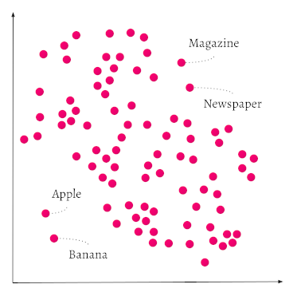

What is ベクトル インデックス作成? それは ベクトル データベースの重要なコンポーネントであり、[類似度検索の検索プロセスを **大幅に高速化** する](https://weaviate.io/blog/vector-search-explained) 一方で検索精度の低下は最小限に抑えられます（[HNSW インデックス](#hierarchical-navigable-small-world-hnsw-index)）。また、[フラット インデックス](#flat-index) は多数のデータサブセットを小さなメモリフットプリントで効率的に保存できます。[ダイナミック インデックス](#dynamic-index) は、フラット インデックスとして開始し、しきい値を超えると動的に HNSW インデックスへ切り替えることも可能です。

Weaviate の ベクトル ファースト ストレージ システムは、ベクトル インデックスを用いたすべてのストレージ操作を処理します。ベクトル ファースト方式でデータを保存することで、セマンティック検索やコンテキスト検索が可能になるだけでなく、十分な水平スケーリングやインデックスのシャードがあれば、パフォーマンスを低下させることなく *非常に* 大きなデータ量を保存できます。

Weaviate は以下の ベクトル インデックス タイプをサポートしています:
* [フラット インデックス](#flat-index)：小規模データセット向けに設計されたシンプルで軽量なインデックス。
* [HNSW インデックス](#hierarchical-navigable-small-world-hnsw-index)：構築には時間がかかりますが、対数的な時間計算量でクエリを処理でき、大規模データセットに適しています。
* [ダイナミック インデックス](#dynamic-index)：オブジェクト数が増加すると自動的にフラット インデックスから HNSW インデックスへ切り替えます。

:::caution Experimental feature
`v1.25` 以降で利用可能です。これは実験的機能のため、慎重にご利用ください。
:::

本ページでは ベクトル インデックスとは何か、そして Weaviate ベクトル データベースでどのような役割を果たすかを説明します。

:::info What is a vector index?
ベクトル データベースにおいて、ベクトル インデックスは ベクトル 埋め込みを整理し、効率的な類似度検索を可能にするデータ構造です。適切なインデックス作成はパフォーマンスに不可欠であり、シンプルなフラット インデックスから HNSW のような高度なアプローチまで、インデックス タイプごとに用途が異なります。
:::

## ベクトル インデックス化の必要性

[ベクトル 埋め込み](https://weaviate.io/blog/vector-embeddings-explained) は意味を表現する優れた方法です。ベクトル のインデックス方法を理解することは、ベクトル データベースを効果的に扱ううえで重要です。ベクトル 埋め込みは、テキスト、画像、動画などさまざまなデータタイプから意味を捉える要素の配列です。要素数は次元と呼ばれます。高次元 ベクトル はより多くの情報を捉えますが、扱いが難しくなります。

ベクトル データベースは高次元 ベクトル の扱いを容易にします。検索を考えてみましょう。ベクトル データベースはデータオブジェクト間のセマンティック類似度を効率的に計測します。[類似度検索](../../search/similarity.md) を実行すると、Weaviate はクエリをベクトル化し、クエリ ベクトル に近い ベクトル を持つオブジェクトをデータベースから見つけ出します。

ベクトル は多次元空間の座標のようなものです。非常にシンプルな ベクトル では、*単語* を 2 次元空間で表現できます。

下図では、`Apple` と `Banana` が互いに近く、`Newspaper` と `Magazine` も近い位置にありますが、前者と後者のペアは同じ空間内で離れています。

各ペア内では ベクトル 埋め込みが似ているため距離が小さく、ペア間では ベクトル の違いが大きいため距離が大きくなります。直感的に、果物同士は似ていますが、果物と読み物は似ていません。

この表現の詳細については ([GloVe](https://github.com/stanfordnlp/GloVe)) および [ベクトル 埋め込み](https://weaviate.io/blog/vector-embeddings-explained#what-exactly-are-vector-embeddings) を参照してください。



別の例えとして、スーパーマーケットでの商品の配置を考えてみましょう。`Apples` は `Bananas` 近くに置かれていることが期待されます。両方とも果物だからです。しかし `Magazine` を探すときは、`Apples` や `Bananas` から離れ、例えば `Newspapers` のある通路に向かいます。これは使用するモジュールによって ベクトル の数値が計算される方法次第で、Weaviate における概念のセマンティクスも同様に保存できます。単語やテキストだけでなく、画像、動画、DNA 配列なども ベクトル 化してインデックスできます。どのモデルを使うかの詳細は [こちら](/weaviate/modules/index.md) をお読みください。


:::tip
弊社ブログ記事 [Vector search explained](https://weaviate.io/blog/vector-search-explained) もぜひご覧ください。
:::

それでは、Weaviate がサポートするさまざまな手法で ベクトル をインデックス化する方法を見ていきましょう。最初に紹介するのは HNSW インデックスです。

## 階層型 Navigable Small World (HNSW) インデックス

**階層型 Navigable Small World (HNSW)** アルゴリズムは多層グラフ上で動作します。これはインデックス タイプでもあり、HNSW アルゴリズムを用いて作成された ベクトル インデックス を指します。HNSW インデックス は非常に高速なクエリを実現しますが、新しい ベクトル を追加してインデックスを再構築する際にはリソースを多く消費する可能性があります。

Weaviate の `hnsw` インデックスは、Hierarchical Navigable Small World（[HNSW](https://arxiv.org/abs/1603.09320)）アルゴリズムの [カスタム実装](../../more-resources/faq.md#q-does-weaviate-use-hnswlib) であり、完全な [CRUD 対応](https://db-engines.com/en/blog_post/87) を提供します。

構築時、HNSW アルゴリズムは複数のレイヤーを作成します。クエリ時には、これらのレイヤーを利用して近似最近傍（ANN）リストを迅速かつ効率的に構築します。

以下は HNSW を用いた ベクトル 検索の概念図です。


1 つのオブジェクトは複数のレイヤーに存在する場合がありますが、すべてのオブジェクトは最下層（図のレイヤー 0）に必ず存在します。レイヤー 0 ではデータオブジェクト同士が密に接続されています。上位レイヤーに進むほどオブジェクト数と接続数は減少します。上位レイヤーのデータオブジェクトは下位レイヤーと対応していますが、各レイヤーは直下のレイヤーより指数関数的に少ないオブジェクトを持ちます。HNSW アルゴリズムはこれらのレイヤー構造を活用して大量データを効率的に処理します。

検索クエリが来ると、HNSW は最上位レイヤーで最も近いデータポイントを見つけます。次に 1 つ下のレイヤーに降り、そのレイヤーで上位レイヤーのデータポイントに最も近いポイントを探します。これが最近傍です。このプロセスをレイヤーごとに繰り返し、最下層に到達すると検索クエリに最も近いデータオブジェクトを返します。

上位レイヤーには比較的少ないデータオブジェクトしかないため、HNSW は検索対象を大幅に削減できます。一方、レイヤーが 1 つしかないデータストアでは、アルゴリズムは無関係なオブジェクトも含め多くを検索する必要があります。

HNSW は非常に高速かつメモリ効率の高い類似度検索手法です。メモリキャッシュには最上位レイヤーのみを保持し、最下層のすべてのオブジェクトを保持しません。上位から下位へ検索が移る際、HNSW はクエリに最も近いデータオブジェクトのみを追加します。そのため、他の検索アルゴリズムと比べて使用メモリは小さくなります。

図を再度ご覧ください。青い検索 ベクトル が最上位レイヤーで部分的な結果に接続し、レイヤー 1 のオブジェクトがレイヤー 0 の結果集合へ導きます。HNSW は 3 回のホップ（点線）で検索を進め、クエリと無関係なオブジェクトを飛び越えています。

もしデータのアップロード速度を超高速なクエリや高いスケーラビリティよりも重視する場合は、他の ベクトル インデックス タイプ（例: [Spotify の Annoy](https://github.com/spotify/annoy)）の方が適しているかもしれません。

### 検索品質と速度のトレードオフ管理

HNSW のパラメータを調整することで、検索品質と速度のバランスを取ることができます。

`ef` パラメータは、このトレードオフを左右する重要な設定です。

`ef` は検索中に HNSW アルゴリズムが使用する動的リストのサイズを決定します。`ef` を大きくすると探索範囲が広がり精度が向上しますが、クエリ速度が低下する可能性があります。

逆に `ef` を小さくすると検索は高速になりますが、精度が犠牲になることがあります。このバランスは、速度優先か精度優先かによって重要度が変わります。例えば即時応答が求められるアプリケーションでは、多少の精度低下と引き換えに小さな `ef` が好まれるかもしれません。一方、分析や研究のように高精度が最優先の場面では、大きな `ef` が適しています。

`ef` は明示的にも動的にも設定できます。動的 `ef` は、クエリパターンが変動する環境で特に有効です。動的設定では、Weaviate がリアルタイムのクエリ要件に基づき速度と再現率の最適バランスを図ります。

動的 `ef` を有効化するには `ef`: -1 を設定します。Weaviate はクエリのレスポンス上限に応じて ANN リストのサイズを調整します。この計算では `dynamicEfMin`、`dynamicEfMax`、`dynamicEfFactor` の値も考慮されます。

### Dynamic ef

`ef` パラメータはクエリ時の ANN リストのサイズを制御します。特定のサイズを指定するか、Weaviate に動的調整させるかを選べます。動的 `ef` を選択した場合、Weaviate は ANN リストのサイズを制御するいくつかのオプションを提供します。

リストの長さはクエリで設定したレスポンス制限（limit）を基準に決定されます。Weaviate はこの limit をアンカーとして、`dynamicEf` パラメータでリストサイズを調整します。

- `dynamicEfMin` はリスト長の下限を設定します。
- `dynamicEfMax` はリスト長の上限を設定します。
- `dynamicEfFactor` はリスト長をスケーリングする係数を設定します。

検索の再現率を高く保つため、クエリ limit が小さくても実際の動的 `ef` 値は `dynamicEfMin` を下回りません。

大きな結果セットを取得する際の速度を維持するため、動的 `ef` 値は `dynamicEfMax` を上限とします。クエリ limit がその上限を超えても、`dynamicEfMax` を超えることはありません。クエリ limit が `dynamicEfMax` より大きい場合、この上限は効果を持たず、動的 `ef` 値はクエリ limit と等しくなります。

ANN リストの長さを決めるため、Weaviate はクエリ limit に `dynamicEfFactor` を掛けます。その後 `dynamicEfMin` と `dynamicEfMax` により範囲が調整されます。

以下の GraphQL クエリでは limit を 4 に設定しています。

```graphql
{
  Get {
    JeopardyQuestion(limit: 4) {
      answer
      question
    }
  }
}
```

このコレクションに次のような動的 `ef` 設定があるとします。

```json
  "vectorIndexConfig": {
     "ef": -1,
     "dynamicEfMin": 5
     "dynamicEfMax": 25
     "dynamicEfFactor": 10
  }
```

検索リストは次の特徴を持ちます。

- 潜在的な長さは 40 オブジェクト（("dynamicEfFactor": 10) × (limit: 4)）。
- 最小長は 5 オブジェクト ("dynamicEfMin": 5)。
- 最大長は 25 オブジェクト ("dynamicEfMax": 25)。
- 実際のサイズは 5〜25 オブジェクトの範囲。

ローカル環境で Weaviate を実行するために [`docker-compose.yml`](/deploy/installation-guides/docker-installation.md) を使用する場合、`QUERY_DEFAULTS_LIMIT` 環境変数が適切なデフォルトクエリ limit を設定します。メモリエラーを防ぐため、`QUERY_DEFAULTS_LIMIT` は `QUERY_MAXIMUM_RESULTS` よりかなり低い値になっています。

デフォルト limit を変更するには、Weaviate インスタンスを構成する際に `QUERY_DEFAULTS_LIMIT` の値を編集してください。
### 削除

クリーンアップは非同期プロセスであり、削除や更新の後に HNSW グラフを再構築します。クリーンアップ前はオブジェクトに削除フラグが付くだけで、依然として HNSW グラフに接続されています。クリーンアップ中にエッジが再割り当てされ、オブジェクトは完全に削除されます。

### 非同期インデックス作成

:::caution Experimental
`v1.22` から利用可能です。これは実験的機能です。ご利用の際はご注意ください。
:::

この機能は ベクトル インデックス、特に HNSW インデックスのみに関連します。

非同期インデックス作成は、次の方法で opt-in して有効化できます。  
- オープンソース版のユーザー: `ASYNC_INDEXING` 環境変数を `true` に設定します。  
- Weaviate Cloud のユーザー: Weaviate Cloud Console で `Enable async indexing` スイッチをオンにします。  

同期インデックス作成では、ベクトル インデックスはオブジェクトストアと同時に更新されます。特にインデックスのサイズが大きくなると、HNSW インデックスの更新は高コストとなり、インデックス作成がシステムのボトルネックになってリクエスト完了までの時間を遅延させる可能性があります。

非同期インデックス作成を有効にすると、すべてのベクトル インデックス操作はキューを経由します。これはバッチインポートだけでなく、単一オブジェクトのインポート、削除、更新にも適用されます。

そのため、オブジェクトストアは素早く更新されてユーザーリクエストを完了でき、ベクトル インデックスはバックグラウンドで更新されます。非同期インデックス作成は、大量データのインポート時に特に有用です。

これにより、オブジェクト作成から HNSW インデックスによるベクトル検索が可能になるまでに短い遅延が発生します。ノードごとのキュー内オブジェクト数は［こちら］(/deploy/configuration/nodes.md)で監視できます。

:::info Changes in `v1.28`
Weaviate `v1.22` 〜 `v1.27` では、非同期インデックス作成はバッチインポート操作のみに影響し、インメモリキューを使用していました。  
<br/>

`v1.28` からは、単一オブジェクトのインポート、削除、更新にも拡張されました。さらにインメモリキューは永続的なオンディスクキューに置き換えられています。これによりインデックス操作の堅牢性が向上し、ロック競合とメモリ使用量の削減によってパフォーマンスが改善されます。  
<br/>

オンディスクキューの使用によりディスク使用量がわずかに増加する場合がありますが、総ディスク使用量のごく一部にとどまる想定です。
:::

## フラットインデックス

:::info Added in `v1.23`
:::

フラットインデックスは、データベースにおけるベクトル インデックス実装の基本的手法の一つです。その名の通りシンプルで軽量なインデックスで、構築が速くメモリフットプリントも非常に小さくなります。各エンドユーザー（テナント）が独立したデータセットを持つ SaaS 製品や、分離されたレコードセットを扱うデータベースなどのユースケースに適しています。

フラットインデックスはディスクに裏付けられた単一レイヤーのデータオブジェクトで構成されるため、メモリフットプリントが非常に小さくなります。マルチテナンシーなど小規模なコレクションに最適です。

一方で、フラットインデックスはデータオブジェクト数に対して線形時間計算量を持つため、大規模コレクションにはスケールしにくいという欠点があります。対照的に `hnsw` インデックスは対数時間計算量です。

## ダイナミックインデックス

:::caution Experimental feature
`v1.25` から利用可能です。これは実験的機能です。ご利用の際はご注意ください。
:::

import DynamicAsyncRequirements from '/_includes/dynamic-index-async-req.mdx';

<DynamicAsyncRequirements/>

フラットインデックスはオブジェクト数が少ないユースケースにおいて、メモリオーバーヘッドが低くレイテンシも良好です。オブジェクト数が増えるにつれ、検索を高速化する HNSW インデックスの方が有効になります。ダイナミックインデックスの目的は、スケール時にメモリフットプリントを増やす代わりにクエリ時のレイテンシを短縮することです。

ダイナミックインデックスを設定すると、フラットインデックスから HNSW インデックスへ自動的に切り替えられます。切り替えはオブジェクト数が指定の閾値（デフォルトは 10,000）を超えた際に行われます。この機能は非同期インデックス作成が有効になっている場合のみ動作します。インポート中に閾値に達すると、すべてのデータが非同期キューにたまり、バックグラウンドで HNSW インデックスが構築され、準備が整うとフラットから HNSW へのスワップが完了します。

現在、この機能はフラットから HNSW への一方向アップグレードのみをサポートしており、削除によってオブジェクト数が閾値を下回ってもフラットインデックスへ戻ることはできません。

これはマルチテナント環境で特に有用です。各テナントごとに HNSW インデックスを構築するとオーバーヘッドが大きくなりますが、ダイナミックインデックスを使用すると、個々のテナントが成長したときのみフラットから HNSW へ切り替わり、小規模テナントのインデックスはフラットのままにできます。

## ベクトルキャッシュの考慮事項

検索とインポートのパフォーマンスを最適化するには、以前にインポートした ベクトル をメモリ上に保持しておく必要があります。ディスクからのベクトル読み出しはメモリ読み出しに比べ桁違いに遅いため、ディスクキャッシュの使用は最小限に抑えるべきです。ただし Weaviate ではメモリ上のベクトル数を制限できます。新しいコレクション作成時、この上限は既定で 1 兆（`1e12`）オブジェクトに設定されています。

インポート時には、`vectorCacheMaxObjects` をすべてのベクトルがメモリに収まる十分に高い値に設定してください。各インポートでは複数回の検索が行われるため、キャッシュに全ベクトルを保持できない場合インポート性能が大幅に低下します。

インポート後、主にクエリがメインのワークロードになったら、データセット全体より小さいキャッシュ上限を試してみてください。

現在キャッシュにないベクトルは、空きがあればキャッシュに追加されます。キャッシュが満杯になると、Weaviate はキャッシュを丸ごと破棄します。その後はすべてのベクトルが初回はディスクから読み込まれ、以降は再びキャッシュにヒットするまで同じ動作を繰り返します。データセットが大きく、多くのユーザーが特定の ベクトル サブセットのみを検索する場合、キャッシュは非常に有効です。この場合、大多数のユーザーはキャッシュからサービスを受け、不規則なクエリのみディスク読み込みが発生します。

## ベクトルインデックス FAQ

### ベクトルインデックスを 直積量子化 と併用できますか？

はい、詳しくは［直積量子化（圧縮）］(../vector-quantization.md) をご覧ください。

### どの ベクトル インデックスを選べばよいですか？

簡単な目安として、SaaS 製品のように各エンドユーザー（テナント）が独立したデータセットを持つユースケースでは `flat` インデックスが適しています。大規模コレクションの場合は `hnsw` インデックスの方が適している可能性があります。

ベクトル インデックス種別パラメーターは、データオブジェクトの ベクトル を「どのようにインデックス化するか」だけを指定します。インデックスはデータ検索と類似検索に使用されます。

`vectorizer` パラメーターは、データ ベクトル を「どのように生成するか」（ベクトルに含まれる数値）を決定します。`vectorizer` には `text2vec-contextionary` などの［モジュール］(/weaviate/modules/index.md) を指定し、Weaviate によって ベクトル が生成されます。独自の ベクトル をインポートする場合は `vectorizer` を `none` に設定できます。

コレクション設定について詳しくは［こちらのハウツーページ］(../../manage-collections/vector-config.mdx) を参照してください。

### ベクトル インデックスで使用できる距離メトリクスは？

コサイン類似度など［距離メトリクス一覧］(/weaviate/config-refs/distances.md) にあるすべてを、任意のベクトル インデックス種別で利用できます。

### Weaviate で ベクトル インデックス種別を設定する方法

インデックス種別は、［コレクション定義］(../../manage-collections/vector-config.mdx#set-vector-index-type) の設定でコレクションごとに指定できます。利用可能な［ベクトル インデックス設定］(../../config-refs/schema/vector-index.md) を参照してください。

### インデックス作成をスキップするタイミング

コレクションをベクトル化する必要がない場合もあります。たとえば、他の 2 つのコレクション間の参照だけで構成されている場合や、ほとんどが重複要素の場合です。

重複 ベクトル を HNSW にインポートするのは非常にコストがかかります。インポートアルゴリズムは早い段階で候補 ベクトル の距離が最も遠い候補より大きいかを確認しますが、重複 ベクトル が多数ある場合この早期終了条件が満たされず、インポートやクエリごとに全探索が行われます。

コレクションのインデックス作成を避けるには、`"skip"` を `"true"` に設定します。デフォルトではコレクションはインデックス化されます。

### どのような ANN アルゴリズムがありますか？

さまざまな ANN アルゴリズムが存在します。概要は<a href="http://ann-benchmarks.com/" data-proofer-ignore>こちらの Web サイト</a>で確認できます。

### Weaviate の ANN パフォーマンスに関する指標的ベンチマークはありますか？

［ANN ベンチマークページ］(/weaviate/benchmarks/ann.md) では、多種多様な ベクトル 検索ユースケースと相対ベンチマークを掲載しています。ご自身のデータセットに近いものを探し、最適な設定を学ぶのに最適です。

## 参考資料

:::info Related pages
- [概念: 直積量子化（圧縮）](../vector-quantization.md)
- [設定: ベクトル インデックス](../../config-refs/schema/vector-index.md)
- [設定: スキーマ（セマンティックインデックスの設定）](../../config-refs/schema/index.md#configure-semantic-indexing)
:::
## ご質問とフィードバック

import DocsFeedback from '/_includes/docs-feedback.mdx';

<DocsFeedback/>