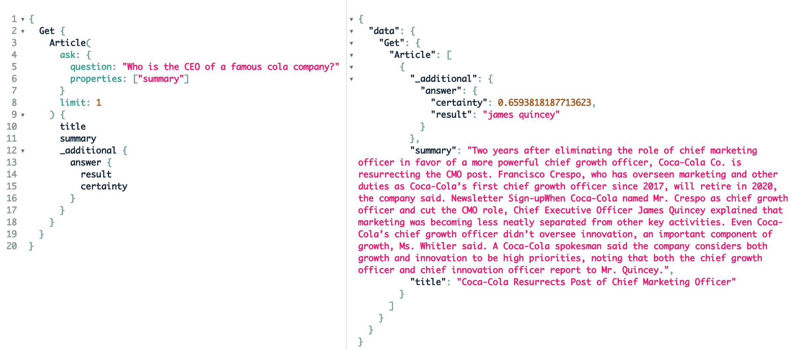

 Weaviate は、その API を通じて管理および利用できます。 Weaviate には RESTful API と GraphQL API が用意されています。 すべての言語のクライアントライブラリは、すべての API 機能をサポートしています。 たとえば Python クライアントなど、一部のクライアントにはスキーマの完全管理やバッチ処理などの追加機能があります。 これにより、 Weaviate はカスタムプロジェクトでも容易に活用できます。 さらに、 API は直感的に設計されているため、既存のデータ環境への統合も簡単です。

このページでは、 Weaviate の API がどのように設計されているか、および Weaviate Console を使用して GraphQL でインスタンスを検索する方法について解説します。

## API デザイン

### デザイン： UX と Weaviate の機能

ユーザーエクスペリエンス (UX) は、私たちにとって最も重要な原則の一つです。 Weaviate は理解しやすく、直感的に使え、かつコミュニティにとって価値があり、望まれ、実用的であるべきです。 Weaviate とのインタラクションは、その UX において極めて重要です。 Weaviate の API はユーザーのニーズの視点から設計され、ソフトウェア機能を念頭に置いています。 私たちはユーザーリサーチ、ユーザーテスト、プロトタイピングを実施し、すべての機能がユーザーの共感を得られるようにしています。 ユーザー要件は共同ディスカッションを通じて継続的に収集されます。 私たちはユーザーニーズを Weaviate の機能と照合します。 ユーザーまたはアプリケーションの観点から強い要望がある場合、 Weaviate の機能や API を拡張することがあります。 新しい Weaviate の機能が追加された際には、それに対応する (新しい) API 機能が当然ながら利用可能になります。

Weaviate の API UX は、 Peter Morville による UX Honeycomb のユーザビリティルールに従って設計されています。

### RESTful API と GraphQL API

Weaviate には RESTful API と GraphQL API の両方があります。 現在、両 API の機能は完全には一致していません (今後実装予定であり、 GitHub に [issue](https://github.com/weaviate/weaviate/issues/1540) があります)。 RESTful API は主に DB 管理と CRUD 操作に使用されます。 GraphQL API は主に Weaviate 内のデータオブジェクトへアクセスするために使用され、単純なルックアップからスカラー検索と ベクトル 検索の組み合わせまで対応します。 概ね、 API は次のユーザーニーズをサポートしています。

* **データの追加、取得、更新、削除 (CRUD)** -> RESTful API
* **Weaviate 管理操作** -> RESTful API
* **データ検索** -> GraphQL API
* **探索的データ検索** -> GraphQL API
* **データ分析 (メタデータ)** -> GraphQL API
* **大規模データセットを本番環境でほぼリアルタイムに扱う** -> クライアントライブラリ (Python、 Go、 Java、 JavaScript) が内部で両 API を使用
* **アプリケーションへの容易な統合** -> クライアントライブラリ (Python、 Go、 Java、 JavaScript) が内部で両 API を使用

## GraphQL

### なぜ GraphQL なのか？
私たちが GraphQL API を採用した理由は複数あります。

* **データ構造**  
  * Weaviate のデータはクラスとプロパティの構造に従います。 データオブジェクトはクラスとプロパティで GraphQL クエリが可能です。  
  * Weaviate ではクロスリファレンスでデータをリンクできます。 GraphQL のようなグラフクエリ言語は非常に有用です。
* **パフォーマンス**  
  * GraphQL ではオーバー／アンダーフェッチがありません。 クエリした情報だけが返され、それ以上でも以下でもありません。 これはパフォーマンス面で有利です。  
  * リクエスト数の削減。 GraphQL では、従来の RESTful API で同じ結果を得るために必要となる多数のクエリを、効率的かつ精密なクエリで置き換えられます。
* **ユーザーエクスペリエンス**  
  * 複雑さの低減  
  * 型付きスキーマによりエラーが起こりにくい  
  * カスタムデザイン  
  * データ探索やファジー検索が可能

### GraphQL デザインの原則
GraphQL クエリは直感的で Weaviate の機能に適合するよう設計されています。 [Hackernoon のこの記事](https://hackernoon.com/how-weaviates-graphql-api-was-designed-t93932tl) では、 GraphQL API がどのように設計されたかを詳しく解説しています (例は古い Weaviate と GraphQL API バージョンを示しています)。 設計の要点は次の 3 つです。

* **自然言語**  
  GraphQL クエリは可能な限り自然言語パターンに従います。 クエリの機能は理解しやすく、記述と記憶が容易です。 例えば、次のような自然言語を認識できるクエリがあります。 「*Articles* の *wordcount* が *1000* より *大きい* 場合に *title* を *取得* する」。 このクエリの主要語句は GraphQL クエリ内でも使用されています。

```graphql
{
  Get {
    Article(where: {
        path: ["wordCount"],    # Path to the property that should be used
        operator: GreaterThan,  # operator
        valueInt: 1000          # value (which is always = to the type of the path property)
      }) {
      title
    }
  }
}
```

現在、 GraphQL リクエストには主に「Get{}」「Explore{}」「Aggregate{}」の 3 つの関数があります。

* **クラス & プロパティ**  
  Weaviate のデータはクラスとプロパティの構造を持ち、データオブジェクト間でクロスリファレンスが可能です。 返却するデータのクラス名は『メイン関数』の 1 階層下に書きます。 その次の階層には、クラスごとに返却するプロパティおよびクロスリファレンスプロパティを記述します。

```graphql
{
  <Function> {
      <Class> {
        <property>

        <cross_reference-property> {
            ... on <ClassOfBeacon> {
                <property>
            }
        }

        _<additional-property> {
            <additional-field>
        }
      }
  }
}
```

* **データベース設定に依存するクエリフィルター (検索引数)**  
  オブジェクトをフィルタリングするためにクラスレベルでフィルターを追加できます。 スカラー (`where` フィルター) と ベクトル (`near<...>` フィルター) を組み合わせることができます。 Weaviate のセットアップ (接続しているモジュール) に応じて、追加のフィルターも使用可能です。 例として、 [`qna-transformers` モジュール](/weaviate/modules/qna-transformers.md) を使ったフィルターは次のようになります。

```graphql
{
  Get {
    Article(
      ask: {
        question: "Who is the king of the Netherlands?",
        properties: ["summary"]
      },
      limit: 1
    ) {
      title
      _additional {
        answer {
          result
        }
      }
    }
  }
}
```

### メイン関数の GraphQL デザイン

1. **データ検索: `Get {}`**  
   データオブジェクトのクラス名が分かっている場合に検索します。  
2. **探索的 & ファジー検索: `Explore {}`**  
   データスキーマやクラス名が分からない場合にファジーに検索します。  
3. **データ分析 (メタデータ): `Aggregate {}`**  
   メタデータを取得し、データ集計の分析を行います。  

## gRPC API サポート

バージョン `1.19` から、 Weaviate は gRPC (gRPC Remote Procedure Calls) API のサポートを導入し、将来的にさらに高速化を図ります。

これはユーザー向けの API 変更を伴いません。 2023 年 5 月現在、 gRPC はごく小規模に追加されており、今後段階的にコアライブラリおよびクライアントへと拡大していく予定です。

## Weaviate Console

[Weaviate Console](https://console.weaviate.cloud) は、 WCD の Weaviate クラスターを管理し、他の場所で稼働する Weaviate インスタンスへアクセスするためのダッシュボードです。 Query Module を使って GraphQL クエリを実行できます。



## Weaviate クライアント

Weaviate には複数のクライアントライブラリがあります： [Go](/weaviate/client-libraries/go.md)、 [Java](/weaviate/client-libraries/java.md)、 [Python](/weaviate/client-libraries/python/index.mdx)、 [TypeScript/JavaScript](/weaviate/client-libraries/typescript/index.mdx)。 すべての言語のクライアントライブラリは、すべての API 機能をサポートしています。 たとえば Python クライアントのように、スキーマ完全管理やバッチ処理などの追加機能を持つものもあります。 これにより、 Weaviate はカスタムプロジェクトで簡単に利用できます。 API は直感的に使用できるため、 Weaviate を既存のデータ環境へ統合するのも容易です。

## さらに学ぶ
:::info Related pages
- [リファレンス: GraphQL API](../api/graphql/index.md)
- [リファレンス: RESTful API](/weaviate/api/rest)
- [リファレンス: クライアントライブラリ](../client-libraries/index.mdx)
:::

## 質問・フィードバック

import DocsFeedback from '/_includes/docs-feedback.mdx';

<DocsFeedback/>