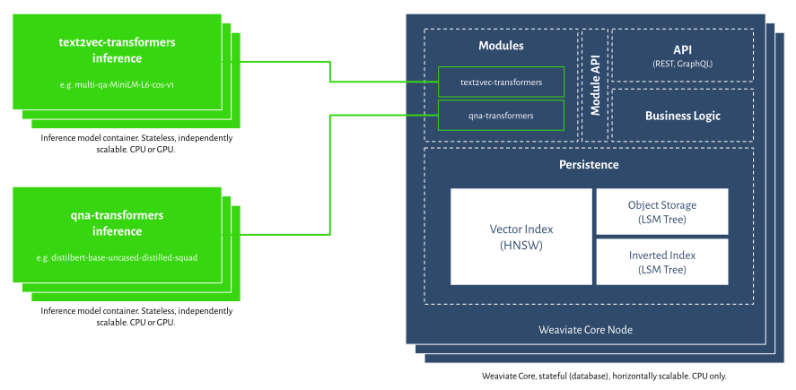
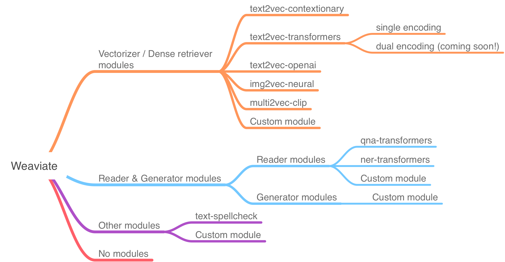

<!-- :::caution Migrated From:
- Combines theoretical explanations from `Configuration/Modules` + `Modules/Index`. e.g.:
  - `Introduction` is from `Configuration/Modules`
  - `Vectorization modules (Dense Retriever modules)` is from `Modules/Index`
::: -->

 Weaviate にはモジュール化された構造があります。ベクトル化やバックアップなどの機能は、オプションのモジュールによって処理されます。

モジュールが何も付いていない  Weaviate のコアは、純粋な ベクトル ネイティブ データベースです。  

 Weaviate では、データはオブジェクトとその ベクトル の組み合わせとして保存され、これらの ベクトル は提供されている [ベクトル インデックス アルゴリズム](../concepts/indexing/vector-index.md) によって検索できます。ベクトライザー モジュールが一つも接続されていない場合、 Weaviate はオブジェクトをどのように ベクトル 化するか、つまりオブジェクトから ベクトル を計算する方法を認識しません。

保存・検索したいデータの種類（テキスト、画像など）やユースケース（検索、質問応答など）、言語、分類、 ML モデル、学習データセットなどに応じて、最適なベクトライザー モジュールを選択して接続できます。または、独自に用意した ベクトル を  Weaviate に持ち込むことも可能です。

このページでは、モジュールとは何か、そして Weaviate においてどのような役割を果たすのかを説明します。

## 利用可能なモジュールの種類

以下の図は、最新の  Weaviate バージョン (||site.weaviate_version||) で利用できるモジュールを示しています。モジュールは次のカテゴリに分類されます。

- ベクトライザー モジュール
- ベクトライザーおよび追加機能モジュール
- その他のモジュール

### ベクトライザー & ランカー モジュール

`text2vec-*`、`multi2vec-*`、`img2vec-*` などのベクトライザー モジュールは、データを ベクトル に変換します。`rerank-*` などのランカー モジュールは、結果をランク付けします。

### リーダー & ジェネレーター モジュール

リーダーまたはジェネレーター モジュールは、ベクトライザー モジュールの上に重ねて使用できます。これらのモジュールは取得された関連ドキュメントの集合に対して、質問応答や生成タスクなどの追加処理を行います。例としては、ドキュメントから直接回答を抽出する [`qna-transformers`](../modules/qna-transformers.md) モジュールがあります。ジェネレーター モジュールは、言語生成を用いてドキュメントから回答を生成します。

### その他のモジュール

`gcs-backup` や `text-spellcheck` などが含まれます。

## 依存関係

モジュールによっては、他のモジュールが存在している必要があります。たとえば、[`qna-transformers`](../modules/qna-transformers.md) モジュールを使用するには、テキスト ベクトル化モジュールが *ちょうど 1 つ* 必要です。

## モジュールなしの Weaviate

 Weaviate は、モジュールを一切使用せずに純粋な ベクトル ネイティブ データベース兼検索エンジンとして利用することもできます。その場合、データエントリーごとに ベクトル を入力する必要があります。また、検索も ベクトル を使って行います。

## カスタム モジュール

誰でも  Weaviate で使用できるカスタム モジュールを作成できます。独自モジュールの作成と利用方法については [こちら](../modules/custom-modules.md) をご覧ください。

## 関連リソース

:::info 関連ページ
- [設定：モジュール](../configuration/modules.md)
- [リファレンス：モジュール](../modules/index.md)
:::

## 質問とフィードバック

import DocsFeedback from '/_includes/docs-feedback.mdx';

<DocsFeedback/>