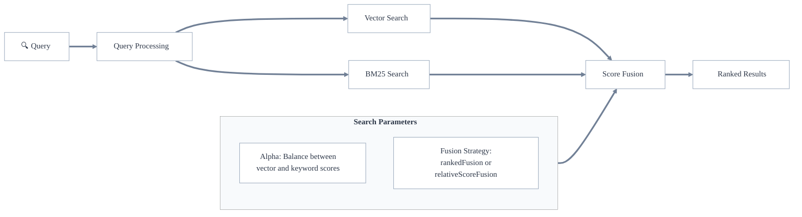

ハイブリッド検索は、[ ベクトル検索 ](./vector-search.md) と [ キーワード検索 (BM25) ](./keyword-search.md) を組み合わせ、それぞれの強みを活用します。これにより、検索結果の意味的類似度 ( ベクトル検索 ) と正確なキーワード関連度 (BM25) の両方が考慮され、より包括的な検索結果が得られます。

ハイブリッド検索は二つの検索タイプを並列で実行し、それぞれのスコアを組み合わせて最終的なランキングを生成します。汎用性と堅牢性に優れており、幅広い検索ユースケースに適しています。

## ハイブリッド検索の仕組み

Weaviate におけるハイブリッド検索は、次の手順で実行されます。

1. 2 種類の検索を並列で実行  
   - ベクトル検索: 意味的に類似したコンテンツを検索  
   - BM25 検索: キーワード一致を検索  
1. 正規化されたスコアを [ フュージョン方式 ](#fusion-strategies) で結合  
1. 結合後のスコアで結果をランキングして返却

### フュージョン戦略

Weaviate は、ベクトル検索とキーワード検索のスコアを組み合わせるために `relativeScoreFusion` と `rankedFusion` の 2 つの戦略をサポートしています。

`relativeScoreFusion` ( `v1.24` 以降のデフォルト) では、各オブジェクトのスコアはベクトル検索・キーワード検索それぞれの指標を *正規化* して算出します。最大値は 1、最小値は 0 とし、その間はこのスケールに従って配置されます。合計スコアは、正規化されたベクトル距離と正規化された BM25 スコアのスケール済み合計として計算されます。

`rankedFusion` ( `v1.23` 以前のデフォルト) では、各オブジェクトのスコアは検索結果内での順位に基づいて計算され、最上位のオブジェクトが最も高いスコアを持ち、それ以降順位に応じて減少します。合計スコアは、ベクトル検索とキーワード検索の順位ベースのスコアを加算して算出されます。

一般的には `relativeScoreFusion` が好ましい選択となる場合が多いため、デフォルト設定になっています。

主な理由は、`relativeScoreFusion` が元々の検索スコアから得られる情報をより多く保持できるのに対し、`rankedFusion` は順位のみを保持するためです。ベクトル検索とキーワード検索が捉えた微妙な差異は、`relativeScoreFusion` によるランキングにより反映されやすいと考えられます。

以下に、2 つのフュージョン戦略の具体的な例を示します。

### フュージョン例

検索によって **5 件**のオブジェクトが返されたとします。**ドキュメント ID** (0〜4) と **キーワード検索**・**ベクトル検索**の **スコア** は次のとおり、**スコア順**に並んでいます。

<table>
  <tr>
    <th>検索タイプ</th>
    <th>(id): score</th><th>(id): score</th><th>(id): score</th><th>(id): score</th><th>(id): score</th>
  </tr>
  <tr>
    <td>キーワード</td>
    <td>(1): 5</td><td>(0): 2.6</td><td>(2): 2.3</td><td>(4): 0.2</td><td>(3): 0.09</td>
  </tr>
  <tr>
    <td>ベクトル</td>
    <td>(2): 0.6</td><td>(4): 0.598</td><td>(0): 0.596</td><td>(1): 0.594</td><td>(3): 0.009</td>
  </tr>
</table>

#### ランク融合

スコアは各結果の順位に依存し、`1/(RANK + 60)` により計算されます。結果は以下のとおりです。

<table>
  <tr>
    <th>検索タイプ</th>
    <th>(id): score</th><th>(id): score</th><th>(id): score</th><th>(id): score</th><th>(id): score</th>
  </tr>
  <tr>
    <td>キーワード</td>
    <td>(1): 0.0154</td><td>(0): 0.0160</td><td>(2): 0.0161</td><td>(4): 0.0167</td><td>(3): 0.0166</td>
  </tr>
  <tr>
    <td>ベクトル</td>
    <td>(2): 0.016502</td><td>(4): 0.016502</td><td>(0): 0.016503</td><td>(1): 0.016503</td><td>(3): 0.016666</td>
  </tr>
</table>

ご覧のとおり、入力スコアに関係なく順位ごとの結果は同一になります。

#### 相対スコア融合

相対スコア融合では、最大スコアを 1、最小スコアを 0 に設定し、その間の値は **最大値** と **最小値** からの **相対距離** に基づいてスケーリングされます。

<table>
  <tr>
    <th>検索タイプ</th>
    <th>(id): score</th><th>(id): score</th><th>(id): score</th><th>(id): score</th><th>(id): score</th>
  </tr>
  <tr>
    <td>キーワード</td>
    <td>(1): 1.0</td><td>(0): 0.511</td><td>(2): 0.450</td><td>(4): 0.022</td><td>(3): 0.0</td>
  </tr>
  <tr>
    <td>ベクトル</td>
    <td>(2): 1.0</td><td>(4): 0.996</td><td>(0): 0.993</td><td>(1): 0.986</td><td>(3): 0.0</td>
  </tr>
</table>

したがって、元のスコア分布が相対的に反映されます。たとえば、最初の 4 ドキュメントのベクトル検索スコアはほぼ同一であり、正規化後も同様です。

#### 比較

ベクトル検索では、上位 4 件 ( **ID 2, 4, 0, 1** ) のスコアがほぼ同一で、いずれも良好な結果でした。一方、キーワード検索では 1 件 ( **ID 1** ) が他より大幅に高スコアでした。

`relativeScoreFusion` の最終結果では、この **ID 1** がトップとなりました。キーワード検索で大きな差を付けて 1 位であり、ベクトル検索でも上位グループに入っていたためです。

対照的に `rankedFusion` では **ID 2** がトップで、**ID 1** と **ID 0** が僅差で続きました。

### Alpha パラメーター

`alpha` 値は、最終的なハイブリッド検索結果においてベクトル検索結果の重みを決定します。`alpha` の範囲は 0 〜 1 です。

- `alpha = 0.5` (デフォルト): 両検索に同等の重み  
- `alpha > 0.5`: ベクトル検索の重みを増加  
- `alpha < 0.5`: キーワード検索の重みを増加  

## 検索しきい値

ハイブリッド検索では、`max vector distance` パラメーターを使用してベクトル距離の最大しきい値を設定できます。

このしきい値はハイブリッド検索のベクトル検索部分のみに適用され、キーワード検索スコアに関係なく、ベクトル空間で類似度が低すぎる結果を除外できます。

たとえば `0.3` の最大ベクトル距離を設定した場合、ベクトル距離が `0.3` を超えるオブジェクトは、キーワード検索スコアが高くてもハイブリッド検索結果から除外されます。

これは、キーワードマッチングを利用しつつも、意味的類似度が一定基準を満たすことを保証したい場合に有効です。

キーワード (BM25) 部分または結合後スコアに対して同等のしきい値パラメーターはありません。

これは、BM25 スコアがベクトル距離のように正規化・上限化されておらず、普遍的なしきい値を設定しても実用性が低いためです。
## キーワード (BM25) 検索パラメーター

Weaviate のハイブリッド検索では、キーワード (BM25) 検索で利用可能なすべてのパラメーターを使用できます。これには、トークン化方法、 stopwords 、 BM25 パラメーター ( k1 、 b )、検索演算子 ( `and`  または `or` )、検索対象のプロパティ、および特定のプロパティにブーストをかける機能などが含まれます。

これらのパラメーターの詳細については、[キーワード検索のページ](./keyword-search.md) をご覧ください。

## その他のリソース

- [How-to: 検索](../../search/index.mdx)
- [How-to: ハイブリッド検索](../../search/hybrid.md)
- [ブログ: Weaviate の融合アルゴリズムを深掘り](https://weaviate.io/blog/hybrid-search-fusion-algorithms)

## 質問とフィードバック

import DocsFeedback from '/_includes/docs-feedback.mdx';

<DocsFeedback/>