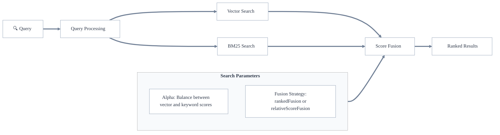

ハイブリッド検索は [ ベクトル検索 ](./vector-search.md) と [ キーワード検索（BM25）](./keyword-search.md) を組み合わせ、それぞれの強みを活かします。これにより、セマンティック類似度（ベクトル検索）と正確なキーワード関連度（BM25）を考慮し、より包括的な検索結果を提供します。

ハイブリッド検索では両方の検索を並列で実行し、それぞれのスコアを組み合わせて最終的なランキングを生成します。これにより多様で堅牢な検索が可能となり、幅広いユースケースに適しています。

## ハイブリッド検索の仕組み

Weaviate でハイブリッド検索を行う際の手順は次のとおりです。

1. 両方の検索を並列で実行  
   - ベクトル検索でセマンティックに類似したコンテンツを取得  
   - BM25 検索でキーワード一致を取得  
1. 正規化したスコアを [ 融合戦略 ](#fusion-strategies) で結合  
1. 結合スコアでランク付けした結果を返却

### 融合戦略

Weaviate では、ベクトル検索とキーワード検索のスコアを組み合わせる方法として `relativeScoreFusion` と `rankedFusion` の 2 つをサポートしています。

`relativeScoreFusion`（`v1.24` 以降のデフォルト）では、各オブジェクトのスコアをベクトル検索とキーワード検索それぞれで *正規化* します。最大値は 1、最小値は 0 とし、その間をスケールします。最終スコアは、正規化されたベクトル距離と正規化された BM25 スコアのスケール済み合計として計算されます。

`rankedFusion`（`v1.23` 以前のデフォルト）では、各オブジェクトは検索結果内の順位に基づいてスコアリングされます。最上位のオブジェクトが最も高いスコアを受け取り、順位が下がるにつれてスコアが減少します。最終スコアは、ベクトル検索とキーワード検索の順位ベーススコアを合算して算出します。

一般的には `relativeScoreFusion` が良い選択肢であることが多いため、デフォルトになっています。

主な理由は、`relativeScoreFusion` が元の検索スコアからより多くの情報を保持するのに対し、`rankedFusion` は順位のみを保持する点です。ベクトル検索とキーワード検索で得られる微妙な違いは、`relativeScoreFusion` の方がランキングに反映されやすいと考えられます。

以下に 2 つの融合戦略の具体例を示します。

### 融合例

検索により **5 件**のオブジェクトが返され、それぞれ **ドキュメント ID**（0 ～ 4）と **キーワード検索スコア**、**ベクトル検索スコア**が **スコア順** に並んでいるとします。

<table>
  <tr>
    <th>検索タイプ</th>
    <th>(id): score</th><th>(id): score</th><th>(id): score</th><th>(id): score</th><th>(id): score</th>
  </tr>
  <tr>
    <td>キーワード</td>
    <td>(1): 5</td><td>(0): 2.6</td><td>(2): 2.3</td><td>(4): 0.2</td><td>(3): 0.09</td>
  </tr>
  <tr>
    <td>ベクトル</td>
    <td>(2): 0.6</td><td>(4): 0.598</td><td>(0): 0.596</td><td>(1): 0.594</td><td>(3): 0.009</td>
  </tr>
</table>

#### ランクベース融合

スコアは各結果の順位に依存し、`1/(RANK + 60)` で計算されます。

<table>
  <tr>
    <th>検索タイプ</th>
    <th>(id): score</th><th>(id): score</th><th>(id): score</th><th>(id): score</th><th>(id): score</th>
  </tr>
  <tr>
    <td>キーワード</td>
    <td>(1): 0.0154</td><td>(0): 0.0160</td><td>(2): 0.0161</td><td>(4): 0.0167</td><td>(3): 0.0166</td>
  </tr>
  <tr>
    <td>ベクトル</td>
    <td>(2): 0.016502</td><td>(4): 0.016502</td><td>(0): 0.016503</td><td>(1): 0.016503</td><td>(3): 0.016666</td>
  </tr>
</table>

ご覧のとおり、スコアがどれだけ異なっていても、同じ順位であれば結果は同一になります。

#### 相対スコア融合

相対スコア融合では、最大スコアを 1、最小スコアを 0 とし、**最大値**と**最小値**までの**相対距離**に応じてスコールします。

<table>
  <tr>
    <th>検索タイプ</th>
    <th>(id): score</th><th>(id): score</th><th>(id): score</th><th>(id): score</th><th>(id): score</th>
  </tr>
  <tr>
    <td>キーワード</td>
    <td>(1): 1.0</td><td>(0): 0.511</td><td>(2): 0.450</td><td>(4): 0.022</td><td>(3): 0.0</td>
  </tr>
  <tr>
    <td>ベクトル</td>
    <td>(2): 1.0</td><td>(4): 0.996</td><td>(0): 0.993</td><td>(1): 0.986</td><td>(3): 0.0</td>
  </tr>
</table>

この方法では、元のスコア分布が反映されます。たとえば、ベクトル検索の上位 4 件のスコアはほぼ同一であり、正規化後もその関係は維持されています。

#### 比較

ベクトル検索では上位 4 件（ID 2, 4, 0, 1）のスコアがほぼ同じで、いずれも良好な結果でした。一方、キーワード検索では 1 件（ID 1）が他より大きな差をつけて優れていました。

`relativeScoreFusion` の最終結果では、ID 1 がトップになりました。これは、キーワード検索で大きく抜きん出ており、ベクトル検索でも上位グループに入っていたため妥当です。

対して `rankedFusion` では、ID 2 がトップで、ID 1 と ID 0 が僅差で続きます。

### Alpha パラメーター

alpha 値は、最終的なハイブリッド検索結果におけるベクトル検索の重みを決定します。alpha は 0 から 1 の範囲で指定します。

- `alpha = 0.5`（デフォルト）: 両検索に同等の重み  
- `alpha > 0.5`: ベクトル検索により重み付け  
- `alpha < 0.5`: キーワード検索により重み付け  

## 検索しきい値

ハイブリッド検索では `max vector distance` パラメーターで最大ベクトル距離のしきい値を設定できます。

このしきい値はハイブリッド検索のベクトル検索部分のみに適用され、たとえキーワード検索スコアが高くても、ベクトル空間で類似度が低すぎる結果を除外できます。

たとえば `0.3` を指定すると、ベクトル距離が `0.3` を超えるオブジェクトはハイブリッド検索結果から除外されます。

これにより、セマンティック類似度が一定基準以上であることを保証しつつ、キーワード一致の利点も享受できます。

キーワード（BM25）部分や最終結合スコアには同等のしきい値パラメーターはありません。

これは、BM25 スコアがベクトル距離のように正規化・制約されておらず、一般的なしきい値を設定しても意味が薄いためです。
## キーワード (BM25) 検索パラメーター

Weaviate のハイブリッド検索では、キーワード (BM25) 検索で利用できるすべてのパラメーターを使用できます。これには、たとえばトークン化方式、ストップワード、BM25 パラメーター (k1、b)、検索演算子 ( `and` または `or` )、検索対象とする特定のプロパティや、特定のプロパティをブーストする機能などが含まれます。

これらのパラメーターの詳細については、[キーワード検索のページ](./keyword-search.md) をご覧ください。

## さらなるリソース

- [How-to: Search](../../search/index.mdx)
- [How-to: Hybrid search](../../search/hybrid.md)
- [Blog: A deep dive into Weaviate's fusion algorithms](https://weaviate.io/blog/hybrid-search-fusion-algorithms)

## ご質問とフィードバック

import DocsFeedback from '/_includes/docs-feedback.mdx';

<DocsFeedback/>