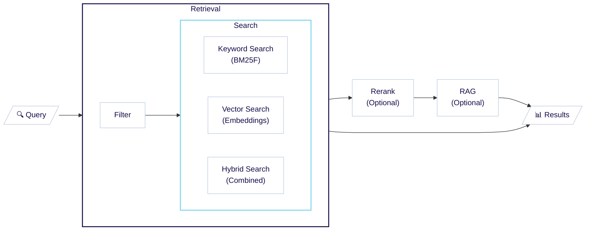

Weaviate は柔軟で高速かつスケーラブルな検索を実行し、 10 億規模のデータセットでもユーザーが迅速に適切なデータを見つけられるよう支援します。

Weaviate では、ニーズに合わせてさまざまな検索タイプを実行でき、パフォーマンスと精度を最適化するための設定も行えます。

以下のセクションでは、Weaviate における検索の概念的な概要として、[検索プロセスと種類の概要](#search-process) を紹介します。

## 検索プロセス

次の表と図は、Weaviate における検索プロセスを示しています。コアの検索プロセスを中心に、結果を改善・操作するためのステップがいくつか存在します。

| Step | Description | Optional |
|------|-------------|----------|
| 1. [Retrieval](#retrieval-filter) | <strong>[Filter](#retrieval-filter):</strong> 条件に基づいて結果セットを絞り込む<br/><strong>[Search](#retrieval-search):</strong> [キーワード](#keyword-search)・[ベクトル](#vector-search)・[ハイブリッド](#hybrid-search) のいずれかの検索タイプで最も関連性の高いエントリーを見つける | 必須 |
| 2. [Rerank](#rerank) | 別の (より複雑な) モデルで結果を再順位付けする | 任意 |
| 3. [Retrieval augmented generation](#retrieval-augmented-generation-rag) | 取得したデータとプロンプトを生成系 AI モデルへ送信する。検索拡張生成 (RAG) とも呼ばれる | 任意 |

<center>



</center>

各ステップの概要は次のとおりです。

### リトリーバル: フィルター

:::info In one sentence
<i class="fa-solid fa-filter"></i> フィルターは、特定の条件に基づいてオブジェクト数を減らします。
:::

フィルターは以下のような条件でオブジェクトを絞り込みます。

- テキスト一致
- 数値しきい値
- 日付範囲
- カテゴリ値
- 地理的位置

フィルタリングを適切に行うことで検索結果の関連性を大幅に高められます。これは、フィルターが厳密な条件で結果セットを正確に絞り込めるためです。

:::info How do filters interact with searches?
Weaviate では [プリフィルタリング](../filtering.md) を採用しており、検索より前にフィルターが実行されます。
<br/>

これにより、検索結果がフィルター条件と重なり合い、適切なオブジェクトが取得されます。
:::

<details>
  <summary>フィルター: 例</summary>

次の `animal_objs` のようなデータセットでは、特定の色でフィルターして条件に合うオブジェクトのみを取得できます。
<br/>

```json
[
    {"description": "brown dog"},
    {"description": "small domestic black cat"},
    {"description": "orange cheetah"},
    {"description": "black bear"},
    {"description": "large white seagull"},
    {"description": "yellow canary"},
]
```

`"description"` に `"black"` をフィルターすると、黒色のオブジェクトのみが返されます。

- `{'description': 'black bear'}`
- `{'description': 'small domestic black cat'}`
<br/>

Weaviate では、他に順位付けを行わない場合、結果の並びはオブジェクトの UUID に基づきます。そのため、この場合の順序は実質ランダムになり、フィルターは条件に合うかどうかだけを判断します。
</details>

### リトリーバル: 検索

:::info In one sentence
<i class="fa-solid fa-magnifying-glass"></i> 検索は、クエリとの関連度に基づいてオブジェクトを順序付けしたリストを生成します。
:::

検索は、最も近い・最も関連性の高いデータオブジェクトを見つけるプロセスです。Weaviate では、[キーワード検索](#keyword-search)、[ベクトル検索](#vector-search)、[ハイブリッド検索](#hybrid-search) の 3 種類をサポートしています。

| 検索タイプ | 説明 |
|-------------|-------------|
| キーワード検索 | トークン頻度を用いた従来のテキスト検索。 |
| ベクトル検索 | ベクトル埋め込みによる類似度検索。 |
| ハイブリッド検索 | ベクトル検索とキーワード検索の結果を組み合わせる。 |

:::tip Search vs Filter
フィルターは条件に合うかどうかだけを判定するため、結果の順位付けは行いません。
<br/>

検索ではクエリとの関連度に基づいて結果が **順位付け** されます。
:::

それでは各検索タイプを詳しく見ていきましょう。

#### キーワード検索

キーワード検索では、キーワード一致の「スコア」に基づいて結果を順位付けします。このスコアは、クエリ内のトークンが各データオブジェクトにどの程度含まれているかによって算出され、これらの指標を  BM25 アルゴリズムで組み合わせて最終スコアを生成します。

<details>
  <summary>キーワード検索: 例</summary>

次の `animal_objs` のようなデータセットでは、特定の色に対してキーワード検索を行い、その重要度を確認できます。
<br/>

```json
[
    {"description": "brown dog"},
    {"description": "small domestic black cat"},
    {"description": "orange cheetah"},
    {"description": "black bear"},
    {"description": "large white seagull"},
    {"description": "yellow canary"},
]
```

`"black"` でキーワード検索を行うと、黒色のオブジェクトのみが返されますが、ここでは  BM25 アルゴリズムに基づいて順位付けされます。
1. `{'description': 'black bear'}`
1. `{'description': 'small domestic black cat'}`
<br/>

`{"description": "black bear"}` のほうが `{"description": "small domestic black cat"}` よりスコアが高いのは、テキスト中で「black」が占める割合が大きいためです。
</details>

<details>
  <summary>キーワード検索を使う場面</summary>

キーワード検索は、特定の単語の出現がテキストの関連性を強く示す場合に最適です。

例えば:
- 医療や法律文献で特定の用語を含むものを探す
- 正確な用語が重要となる技術文書や API リファレンスを検索する
- EC データベースで製品名や SKU を特定する
- プログラミング環境でコードスニペットやエラーメッセージを探す
</details>

:::info Read more
Weaviate におけるキーワード検索の詳細は [keyword search](./keyword-search.md) を参照してください。
:::

#### ベクトル検索

ベクトル埋め込みを用いた類似検索です。この方法では、あらかじめ設定された [距離メトリック](../../config-refs/distances.md) に基づき、クエリのベクトル埋め込みと保存済みオブジェクトのベクトル埋め込みを比較し、最も近いものを探します。

 Weaviate では、複数の方法でベクトル検索を実行できます。 [テキスト入力](../../search/similarity.md#search-with-text)、 [ベクトル入力](../../search/similarity.md#search-with-a-vector)、あるいは [既存オブジェクト](../../search/similarity.md#search-with-an-existing-object) を基に類似オブジェクトを検索できます。さらに、 [画像](../../search/image.md) など他のモダリティでの検索も可能です。

<details>
  <summary>ベクトル検索: 例</summary>

`animal_objs` のようなデータセットでは、意味的に近い単語で検索し、それらがどの程度重要かを取得できます。  
<br/>

```json
[
    {"description": "brown dog"},
    {"description": "small domestic black cat"},
    {"description": "orange cheetah"},
    {"description": "black bear"},
    {"description": "large white seagull"},
    {"description": "yellow canary"},
]
```

ここで `"black"` を検索すると、キーワード検索と同様に動作します。しかし、ベクトル検索では `"very dark"`、`"noir"`、`"ebony"` などのクエリでも類似結果が得られます。  
<br/>

これは、ベクトル検索がテキストの持つ意味に基づいており、使用された単語の一致には依存しないためです。ベクトル埋め込みはテキストの意味を捉えるため、より柔軟な検索が可能になります。  
<br/>

その結果、上位 3 件は次のとおりです:  
1. `{'description': 'black bear'}`
1. `{'description': 'small domestic black cat'}`
1. `{'description': 'orange cheetah'}`

</details>

<details>
  <summary>ベクトル検索を使う場面</summary>

ベクトル検索は、人間の「類似性」の感覚が結果品質の良い指標になる場合に最適です。

例:  
- セマンティックテキスト検索: 異なる単語を使っていても意味が近い文書を探す。  
- 多言語検索: 異なる言語間で関連コンテンツを見つける。  
- 画像類似検索: 大規模データベースから視覚的に似た画像を探す。  

</details>

:::info Read more
 Weaviate におけるベクトル検索のしくみについては [ベクトル検索](./vector-search.md) ページをご覧ください。
:::

#### ハイブリッド検索

ベクトル検索とキーワード検索を組み合わせ、それぞれの利点を活かします。両方の検索を実行し、ハイブリッド融合方法や alpha 値などのパラメータを用いて結果を結合します。

<details>
  <summary>ハイブリッド検索: 例</summary>

`animal_objs` のようなデータセットでは、ハイブリッド検索により、より堅牢に関連オブジェクトを見つけることができます。  
<br/>

```json
[
    {"description": "brown dog"},
    {"description": "small domestic black cat"},
    {"description": "orange cheetah"},
    {"description": "black bear"},
    {"description": "large white seagull"},
    {"description": "yellow canary"},
]
```

`"black canine"` でハイブリッド検索を行うと、キーワード検索との一致により、説明に `"black"` を含むオブジェクトが高く評価されます。そのため `{"description": "small domestic black cat"}` や `{"description": "black bear"}` が上位に表示されます。  
<br/>

一方で、ベクトル検索によりクエリと `"dog"` の高い類似度が検出されるため、`{"description": "brown dog"}` のように `"dog"` を含むオブジェクトもブーストされます。  
<br/>

その結果、上位 3 件は次のとおりです:  
1. `{"description": "black bear"}`
1. `{"description": "small domestic black cat"}`
1. `{"description": "brown dog"}`

</details>

<details>
  <summary>ハイブリッド検索を使う場面</summary>

ハイブリッド検索は堅牢な検索タイプであり、出発点として最適です。どちらか一方の検索で良い結果が得られたアイテムをブーストする傾向があります。

例:  
- 学術論文検索: キーワードの関連性とセマンティック類似性の両方に基づき論文を探す。  
- 求人マッチング: スキルのキーワード一致と職務記述の意味理解を組み合わせ候補者を特定する。  
- レシピ検索: 特定の材料 (キーワード) と料理全体の類似性 (ベクトル) の両方を考慮してレシピを探す。  
- カスタマーサポート: 正確な用語一致と概念的類似性を併用し、関連チケットやドキュメントを発見する。  

</details>

:::info Read more
 Weaviate におけるハイブリッド検索のしくみについては [ハイブリッド検索](./hybrid-search.md) ページをご覧ください。
:::

### 取得: 順序なし

ランク付けを伴わないクエリを組み立てることもできます。

たとえば、単にフィルターだけのクエリや、 [カーソル API](../../manage-objects/read-all-objects.mdx) を使ってデータセット全体を順に処理したい場合があります。

このような順序なし取得リクエストでは、 Weaviate はオブジェクトを UUID の順で取得します。したがって、結果リストは実質的にランダムな順序になります。

### リランク

:::info In one sentence
<i class="fa-solid fa-sort"></i> リランカーは、より複雑なモデルや異なる基準で初期検索結果を再順位付けします。
:::

リランクは、初期検索結果を再順位付けして検索関連性を向上させます。

コレクションが [リランカー統合を設定済み](../../model-providers/index.md) の場合、 Weaviate は設定されたリランカーモデルを用いて初期検索結果を並べ替えます。

これにより、計算コストの高いモデルを小さな結果サブセットに適用し、検索品質を向上させることができます。通常、 [Cohere Rerank](../../model-providers/cohere/reranker.md) や [Hugging Face Reranker](../../model-providers/transformers/reranker.md) などのリランカーモデルはクロスエンコーダーモデルであり、テキストをより細かく理解できます。

また、リランカーを使用して取得時とは異なる入力クエリを提供し、より高度な検索戦略を採用することもできます。

<details>
  <summary>リランクを使う場面</summary>

リランクは、より複雑なモデルを小さな結果サブセットに適用して検索結果の質を高めたい場合に有用です。対象オブジェクトが非常に微妙または専門的な業界・ユースケースの場合に必要となることがあります。

例として、法律、医療、科学文献の検索では、テキストをより精緻に理解する必要があります。リランクにより、最も関連性の高い結果を表面化できます。  
</details>

### 検索拡張生成 (RAG)

:::info In one sentence
<i class="fa-solid fa-robot"></i> Retrieval Augmented Generation は、検索と生成 AI モデルを組み合わせ、検索結果に基づき新しいコンテンツを生成します。
:::

検索拡張生成 (RAG) は、生成検索とも呼ばれ、検索と生成 AI モデルを組み合わせ、検索結果を基に新しいコンテンツを生成する強力な手法です。これにより、 AI モデルの生成能力と Weaviate の検索能力の両方を活用できます。

 Weaviate は [AWS](../../model-providers/aws/generative.md)、 [Cohere](../../model-providers/cohere/generative.md)、 [Google](../../model-providers/google/generative.md)、 [OpenAI](../../model-providers/openai/generative.md)、 [Ollama](../../model-providers/ollama/generative.md) など、多くの人気ある [生成モデルプロバイダー](../../model-providers/index.md) と統合しています。

その結果、 Weaviate では RAG を [簡単に設定](../../manage-collections/generative-reranker-models.mdx#specify-a-generative-model-integration) でき、 [統合された単一クエリ](../../search/generative.md#grouped-task-search) として容易に実行できます。

<details>
  <summary>RAG: 例</summary>

`animal_objs` のようなデータセットでは、任意の検索方法と組み合わせて検索拡張生成を行い、関連オブジェクトを取得したあと変換できます。  
<br/>

```json
[
    {"description": "brown dog"},
    {"description": "small domestic black cat"},
    {"description": "orange cheetah"},
    {"description": "black bear"},
    {"description": "large white seagull"},
    {"description": "yellow canary"},
]
```

例として、キーワード検索 `"black"` と RAG リクエスト `"What do these animal descriptions have in common?"` を考えます。  
<br/>

検索結果は `{"description": "black bear"}` と `{"description": "small domestic black cat"}` です。その後、生成モデルがクエリに基づき出力を生成します。一例として次のような生成結果が得られました。  
<br/>

```text
"What these descriptions have in common are:

* **Color:** Both describe animals with a **black** color.
* **Species:**  One is an **animal**, the other describes a **breed** of animal (domesticated)."
```
</details>
## 検索スコアと指標

Weaviate では、クエリに対する検索結果をランク付けするために、さまざまな指標を使用します。主な指標は以下のとおりです。

- ベクトル距離: クエリとオブジェクト間のベクトル距離。
- BM25F スコア: BM25F アルゴリズムを用いて計算されるキーワード検索スコア。
- ハイブリッド スコア: ベクトル検索とキーワード検索のスコアを組み合わせたもの。

## 名前付きベクトル

### 特定の名前付きベクトルの検索

名前付きベクトルを持つコレクションでベクトル検索を行う場合は、検索するベクトル空間を指定します。

[ベクトル類似度検索](/weaviate/search/similarity#named-vectors)（ `near_text` 、 `near_object` 、 `near_vector` 、 `near_image` ）および [ハイブリッド検索](/weaviate/search/hybrid#named-vectors) で名前付きベクトルを使用できます。

名前付きベクトルのコレクションはハイブリッド検索をサポートしますが、一度に 1 つのベクトルのみ検索できます。

コレクションに名前付きベクトルがあっても、[キーワード検索](/weaviate/search/bm25) の構文は変わりません。

### 複数の名前付きベクトルの検索

:::info Added in `v1.26`
:::

コレクションに複数の名前付きベクトルが定義されている場合、それらを 1 回の検索で指定できます。これは、オブジェクトと複数の名前付きベクトルとの類似度を比較する際に便利です。

この機能は「マルチターゲット ベクトル検索 (multi-target vector search)」と呼ばれます。

マルチターゲット ベクトル検索では、以下を指定できます。

- 検索対象とするベクトル
- 対象ベクトルと比較するクエリ
- 各対象ベクトルに対して適用する距離の重み（生値または正規化後）

詳細は [How-to: Multi-target vector search](../../search/multi-vector.md) を参照してください。

## 参考リソース

詳細は次のページを参照してください。
- [概念: ベクトル検索](./vector-search.md)
- [概念: キーワード検索](./keyword-search.md)
- [概念: ハイブリッド検索](./hybrid-search.md)

これらの検索タイプのコードスニペットについては、[How-to: search](../../search/index.mdx) ページを参照してください。

## 質問とフィードバック

import DocsFeedback from '/_includes/docs-feedback.mdx';

<DocsFeedback/>